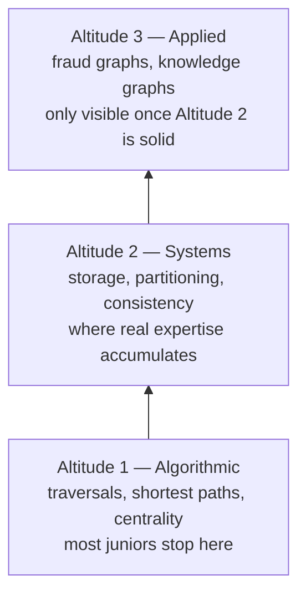
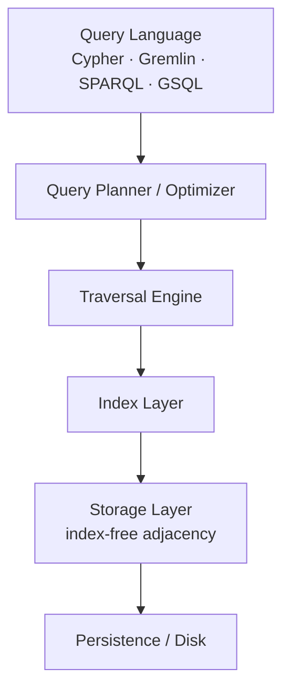
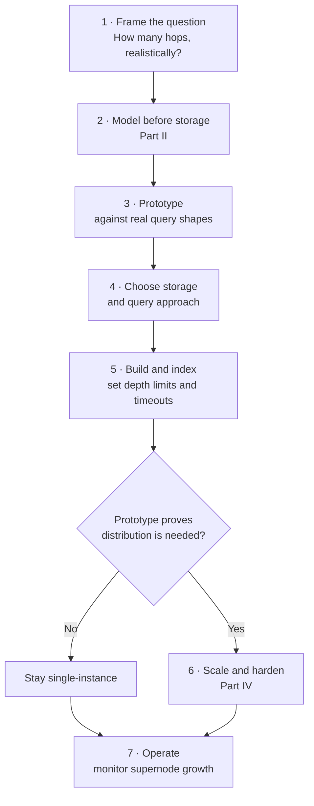
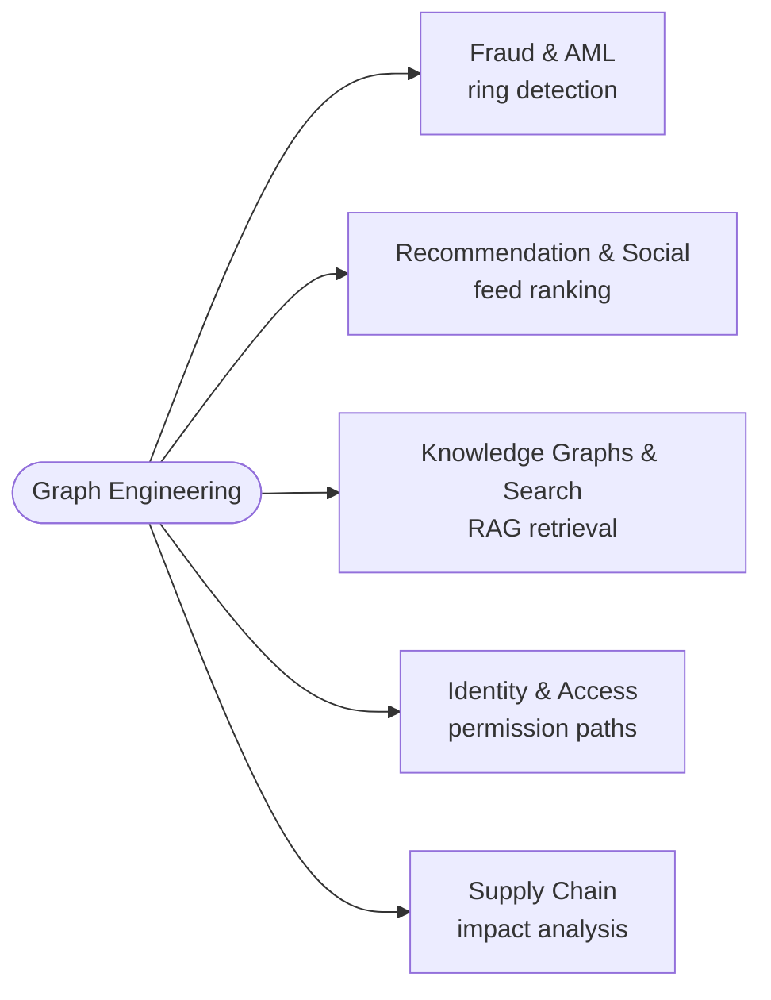

# 01 — What Is Graph Engineering?

> Part I: Foundations · Position 1 of 37 · ~12 min read

## Table

| # | Section | In this chapter |
|---|---|---|
| 1 | Introduction | Defining graph engineering, and why the one-line version isn't enough |
| 2 | Prerequisites | What (if anything) you need before this chapter |
| 3 | Core Concepts | The three altitudes of the field, and how it compares to adjacent disciplines |
| 4 | Internal Architecture | The generic layer-stack every graph engine follows, at a field level |
| 5 | Workflow | The typical shape of a graph engineering project, start to finish |
| 6 | Syntax / Structure | The structural vocabulary — nodes, edges, direction — every graph query language builds on |
| 7 | Code Examples | A first, minimal look at what a graph query actually reads like |
| 8 | Use Cases | Where this field shows up in production |
| 9 | Performance Considerations | Why traversal-heavy queries behave so differently from relational joins |
| 10 | Security Considerations | Relationship-level privacy and access-control risks specific to graphs |
| 11 | Best Practices | Field-level habits worth adopting from day one |
| 12 | Common Errors | Concrete mistakes, not just wrong mental models |
| 13 | Interview Questions | What you'll actually get asked at this level, and how to answer well |
| 14 | Summary | The takeaway, in one paragraph |
| 15 | References & Further Reading | Where to go next, inside and outside this library |

## 1. Introduction

Graph engineering is the discipline of designing, building, and operating systems where the *relationships* between data points carry as much engineering weight as the data points themselves — modeling them, storing them, querying them, and keeping all of it correct and fast as the data grows.

That sentence is true and almost useless on its own. It also describes graph theory, most of data modeling, and half of what a backend engineer does when drawing an entity-relationship diagram. The distinction that actually matters: graph engineering is a *systems* discipline sitting on top of a *math* discipline. Nearly every serious mistake in this field happens in the gap between the two — a theoretically correct algorithm gets applied to a real dataset and falls over, or a mathematically elegant schema turns out to be operationally unworkable.

This chapter, and this library, are written from the systems side of that gap. The theory shows up constantly. It's never the endpoint.

## 2. Prerequisites

Formally, none — this is the entry point to the library, and Part I exists specifically to build the vocabulary the rest of it assumes.

Informally, a few things make the next several chapters land faster: comfort with basic data structures (arrays, lists, hash maps), enough familiarity with any general-purpose language to read short code snippets, and — if you've worked with relational databases before — an intuitive sense of what a JOIN costs, since a lot of this field's value proposition is defined in contrast to that cost. None of this is required. It just means chapters 2 through 8 will feel like review rather than new material if you already have it.

## 3. Core Concepts

### What it is not

- **Not graph theory.** Knowing Dijkstra's algorithm makes you literate in graph theory, not competent in graph engineering — the same way knowing Big-O notation doesn't make you a distributed systems engineer.
- **Not "I stood up a Neo4j container once."** Running a graph database for a weekend project teaches Cypher syntax, not what happens when that same query plan meets a dataset 400x larger under concurrent writes.
- **Not graph ML exclusively.** Training a GNN or generating embeddings (Part V) assumes a queryable graph already exists — it doesn't build the substrate underneath it.
- **Not "foreign keys with extra steps."** A normalized relational schema is, technically, a graph. The moment your dominant query pattern becomes multi-hop traversal, relational joins start costing you exponentially — that's usually the real trigger for needing this field, not data volume.

### The three altitudes



| Altitude | What it covers | Where most juniors stop |
|---|---|---|
| **1 — Algorithmic** | Traversals, shortest paths, centrality, community detection | Here — mistaken for the whole field |
| **2 — Systems** | Storage internals, partitioning, indexing, consistency under concurrent writes | Rarely reached without years of on-call scars |
| **3 — Applied** | Fraud graphs, knowledge graphs, recommendation graphs | Only visible once altitude 2 is solid |

Altitude 2 is where most real expertise accumulates, and it's almost entirely absent from formal education — Parts III and IV live there deliberately.

### Where it sits relative to adjacent fields

| Field | Core question | Primary artifact | Where it breaks down |
|---|---|---|---|
| Graph theory | Is this property true of graphs in general? | Proofs, theorems | Indifferent to latency, memory, concurrent writes |
| **Graph engineering** | How do I answer relationship queries correctly, fast, and reliably at scale? | Running systems, schemas, query plans | Requires theory as input, not output |
| Graph data science / ML | What can I predict from graph structure? | Models, embeddings | Assumes the graph substrate already exists |
| Relational engineering | How do I store structured business data? | Schemas, joins | Degrades as traversal depth increases |

### The maturity gap — an opinion, stated as one

Relational engineering converged decades ago around one mental model — SQL, normal forms, relational algebra. Graph engineering hasn't converged the same way, and it isn't close: Cypher, Gremlin, SPARQL, and GSQL encode genuinely different mental models of what a query even *is*, not just different syntax for the same idea. That's a real, underdiscussed cost, and it's why "just pick a graph database and go" is worse advice here than the relational equivalent. This is a read on the field, not a settled fact — form your own view as you get into Part III.

## 4. Internal Architecture

No single "graph engineering" codebase exists to walk through — that's a claim only individual systems can make (Part III covers several). What does exist, and generalizes across nearly every graph engine you'll encounter, is a common layer stack:



The layer that makes graph engines behave differently from relational ones is storage: most native graph databases use **index-free adjacency**, where each node holds direct physical pointers to its neighbors, so a traversal is a pointer-chase rather than an index lookup per hop. That single design decision is most of the reason multi-hop queries stay fast in a graph engine and get slow in a relational one. Chapter 15 opens this layer up properly — this is just enough of a map to know where you are once you get there.

## 5. Workflow

A graph engineering task, at whatever scale, tends to move through the same rough sequence:



1. **Frame the question.** What relationship pattern are you actually trying to answer, and how many hops deep does a realistic query go? This number matters more than total data volume for almost every downstream decision.
2. **Model before choosing storage.** Sketch the node/edge/property shape (Part II) before picking a database. Modeling mistakes are expensive to unwind; storage choices are comparatively easy to change early.
3. **Prototype against real query shapes.** Validate performance against the traversal depth and fan-out you actually expect, not a synthetic benchmark.
4. **Choose storage and query approach.** Native graph database, relational with recursive queries, or something else — decided by the prototype's numbers, not by default.
5. **Build and index.** Implement the schema, set up indexes, and decide where traversal limits and query timeouts live before launch, not after an incident.
6. **Scale and harden, only if proven necessary.** Partition only once the prototype shows you need to (Part IV); premature partitioning is a common, expensive mistake.
7. **Operate.** Monitor query patterns and supernode growth continuously — graphs develop new hot spots as usage shifts, not only as data grows.

## 6. Syntax / Structure

Every graph, regardless of which database or query language eventually represents it, reduces to the same structural vocabulary:

- **G = (V, E)** — a graph is a set of vertices (nodes) and a set of edges (relationships) connecting them. This is the formal notation Part I's algorithm chapters use throughout.
- **Direction** — edges can be directed (A → B, meaning something specific about A relating to B) or undirected (A — B, a symmetric relationship).
- **Weight** — an edge can carry a numeric cost or strength, used heavily in shortest-path and centrality algorithms (chapters 5–6).
- **Labels and properties** — in the property-graph model most engineers work in day to day, both nodes and edges carry a type label and arbitrary key/value properties, e.g. a `(:Person {name: "..."})` node connected by a `[:WORKS_AT {since: 2021}]` edge.

That last line is a preview, not a lesson — chapter 9 covers property-graph modeling in full, and chapter 16 compares how Cypher, Gremlin, SPARQL, and GSQL each express this same underlying structure differently.

## 7. Code Examples

A full syntax lesson belongs to Part III, not here — but it's worth seeing one real example before that, so the abstractions above have something concrete to attach to. In Cypher (Neo4j's query language), finding everyone a given person directly knows reads almost like the sentence describing it:

```cypher
MATCH (a:Person {name: 'Deb'})-[:KNOWS]->(b:Person)
RETURN b.name
```

That single line is doing what altitude 1 (theory) calls a breadth-first traversal of depth 1, and what altitude 2 (systems) implements as a pointer-chase across index-free adjacency rather than a table scan. Same operation, two different vocabularies for describing it — which is a lot of what "altitude 1 versus altitude 2" actually means in practice.

## 8. Use Cases

Graph engineering earns its complexity in domains where the relationship pattern *is* the signal, not a side detail:



- **Fraud and anti-money-laundering** — detecting rings and layered transaction chains that are invisible row-by-row but obvious as a graph pattern (chapter 30).
- **Recommendation and social systems** — friend-of-friend, "people who bought X also bought Y," feed ranking (chapter 32).
- **Knowledge graphs and search** — entity linking, graph-augmented retrieval for systems like RAG pipelines (chapter 31).
- **Identity and access graphs** — "can this principal reach this resource through any permission path," a genuinely multi-hop question most access-control systems handle poorly.
- **Supply chain and network topology** — dependency and impact analysis, where "what breaks if this node goes down" is inherently a graph question.

The common thread: in every one of these, the interesting query is "how are these things connected," not "what does this one row say."

## 9. Performance Considerations

The single performance fact that justifies this field's existence: in a relational system, each additional hop of a relationship traversal typically costs another join, and join cost compounds — a 4-hop query can be dramatically more expensive than a 2-hop one. In a native graph engine built on index-free adjacency (section 4), a hop is a pointer dereference, and cost scales much closer to linearly with the number of hops actually taken, largely independent of total graph size.

That's the theory. In practice, two things blow this up:

- **Supernodes.** A hub with disproportionately many edges turns a cheap pointer-chase into a scan the moment a traversal passes through it (chapter 19).
- **Unbounded traversal.** A query without a depth limit doesn't fail gracefully — it can walk an arbitrarily large portion of the graph before anyone notices (see section 10).

Performance in this field is mostly about respecting those two failure modes early, not about picking a faster database.

## 10. Security Considerations

Three concerns show up specifically because data is graph-shaped, on top of standard database security hygiene:

- **Relationship-based re-identification.** Anonymizing individual nodes doesn't anonymize the graph. Enough relationship structure around a node — even with names stripped — can uniquely re-identify it; this is a well-documented risk in graph and network-data privacy research, not a theoretical edge case.
- **Relationship-aware access control.** Row-level permissions ("can this user see this record") don't translate cleanly to graphs, where the real question is often "can this principal reach this node through any permitted path." Getting this wrong tends to either over-restrict traversal or silently leak paths nobody explicitly authorized.
- **Traversal-based denial of service.** An unbounded or adversarially crafted traversal query is a resource-exhaustion vector in a way a bounded SQL query typically isn't — the same property that makes graph queries powerful makes them a genuine DoS surface if depth and fan-out aren't capped.

None of this is exotic; it's what standard database security hygiene has to additionally account for once the primary data shape is relationships rather than rows.

## 11. Best Practices

- Model before you pick a database — the schema decision is expensive to unwind; the storage decision usually isn't, this early.
- Benchmark against your actual traversal depth and fan-out, not a synthetic or vendor-provided benchmark.
- Treat query plans as a first-class artifact you review — the way you'd review a slow SQL query's EXPLAIN output — not something you only look at during an incident.
- Set traversal depth limits and query timeouts before launch, not after the first runaway query.
- Don't distribute prematurely — prove you need to with the prototype's numbers (workflow step 3), not intuition about "big data."
- Revisit supernode candidates on a schedule — hubs tend to emerge as usage patterns shift, not only as raw data grows.

## 12. Common Errors

- **Modeling an edge as a node "to be safe."** It usually adds an unnecessary hop to every query that touches that relationship, for no real gain.
- **Choosing a distributed graph engine before proving a single instance can't handle the load.** Partitioning a graph badly makes it slower, not faster, because it destroys locality (chapter 20).
- **Treating a graph database as a drop-in NoSQL replacement.** The access patterns that make a graph database worth its operational cost require redesigning around traversal, not just swapping the storage layer under an unchanged application.
- **Shipping a query with no depth limit.** This is the single most common cause of a graph system's first production incident.
- **Assuming a force-directed visualization counts as understanding the graph.** Past a few thousand nodes it stops conveying anything and starts being decorative — understanding at scale comes from query patterns and metrics (chapter 35), not pictures.

## 13. Interview Questions

**"How would you explain graph engineering to someone who only knows relational databases?"**
Strong answers lead with the join-cost contrast (section 9), not with algorithm names — interviewers are checking whether you can explain the field's value proposition in terms a stakeholder would actually care about.

**"When would you *not* use a graph database, even if the data clearly has relationships?"**
Look for: shallow, fixed-depth traversal patterns where a couple of indexed joins are simpler and cheaper to operate; low relationship-query volume relative to simple lookups; team unfamiliarity with graph query languages as a real, non-dismissible operational cost.

**"What's the practical difference between graph theory and graph engineering?"**
The strongest answers use a concrete example — e.g., "Dijkstra's algorithm tells you the shortest path exists and how to compute it; graph engineering is deciding how that computation survives being run constantly against a graph that's being written to concurrently."

**"What's a supernode, and why does it matter?"**
Even before chapter 19, you should be able to define it (a disproportionately high-degree node) and state the failure mode in one sentence: it turns a cheap traversal into an expensive scan the moment a query passes through it.

**"Walk me through how you'd decide whether a new feature needs a graph database at all."**
This is really asking whether you default to graph tooling reflexively or reason from query shape first. A strong answer starts from workflow step 1 (section 5): what's the realistic traversal depth, and does relational actually fail at that depth?

## 14. Summary

Graph engineering is the work of making altitude-1 theory survive contact with altitude-2 reality, in service of an altitude-3 problem someone is actually paying for. The performance story (section 9) is why the field exists; the security and error patterns (sections 10, 12) are why it's harder than it looks; and the workflow (section 5) is the discipline that keeps those from becoming the same production incident twice. Most of what separates a junior engineer from a senior one here isn't a bigger algorithm toolkit — it's scar tissue from watching a modeling decision made in week one cause an outage in year two.

## 15. References & Further Reading

**Within this library**
- Chapter 2 — Graph Fundamentals and Representations
- Chapter 9 — Property Graph Modeling
- Chapter 15 — Native Graph Storage Internals
- Chapter 19 — The Supernode Problem
- Chapter 37 — Graph Engineering Career and Glossary

**Further reading**
- *Introduction to Graph Theory*, Douglas B. West — the standard reference for the algorithmic layer this library treats as prerequisite background rather than teaching from scratch.
- *Graph Databases*, Ian Robinson, Jim Webber, and Emil Eifrem — written from inside the systems layer this library spends most of its time in.
- *Networks, Crowds, and Markets*, David Easley and Jon Kleinberg — freely available online, and the best treatment of why relationship structure matters before any engineering question comes up at all.
- Whichever graph database you end up choosing, its official documentation will be more current than any book on this list — implementations move faster than print.
