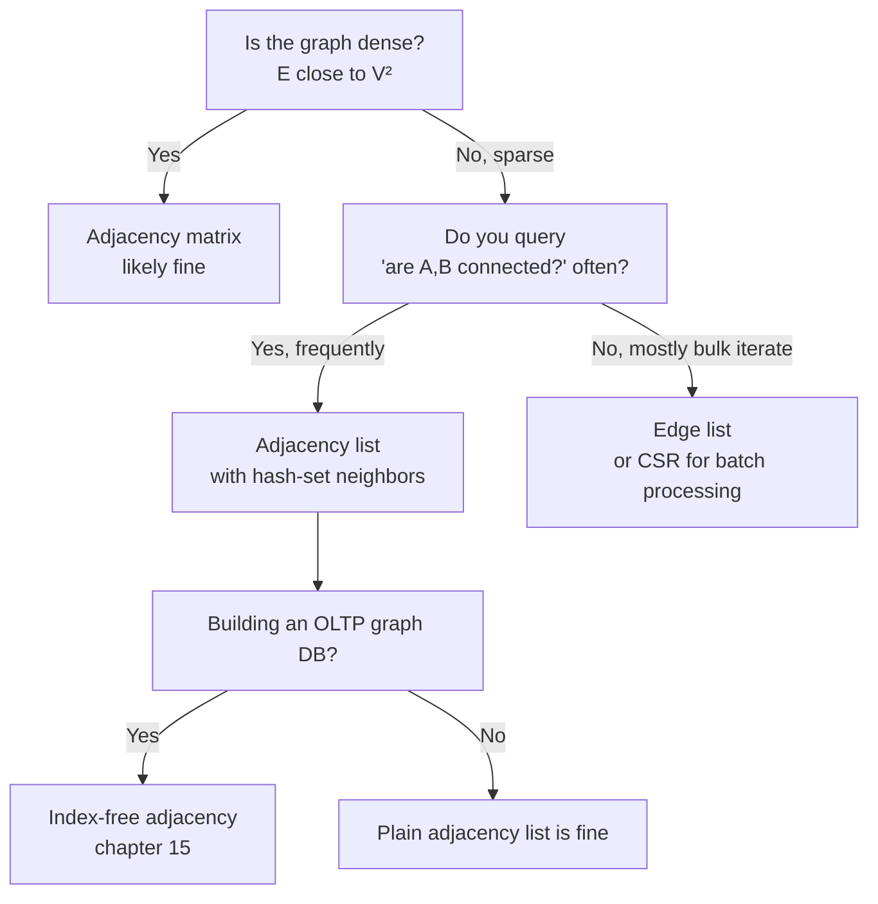
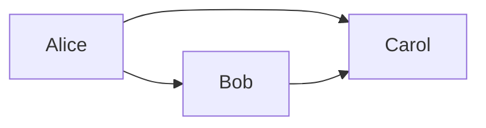

# 02 — Graph Fundamentals and Representations

> Part I: Foundations · Position 2 of 37 · ~11 min read

## Table

| # | Section | In this chapter |
|---|---|---|
| 1 | Introduction | Why representation is the first fork in the road, before any algorithm runs |
| 2 | Prerequisites | Chapter 1's vocabulary; basic arrays, lists, hash maps |
| 3 | Core Concepts | Adjacency matrix, adjacency list, edge list — and their real tradeoffs |
| 4 | Internal Architecture | What production engines actually use instead of the textbook three |
| 5 | Workflow | Choosing a representation, as a decision flow |
| 6 | Syntax / Structure | One example graph, encoded three ways |
| 7 | Code Examples | Building each representation in Python |
| 8 | Use Cases | Where each representation actually wins in practice |
| 9 | Performance Considerations | Why sparsity decides almost everything here |
| 10 | Security Considerations | Bulk export and the blast-radius problem |
| 11 | Best Practices | Defaults worth having before you need them |
| 12 | Common Errors | The mistakes that only show up at scale |
| 13 | Interview Questions | What you'll get asked, and how to answer well |
| 14 | Summary | The one variable that decides most of this |
| 15 | References & Further Reading | Where to go next |

## 1. Introduction

Before a single traversal, shortest-path, or centrality algorithm can run, the graph has to live somewhere — in memory, on disk, across a cluster. How you hold it shapes what every later operation costs. Get this choice wrong and no algorithm, however elegant, will save you: you'll be paying an unnecessary tax on every single operation for the life of the system.

This is also where graph theory's tidy abstraction — "a graph is a set of vertices and edges" — first meets engineering reality, which cares about bytes, cache lines, and lookup time.

## 2. Prerequisites

Chapter 1's vocabulary (nodes, edges, direction, weight) is assumed. Comfort with arrays, lists, and hash maps helps directly here, since all three representations below are just different combinations of those three structures wearing a graph-shaped costume.

## 3. Core Concepts

Three representations cover almost everything you'll encounter, and each makes a different bet about what you'll do most often with the graph.

| Representation | Space | Edge lookup | Iterate neighbors | Bet it makes |
|---|---|---|---|---|
| **Adjacency matrix** | O(V²) | O(1) | O(V) | You'll check "are A and B connected?" constantly, and the graph is dense |
| **Adjacency list** | O(V + E) | O(degree) | O(degree) | You'll walk from a node to its neighbors constantly, and the graph is sparse |
| **Edge list** | O(E) | O(E) | O(E) | You'll process every edge once (bulk load, export, certain algorithms), not query repeatedly |

The matrix trades space for lookup speed; the list trades lookup speed for space efficiency on sparse graphs; the edge list optimizes for neither and wins purely on simplicity and bulk-iteration cost.

## 4. Internal Architecture

Production systems rarely use any of the three textbook forms literally. Two variants dominate real engines:

- **Compressed Sparse Row (CSR)** — a flattened, cache-friendly array encoding of the adjacency list, common in analytical/batch graph-processing engines because it's extremely fast to scan sequentially and compact in memory.
- **Index-free adjacency** — introduced in chapter 1: each node holds direct physical pointers to its neighbor records, so a hop is a pointer dereference rather than a lookup. This is the representation most native graph *databases* (as opposed to batch analytics engines) build on, because it optimizes for exactly the access pattern OLTP graph workloads have — walk from a specific node outward, repeatedly, unpredictably.

The textbook three are correct as mental models. They're rarely the literal on-disk format once you're past chapter 15's territory.

## 5. Workflow



## 6. Syntax / Structure

A tiny example graph, encoded three ways:



**Adjacency matrix**

| | Alice | Bob | Carol |
|---|---|---|---|
| **Alice** | 0 | 1 | 1 |
| **Bob** | 0 | 0 | 1 |
| **Carol** | 0 | 0 | 0 |

**Adjacency list**
```
Alice: [Bob, Carol]
Bob:   [Carol]
Carol: []
```

**Edge list**
```
(Alice, Bob)
(Alice, Carol)
(Bob, Carol)
```

Same graph. Three answers to "how much memory does this cost, and what's fast."

## 7. Code Examples

```python
# Adjacency list — the default for sparse, real-world graphs
graph = {
    "Alice": ["Bob", "Carol"],
    "Bob": ["Carol"],
    "Carol": [],
}

# Adjacency matrix — fine for small, dense graphs
nodes = ["Alice", "Bob", "Carol"]
idx = {n: i for i, n in enumerate(nodes)}
matrix = [[0] * len(nodes) for _ in nodes]
matrix[idx["Alice"]][idx["Bob"]] = 1
matrix[idx["Alice"]][idx["Carol"]] = 1
matrix[idx["Bob"]][idx["Carol"]] = 1

# Edge list — simplest, best for bulk load/export
edges = [("Alice", "Bob"), ("Alice", "Carol"), ("Bob", "Carol")]
```

## 8. Use Cases

- **Adjacency matrix** — spectral graph methods, small dense graphs, anywhere the computation is genuinely linear-algebra-native (eigenvector centrality, some clustering methods).
- **Adjacency list** — the default for nearly all traversal, shortest-path, and general-purpose graph database work, because most real-world graphs are sparse.
- **Edge list** — ETL and data interchange (it's the natural shape of a CSV export), Kruskal's minimum spanning tree algorithm, bulk-loading a database.

## 9. Performance Considerations

Almost every real-world graph is sparse — social networks, knowledge graphs, transaction graphs typically have E much closer to O(V) than O(V²). An adjacency matrix on a sparse graph doesn't just waste some memory; it wastes almost all of it storing zeros. This single fact is why adjacency-list-family representations dominate production graph systems, and why matrix representations are usually a sign the workload is either small, dense, or fundamentally linear-algebra-shaped rather than traversal-shaped.

## 10. Security Considerations

Representation choice interacts with data-exposure risk in a way that's easy to miss: a dense matrix export or a full adjacency-list dump for "feature engineering" purposes is a much larger blast radius than a scoped, traversal-limited query against the live graph. Bulk exports built on convenient representations tend to become de facto backups nobody classified as sensitive — worth auditing specifically wherever a representation choice made for computation convenience quietly became a storage or sharing decision.

## 11. Best Practices

- Default to adjacency-list-family structures unless you have a specific, demonstrated reason to use a matrix.
- Don't let a data scientist's convenient in-memory matrix export become your system's actual storage format.
- Choose edge list only for bulk, one-pass workloads — it's the wrong choice the moment you need repeated lookups.

## 12. Common Errors

- **Reaching for adjacency matrix by default** because it's usually taught first, then hitting a memory wall once the graph reaches real-world scale.
- **Forgetting directionality when populating the structure** — storing an edge in both directions for an undirected graph, or only one direction for a directed graph, inconsistently across the codebase.
- **Treating edge list as query-ready** — using it for repeated neighbor lookups, which is exactly the access pattern it's worst at.

## 13. Interview Questions

**"When would an adjacency matrix beat an adjacency list?"**
Look for: dense graphs, need for O(1) edge-existence checks, or genuinely matrix-native computation — not "it's simpler to reason about."

**"Walk through the space complexity of each representation for a graph with V vertices and E edges."**
O(V²) for matrix, O(V + E) for list, O(E) for edge list — and why that difference is enormous once E is much smaller than V².

**"Why do most production graph databases avoid dense adjacency matrices?"**
Real-world graphs are sparse; a matrix on a sparse graph mostly stores zeros, at V² cost.

## 14. Summary

Representation is decided almost entirely by one question: is your graph sparse or dense, and do you need fast existence-checks or fast neighbor-iteration? Get the honest answer to that before writing a single line of algorithm code — chapter 15 will show you where this choice ends up living once a real database is involved.

## 15. References & Further Reading

**Within this library**
- Chapter 1 — What Is Graph Engineering?
- Chapter 15 — Native Graph Storage Internals
- Chapter 9 — Property Graph Modeling

**Further reading**
- *Introduction to Algorithms*, Thomas H. Cormen, Charles E. Leiserson, Ronald L. Rivest, and Clifford Stein — the standard reference for the representation-level complexity analysis in this chapter.
