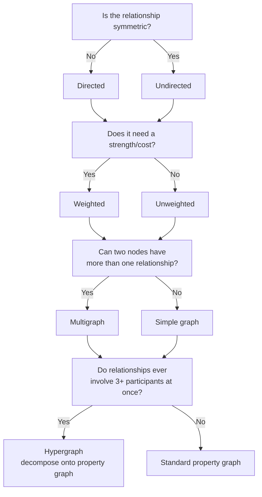
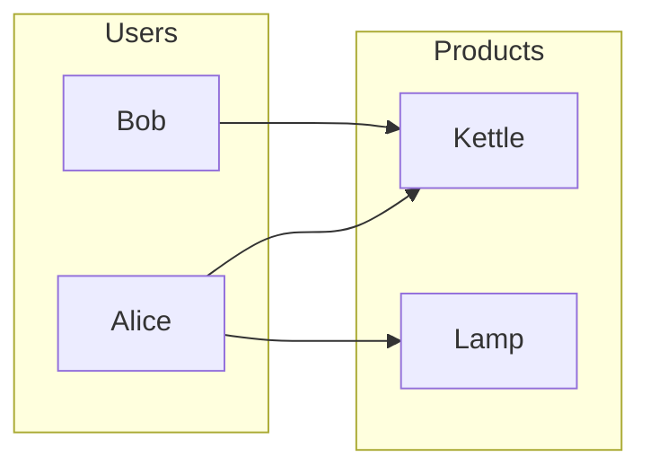
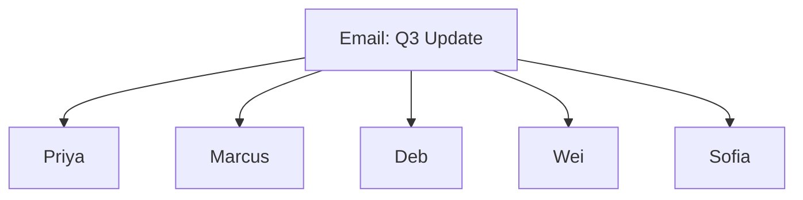

# 03 — Graph Types Taxonomy

> Part I: Foundations · Position 3 of 37 · ~11 min read

## Table

| # | Section | In this chapter |
|---|---|---|
| 1 | Introduction | Picking the wrong graph type is a bigger error than picking the wrong storage |
| 2 | Prerequisites | Chapters 1–2 |
| 3 | Core Concepts | Directed, weighted, multigraph, hypergraph, bipartite, temporal — defined and contrasted |
| 4 | Internal Architecture | How each type actually gets encoded inside a property-graph engine |
| 5 | Workflow | A decision tree for "which type actually models my domain" |
| 6 | Syntax / Structure | Small diagrams for the less obvious types |
| 7 | Code Examples | Modeling a multigraph and a hyperedge decomposition |
| 8 | Use Cases | Where each type shows up in production |
| 9 | Performance Considerations | The cost of forcing a graph into the wrong type |
| 10 | Security Considerations | Temporal graphs and the un-time-boxed query problem |
| 11 | Best Practices | Model the true type before you model anything else |
| 12 | Common Errors | Losing semantics by flattening the wrong type into edges |
| 13 | Interview Questions | What you'll get asked, and how to answer well |
| 14 | Summary | The shape of the relationship, not the domain, decides the type |
| 15 | References & Further Reading | Where to go next |

## 1. Introduction

Not every graph is the same shape. A social "follows" relationship, a road network, an email with five recipients, and a users-and-products recommendation graph are all "graphs" — but modeling all four the same way is a more fundamental mistake than picking the wrong storage representation (chapter 2), because it distorts the actual semantics of the data, not just its performance.

## 2. Prerequisites

Chapters 1 and 2 — this chapter assumes you're comfortable with the basic vocabulary and representation tradeoffs already covered.

## 3. Core Concepts

| Type | Defining property | Canonical example |
|---|---|---|
| Directed | Edges have a direction; the relationship is asymmetric | "Follows" on social media |
| Undirected | Edges have no direction; the relationship is symmetric | Mutual friendship |
| Weighted | Edges carry a numeric cost or strength | Road distances, transaction amounts |
| Multigraph | More than one edge allowed between the same pair of nodes | Multiple flights between two airports |
| Hypergraph | An edge can connect more than two nodes at once | One email, five recipients |
| Bipartite | Two disjoint node sets; edges only cross between them | Users and products |
| Temporal | Nodes or edges carry a validity time range | Fraud pattern evolution, audit trails |

Most production systems default to **directed, weighted, property graphs** as the base model, then layer the other properties (multigraph, temporal) on top as needed — few systems need a pure, unadorned "simple graph."

## 4. Internal Architecture

Here's the part that surprises people coming from a pure theory background: almost no mainstream graph database has native hyperedge storage. A hypergraph is nearly always **decomposed** onto the underlying property-graph primitive — the hyperedge itself becomes a node (sometimes called an "edge node" or "event node"), connected by ordinary directed edges to each real participant. The "five recipients on one email" hyperedge becomes an `Email` node connected to five `Person` nodes, rather than ten pairwise edges between recipients that were never actually related to each other.

Multigraphs are handled more directly — most property graph engines allow multiple edges between the same node pair natively, as long as each edge carries its own identity and properties (a `FLIGHT` edge with a `date` property, for instance, rather than collapsing all flights between two airports into one edge).

## 5. Workflow



## 6. Syntax / Structure

Bipartite — two node sets, edges only crossing between them:



Hyperedge decomposition — one email, five recipients, modeled as a shared event node rather than pairwise edges:



## 7. Code Examples

```cypher
// Multigraph: multiple typed, dated FLIGHT edges between the same two airports
MATCH (a:Airport {code: 'JFK'}), (b:Airport {code: 'LHR'})
CREATE (a)-[:FLIGHT {date: '2026-08-01', carrier: 'BA'}]->(b)
CREATE (a)-[:FLIGHT {date: '2026-08-03', carrier: 'AA'}]->(b)
```

```cypher
// Hyperedge decomposition: one email, five recipients, via a shared event node
CREATE (e:Email {subject: 'Q3 Update'})
CREATE (e)-[:SENT_TO]->(:Person {name: 'Priya'})
CREATE (e)-[:SENT_TO]->(:Person {name: 'Marcus'})
```

## 8. Use Cases

- **Directed** — social follows, citation graphs, dependency graphs.
- **Weighted** — road networks (chapter 5), transaction graphs (chapter 30).
- **Multigraph** — transportation networks, multiple relationship types between the same two entities (colleague *and* co-author).
- **Hypergraph** — group events, co-authorship, shared-session or shared-transaction modeling.
- **Bipartite** — recommendation systems (chapter 32), access-control graphs (users and permissions).
- **Temporal** — fraud pattern evolution, audit trails, versioned knowledge graphs (chapter 12).

## 9. Performance Considerations

Forcing the wrong type onto real data has a concrete performance cost, not just a modeling-purity cost. Flattening a hyperedge into pairwise edges between all participants turns one relationship into *n choose 2* edges — a five-person email becomes ten edges instead of five, none of which individually mean anything, and all of which now show up in every traversal that touches any of those people.

## 10. Security Considerations

Temporal graphs carry a specific, easy-to-miss risk: if edge or node validity windows aren't properly enforced at query time, a query that isn't explicitly time-boxed can surface relationships that were supposed to have expired — a revoked access grant, a closed account's connections, a deleted relationship that was only soft-deleted with an end timestamp. "Un-time-boxed" queries against a temporal graph are a real, recurring class of access-control bug.

## 11. Best Practices

- Model the true relationship shape first — symmetric or not, single or multi, pairwise or group — before choosing storage or query language.
- Default to directed, weighted, property graphs as the base case; add multigraph and temporal semantics deliberately, not as an afterthought.
- Decompose hyperedges explicitly and name the resulting event node meaningfully, rather than losing the "this happened together" semantic.

## 12. Common Errors

- **Modeling a hyperedge as pairwise edges** and losing the fact that the participants were connected through one shared event, not through each other directly.
- **Treating a multigraph relationship as a single edge**, silently overwriting or merging distinct events (two separate flights collapsed into one edge).
- **Skipping temporal modeling** on data that's inherently time-sensitive, then discovering months later that "current state" queries were quietly returning historical noise.

## 13. Interview Questions

**"How would you model a group chat with five participants as a graph — hyperedge or pairwise edges, and why?"**
Look for: recognizing the shared-event pattern and decomposing it onto a property graph via an event node, not defaulting to pairwise edges.

**"What's the difference between a multigraph and a simple weighted graph?"**
A weighted simple graph still allows only one edge per node pair; a multigraph allows several, each with independent identity and properties.

## 14. Summary

The type of graph you're modeling should come from the true shape of the relationship in the domain — symmetric or not, singular or repeated, pairwise or group, static or time-bound — not from whichever type is easiest to store. Chapter 9 picks this thread back up at the schema-design level.

## 15. References & Further Reading

**Within this library**
- Chapter 1 — What Is Graph Engineering?
- Chapter 9 — Property Graph Modeling
- Chapter 12 — Temporal and Versioned Graphs
- Chapter 30 — Fraud and Anomaly Detection Graphs

**Further reading**
- *Introduction to Graph Theory*, Douglas B. West — covers the formal definitions of hypergraphs, bipartite graphs, and multigraphs referenced in this chapter.
