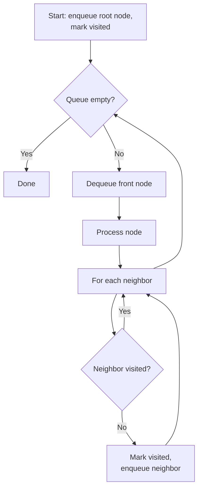
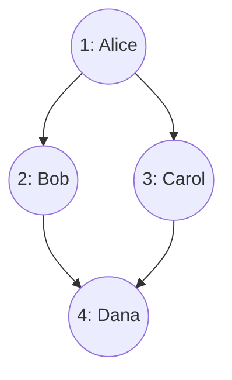

# 04 — Traversal Algorithms

> Part I: Foundations · Position 4 of 37 · ~12 min read

## Table

| # | Section | In this chapter |
|---|---|---|
| 1 | Introduction | The two simplest algorithms in the field, and the two most often mis-implemented |
| 2 | Prerequisites | Chapters 1–3 |
| 3 | Core Concepts | BFS and DFS mechanics, side by side |
| 4 | Internal Architecture | How a real engine walks index-free adjacency at scale |
| 5 | Workflow | BFS as a flowchart |
| 6 | Syntax / Structure | A worked traversal-order example |
| 7 | Code Examples | Correct, minimal BFS and DFS in Python |
| 8 | Use Cases | Shortest unweighted path, cycle detection, topological sort |
| 9 | Performance Considerations | The recursion-depth failure mode nobody warns you about |
| 10 | Security Considerations | Unbounded traversal as a denial-of-service vector |
| 11 | Best Practices | Visited-tracking and iteration over naive recursion |
| 12 | Common Errors | The subtle bug in *when* you mark a node visited |
| 13 | Interview Questions | What you'll get asked, and how to answer well |
| 14 | Summary | O(V+E) is the easy part |
| 15 | References & Further Reading | Where to go next |

## 1. Introduction

BFS and DFS are usually the first two algorithms anyone learns in this field, which creates a false sense that they're the easy chapter. In production they're actually one of the more common sources of real incidents — not because the algorithms are wrong, but because the boring edge cases (cycles, disconnected components, recursion depth) get skipped under deadline pressure and surface months later as a timeout, a stack overflow, or an infinite loop in production.

## 2. Prerequisites

Chapters 1 through 3 — traversal is the first algorithm family that actually operates on the representations and types covered so far.

## 3. Core Concepts

| | BFS | DFS |
|---|---|---|
| Data structure | Queue | Stack (or recursion) |
| Explores | Level by level | As deep as possible, then backtracks |
| Time | O(V + E) | O(V + E) |
| Space | O(V) for the queue/visited set | O(V) worst case — recursion depth on a long path |
| Finds | Shortest path in an unweighted graph | Any path; good for structural questions |

Both are correct and complete on a connected, acyclic-aware implementation. Both fail the same two ways if you skip the boring parts: they loop forever on a cycle without visited-tracking, and they silently skip nodes in a different connected component if you only start from one node.

## 4. Internal Architecture

Against index-free adjacency (chapter 1), a traversal is a pointer-chase: dequeue or pop a node, follow its direct neighbor pointers, enqueue or push the unvisited ones. The part that doesn't show up in a classroom implementation is **visited-tracking at scale** — on a graph with billions of nodes, a full in-memory visited bitmap may not fit in memory at all, which is exactly why large-scale distributed traversal (chapter 21) doesn't run a single BFS from a single machine; it processes the graph in **frontiers** — batches of "currently active" nodes — across a cluster, a model formalized by the Pregel/BSP approach.

## 5. Workflow



## 6. Syntax / Structure

A worked example — BFS from Alice, visitation order numbered:



Dana is reachable through both Bob and Carol, but visited exactly once — the visited-check on enqueue is what prevents her from being processed twice.

## 7. Code Examples

```python
from collections import deque

def bfs(graph, start):
    visited = {start}
    queue = deque([start])
    order = []
    while queue:
        node = queue.popleft()
        order.append(node)
        for neighbor in graph[node]:
            if neighbor not in visited:
                visited.add(neighbor)   # mark visited at enqueue time, not dequeue
                queue.append(neighbor)
    return order

def dfs_iterative(graph, start):
    visited = {start}
    stack = [start]
    order = []
    while stack:
        node = stack.pop()
        order.append(node)
        for neighbor in graph[node]:
            if neighbor not in visited:
                visited.add(neighbor)
                stack.append(neighbor)
    return order
```

Both are written iteratively on purpose — see section 11.

## 8. Use Cases

- **BFS** — shortest path in an unweighted graph, "degrees of connection" features, level-order web crawling.
- **DFS** — cycle detection, topological sort, finding connected components, dependency resolution (build systems, package managers).

## 9. Performance Considerations

The theoretical story is O(V + E) for both. The practical story that catches people off guard: a naive **recursive** DFS implementation uses the call stack for its recursion depth, and on a long, path-like graph (a chain of thousands of sequentially connected nodes — not exotic in dependency graphs or linked-list-shaped data), that recursion depth can exceed the language runtime's default stack limit and crash with a stack overflow, even though the algorithm is textbook-correct. This is a real, common gap between "correct on the whiteboard" and "correct in production."

## 10. Security Considerations

An API endpoint that runs unrestricted BFS or DFS from a user-supplied start node, with no cap on nodes visited or depth traversed, is a textbook resource-exhaustion vector — exactly the "unbounded traversal" risk flagged in chapter 1. This is the first chapter where that warning becomes concrete: cap both traversal depth and total node count before exposing any traversal as a query surface.

## 11. Best Practices

- Always track visited nodes explicitly and mark them at enqueue/push time, not at process time.
- Prefer iterative implementations (explicit queue or stack) over naive recursion for DFS in production, specifically to avoid the stack-overflow failure mode in section 9.
- Cap traversal depth and node count on any traversal exposed as a live query.
- Explicitly iterate over all unvisited nodes to catch disconnected components — a single traversal from one start node will silently miss anything not reachable from it.

## 12. Common Errors

- **Marking a node visited at dequeue/pop time instead of enqueue/push time.** This subtle ordering bug allows the same node to be enqueued multiple times before it's ever processed, causing duplicate work and, in some implementations, incorrect results.
- **Missing the visited check entirely on a cyclic graph** — an infinite loop that often doesn't surface in testing if the test graphs happen to be acyclic.
- **Assuming one traversal covers the whole graph** and silently missing disconnected components.

## 13. Interview Questions

**"Implement BFS and explain why you mark nodes visited when you enqueue them, not when you dequeue them."**
The core insight: marking at dequeue time allows the same node to be added to the queue multiple times before it's ever processed.

**"How would you detect a cycle in a directed graph using DFS?"**
Look for: tracking not just visited nodes but nodes currently *on the recursion stack* — a "back edge" to a node still on the stack indicates a cycle.

**"Your BFS is running out of memory on a huge graph — what would you change?"**
A strong answer moves toward frontier-based, distributed processing (chapter 21) rather than trying to shrink the visited set on a single machine.

## 14. Summary

BFS and DFS are O(V + E) and easy to state correctly. They're hard to run correctly in production, because the failure modes — cycles, disconnection, recursion depth, unbounded scope — are boring, easy to skip under deadline pressure, and expensive when they surface as an incident instead of a code review comment.

## 15. References & Further Reading

**Within this library**
- Chapter 1 — What Is Graph Engineering? (unbounded traversal)
- Chapter 5 — Shortest Path and Routing Algorithms
- Chapter 21 — Distributed Graph Processing Frameworks

**Further reading**
- *Introduction to Algorithms*, Cormen, Leiserson, Rivest, and Stein — the standard reference for BFS/DFS correctness proofs and complexity analysis.
