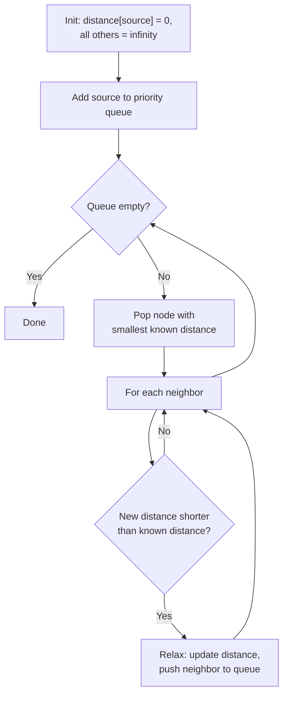
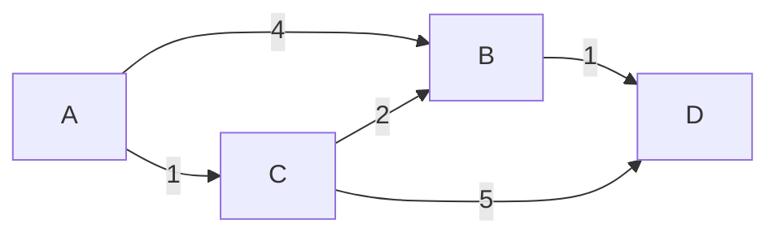

# 05 — Shortest Path and Routing Algorithms

> Part I: Foundations · Position 5 of 37 · ~13 min read

## Table

| # | Section | In this chapter |
|---|---|---|
| 1 | Introduction | The single most economically important algorithm family in this field |
| 2 | Prerequisites | Chapter 4 — Dijkstra is BFS with priorities |
| 3 | Core Concepts | Dijkstra, Bellman-Ford, Floyd-Warshall, A* — compared honestly |
| 4 | Internal Architecture | Why the priority queue implementation matters more than the algorithm |
| 5 | Workflow | Dijkstra's algorithm as a flowchart |
| 6 | Syntax / Structure | A worked shortest-path example |
| 7 | Code Examples | A correct Dijkstra implementation |
| 8 | Use Cases | Road routing, network protocols, all-pairs distance |
| 9 | Performance Considerations | Why real routing engines don't run plain Dijkstra |
| 10 | Security Considerations | Adversarial edges in user-influenced graphs |
| 11 | Best Practices | Match the algorithm to what you actually know about your weights |
| 12 | Common Errors | The silent-wrong-answer bug that never crashes |
| 13 | Interview Questions | What you'll get asked, and how to answer well |
| 14 | Summary | Four algorithms, one tradeoff |
| 15 | References & Further Reading | Where to go next |

## 1. Introduction

Routing, logistics, navigation, and network protocols all reduce, eventually, to some variant of "what's the cheapest path from A to B." The four canonical algorithms in this chapter don't compete with each other so much as answer that question under different assumptions about what you know — do your weights go negative, do you need one path or all of them, and how much time can you spend precomputing before the first query even arrives.

## 2. Prerequisites

Chapter 4. Dijkstra's algorithm is, structurally, breadth-first search with a priority queue instead of a plain queue — if BFS's mechanics are solid, Dijkstra is a small conceptual step, not a new one.

## 3. Core Concepts

| Algorithm | Scope | Negative weights? | Time complexity |
|---|---|---|---|
| **Dijkstra** | Single-source | No | O((V + E) log V) with a binary heap |
| **Bellman-Ford** | Single-source | Yes, and detects negative cycles | O(VE) |
| **Floyd-Warshall** | All-pairs | Yes (not negative cycles) | O(V³) |
| **A\*** | Single-source, point-to-point | No (heuristic-guided Dijkstra) | Depends on heuristic quality; often dramatically faster in practice |

The real decision tree is: do you need one destination or all of them (single-source vs. all-pairs), and can your weights go negative. A* only wins when a good admissible heuristic exists — geographic distance for road networks is the classic case.

## 4. Internal Architecture

Dijkstra's textbook complexity assumes an efficient priority queue, and this is where theory and practice genuinely diverge: a **Fibonacci heap** gives the best asymptotic complexity, O(E + V log V), but has poor real-world constant factors — the bookkeeping overhead usually makes it slower in practice than a simple **binary heap**, despite the binary heap's worse asymptotic bound. Most production implementations use a binary heap for exactly this reason. This is one of the clearest examples in the whole field of "the better Big-O doesn't mean the better implementation."

## 5. Workflow



## 6. Syntax / Structure

A worked example — shortest path from A to D:



The direct A→B edge costs 4. The path A→C→B costs 3. Dijkstra relaxes B's distance down from 4 to 3 when it processes C — the algorithm's entire mechanism in one small example.

## 7. Code Examples

```python
import heapq

def dijkstra(graph, source):
    # graph: {node: [(neighbor, weight), ...]}
    distances = {source: 0}
    pq = [(0, source)]
    while pq:
        dist, node = heapq.heappop(pq)
        if dist > distances.get(node, float('inf')):
            continue  # stale entry, already found a better path
        for neighbor, weight in graph[node]:
            new_dist = dist + weight
            if new_dist < distances.get(neighbor, float('inf')):
                distances[neighbor] = new_dist
                heapq.heappush(pq, (new_dist, neighbor))
    return distances
```

## 8. Use Cases

- **Dijkstra / A\*** — road network routing, game pathfinding.
- **Bellman-Ford** — network routing protocols where negative-weight-style link costs or negative cycle detection matter (distance-vector protocols like RIP historically use Bellman-Ford-style computation).
- **Floyd-Warshall** — small, dense graphs where you genuinely need every pair's distance at once (network diameter calculations, small facility-location problems).

## 9. Performance Considerations

Real-world routing engines at continental scale — mapping apps, logistics platforms — do not run plain Dijkstra or A* against the live graph per query; the latency wouldn't be acceptable. They use precomputation-based speedup techniques, most notably **contraction hierarchies**, which preprocess the graph once (expensive, done offline) to make individual queries dramatically faster (cheap, done online) by shortcutting through unimportant intermediate nodes. This is a genuine altitude-1-vs-altitude-2 gap: the textbook algorithm is correct and is also not what's actually running behind a mapping app's "get directions" button.

## 10. Security Considerations

In any system where the graph itself is partially user-generated or user-influenced (marketplaces, social routing, peer-to-peer networks), shortest-path algorithms are vulnerable to adversarial edge injection — an attacker adding fake low-weight edges or nodes specifically to manipulate which routes or connections the algorithm surfaces as "shortest." Any shortest-path computation over partially untrusted graph data should treat edge weights as a potential attack surface, not just as input.

## 11. Best Practices

- Never run Dijkstra on a graph with negative weights — see section 12, this doesn't fail loudly.
- Use Bellman-Ford specifically when negative weights or negative-cycle detection matter, and accept the slower complexity as the cost.
- Precompute for repeated point-to-point queries against a mostly-static graph rather than recomputing from scratch every time.

## 12. Common Errors

- **Running Dijkstra with negative edge weights.** This is the single most important correctness gotcha in this chapter: Dijkstra doesn't crash or throw an error on negative weights — it silently returns an incorrect shortest path, because its greedy assumption (once a node is finalized, its distance can't improve) breaks down. This is far more dangerous than a loud failure.
- **Not checking for negative cycles when using Bellman-Ford** on data where they're actually possible — a negative cycle means "shortest path" is undefined (you could loop forever, decreasing cost), and Bellman-Ford's cycle-detection pass exists specifically to catch this.

## 13. Interview Questions

**"Why doesn't Dijkstra work with negative edge weights?"**
The strongest answers explain *why*, not just *that*: Dijkstra assumes a finalized node's shortest distance can never improve, which negative weights can violate.

**"When would you choose Bellman-Ford over Dijkstra despite it being slower?"**
Negative weights present in the data, or a need to explicitly detect negative cycles.

**"Explain A* and why it's faster than Dijkstra in practice."**
A heuristic function biases the search toward the goal rather than exploring uniformly in all directions — correctness depends on the heuristic being admissible (never overestimating true cost).

## 14. Summary

Four algorithms, one underlying tradeoff: how much do you know about your weights, and do you need one answer or all of them. Dijkstra is the default until negative weights force Bellman-Ford, until an all-pairs need forces Floyd-Warshall, or until a good heuristic makes A* worth the extra complexity. Production systems at real scale add a fifth consideration none of these four address on their own: precomputation, covered in chapter 25.

## 15. References & Further Reading

**Within this library**
- Chapter 4 — Traversal Algorithms
- Chapter 6 — Centrality and Ranking Algorithms
- Chapter 25 — Capacity Planning and Benchmarking

**Further reading**
- *Introduction to Algorithms*, Cormen, Leiserson, Rivest, and Stein — covers all four algorithms in this chapter with full correctness proofs.
