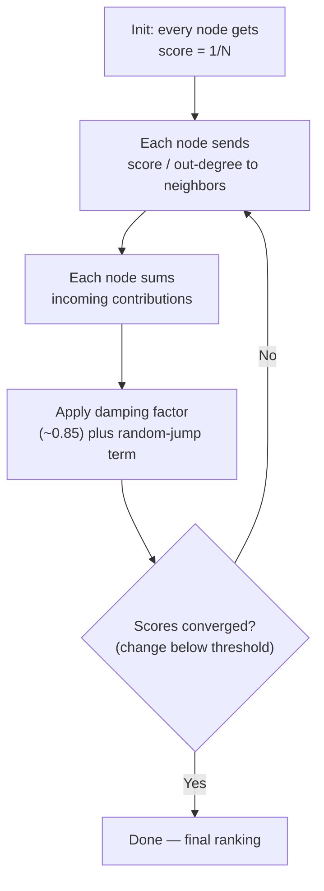

# 06 — Centrality and Ranking Algorithms

> Part I: Foundations · Position 6 of 37 · ~12 min read

## Table

| # | Section | In this chapter |
|---|---|---|
| 1 | Introduction | "Important" isn't one question — it's at least four different ones |
| 2 | Prerequisites | Chapters 4–5 |
| 3 | Core Concepts | Degree, betweenness, closeness, eigenvector centrality, and PageRank |
| 4 | Internal Architecture | PageRank as iterative power iteration, and why that matters for scale |
| 5 | Workflow | PageRank's iterative loop as a flowchart |
| 6 | Syntax / Structure | The PageRank formula, unpacked |
| 7 | Code Examples | A minimal PageRank implementation |
| 8 | Use Cases | Search ranking, fraud hubs, critical infrastructure, brokers |
| 9 | Performance Considerations | Why betweenness centrality gets approximated, not computed exactly |
| 10 | Security Considerations | Centrality-based deanonymization and link-farm manipulation |
| 11 | Best Practices | Pick the measure that matches the question, not the most famous one |
| 12 | Common Errors | Applying PageRank's assumptions to a graph it wasn't built for |
| 13 | Interview Questions | What you'll get asked, and how to answer well |
| 14 | Summary | Four questions, four answers, no universal "importance" |
| 15 | References & Further Reading | Where to go next |

## 1. Introduction

"Which nodes matter most?" sounds like one question. It's actually at least four, and picking the wrong one gives you a ranking that's technically correct and practically useless — a betweenness-centrality answer to a degree-centrality question, dressed up as an insight.

## 2. Prerequisites

Chapters 4 and 5 — several centrality measures are built directly on shortest-path computation.

## 3. Core Concepts

| Measure | Answers | Expensive part |
|---|---|---|
| **Degree centrality** | How many direct connections does this node have? | Trivial — just count edges |
| **Betweenness centrality** | How often does this node sit on the shortest path between others? | O(VE) via Brandes' algorithm — genuinely costly at scale |
| **Closeness centrality** | How close is this node to everything else, on average? | Requires shortest paths to every other node |
| **Eigenvector centrality** | Is this node connected to other important nodes? (recursive) | Iterative eigenvector computation |
| **PageRank** | Same idea as eigenvector centrality, with a damping factor for dead ends | Iterative power iteration |

Betweenness finds **bridges and brokers** — nodes that connect otherwise-separate parts of the graph. Degree finds **hubs**. Eigenvector-family measures (including PageRank) find nodes that are important *because of who they're connected to*, not just how many connections they have.

## 4. Internal Architecture

PageRank is computed via **power iteration**: start every node with a uniform score, repeatedly redistribute each node's score to its neighbors proportional to its outgoing edges, apply a damping factor (traditionally around 0.85, modeling the chance a "random surfer" stops following links and jumps somewhere random), and repeat until scores converge. This is just repeated matrix-vector multiplication — which is exactly why PageRank parallelizes well and is a natural fit for distributed graph-processing frameworks (chapter 21): each iteration only needs each node to know its neighbors' current scores, not the whole graph's state.

## 5. Workflow



## 6. Syntax / Structure

The PageRank update rule, in words: a node's new score is `(1 - damping) / N`, plus `damping` times the sum, over every node linking to it, of that linking node's current score divided by its own out-degree. The `(1 - damping) / N` term is the "random jump" — what prevents score from getting permanently trapped in a dead-end node with no outgoing links.

## 7. Code Examples

```python
def pagerank(graph, damping=0.85, iterations=50):
    # graph: {node: [neighbor, ...]} — outgoing links
    n = len(graph)
    scores = {node: 1 / n for node in graph}
    for _ in range(iterations):
        new_scores = {node: (1 - damping) / n for node in graph}
        for node, neighbors in graph.items():
            if not neighbors:
                continue
            share = scores[node] / len(neighbors)
            for neighbor in neighbors:
                new_scores[neighbor] += damping * share
        scores = new_scores
    return scores
```

## 8. Use Cases

- **PageRank** — search ranking (its original use), and unusually high centrality flagging potential money-laundering hubs in transaction graphs (chapter 30).
- **Betweenness** — identifying critical infrastructure nodes, organizational brokers who sit between otherwise-disconnected teams.
- **Closeness** — facility-location and logistics-hub placement problems.
- **Degree** — the cheap, first-pass "who has the most connections" check, often a reasonable starting heuristic before reaching for anything more expensive.

## 9. Performance Considerations

Betweenness centrality's O(VE) cost via Brandes' algorithm is genuinely expensive at real scale, and exact computation on large graphs is often impractical. Production systems commonly use **sampling-based approximations** instead — computing exact betweenness on a subset of source nodes and extrapolating — trading some accuracy for tractability. This is standard, accepted practice, not a shortcut to be embarrassed about.

## 10. Security Considerations

Two adversarial concerns are specific to centrality: **centrality-based deanonymization**, where high-centrality nodes are often the easiest to reidentify in an otherwise-anonymized social graph, directly connecting back to chapter 1's re-identification warning; and **centrality manipulation**, where coordinated link farms artificially inflate PageRank or similar scores — a well-documented adversarial pattern against any ranking system built on link structure.

## 11. Best Practices

- Choose the centrality measure that matches the actual business question, not the most famous one — PageRank isn't automatically right just because it's well-known.
- Use sampling-based approximation for betweenness at scale rather than attempting exact computation.
- Treat centrality scores as relative rankings, not as meaningful in isolation.

## 12. Common Errors

- **Applying PageRank's damping/normalization assumptions to a graph it wasn't designed for** — PageRank was built for directed hyperlink graphs; applying it naively to undirected or fundamentally different graph types without adapting the assumptions can produce misleading scores.
- **Treating raw centrality score magnitude as meaningful** rather than as a ranking — the number itself usually isn't interpretable outside the context of the whole distribution.

## 13. Interview Questions

**"Explain PageRank's damping factor and why it exists."**
It models the probability a random surfer keeps following links vs. jumps randomly — and prevents score from getting permanently trapped in dead-end nodes.

**"When would betweenness centrality matter more than degree centrality?"**
When you care about bridges and bottlenecks — nodes whose removal would disconnect the graph — rather than nodes with the most direct connections.

## 14. Summary

There is no single "importance" score. Degree, betweenness, closeness, and eigenvector-family measures (including PageRank) each answer a genuinely different question, and the right one depends entirely on what "important" needs to mean for the problem in front of you.

## 15. References & Further Reading

**Within this library**
- Chapter 5 — Shortest Path and Routing Algorithms
- Chapter 21 — Distributed Graph Processing Frameworks
- Chapter 30 — Fraud and Anomaly Detection Graphs

**Further reading**
- Page, Brin, Motwani, and Winograd — the original Stanford PageRank paper.
- Ulrik Brandes — "A Faster Algorithm for Betweenness Centrality," the standard efficient betweenness computation referenced in section 3.
