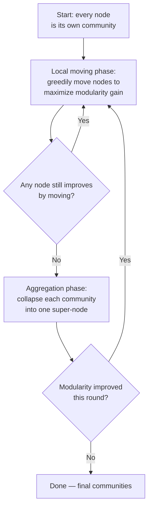

# 07 — Community Detection and Clustering

> Part I: Foundations · Position 7 of 37 · ~12 min read

## Table

| # | Section | In this chapter |
|---|---|---|
| 1 | Introduction | Community detection optimizes a proxy for "natural groups," not the thing itself |
| 2 | Prerequisites | Chapters 4 and 6 |
| 3 | Core Concepts | Louvain, Leiden, label propagation, and what modularity actually measures |
| 4 | Internal Architecture | How Louvain's two-phase process actually works |
| 5 | Workflow | Louvain's iterative loop as a flowchart |
| 6 | Syntax / Structure | The modularity formula, in words |
| 7 | Code Examples | A minimal, illustrative community-merge sketch |
| 8 | Use Cases | Friend groups, fraud rings, customer segmentation |
| 9 | Performance Considerations | Why Louvain and Leiden scale where exact optimization can't |
| 10 | Security Considerations | Community structure as sensitive information in its own right |
| 11 | Best Practices | Check stability across seeds before trusting one result |
| 12 | Common Errors | Treating one algorithm's output as ground truth |
| 13 | Interview Questions | What you'll get asked, and how to answer well |
| 14 | Summary | Communities are found relative to a proxy, not discovered as fact |
| 15 | References & Further Reading | Where to go next |

## 1. Introduction

Community detection promises an answer to "what are the natural groups in this graph." The honest answer is narrower: it optimizes a specific mathematical proxy for that question — almost always **modularity** — and that proxy has known blind spots. Understanding those blind spots is the difference between using this family of algorithms well and being quietly misled by them.

## 2. Prerequisites

Chapters 4 and 6 — community detection builds on traversal and, conceptually, sits alongside centrality as another way of asking "what does the structure of this graph tell me."

## 3. Core Concepts

**Modularity** measures how much more densely connected a proposed group is compared to what you'd expect by chance. Higher modularity roughly means "this partition into groups looks less like a random graph."

| Algorithm | Approach | Speed | Notable property |
|---|---|---|---|
| **Louvain** | Greedy modularity maximization, iterative merge | Fast, widely used | Can produce internally *disconnected* "communities" — a known flaw |
| **Leiden** | Refinement of Louvain | Fast, slightly more overhead | Explicitly guarantees well-connected communities, fixing Louvain's flaw |
| **Label propagation** | Nodes adopt their neighbors' most common label, iteratively | Near-linear, very fast | Less stable — different runs can give different results |

Maximizing modularity exactly is NP-hard. Every practical algorithm here is a heuristic, not an exact solver — the communities you get are an approximation, not ground truth.

## 4. Internal Architecture

Louvain works in two repeated phases: **local moving**, where each node is greedily reassigned to whichever neighboring community most increases modularity, and **aggregation**, where each detected community is collapsed into a single super-node and the process repeats on this smaller graph. This is why Louvain is fast — the graph gets smaller every pass — and also why it can produce disconnected communities: the aggregation step can merge two dense-but-physically-separate clusters into one "community" if doing so happens to increase modularity, with nothing in the algorithm enforcing that the result stays a single connected piece. Leiden adds an explicit refinement step specifically to close this gap.

## 5. Workflow



## 6. Syntax / Structure

Modularity, in words: for a proposed grouping, sum up — across every pair of nodes in the same group — the actual edge weight between them minus the *expected* edge weight if connections were placed at random (proportional to each node's degree). Sum that difference across all pairs in all groups, normalized by total edge weight. A high positive score means the groups are genuinely denser internally than chance would predict.

## 7. Code Examples

```python
# Illustrative sketch of Louvain's local-moving idea — not a full implementation.
# Real production use should reach for an established library rather than
# a hand-rolled version, given how easy modularity bookkeeping is to get subtly wrong.

def modularity_gain(node, target_community, graph, communities):
    """Sketch only: real gain calculation needs degree-weighted expectation terms."""
    internal_edges = sum(
        1 for neighbor in graph[node]
        if communities[neighbor] == target_community
    )
    return internal_edges  # a real implementation subtracts the expected-by-chance term
```

## 8. Use Cases

- Social network friend-group detection.
- Fraud ring detection — coordinated account clusters (chapter 30).
- Customer or product segmentation for targeting and recommendations.

## 9. Performance Considerations

Exact modularity optimization is NP-hard, which rules it out above trivial graph sizes. Louvain and Leiden both scale near-linearly in practice because of the aggregation trick in section 4 — the graph shrinks every pass. Label propagation is faster still, at the cost of determinism: different runs, or different tie-breaking orders, can produce meaningfully different community assignments on the same graph.

## 10. Security Considerations

Community structure is sensitive in its own right, independent of any individual node's identity. Revealing "this cluster of accounts behaves as a coordinated group" carries real privacy and surveillance implications, especially for social or communication graphs — the community label itself can be the disclosure, even when no individual node's data is directly exposed.

## 11. Best Practices

- Run multiple algorithms, or the same algorithm with multiple random seeds, and check stability before treating a community assignment as settled fact.
- Understand the resolution limit before concluding "no substructure exists" — modularity optimization can systematically miss small communities embedded in a large graph.
- Prefer Leiden over vanilla Louvain when downstream logic assumes communities are internally connected.

## 12. Common Errors

- **Treating one algorithm's single run as ground truth** rather than as one approximation among several plausible ones.
- **Not checking internal connectivity of Louvain's output** — exactly the flaw Leiden was built to fix, and a real source of silently broken downstream logic if unchecked.

## 13. Interview Questions

**"Why was Leiden created if Louvain already existed?"**
Louvain can produce internally disconnected communities under aggregation; Leiden adds a refinement step that explicitly guarantees connectivity.

**"What's the resolution limit problem in modularity optimization?"**
Modularity, as a global measure, can systematically fail to detect communities that are small relative to the whole graph, even when they're genuinely dense internally.

## 14. Summary

Community detection doesn't discover ground-truth groups — it finds a partition that scores well against a specific proxy, usually modularity, using a heuristic that trades exactness for tractability. Treat the output as a strong hypothesis worth checking, not a fact worth building irreversible decisions on without validation.

## 15. References & Further Reading

**Within this library**
- Chapter 4 — Traversal Algorithms
- Chapter 6 — Centrality and Ranking Algorithms
- Chapter 30 — Fraud and Anomaly Detection Graphs

**Further reading**
- Blondel, Guillaume, Lambiotte, and Lefebvre — "Fast Unfolding of Communities in Large Networks," the original Louvain paper.
- Traag, Waltman, and van Eck — "From Louvain to Leiden: Guaranteeing Well-Connected Communities."
