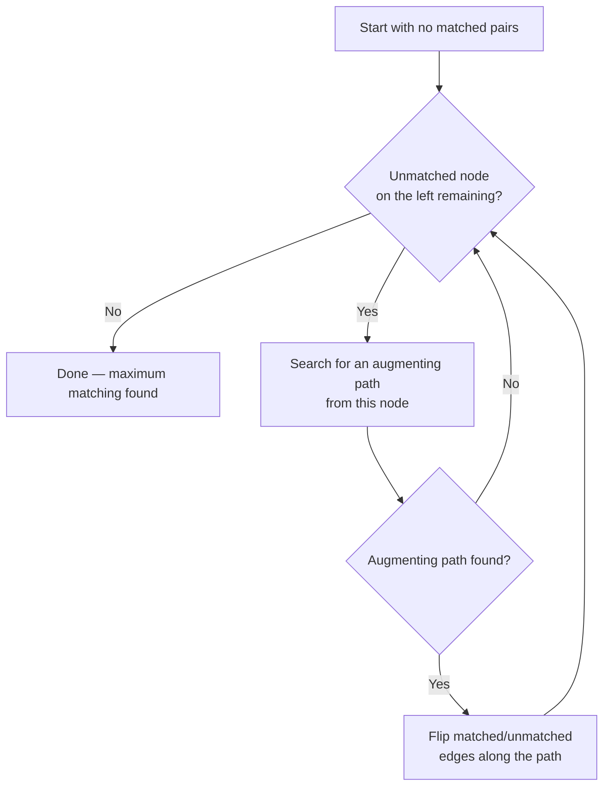

# 08 — Graph Coloring and Matching

> Part I: Foundations · Position 8 of 37 · ~11 min read

## Table

| # | Section | In this chapter |
|---|---|---|
| 1 | Introduction | Puzzle-book problems that run compilers, schedules, and exchange markets |
| 2 | Prerequisites | Chapter 3 — bipartite graphs |
| 3 | Core Concepts | Coloring, chromatic number, and maximum matching |
| 4 | Internal Architecture | How real register allocators actually approach an NP-hard problem |
| 5 | Workflow | Hopcroft-Karp's augmenting-path search as a flowchart |
| 6 | Syntax / Structure | Coloring and matching notation |
| 7 | Code Examples | A greedy coloring implementation |
| 8 | Use Cases | Compiler register allocation, scheduling, kidney exchange, ride-share matching |
| 9 | Performance Considerations | Why coloring gets approximated and matching doesn't have to be |
| 10 | Security Considerations | Gaming matching systems with fake nodes |
| 11 | Best Practices | Use exact algorithms where the problem is genuinely polynomial |
| 12 | Common Errors | Brute-forcing a problem that doesn't need it, or vice versa |
| 13 | Interview Questions | What you'll get asked, and how to answer well |
| 14 | Summary | One of these is NP-hard; the other one isn't, and that changes everything |
| 15 | References & Further Reading | Where to go next |

## 1. Introduction

Graph coloring and matching read like textbook puzzles — color a map, pair up dance partners — but compiler register allocation, exam scheduling, and real-world exchange markets like kidney donation programs all run on exactly these two problems. The gap between how simple they sound and how differently tractable they actually are is the whole point of this chapter.

## 2. Prerequisites

Chapter 3, specifically bipartite graphs — most practical matching problems are bipartite matching problems.

## 3. Core Concepts

**Graph coloring** assigns colors to nodes such that no two adjacent nodes share a color. The **chromatic number** is the fewest colors needed. Deciding whether a graph can be colored with *k* colors, for any *k* ≥ 3, is NP-complete — there's no known efficient exact algorithm for the general case.

**Maximum matching** pairs nodes such that no node is matched more than once. Unlike general coloring, matching on a **bipartite** graph is solvable exactly in polynomial time — a genuinely different complexity class from general graph coloring, despite both problems sounding similarly "hard."

| Problem | Complexity | Standard algorithm |
|---|---|---|
| General graph coloring | NP-hard | Greedy + heuristics (no efficient exact solver) |
| Bipartite maximum matching | Polynomial | Hopcroft-Karp, O(E√V) |

## 4. Internal Architecture

Since exact optimal coloring is intractable at real scale, production systems — including compiler register allocators — don't attempt it. They use greedy coloring heuristics combined with backtracking or spilling strategies (in a compiler's case, "spilling" a variable to memory when no register color is available) to get a good-enough result quickly, rather than a provably optimal one. This is one of the field's clearest examples of choosing a fast heuristic over an intractable exact solution, deliberately and permanently, not as a temporary shortcut.

## 5. Workflow



An augmenting path alternates between unmatched and matched edges, starting and ending on unmatched nodes — flipping it increases the total matching size by exactly one.

## 6. Syntax / Structure

Coloring: `color(v) ≠ color(u)` for every edge `(u, v)`. Chromatic number is written `χ(G)`.

Matching: a matching `M` is a set of edges with no shared endpoints; a *maximum* matching has the largest possible `|M|`.

## 7. Code Examples

```python
def greedy_coloring(graph):
    # graph: {node: [neighbor, ...]}
    colors = {}
    for node in graph:
        used = {colors[n] for n in graph[node] if n in colors}
        color = 0
        while color in used:
            color += 1
        colors[node] = color
    return colors
```

Greedy coloring isn't guaranteed optimal — it depends on node processing order — but it's fast and good enough for most real workloads, consistent with section 4.

## 8. Use Cases

- **Coloring** — compiler register allocation, exam and meeting scheduling (time slots as colors), map coloring.
- **Matching** — job and task assignment, kidney exchange programs (a genuine, well-studied real-world application of graph matching), ride-share driver-rider pairing, dating and matchmaking systems.

## 9. Performance Considerations

Because general coloring is NP-hard, production systems above trivially small graphs never attempt exact optimal coloring — they use greedy or heuristic approaches and accept a possibly-suboptimal-but-valid result. Bipartite matching is the opposite story: it's one of the few graph problems that looks intimidating but is actually efficiently solvable exactly, which is why Hopcroft-Karp (or simpler augmenting-path methods on smaller instances) is used directly in production rather than approximated.

## 10. Security Considerations

Matching systems built on user-supplied graphs — ride-share, dating, job-matching platforms — are a real target for manipulation via fake or duplicate nodes designed to game match outcomes (securing a preferred match, avoiding an undesired one, or manipulating priority in an exchange). Any production matching system operating on user-influenced data needs to treat node authenticity as part of its threat model, not just an input-validation afterthought.

## 11. Best Practices

- Use exact algorithms where the underlying problem is genuinely polynomial — Hopcroft-Karp for bipartite matching, not a general-purpose approximate method.
- Use heuristics deliberately for NP-hard coloring, and validate result quality rather than assuming "it ran, so it's good."
- Don't reach for a general matching algorithm on a problem that's actually bipartite — the specialized algorithm is both simpler and faster.

## 12. Common Errors

- **Attempting exact optimal coloring on a large general graph** — the problem is intractable at that scale, and the attempt will not finish in reasonable time.
- **Using a general-purpose matching algorithm on a bipartite-specific problem**, missing the simpler, faster Hopcroft-Karp approach that the bipartite structure actually enables.

## 13. Interview Questions

**"Why is graph coloring NP-hard but bipartite matching isn't?"**
Look for recognition that these are genuinely different complexity classes, not just "harder" and "easier" versions of the same difficulty — coloring has no known efficient exact algorithm for k ≥ 3 colors; bipartite matching has one.

**"How would you model kidney exchange as a graph matching problem?"**
Donors and recipients as bipartite (or more complex cyclic-exchange) nodes, edges representing medical compatibility, matching maximizing the number of successful, compatible pairings.

## 14. Summary

Coloring and matching sit right next to each other in most textbooks and belong to entirely different complexity worlds — one NP-hard, one polynomial. Knowing which is which, and reaching for the right algorithm rather than a general-purpose one, is most of what this chapter is actually about.

## 15. References & Further Reading

**Within this library**
- Chapter 3 — Graph Types Taxonomy
- Chapter 9 — Property Graph Modeling

**Further reading**
- Hopcroft and Karp — the original bipartite matching algorithm paper.
- Appel and Haken — the proof of the four-color theorem, the most famous coloring result in mathematics.
