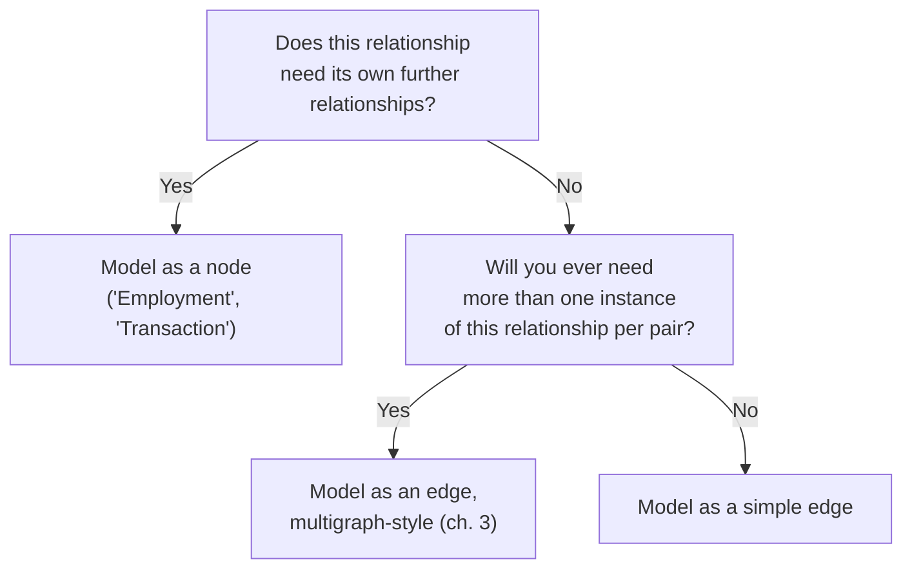

# 09 — Property Graph Modeling

> Part II: Data Modeling · Position 9 of 37 · ~11 min read

## Table

| # | Section | In this chapter |
|---|---|---|
| 1 | Introduction | The model almost everyone actually works in day to day |
| 2 | Prerequisites | Chapters 1–3 |
| 3 | Core Concepts | Nodes, edges, labels, properties — and the verb-vs-noun debate |
| 4 | Internal Architecture | How labels and properties are actually stored alongside index-free adjacency |
| 5 | Workflow | Deciding edge vs. node for a given relationship |
| 6 | Syntax / Structure | Property graph notation in Cypher |
| 7 | Code Examples | Modeling the same relationship two ways |
| 8 | Use Cases | Where property graphs are the default, correctly |
| 9 | Performance Considerations | Why over-using properties kills traversability |
| 10 | Security Considerations | Properties as an accidental PII sink |
| 11 | Best Practices | Model the verb as an edge until you have a real reason not to |
| 12 | Common Errors | The single most common property graph modeling mistake |
| 13 | Interview Questions | What you'll get asked, and how to answer well |
| 14 | Summary | One question decides most of this |
| 15 | References & Further Reading | Where to go next |

## 1. Introduction

The property graph model — nodes and edges, each with a label/type and arbitrary key-value properties — is what most engineers mean when they say "graph database" day to day. It's flexible enough to model almost anything, which is exactly the problem: flexibility without a clear modeling discipline produces schemas that are technically valid and practically unusable.

## 2. Prerequisites

Chapters 1 through 3, especially chapter 3's graph types — property graphs are usually where those abstract types actually get implemented.

## 3. Core Concepts

A property graph has four building blocks: **nodes** (entities, each with a label like `Person` or `Company`), **edges** (relationships, each with a type like `WORKS_AT`, plus direction), and **properties** on both (key-value pairs like `name: "Deb"` or `since: 2021`).

The central, recurring design question is the **verb-vs-noun debate**: should a relationship be modeled as an edge (a verb — "works at") or as its own node (a noun — an `Employment` entity connecting a `Person` and a `Company`)? Edges are cheap to traverse but can't easily carry their own further relationships. A node can have relationships pointing at it — "who approved this employment" — that an edge fundamentally cannot.

| | Edge ("verb") | Node ("noun") |
|---|---|---|
| Traversal cost | Cheap — one hop | More expensive — two hops through the relationship node |
| Can have its own relationships? | No | Yes |
| Right for | Simple, one-shot relationships | Relationships that are themselves subject to further facts |

## 4. Internal Architecture

Labels and properties don't change the fundamental storage mechanism from chapter 15's index-free adjacency — a labeled, propertied node is still just a record with direct pointers to its relationship records. The label typically lives as metadata on the node record itself (often backed by its own index for fast "find all nodes of type X" lookups), while properties are usually stored in a separate property store referenced by the node or relationship record, keeping the core traversal structure lean regardless of how many properties a given node happens to carry.

## 5. Workflow



## 6. Syntax / Structure

```cypher
// Verb-as-edge: simple, one-hop traversal
(deb:Person {name: 'Deb'})-[:WORKS_AT {since: 2021}]->(company:Company {name: 'Acme'})

// Noun-as-node: the relationship itself can now have its own relationships
(deb:Person)-[:HAS]->(e:Employment {since: 2021})-[:AT]->(company:Company)
(e)-[:APPROVED_BY]->(manager:Person {name: 'Priya'})
```

## 7. Code Examples

```cypher
// Anti-pattern: relationship data crammed into a property, losing traversability
CREATE (deb:Person {name: 'Deb', manager_name: 'Priya'})

// Better: the relationship is queryable, reversible, and joinable to other data
CREATE (deb:Person {name: 'Deb'})-[:MANAGED_BY]->(priya:Person {name: 'Priya'})
```

## 8. Use Cases

Property graphs are the right default for most application-level graph work: social graphs, recommendation graphs, access-control graphs, org charts — anywhere the relationships themselves are relatively simple and the main need is fast, flexible traversal rather than formal cross-organization interoperability (chapter 10 covers when that formality is actually worth its cost).

## 9. Performance Considerations

The single biggest performance cost in property graph modeling isn't storage — it's **lost traversability**. Every time a relationship gets crammed into a property instead of expressed as an edge (a `manager_name` string instead of a `MANAGED_BY` edge), you lose the ability to traverse it, index it independently, or query it in reverse ("who does Priya manage?") without a full property scan instead of a graph-native hop.

## 10. Security Considerations

Properties are an easy, informal place for PII to accumulate without anyone explicitly deciding it should live there — a `notes` or `metadata` property field is a classic spot for sensitive free-text to end up unclassified and unaudited. Property-level data classification deserves the same rigor as column-level classification in a relational schema; it's easy to skip precisely because properties feel informal.

## 11. Best Practices

- Default to modeling the verb as an edge; only promote it to a node when you have a concrete need for the relationship to have its own further relationships or independent identity.
- Treat any property that looks like it's referencing another entity by name or ID as a modeling smell — it usually wants to be an edge.
- Audit property fields for accumulated PII the same way you'd audit relational columns.

## 12. Common Errors

- **Storing a reference as a property instead of an edge** — the single most common property graph mistake, and the one covered in section 7's anti-pattern example.
- **Promoting every relationship to a node "to be safe,"** the mirror-image error from chapter 1 — adding unnecessary hops to relationships that never needed independent identity.

## 13. Interview Questions

**"How would you decide whether a relationship should be an edge or its own node?"**
The strongest answers lead with "does this relationship need its own relationships" rather than "it depends" without a concrete test.

**"What's wrong with storing `manager_name` as a property on a `Person` node?"**
It's not traversable, not reversible, and not indexable the way a `MANAGED_BY` edge would be.

## 14. Summary

Property graph modeling comes down to one recurring question, asked relationship by relationship: does this need to be traversable and independently queryable (edge), or does it need its own further facts and relationships (node)? Most modeling disasters in this field trace back to answering that question inconsistently across a schema.

## 15. References & Further Reading

**Within this library**
- Chapter 3 — Graph Types Taxonomy
- Chapter 11 — Graph Schema Design Patterns
- Chapter 15 — Native Graph Storage Internals
