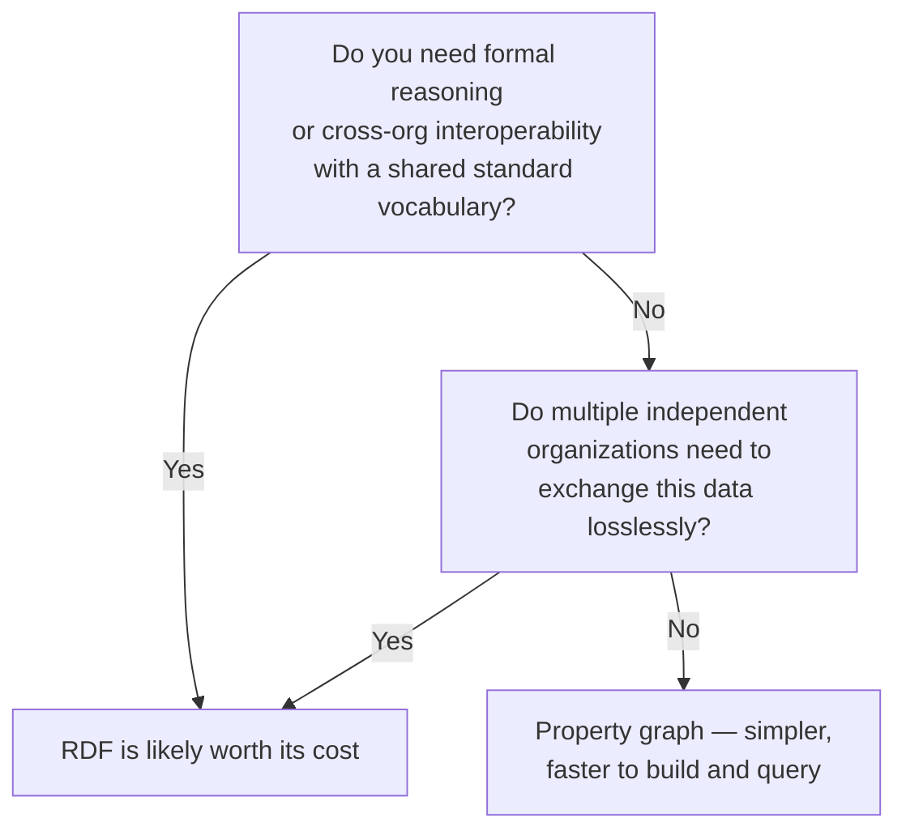

# 10 — RDF and Knowledge Graph Modeling

> Part II: Data Modeling · Position 10 of 37 · ~11 min read

## Table

| # | Section | In this chapter |
|---|---|---|
| 1 | Introduction | The other graph model, built for a different problem than property graphs solve |
| 2 | Prerequisites | Chapter 9 |
| 3 | Core Concepts | Triples, ontologies, OWL, schema.org |
| 4 | Internal Architecture | Triple stores and how they differ from property graph engines |
| 5 | Workflow | Deciding RDF vs. property graph |
| 6 | Syntax / Structure | A triple, and a SPARQL query over it |
| 7 | Code Examples | The same fact in RDF and in a property graph |
| 8 | Use Cases | Where RDF's formality actually pays for itself |
| 9 | Performance Considerations | The interoperability-vs-simplicity tradeoff, concretely |
| 10 | Security Considerations | Open-world assumption and the "absence isn't denial" trap |
| 11 | Best Practices | Don't reach for RDF by default |
| 12 | Common Errors | Using RDF's formalism where a property graph would have been simpler |
| 13 | Interview Questions | What you'll get asked, and how to answer well |
| 14 | Summary | Formality is a cost you pay for a specific benefit |
| 15 | References & Further Reading | Where to go next |

## 1. Introduction

RDF (Resource Description Framework) and the property graph model both call themselves "graphs," and they're solving genuinely different problems. Property graphs optimize for flexible, fast application-level traversal. RDF optimizes for formal, standardized, cross-organization data interchange and reasoning. Confusing the two — or reaching for RDF's formality when you didn't need it — is a real, recurring modeling mistake.

## 2. Prerequisites

Chapter 9 — understanding what property graphs optimize for makes RDF's different tradeoffs much easier to evaluate honestly.

## 3. Core Concepts

RDF represents every fact as a **triple**: subject–predicate–object. "Alice worksAt Anthropic" becomes `(Alice, worksAt, Anthropic)`. There's no separate "node" and "edge" concept the way property graphs have it — everything is triples, including, in principle, facts about facts.

An **ontology** is a formal vocabulary defining what classes and relationships are allowed to mean — **OWL** (Web Ontology Language) is the W3C standard for writing these. **schema.org** is a widely-adopted shared vocabulary specifically for structured data on the web (used heavily in SEO and search-engine understanding of page content) — a practical, everyday example of an RDF-adjacent ontology already in use.

RDF's query language is **SPARQL**, already introduced in chapter 1 as one of the four major graph query languages.

## 4. Internal Architecture

RDF is typically stored in a **triple store**, indexed to efficiently answer queries across all three positions of a triple — "what's the object, given this subject and predicate," but also "what subjects have this predicate-object pair," and combinations of the two. This is architecturally different from a property graph engine's index-free adjacency, which is optimized for "starting from this specific node, walk outward" rather than "search across all triples matching this pattern." Triple stores generally use various indexing structures across subject-predicate-object permutations rather than a single dominant physical adjacency structure.

## 5. Workflow



## 6. Syntax / Structure

A triple: `(Deb, worksAt, Anthropic)`.

The same fact in SPARQL, asking "where does Deb work":

```sparql
SELECT ?employer WHERE {
  :Deb :worksAt ?employer .
}
```

## 7. Code Examples

The same fact, two models:

```
# RDF triples
(Deb, worksAt, Anthropic)
(Anthropic, type, Company)
```

```cypher
// Property graph equivalent
(deb:Person {name: 'Deb'})-[:WORKS_AT]->(anthropic:Company {name: 'Anthropic'})
```

Structurally similar at this scale. The difference shows up in formal reasoning capability and standardized interchange, not in this single example.

## 8. Use Cases

RDF earns its cost specifically where **formal reasoning** matters (inferring new facts from ontology rules — "if X is a subclass of Y, and Z is an X, then Z is also a Y") or where **standardized cross-organization interchange** matters — biomedical and life-sciences data sharing, government linked-open-data initiatives, and search-engine-facing structured data (schema.org) are the classic real examples.

## 9. Performance Considerations

RDF's formality is a real, ongoing cost: schema validation against an ontology, the overhead of representing even simple facts as full triples, and query patterns that are often less intuitive to write than property-graph pattern matching. None of this is free, and paying it without a genuine need for reasoning or standardized interchange is a common, avoidable tax on a team.

## 10. Security Considerations

RDF traditionally operates under an **open-world assumption** — the absence of a triple stating a fact doesn't mean that fact is false, only that it's unknown. This is philosophically appropriate for open, incomplete web-scale data, but it's a genuine trap if a team unconsciously treats an RDF store like a property graph's more typical closed-world assumption (where absence of a relationship is usually treated as meaning it doesn't exist) — particularly dangerous in any access-control context, where "no explicit deny" should never be silently read as "implicitly allowed."

## 11. Best Practices

- Don't reach for RDF by default — most internal application graphs don't need its formalism, and property graphs (chapter 9) get you there faster.
- If you do need RDF, invest in the ontology design up front; a poorly designed ontology is worse than none, since it actively constrains and mis-models the domain.
- Be explicit and deliberate about open-world vs. closed-world assumptions, especially anywhere access control is involved.

## 12. Common Errors

- **Choosing RDF because it sounds more "correct" or academically rigorous**, without a concrete need for reasoning or cross-org interchange that justifies the added cost.
- **Silently assuming closed-world semantics inside an open-world RDF store**, particularly in security-sensitive contexts.

## 13. Interview Questions

**"When would you choose RDF over a property graph?"**
Look for: formal reasoning requirements, or genuine cross-organization standardized interchange — not "it's the more academically correct graph model."

**"What's the difference between open-world and closed-world assumptions, and why does it matter?"**
Open-world: absence of a fact means unknown, not false. This is a real, practical hazard in access-control contexts specifically.

## 14. Summary

RDF and property graphs aren't competing implementations of the same idea — they're built for different problems. RDF's formal, standardized structure earns its cost when reasoning or cross-organization interchange genuinely matter; everywhere else, it's usually an unnecessary tax on a team that would have been faster and simpler in the property graph model from chapter 9.

## 15. References & Further Reading

**Within this library**
- Chapter 9 — Property Graph Modeling
- Chapter 16 — Query Languages Compared
- Chapter 31 — Knowledge Graphs for Search and RAG
