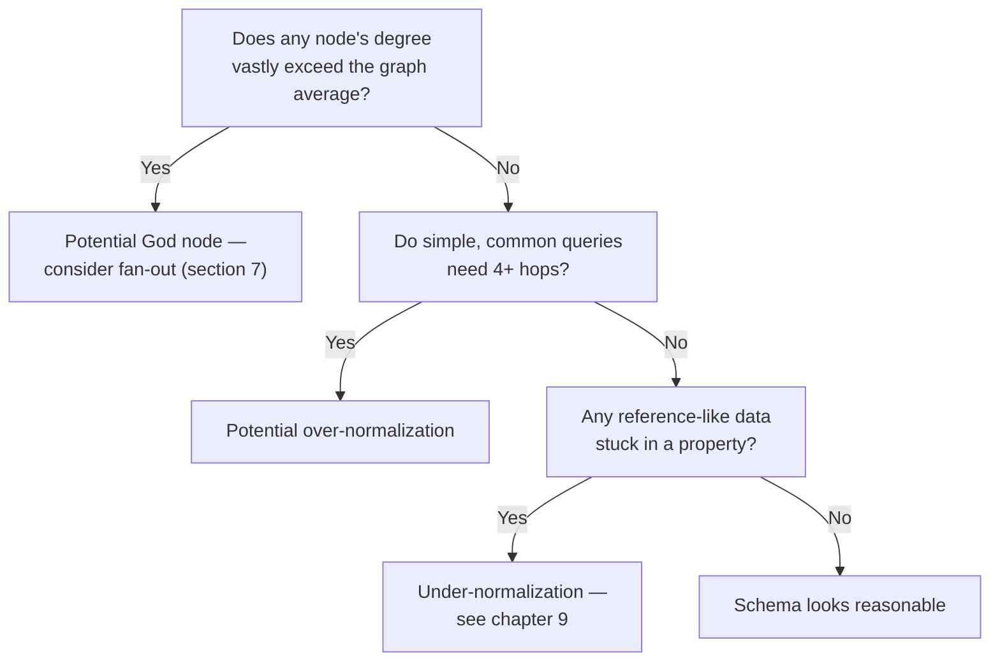
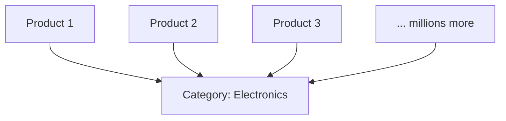

# 11 — Graph Schema Design Patterns

> Part II: Data Modeling · Position 11 of 37 · ~11 min read

## Table

| # | Section | In this chapter |
|---|---|---|
| 1 | Introduction | The recurring failure shapes, across otherwise very different schemas |
| 2 | Prerequisites | Chapter 9 |
| 3 | Core Concepts | The God node, over-normalization, under-normalization |
| 4 | Internal Architecture | Why these patterns hurt differently depending on the storage engine |
| 5 | Workflow | A schema review checklist as a flow |
| 6 | Syntax / Structure | Spotting the antipattern in a schema diagram |
| 7 | Code Examples | Fan-out as a fix for an emerging God node |
| 8 | Use Cases | Where each antipattern tends to sneak in |
| 9 | Performance Considerations | Why these are performance bugs, not just style issues |
| 10 | Security Considerations | Over-broad nodes as an accidental permission boundary |
| 11 | Best Practices | Reviewing for these patterns before launch, not after |
| 12 | Common Errors | The three patterns, concretely |
| 13 | Interview Questions | What you'll get asked, and how to answer well |
| 14 | Summary | Most schema disasters are one of three shapes |
| 15 | References & Further Reading | Where to go next |

## 1. Introduction

Across wildly different domains — social networks, fraud graphs, e-commerce catalogs — the same handful of schema mistakes keep recurring. Naming them explicitly makes them much easier to catch in a design review than "something about this schema feels wrong."

## 2. Prerequisites

Chapter 9's verb-vs-noun modeling discipline is the foundation this chapter builds on.

## 3. Core Concepts

- **The God node** — one node connected to a disproportionate share of the graph (a single `Category: Electronics` node linked from millions of products). This is a supernode (full treatment in chapter 19) introduced at the schema-design level, where it's often still preventable.
- **Over-normalization** — splitting relationships into so many small typed nodes that simple queries require unnecessarily many hops.
- **Under-normalization** — cramming too much into properties (chapter 9's core anti-pattern), losing traversability and independent queryability.

| Pattern | Symptom | Root cause |
|---|---|---|
| God node | One node with vastly disproportionate degree | Categorical/grouping data modeled as a single shared node |
| Over-normalization | Simple queries need many hops | Excessive node-per-concept splitting |
| Under-normalization | Can't traverse or query a relationship | Relationship crammed into a property |

## 4. Internal Architecture

Each pattern hurts differently depending on the storage layer. A God node is catastrophic specifically against index-free adjacency (chapter 15), since traversing through it means walking a huge neighbor list instead of a cheap pointer-chase. Over-normalization hurts more in distributed systems (Part IV), where each extra hop is a potential network round-trip rather than a local pointer dereference. Under-normalization doesn't hurt traversal performance directly — it prevents traversal from being possible at all.

## 5. Workflow



## 6. Syntax / Structure

The God node pattern, visually:



Every product traversal touching "category" now passes through the same single node.

## 7. Code Examples

```cypher
// Emerging God node: every product points at one shared category node
(p:Product)-[:IN_CATEGORY]->(c:Category {name: 'Electronics'})

// Fan-out fix: denormalize the category as a property where deep traversal
// through it isn't actually needed, reserving the edge for cases that are
(p:Product {name: 'Kettle', category: 'Electronics'})-[:IN_CATEGORY]->(c:Category {name: 'Electronics'})
```

The edge stays for the cases that genuinely need category-level traversal (recommendations, browsing); the property serves fast filtering without forcing every query through the shared node.

## 8. Use Cases

God nodes sneak in through categorical/taxonomy data (categories, tags, countries, common employers). Over-normalization sneaks in through well-intentioned "everything should be its own entity" modeling discipline taken too far. Under-normalization sneaks in under deadline pressure, when a property is faster to add than a properly modeled edge.

## 9. Performance Considerations

These aren't style preferences — each pattern has a concrete, measurable performance cost. A God node turns cheap traversal into an effective full scan the moment it's touched. Over-normalization multiplies network round-trips in a distributed system. Under-normalization doesn't show up as a performance problem at all — it shows up as a missing capability, discovered only when someone tries to write the query and can't.

## 10. Security Considerations

An overly broad shared node can accidentally become a de facto permission boundary — if access control is scoped at the node level and many unrelated entities share one categorical node, permission logic can leak more broadly than intended, or become impossible to scope tightly without a schema change.

## 11. Best Practices

- Review new schemas explicitly against these three patterns before launch — this is the checklist in section 5.
- Treat any node whose degree could plausibly grow unbounded as a designed decision, not an accident.
- Revisit schemas periodically; a node that wasn't a God node at launch can become one as usage grows.

## 12. Common Errors

- **Not recognizing a God node until it's already causing incidents** — the pattern is usually visible at design time if anyone asks "could this node's degree grow without bound?"
- **Over-correcting into over-normalization** after being burned by under-normalization once, splitting everything into nodes reflexively rather than deliberately.

## 13. Interview Questions

**"How would you catch a God node before it becomes a production problem?"**
Look for: reviewing schemas specifically for nodes with unbounded potential degree, not waiting for a performance incident to reveal it.

**"What's the tradeoff between over- and under-normalization in a graph schema?"**
Over-normalization costs hops; under-normalization costs traversability entirely — different failure modes, both real.

## 14. Summary

Most graph schema disasters reduce to one of three recurring shapes: a node that grew too central, a schema split into too many pieces, or a relationship that never became a real edge. Naming them makes them checkable in a design review, rather than something you only learn to recognize after an incident.

## 15. References & Further Reading

**Within this library**
- Chapter 9 — Property Graph Modeling
- Chapter 19 — The Supernode Problem
- Chapter 13 — Graph Normalization vs Denormalization
