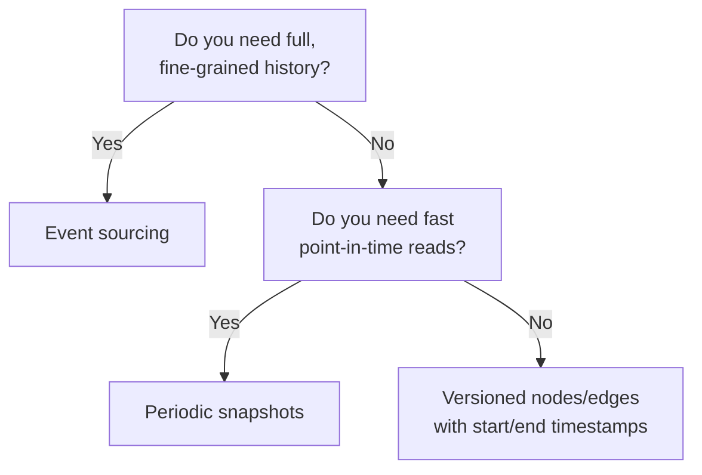

# 12 — Temporal and Versioned Graphs

> Part II: Data Modeling · Position 12 of 37 · ~11 min read

## Table

| # | Section | In this chapter |
|---|---|---|
| 1 | Introduction | Most graphs quietly assume "now" — this chapter is about when that stops being true |
| 2 | Prerequisites | Chapter 3's temporal graph type |
| 3 | Core Concepts | Bitemporal modeling: valid time vs. transaction time |
| 4 | Internal Architecture | Versioned records, event sourcing, and snapshots |
| 5 | Workflow | Choosing a temporal modeling approach |
| 6 | Syntax / Structure | A bitemporal edge, notated |
| 7 | Code Examples | Modeling a relationship that changed over time |
| 8 | Use Cases | Audit trails, fraud pattern evolution, versioned knowledge graphs |
| 9 | Performance Considerations | The cost of "as of any point in time" queries |
| 10 | Security Considerations | The un-time-boxed query problem, revisited |
| 11 | Best Practices | Decide your temporal model before your first write, not after |
| 12 | Common Errors | Treating "deleted" as "gone" |
| 13 | Interview Questions | What you'll get asked, and how to answer well |
| 14 | Summary | Two clocks, not one |
| 15 | References & Further Reading | Where to go next |

## 1. Introduction

Most graph schemas quietly assume the graph represents "now" — that a relationship either currently exists or doesn't. That assumption breaks the moment anyone asks "what did this look like last quarter," and retrofitting time into a graph that was never designed for it is far more expensive than designing it in from the start.

## 2. Prerequisites

Chapter 3 introduced temporal graphs as a type; this chapter covers how to actually model one.

## 3. Core Concepts

**Bitemporal modeling** tracks two independent clocks: **valid time** (when something was true in the real world — "this employment ran from 2021 to 2023") and **transaction time** (when the system recorded that fact — which might be entered months after the fact, or corrected later). These are genuinely independent: a correction entered today about something that was true two years ago has a transaction time of today and a valid time of two years ago.

| Clock | Answers | Example |
|---|---|---|
| Valid time | When was this true in reality? | Employment ran 2021–2023 |
| Transaction time | When did the system know this? | Entered into the system in 2024, as a late correction |

## 4. Internal Architecture

Three common implementation approaches, in increasing order of complexity:

- **Versioned nodes/edges** — each version carries explicit start/end timestamps for one or both clocks; "current state" is a query filtered to the active version.
- **Event sourcing** — an append-only log of events is the source of truth; current (or any historical) graph state is reconstructed by replaying events up to a point in time.
- **Snapshots** — periodic full graph snapshots, with point-in-time queries served from the nearest snapshot rather than reconstructed from an event log.

Event sourcing gives the most complete history and the most flexibility for "as of any time" queries, at the cost of needing to replay events to answer them; snapshots trade some historical granularity for much faster point-in-time reads.

## 5. Workflow



## 6. Syntax / Structure

A bitemporal edge, notated with both clocks:

```
(deb)-[:EMPLOYED_AT {
  valid_from: '2021-01-01', valid_to: '2023-06-01',
  recorded_at: '2021-01-03'
}]->(acme)
```

## 7. Code Examples

```cypher
// A relationship that changed: two versions of the same underlying fact
CREATE (deb:Person)-[:EMPLOYED_AT {
  valid_from: date('2021-01-01'), valid_to: date('2023-06-01')
}]->(acme:Company {name: 'Acme'})

CREATE (deb)-[:EMPLOYED_AT {
  valid_from: date('2023-06-01'), valid_to: null
}]->(other:Company {name: 'Beta Corp'})

// "Where does Deb currently work?" — explicitly time-boxed
MATCH (deb:Person {name: 'Deb'})-[r:EMPLOYED_AT]->(c:Company)
WHERE r.valid_to IS NULL
RETURN c.name
```

## 8. Use Cases

Audit trails and compliance history, fraud pattern evolution over time (chapter 30 — did this cluster of accounts form gradually or suddenly), and versioned knowledge graphs where facts genuinely change (a company's ownership structure, a person's role history).

## 9. Performance Considerations

"As of any point in time" queries are inherently more expensive than "current state" queries, regardless of which implementation approach you choose — you're either filtering a larger set of versioned records, replaying a longer event history, or reconstructing from an older snapshot. Most systems optimize heavily for the current-state case and accept that historical queries are slower, which is usually the right tradeoff since current-state queries dominate real traffic.

## 10. Security Considerations

This directly extends chapter 3's warning: if valid-time windows aren't enforced at every query site, "current state" queries can silently surface expired relationships — a revoked access grant with a past `valid_to` that a query forgot to filter on, a closed account's connections resurfacing because a downstream service queried without the time-box. Any query that doesn't explicitly filter on valid time should be treated as historical, not current, by default.

## 11. Common Errors

- **Treating a "deleted" relationship as physically gone** rather than as a version with a `valid_to` in the past — this is usually the correct approach for auditability, but only if every downstream query actually respects the time boundary.
- **Retrofitting temporal modeling after launch**, discovering the schema and every query site need to change simultaneously.

## 12. Best Practices

- Decide your temporal modeling approach before the first write, not after the first "what did this look like last month" request.
- Make valid-time filtering the default in query helpers/libraries, so "forgetting" to time-box a query isn't the easy path.
- Distinguish valid time from transaction time explicitly wherever corrections or late data entry are possible.

## 13. Interview Questions

**"What's the difference between valid time and transaction time?"**
Valid time is when something was true in reality; transaction time is when the system recorded it — they can differ, especially with corrections or late entry.

**"How would you answer 'what did this graph look like six months ago'?"**
A strong answer names a concrete approach — event replay, snapshot lookup, or versioned-record filtering — rather than describing the goal without a mechanism.

## 14. Summary

A graph that represents change over time needs two clocks, not one, and a deliberate choice among versioning, event sourcing, and snapshotting made before the first write. Skipping this design decision doesn't avoid the cost — it just moves the cost to a much more expensive retrofit later.

## 15. References & Further Reading

**Within this library**
- Chapter 3 — Graph Types Taxonomy
- Chapter 30 — Fraud and Anomaly Detection Graphs
- Chapter 35 — Monitoring and Observability for Graph Systems
