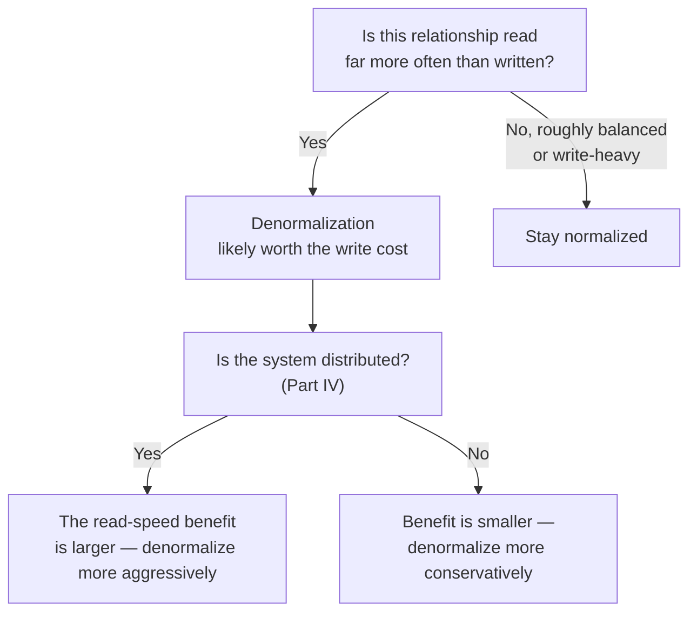

# 13 — Graph Normalization vs. Denormalization

> Part II: Data Modeling · Position 13 of 37 · ~10 min read

## Table

| # | Section | In this chapter |
|---|---|---|
| 1 | Introduction | The relational rules for this don't transfer — graphs have their own spectrum |
| 2 | Prerequisites | Chapters 9 and 11 |
| 3 | Core Concepts | The graph-specific read/write tradeoff spectrum |
| 4 | Internal Architecture | Where the cost of each choice actually lands |
| 5 | Workflow | Deciding where on the spectrum a given relationship belongs |
| 6 | Syntax / Structure | The same data, normalized and denormalized |
| 7 | Code Examples | A denormalization that trades storage for read speed |
| 8 | Use Cases | Where each end of the spectrum wins |
| 9 | Performance Considerations | Reads vs. writes, concretely |
| 10 | Security Considerations | Duplicated data means duplicated update-and-audit obligations |
| 11 | Best Practices | Normalize by default, denormalize with a measured reason |
| 12 | Common Errors | Denormalizing before you've proven you need to |
| 13 | Interview Questions | What you'll get asked, and how to answer well |
| 14 | Summary | This is a spectrum, not a rule set |
| 15 | References & Further Reading | Where to go next |

## 1. Introduction

Relational normalization — 1NF, 2NF, 3NF — doesn't map cleanly onto graphs, and trying to force it to is a common source of confused schema debates. Graphs have their own version of this tradeoff, and it's worth understanding on its own terms rather than translating relational rules that don't quite fit.

## 2. Prerequisites

Chapter 9's modeling discipline and chapter 11's schema patterns — this chapter is really about where, deliberately, to violate that discipline for performance reasons.

## 3. Core Concepts

The graph-specific spectrum runs from **normalized** (many small, typed nodes and edges, minimal redundancy, more hops per query) to **denormalized** (relationships precomputed or duplicated to avoid hops, more storage and write complexity, faster reads).

| | Normalized | Denormalized |
|---|---|---|
| Redundancy | Low | Higher — data duplicated across places |
| Read cost | More hops | Fewer hops, faster |
| Write cost | Simpler — one place to update | More complex — multiple places to keep in sync |

This isn't about correctness the way relational normal forms are — a denormalized graph isn't "wrong," it's a deliberate tradeoff, same as chapter 11's fan-out fix for an emerging God node.

## 4. Internal Architecture

The cost of each choice lands in a different place depending on your storage engine. Against index-free adjacency (chapter 15), extra hops from normalization are relatively cheap — each hop is a pointer dereference. In a distributed, partitioned system (Part IV), the same extra hop can mean a network round-trip, making denormalization's read-speed benefit much larger, and the write-complexity cost of keeping duplicated data in sync correspondingly more important to manage carefully.

## 5. Workflow



## 6. Syntax / Structure

Normalized — category traversed via edge, every time:

```cypher
(p:Product)-[:IN_CATEGORY]->(c:Category {name: 'Electronics'})
```

Denormalized — category also duplicated as a property for fast filtering, edge kept for genuine traversal needs:

```cypher
(p:Product {category: 'Electronics'})-[:IN_CATEGORY]->(c:Category {name: 'Electronics'})
```

## 7. Code Examples

```cypher
// Denormalizing a friend-of-friend count onto the user node itself,
// avoiding a live 2-hop traversal on every profile view
MATCH (u:Person {id: $id})
SET u.friend_of_friend_count = <precomputed value>
// Trade: this must be recomputed/invalidated whenever the friend graph changes
```

## 8. Use Cases

Denormalization wins for read-heavy, latency-sensitive paths — profile pages, recommendation feeds, anything serving live user traffic. Normalization wins where write consistency matters more than read latency, or where the relationship is queried rarely enough that the extra hop cost never actually matters in practice.

## 9. Performance Considerations

This is fundamentally a reads-vs-writes tradeoff, and the right answer depends on the actual read:write ratio for that specific relationship — not a system-wide policy. A relationship read a thousand times for every write is a strong denormalization candidate; one read and written at similar rates usually isn't worth the added write complexity.

## 10. Security Considerations

Duplicated data means duplicated obligations: if a property value is copied in three places for read-speed reasons, all three need to be updated (and audited) consistently when the underlying fact changes or needs to be corrected or deleted — a real, easy-to-miss compliance risk (data-deletion requests, for instance, need to actually reach every denormalized copy, not just the canonical source).

## 11. Best Practices

- Normalize by default; denormalize specific, measured hot paths once you have real evidence of a read-cost problem, not preemptively.
- Track every place a piece of data has been duplicated to, so updates and deletions can reach all of them.
- Re-evaluate denormalization decisions periodically — a hot path today may not be one after a product change.

## 12. Common Errors

- **Denormalizing preemptively**, before any evidence the extra hops are actually a measured problem — adding write complexity for a benefit that was never needed.
- **Losing track of duplicated copies**, so a later data correction or deletion request only reaches some of them.

## 13. Interview Questions

**"How would you decide whether to denormalize a specific relationship in a graph schema?"**
Look for: reasoning from the actual read:write ratio and measured latency need, not a blanket preference either way.

**"What goes wrong if you denormalize without a plan for keeping copies in sync?"**
Stale or inconsistent data across duplicated copies, and compliance risk if deletions or corrections don't reach every copy.

## 14. Summary

Graph normalization isn't a correctness rule the way relational normal forms are — it's a spectrum, and the right point on it is decided relationship by relationship, based on actual read:write ratios and measured cost, not a system-wide default in either direction.

## 15. References & Further Reading

**Within this library**
- Chapter 9 — Property Graph Modeling
- Chapter 11 — Graph Schema Design Patterns
- Chapter 23 — Caching Strategies for Graph Queries
