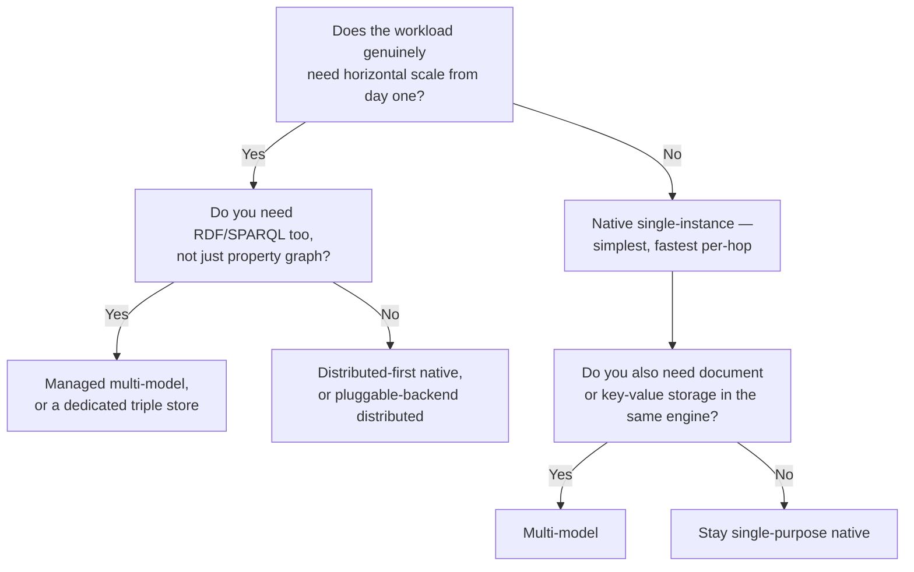

# 14 — Graph Database Landscape

> Part III: Storage & Database Engineering · Position 14 of 37 · ~12 min read

## Table

| # | Section | In this chapter |
|---|---|---|
| 1 | Introduction | An honest map, not a leaderboard |
| 2 | Prerequisites | Chapters 9–10 |
| 3 | Core Concepts | The major categories, by architecture rather than brand |
| 4 | Internal Architecture | Native vs. multi-model vs. distributed-first, structurally |
| 5 | Workflow | Choosing a category before choosing a product |
| 6 | Syntax / Structure | Which language ties to which system |
| 7 | Code Examples | The same query intent, two ecosystems |
| 8 | Use Cases | Where each category tends to fit |
| 9 | Performance Considerations | Category matters more than brand for this |
| 10 | Security Considerations | Managed vs. self-hosted, as a real tradeoff |
| 11 | Best Practices | Prototype against your real query shape before committing |
| 12 | Common Errors | Choosing by popularity instead of architecture fit |
| 13 | Interview Questions | What you'll get asked, and how to answer well |
| 14 | Summary | The category decision matters more than the vendor decision |
| 15 | References & Further Reading | Where to go next |

## 1. Introduction

This chapter maps the landscape by **architecture**, not by ranking specific products — vendor feature lists and pricing change constantly, and a library like this one will always be stale on those specifics faster than official documentation. The categorical distinctions, on the other hand, are stable and are what should actually drive a decision.

## 2. Prerequisites

Chapters 9 and 10 — knowing what property graphs and RDF each optimize for is necessary before evaluating which systems implement which model well.

## 3. Core Concepts

| Category | What it optimizes for | Representative approach |
|---|---|---|
| **Native, single-instance property graph** | Fast OLTP traversal via index-free adjacency | Neo4j-style architecture |
| **Distributed-first, native property graph** | Horizontal scale from day one, parallel query execution | TigerGraph-style architecture |
| **Pluggable-backend distributed graph** | Flexibility to run atop existing distributed storage (Cassandra, HBase-family systems) | JanusGraph-style architecture |
| **Managed, multi-model cloud graph** | Operational simplicity, both property graph and RDF support in one managed service | Amazon Neptune-style architecture |
| **Multi-model (graph + document + key-value)** | One engine covering several data shapes, not graph-only | ArangoDB-style architecture |
| **In-memory native graph** | Very low latency, at the cost of memory-bound dataset size | Memgraph-style architecture |

These categories matter far more than any specific vendor's current feature list for deciding what kind of system you actually need.

## 4. Internal Architecture

The deepest structural fork is **native vs. multi-model** and **single-instance-first vs. distributed-first**. Native, single-instance engines generally get index-free adjacency's full traversal-speed benefit (chapter 15) but scale vertically until they don't. Distributed-first engines trade some of that per-hop simplicity for horizontal scale, usually via one of the partitioning strategies covered in chapter 20. Multi-model engines make a different bet entirely — accepting some graph-specific performance ceiling in exchange for not needing a second system for non-graph data.

## 5. Workflow



## 6. Syntax / Structure

Query language generally follows category, not brand: native property graph engines lean toward Cypher or a Cypher-like language; distributed-first engines often ship their own SQL-adjacent graph language (GSQL-style); pluggable-backend systems commonly support Gremlin; multi-model managed services often support both Gremlin and SPARQL side by side.

## 7. Code Examples

The same intent — "find Deb's direct colleagues" — in two ecosystems:

```cypher
// Cypher-family
MATCH (deb:Person {name: 'Deb'})-[:COLLEAGUE_OF]->(c:Person)
RETURN c.name
```

```groovy
// Gremlin-family
g.V().has('Person', 'name', 'Deb').out('COLLEAGUE_OF').values('name')
```

Same question, genuinely different mental model — declarative pattern-match vs. imperative traversal-chain (full treatment in chapter 16).

## 8. Use Cases

Native single-instance fits most application graphs that haven't outgrown vertical scaling. Distributed-first fits workloads with proven, large-scale traversal needs from the outset. Multi-model fits teams that would rather not operate a second specialized system for a graph feature alongside their primary data store.

## 9. Performance Considerations

For this decision specifically, category matters far more than brand-specific benchmarks, which are frequently vendor-produced and workload-specific in ways that don't transfer to your actual query shape. Prototype against your realistic traversal depth and fan-out (chapter 1's workflow, chapter 25's benchmarking chapter) rather than trusting a published benchmark number.

## 10. Security Considerations

Managed cloud graph databases shift operational security burden (patching, network isolation, backup encryption) to the provider, at the cost of less direct control and a dependency on the provider's security posture and incident response. Self-hosted, pluggable-backend systems keep full control at the cost of the team owning that operational security burden directly. Neither is categorically safer — it's a real tradeoff that should be made deliberately, not by default.

## 11. Best Practices

- Prototype against your real query shapes and realistic data volume before committing to a category, let alone a specific vendor.
- Decide the category (native vs. distributed vs. multi-model) before comparing specific products within it — comparing across categories on feature checklists tends to obscure the more important architectural fit question.
- Check official documentation for current specifics — pricing, exact feature sets, and version capabilities change faster than any static reference should be trusted for.

## 12. Common Errors

- **Choosing by name recognition or popularity** rather than architectural fit to the actual workload.
- **Comparing a native single-instance engine against a distributed-first one on raw feature checklists**, without accounting for the fact that they're solving different scale problems.

## 13. Interview Questions

**"How would you choose between a native single-instance graph database and a distributed-first one?"**
Look for: reasoning from proven scale requirements and prototype numbers, not from vendor marketing or team familiarity alone.

**"What's the tradeoff between a managed graph database and a self-hosted one?"**
Operational simplicity and shifted security burden vs. direct control — a real tradeoff, not a strictly-better-or-worse choice.

## 14. Summary

The category decision — native vs. distributed-first vs. multi-model, managed vs. self-hosted — matters more than the specific vendor decision within a category. Specifics change fast enough that this chapter deliberately stays at the architectural level; official documentation is the right place for anything more current.

## 15. References & Further Reading

**Within this library**
- Chapter 15 — Native Graph Storage Internals
- Chapter 16 — Query Languages Compared
- Chapter 20 — Graph Partitioning and Sharding

**Further reading**
- Whichever systems you're evaluating, their official documentation will always be more current than any static comparison — implementations and pricing move faster than print.
