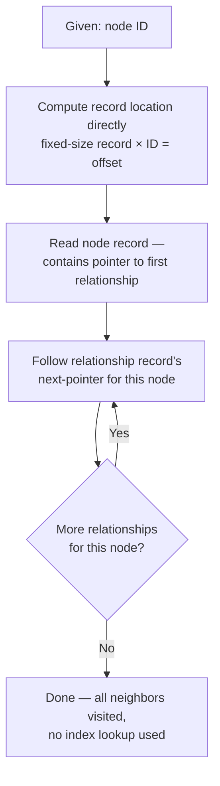

# 15 — Native Graph Storage Internals

> Part III: Storage & Database Engineering · Position 15 of 37 · ~12 min read

## Table

| # | Section | In this chapter |
|---|---|---|
| 1 | Introduction | The chapter every earlier one has been pointing toward |
| 2 | Prerequisites | Chapters 2 and 9 |
| 3 | Core Concepts | Index-free adjacency, unpacked properly |
| 4 | Internal Architecture | Fixed-size records and why they matter |
| 5 | Workflow | What actually happens on disk during a one-hop traversal |
| 6 | Syntax / Structure | The node/relationship record shape |
| 7 | Code Examples | A conceptual record layout |
| 8 | Use Cases | Why this design specifically serves OLTP graph workloads |
| 9 | Performance Considerations | Why this beats a B-tree lookup per hop |
| 10 | Security Considerations | Fixed-size records and the cost of deletion |
| 11 | Best Practices | Design schemas that keep hot traversals shallow |
| 12 | Common Errors | Assuming this architecture solves problems it doesn't |
| 13 | Interview Questions | What you'll get asked, and how to answer well |
| 14 | Summary | One design decision, most of the field's performance story |
| 15 | References & Further Reading | Where to go next |

## 1. Introduction

Chapters 1, 2, and 14 have all referenced index-free adjacency without fully opening it up. This is that chapter — the actual storage-layer mechanism that makes multi-hop traversal fast in a native graph engine, and slow in a relational one running the equivalent joins.

## 2. Prerequisites

Chapter 2's representation tradeoffs and chapter 9's property graph model — this chapter is about how those get implemented physically.

## 3. Core Concepts

**Index-free adjacency** means each node record holds direct physical references — essentially pointers or computable offsets — to its relationship records, rather than relying on a global index to find them. A traversal from a node to its neighbors becomes a pointer dereference, not an index lookup. This is the single architectural decision most responsible for the performance gap between native graph traversal and relational join-based traversal at depth.

## 4. Internal Architecture

Most native graph engines use **fixed-size store records** for nodes and relationships specifically to make this fast: because every record is the same size, a record's physical location can be computed directly from its ID — the same way an array index works — rather than requiring a tree-structured index lookup to find it. Relationships for a given node are typically organized as a **doubly-linked list**: each relationship record points to the previous and next relationship for both the start and end node it connects, so walking all of a node's relationships means following that list directly rather than searching for them.

## 5. Workflow



## 6. Syntax / Structure

A simplified conceptual record layout:

```
NodeRecord {
  id: 42
  label_pointer: -> "Person"
  first_relationship_pointer: -> RelRecord#7
  first_property_pointer: -> PropRecord#12
}

RelRecord#7 {
  type: "WORKS_AT"
  start_node: 42
  end_node: 108
  start_node_next_rel: -> RelRecord#19   // next relationship for node 42
  end_node_next_rel: -> RelRecord#31     // next relationship for node 108
}
```

## 7. Code Examples

This chapter is about physical storage layout rather than application code — there's no equivalent snippet to write against it directly. The record shapes in section 6 are the closest thing to "code" this layer has; everything from chapter 16 onward (query languages) is what actually gets compiled down to walking these structures.

## 8. Use Cases

This design specifically serves **OLTP-style graph workloads**: start from a specific, known node, walk outward unpredictably, repeatedly, at low latency. It's a poor fit for **bulk analytical scans** across the whole graph, which is exactly why analytical engines (chapter 21) tend to favor different physical layouts, like CSR (chapter 2), optimized for sequential scanning rather than pointer-chasing from arbitrary starting points.

## 9. Performance Considerations

A relational join, at the physical level, typically requires an index lookup (often a B-tree traversal, itself O(log n)) for every hop. Index-free adjacency replaces that with a direct pointer dereference — effectively O(1) per hop, independent of total graph size. Over a multi-hop query, that difference compounds: a 4-hop relational join can require four separate O(log n) lookups against a growing intermediate result set, while the equivalent native graph traversal stays close to four cheap, constant-time hops. This is the concrete mechanism behind chapter 1's central performance claim.

## 10. Security Considerations

Fixed-size record layouts have a specific, easy-to-overlook cost: **deletion doesn't necessarily mean disappearance**. Deleted records are frequently marked as free space for reuse rather than immediately overwritten, meaning "deleted" data can sometimes be recoverable from the underlying store files until that space is reused — a genuine consideration for any compliance requirement around guaranteed data erasure, distinct from whether the application-level query layer can still see the data.

## 11. Best Practices

- Design schemas that keep your hottest, most latency-sensitive traversal paths shallow — this architecture rewards shallow, frequent hops more than it rewards any particular schema shape otherwise.
- Don't assume this architecture solves analytical/bulk-scan performance — it's optimized for the opposite access pattern (section 8).
- If guaranteed erasure is a compliance requirement, verify how the specific engine you're using actually handles physical deletion, rather than assuming logical deletion is sufficient.

## 12. Common Errors

- **Assuming index-free adjacency makes every kind of query fast** — it specifically accelerates traversal from a known starting point, not full-graph analytical scans or property-based search (which still need traditional indexes, chapter 17).
- **Assuming logical deletion equals physical erasure** in a compliance-sensitive context, without verifying the specific engine's actual deletion behavior.

## 13. Interview Questions

**"Explain index-free adjacency and why it makes multi-hop traversal fast."**
Direct pointer references from each node to its relationships mean a hop is a pointer dereference, not an index lookup — cost doesn't compound with total graph size the way relational join cost does.

**"Does index-free adjacency make every graph query fast?"**
No — it specifically accelerates traversal from a known node; property-based search and full-graph analytical scans need different mechanisms (chapters 17 and 21).

## 14. Summary

Index-free adjacency, implemented via fixed-size records and per-node linked relationship lists, is the single storage-layer design decision most responsible for why multi-hop traversal is cheap in a native graph engine and expensive in a relational one. Everything chapter 1 promised about this gap has a concrete physical mechanism behind it now.

## 15. References & Further Reading

**Within this library**
- Chapter 1 — What Is Graph Engineering?
- Chapter 2 — Graph Fundamentals and Representations
- Chapter 17 — Indexing Strategies for Graphs
- Chapter 21 — Distributed Graph Processing Frameworks
