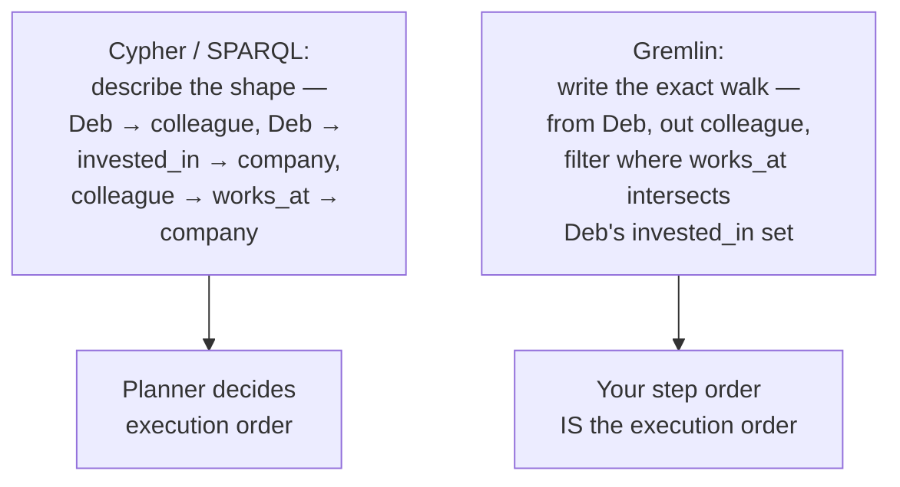

# 16 — Query Languages Compared

> Part III: Storage & Database Engineering · Position 16 of 37 · ~12 min read

## Table

| # | Section | In this chapter |
|---|---|---|
| 1 | Introduction | Different mental models, not different syntax for the same idea |
| 2 | Prerequisites | Chapters 9, 10, 15 |
| 3 | Core Concepts | Cypher, Gremlin, SPARQL, GSQL — compared by mental model |
| 4 | Internal Architecture | How each mental model compiles down to storage-layer operations |
| 5 | Workflow | Reasoning through the same question in each paradigm |
| 6 | Syntax / Structure | Declarative pattern-match vs. imperative traversal-chain |
| 7 | Code Examples | The same query, four ways |
| 8 | Use Cases | Which language fits which system and mindset |
| 9 | Performance Considerations | Why the mental model affects the query plan, not just the syntax |
| 10 | Security Considerations | Injection risk differs by paradigm |
| 11 | Best Practices | Learn the mental model, not just the keywords |
| 12 | Common Errors | Writing Gremlin like Cypher, and vice versa |
| 13 | Interview Questions | What you'll get asked, and how to answer well |
| 14 | Summary | Four ways of asking, one thing being asked |
| 15 | References & Further Reading | Where to go next |

## 1. Introduction

Chapter 1 flagged this as an opinion worth forming your own view on: Cypher, Gremlin, SPARQL, and GSQL aren't just different syntax for the same query concept. They encode genuinely different mental models of what "querying a graph" even means, and moving between them means relearning assumptions, not just re-mapping keywords.

## 2. Prerequisites

Chapters 9, 10, and 15 — this chapter assumes familiarity with the property graph and RDF models, and with the storage mechanics both ultimately compile down to.

## 3. Core Concepts

| Language | Paradigm | Mental model |
|---|---|---|
| **Cypher** | Declarative | "Draw the pattern you want to find, let the engine figure out how" |
| **Gremlin** | Imperative / functional | "Describe the exact walk, step by step" |
| **SPARQL** | Declarative | "Match triple patterns," SQL-adjacent but operating on triples, not rows |
| **GSQL** | Declarative, SQL-like | SQL-familiar syntax with graph-native traversal extensions, built for parallel execution |

Cypher and SPARQL both ask "what pattern am I looking for" and let the query planner decide execution order. Gremlin asks "what's the exact sequence of steps" — genuinely closer to writing an algorithm than to describing a shape.

## 4. Internal Architecture

Declarative languages (Cypher, SPARQL, GSQL) all rely on a **query planner/optimizer** (chapter 1's architecture stack) to translate the described pattern into an actual execution order — which starting point to use, which direction to traverse, when to filter. Gremlin's imperative model skips most of that: the traversal steps you write largely *are* the execution order, which gives more direct control at the cost of the engine doing less automatic optimization on your behalf.

## 5. Workflow

Reasoning through "find Deb's colleagues who also work at companies Deb has invested in," across paradigms:



## 6. Syntax / Structure

The core paradigm split, concretely:

**Declarative (Cypher)** — describe the pattern:
```cypher
MATCH (deb:Person {name:'Deb'})-[:COLLEAGUE_OF]->(c:Person)-[:WORKS_AT]->(co:Company)
RETURN c, co
```

**Imperative (Gremlin)** — describe the walk:
```groovy
g.V().has('Person','name','Deb').out('COLLEAGUE_OF').as('c').out('WORKS_AT').as('co').select('c','co')
```

## 7. Code Examples

The same question — "who does Deb know" — in all four:

```cypher
// Cypher
MATCH (deb:Person {name:'Deb'})-[:KNOWS]->(p) RETURN p.name
```
```groovy
// Gremlin
g.V().has('Person','name','Deb').out('KNOWS').values('name')
```
```sparql
# SPARQL
SELECT ?name WHERE { :Deb :knows ?p . ?p :name ?name . }
```
```sql
-- GSQL (illustrative shape)
SELECT p.name FROM Person:deb - (KNOWS) - Person:p WHERE deb.name == "Deb"
```

## 8. Use Cases

Cypher fits teams that think in patterns and want the engine to handle optimization — the common case for application development. Gremlin fits cases needing precise control over traversal order, or systems built on Apache TinkerPop-compatible backends. SPARQL fits RDF/knowledge-graph work specifically (chapter 10). GSQL fits teams already SQL-fluent, working against a distributed-first engine (chapter 14).

## 9. Performance Considerations

Because declarative languages hand execution order to a planner, the same logical query can compile to different, sometimes very different, physical execution plans depending on available indexes and statistics — this is exactly what chapter 24's query-plan-reading skill is for. Gremlin's imperative model removes that variability at the cost of putting the burden of writing an efficient traversal order entirely on the person writing the query.

## 10. Security Considerations

Injection risk exists across all four, same as SQL, but the specific mitigation differs by paradigm: declarative languages benefit from parameterized queries the same way SQL does; Gremlin's imperative, code-like syntax has historically had a broader and more scrutinized injection surface precisely because its traversal steps can approach general-purpose scripting capability in some implementations — parameterization and input validation deserve extra attention specifically in Gremlin-based systems.

## 11. Best Practices

- Learn the mental model of whichever language you're using, not just its keyword syntax — the paradigm shift is the actual learning curve, not the vocabulary.
- Use parameterized queries in every paradigm, same discipline as SQL.
- Don't assume Gremlin fluency transfers directly to Cypher fluency, or vice versa — chapter 1's "maturity gap" opinion is exactly about this.

## 12. Common Errors

- **Writing Gremlin as if it were declarative** — describing a shape rather than a walk, and getting confused when the engine doesn't "figure it out" the way a planner would.
- **Writing Cypher as if it were imperative** — over-specifying execution order the planner would have handled better on its own.

## 13. Interview Questions

**"What's the fundamental difference between Cypher and Gremlin, beyond syntax?"**
Declarative pattern description with planner-decided execution, vs. imperative step-by-step traversal specification — a paradigm difference, not just a vocabulary one.

**"Why might the same logical query perform differently in Cypher depending on available indexes?"**
Because the planner chooses the physical execution order based on what's actually indexed and what the statistics suggest — the same pattern can compile to different plans (chapter 24).

## 14. Summary

Four languages, four genuinely different ways of expressing "find this pattern in the graph." The syntax is the easy part to learn; the paradigm underneath — pattern description versus explicit walk — is the part that doesn't transfer automatically between them, and is worth understanding deliberately rather than picking up by accident.

## 15. References & Further Reading

**Within this library**
- Chapter 9 — Property Graph Modeling
- Chapter 10 — RDF and Knowledge Graph Modeling
- Chapter 24 — Query Performance and Debugging
