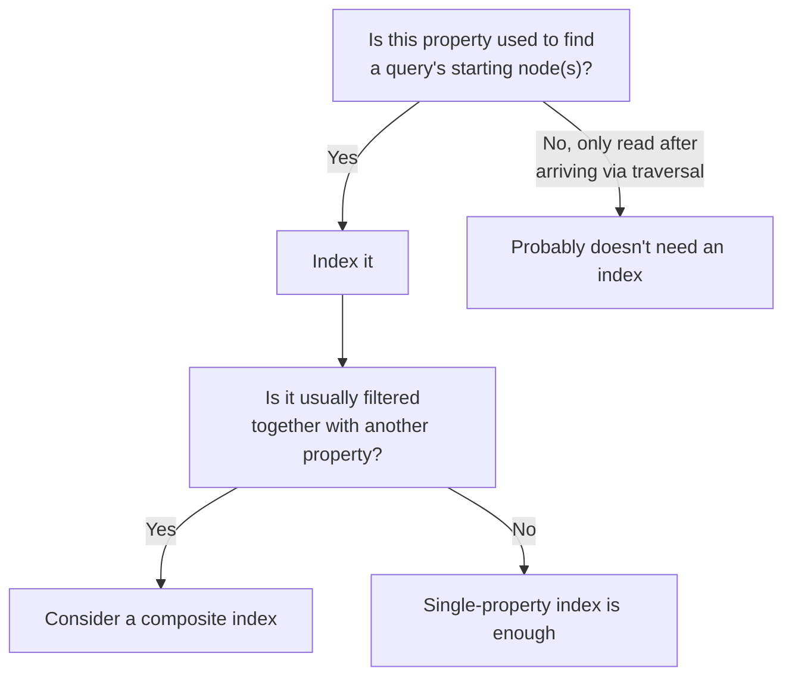

# 17 — Indexing Strategies for Graphs

> Part III: Storage & Database Engineering · Position 17 of 37 · ~10 min read

## Table

| # | Section | In this chapter |
|---|---|---|
| 1 | Introduction | Index-free adjacency solves one problem — this chapter is about the other one |
| 2 | Prerequisites | Chapter 15 |
| 3 | Core Concepts | Property indexes, composite indexes, full-text integration |
| 4 | Internal Architecture | Why adjacency and indexing are separate mechanisms |
| 5 | Workflow | Deciding what actually needs an index |
| 6 | Syntax / Structure | Creating an index in Cypher |
| 7 | Code Examples | Property lookup, with and without an index |
| 8 | Use Cases | Where indexes matter most in a graph workload |
| 9 | Performance Considerations | The cost of over-indexing, not just under-indexing |
| 10 | Security Considerations | Indexes as an information side channel |
| 11 | Best Practices | Index the entry points, not everything |
| 12 | Common Errors | Assuming index-free adjacency means you don't need indexes |
| 13 | Interview Questions | What you'll get asked, and how to answer well |
| 14 | Summary | Two different problems, two different mechanisms |
| 15 | References & Further Reading | Where to go next |

## 1. Introduction

Index-free adjacency (chapter 15) solves "how do I traverse fast once I'm at a node." It says nothing about "how do I find my starting node in the first place." That second problem still needs traditional indexes — and conflating the two is a common, avoidable confusion.

## 2. Prerequisites

Chapter 15 — this chapter is explicitly about the mechanism that chapter didn't cover.

## 3. Core Concepts

- **Property indexes** — index a specific property (like `email` or `account_id`) for fast lookup of the starting node(s) a query needs, independent of the adjacency structure entirely.
- **Composite indexes** — index a combination of properties together, for queries that filter on multiple fields at once.
- **Full-text search integration** — most graph engines integrate a separate, often Lucene-based, full-text index for text search, since neither adjacency nor simple property indexes are built for fuzzy or relevance-ranked text matching.

## 4. Internal Architecture

These are genuinely separate mechanisms from adjacency, and it's worth being precise about why: index-free adjacency accelerates "given this specific node, walk to its neighbors" — a graph-native operation with no equivalent in a relational engine. Property indexing accelerates "find the node(s) matching this property value" — the same fundamental problem a relational database's index solves, using largely the same underlying techniques (commonly B-tree-family or hash-based structures). A graph query typically uses both in sequence: an index to find the starting node, then adjacency to traverse from there.

## 5. Workflow



## 6. Syntax / Structure

```cypher
CREATE INDEX person_email FOR (p:Person) ON (p.email)
CREATE INDEX person_name_dept FOR (p:Person) ON (p.name, p.department)
```

## 7. Code Examples

```cypher
// Without an index on email: effectively a full scan of all Person nodes
MATCH (p:Person {email: 'deb@example.com'}) RETURN p

// With the index from section 6: direct lookup, then adjacency takes over
// for anything traversed from p — the two mechanisms working together
```

## 8. Use Cases

Indexes matter most at query **entry points** — wherever a query needs to find a starting node by something other than its internal ID (email, username, external reference ID). They matter far less on properties only ever read *after* arriving at a node via traversal, since those reads don't need a lookup mechanism at all.

## 9. Performance Considerations

Under-indexing causes slow starting-node lookups, the obvious failure mode. **Over-indexing** has a real, less-obvious cost too: every index adds write overhead (each write now updates the index as well as the underlying data) and storage cost, for properties that may rarely or never actually serve as a query entry point. Indexing strategy deserves the same "prove the need first" discipline as denormalization (chapter 13).

## 10. Security Considerations

Indexes can function as an information side channel: query timing differences between an indexed hit and an indexed miss can, in principle, leak whether a specific value exists in the dataset even when the query itself is denied or returns no visible result — a genuine concern in systems where the mere existence of a record (a specific email being registered, for instance) is itself sensitive information.

## 11. Best Practices

- Index query entry points deliberately — properties a query starts from, not properties only ever read after traversal.
- Use composite indexes for properties that are consistently filtered together, rather than several single-property indexes that the planner has to combine at query time.
- Revisit indexing periodically as query patterns evolve — an index that mattered at launch may not be earning its write-cost months later.

## 12. Common Errors

- **Assuming index-free adjacency means the system doesn't need traditional indexes at all** — a genuine and common misconception; the two solve different problems (section 4).
- **Indexing every property defensively**, paying ongoing write overhead for lookups that rarely or never happen.

## 13. Interview Questions

**"Does index-free adjacency mean a graph database doesn't need indexes?"**
No — adjacency accelerates traversal from a known node; you still need traditional property indexes to find that starting node in the first place.

**"How would you decide which properties to index in a graph schema?"**
Look for: reasoning about which properties actually serve as query entry points, not indexing everything preemptively.

## 14. Summary

Index-free adjacency and property indexing solve two genuinely different problems — traversal speed once you're at a node, and lookup speed to find that node in the first place — and a well-tuned graph system needs both, deployed deliberately rather than either ignored or applied everywhere by default.

## 15. References & Further Reading

**Within this library**
- Chapter 15 — Native Graph Storage Internals
- Chapter 13 — Graph Normalization vs Denormalization
- Chapter 24 — Query Performance and Debugging
