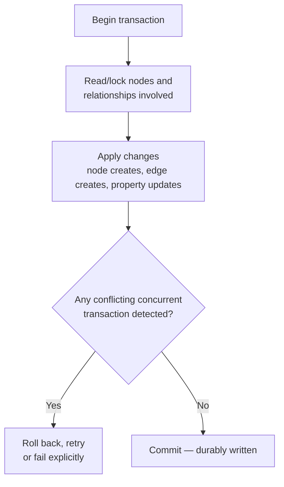

# 18 — ACID and Consistency in Graph Systems

> Part III: Storage & Database Engineering · Position 18 of 37 · ~11 min read

## Table

| # | Section | In this chapter |
|---|---|---|
| 1 | Introduction | Multi-hop transactions are a harder reasoning problem than single-row ones |
| 2 | Prerequisites | Chapter 15 |
| 3 | Core Concepts | ACID, applied specifically to connected data |
| 4 | Internal Architecture | Why supernodes concentrate write conflicts |
| 5 | Workflow | A transaction's lifecycle, as a flow |
| 6 | Syntax / Structure | A multi-hop transaction in Cypher |
| 7 | Code Examples | Two transactions that conflict, and why |
| 8 | Use Cases | Where transactional correctness matters most |
| 9 | Performance Considerations | Isolation level tradeoffs, concretely |
| 10 | Security Considerations | Partial-failure states and data integrity |
| 11 | Best Practices | Keep transactions narrow, and know your isolation level |
| 12 | Common Errors | Assuming graph transactions behave like relational ones |
| 13 | Interview Questions | What you'll get asked, and how to answer well |
| 14 | Summary | Connectivity is what makes this harder |
| 15 | References & Further Reading | Where to go next |

## 1. Introduction

A relational transaction touching a handful of independent rows is a relatively contained reasoning problem. A graph transaction updating several connected nodes and edges at once is harder to reason about precisely because the data is connected — the same property that makes graphs powerful for querying makes concurrent writes to them trickier to get right.

## 2. Prerequisites

Chapter 15's storage internals — understanding what a node/relationship record actually looks like physically makes reasoning about concurrent modification to them much more concrete.

## 3. Core Concepts

The standard ACID properties still apply, with graph-specific texture:

- **Atomicity** — a multi-hop update (create a node, two edges, and modify a third node) either fully commits or fully rolls back.
- **Consistency** — the graph remains in a valid state per schema/constraints after every transaction.
- **Isolation** — concurrent transactions don't see each other's uncommitted intermediate states — genuinely more complex to reason about across a connected subgraph than across independent rows.
- **Durability** — committed changes survive a crash.

## 4. Internal Architecture

Concurrent write conflicts in a graph aren't uniformly distributed — they concentrate exactly where the graph is densely connected. Two transactions modifying **overlapping parts of a subgraph** (both touching the same node, or both touching a supernode's relationship list, chapter 19) are far more likely to conflict than two transactions in a sparse relational table touching unrelated rows. A supernode, already a performance liability (chapter 19), is also a **concurrency hotspot** — many transactions likely to need to modify its relationship list simultaneously.

## 5. Workflow



## 6. Syntax / Structure

```cypher
// A single transaction spanning multiple hops — atomic as a unit
CREATE (t:Transaction {amount: 500})
CREATE (t)-[:FROM]->(a:Account {id: 'A1'})
CREATE (t)-[:TO]->(b:Account {id: 'A2'})
SET a.balance = a.balance - 500
SET b.balance = b.balance + 500
```

If any part of this fails, none of it should persist — the whole thing is one unit.

## 7. Code Examples

```
Transaction 1: reads Account A1's balance, plans to debit it
Transaction 2: reads Account A1's balance, plans to debit it (concurrently)

Without proper isolation, both could read the same starting balance,
both debit independently, and the account ends up double-debited —
the same lost-update problem relational systems face, but more likely
here specifically because A1 is a hub many transactions touch (chapter 19).
```

## 8. Use Cases

Transactional correctness matters most anywhere connected updates need to be all-or-nothing: financial transaction graphs (chapter 30), inventory/reservation systems modeled as graphs, any workflow where a partially-applied multi-hop update would leave the graph in an inconsistent, unsafe-to-query state.

## 9. Performance Considerations

Stronger isolation guarantees cost throughput — more locking or conflict-checking overhead, especially concentrated around supernodes (section 4). Systems under heavy concurrent load against a small number of hot nodes often need to make a deliberate isolation-level tradeoff, sometimes accepting a slightly weaker guarantee in exchange for throughput, the same fundamental tradeoff relational systems have long made explicit through isolation levels like read-committed vs. serializable.

## 10. Security Considerations

A transaction that fails partway through, without proper atomicity, can leave the graph in an inconsistent state that's exploitable — an edge created without its corresponding balance update, for instance, could represent a real integrity and potentially financial-security gap, not just a correctness bug. Partial-failure states deserve the same scrutiny as any other integrity boundary.

## 11. Best Practices

- Keep transactions as narrow as correctness requires — the more nodes/edges a single transaction touches, the more concurrent-conflict surface it has, especially near supernodes.
- Know and deliberately choose your system's isolation level rather than accepting a default without understanding its tradeoffs.
- Design schemas that reduce unnecessary contention on hot nodes where possible (chapter 19's fan-out techniques help here too).

## 12. Common Errors

- **Assuming graph transactions behave exactly like relational ones**, without accounting for how connectivity concentrates conflict around hot nodes.
- **Writing overly broad transactions** that touch far more of the graph than the actual business operation requires, increasing conflict surface unnecessarily.

## 13. Interview Questions

**"Why might concurrent write conflicts in a graph database concentrate around specific nodes?"**
Because dense connectivity — especially supernodes — means many transactions are likely to need to touch the same node's relationship list simultaneously, unlike a sparse relational table.

**"What's the tradeoff between strong isolation and throughput in a graph system?"**
Stronger guarantees mean more locking/conflict-checking overhead, which costs throughput — especially concentrated wherever the graph is densely connected.

## 14. Summary

ACID properties apply to graphs the same way they apply to any transactional system, but connectivity changes the texture of the problem: conflicts concentrate around hubs, multi-hop atomicity is a larger reasoning surface than single-row atomicity, and isolation-level tradeoffs matter more wherever the graph is dense rather than sparse.

## 15. References & Further Reading

**Within this library**
- Chapter 15 — Native Graph Storage Internals
- Chapter 19 — The Supernode Problem
- Chapter 22 — Real-Time Graph Updates at Scale
