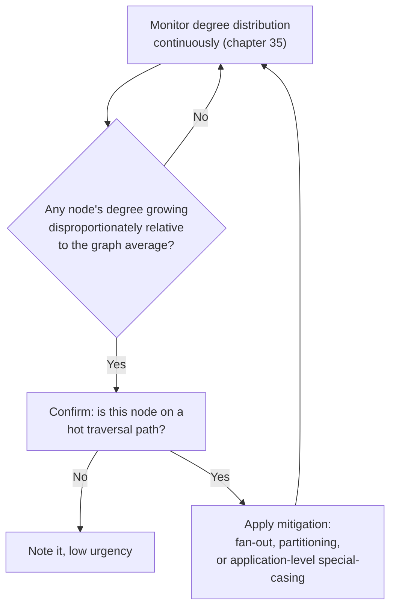
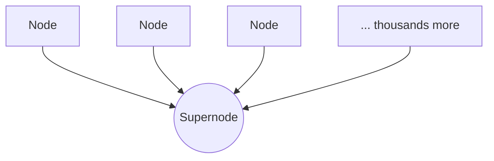

# 19 — The Supernode Problem

> Part IV: Scale & Distributed Systems · Position 19 of 37 · ~12 min read

## Table

| # | Section | In this chapter |
|---|---|---|
| 1 | Introduction | The single concept referenced more than any other in this library, finally in full |
| 2 | Prerequisites | Chapters 9, 11, 15, 18 |
| 3 | Core Concepts | What makes a node a supernode, precisely |
| 4 | Internal Architecture | Why supernodes break index-free adjacency's core assumption |
| 5 | Workflow | Detecting and responding to an emerging supernode |
| 6 | Syntax / Structure | A supernode, visualized |
| 7 | Code Examples | Fan-out as a mitigation, in full |
| 8 | Use Cases | Where supernodes reliably show up |
| 9 | Performance Considerations | Why one hop through a supernode can cost as much as the rest of the query combined |
| 10 | Security Considerations | Supernodes as a concentrated denial-of-service target |
| 11 | Best Practices | Treat known supernodes as designed decisions, not surprises |
| 12 | Common Errors | Discovering a supernode via an incident instead of a review |
| 13 | Interview Questions | What you'll get asked, and how to answer well |
| 14 | Summary | One node, disproportionate cost |
| 15 | References & Further Reading | Where to go next |

## 1. Introduction

This chapter has been referenced by nearly every earlier one — as a schema anti-pattern (chapter 11), a concurrency hotspot (chapter 18), a performance failure mode (chapters 1, 9). It's earned that repetition: the supernode problem is one of the most common, most avoidable causes of production incidents in this field.

## 2. Prerequisites

Chapters 9, 11, 15, and 18 — this chapter is the payoff those earlier ones were building toward.

## 3. Core Concepts

A **supernode** (or "hub") is a node with a degree — a count of direct relationships — disproportionately higher than the graph's typical distribution. There's no fixed universal threshold; what matters is relative to your specific graph's actual degree distribution (chapter 25 covers measuring this honestly). A celebrity account with millions of followers, a shared "Category: Electronics" node (chapter 11), or a single company node linked from every one of its thousands of employees are all real, common examples.

## 4. Internal Architecture

Index-free adjacency (chapter 15) assumes traversing a node's relationships is cheap because the relationship list is short enough that walking it is effectively constant-time in practice. A supernode breaks that assumption directly: walking its relationship list is no longer a quick pointer-chase, it's closer to a full scan — potentially millions of records — the exact operation native graph storage was designed to avoid needing.

## 5. Workflow



## 6. Syntax / Structure



Visually small. Structurally, this single node dominates the cost of any traversal that touches it.

## 7. Code Examples

Chapter 11 introduced fan-out at the schema level; here's the fuller pattern:

```cypher
// Naive: every query needing a product's category traverses through
// a single shared Category node — a supernode by construction
(p:Product)-[:IN_CATEGORY]->(c:Category {name: 'Electronics'})

// Fan-out mitigation: category duplicated as a property for filtering
// and lightweight reads; the edge is preserved only for the traversals
// that genuinely need to walk category-wide relationships
(p:Product {category: 'Electronics'})-[:IN_CATEGORY]->(c:Category {name: 'Electronics'})

// Most "find products in category X" queries now filter on the
// property directly, never touching the shared node at all
MATCH (p:Product {category: 'Electronics'}) RETURN p
```

## 8. Use Cases

Supernodes reliably emerge from: celebrity/high-follower accounts in social graphs, shared categorical or taxonomy nodes (chapter 11), popular products in recommendation graphs, and central "hub" accounts in transaction graphs — sometimes legitimately (a large retailer's account) and sometimes as a fraud signal in itself (chapter 30).

## 9. Performance Considerations

A single hop through a supernode can dominate an entire query's cost, even if every other hop in the query is genuinely cheap — this is why average-case complexity analysis can be badly misleading for real-world graphs (chapter 25's benchmarking-lies theme). A query that looks like a cheap 3-hop traversal on paper can behave like a full-graph scan in practice if one of those hops passes through a supernode.

## 10. Security Considerations

A known supernode is a concentrated, predictable target: an attacker who identifies a high-degree node can craft queries specifically designed to traverse through it repeatedly, turning a single expensive hop into a resource-exhaustion attack far more efficient than a generic unbounded-traversal attempt (chapter 1) against an arbitrary part of the graph.

## 11. Best Practices

- Treat any node whose degree could plausibly grow unbounded as a deliberate design decision at schema time (chapter 11), not something discovered later.
- Monitor degree distribution continuously (chapter 35) — supernodes emerge from usage patterns, not only from data growth.
- Apply fan-out, partitioning-aware modeling, or explicit application-level special-casing for known hubs before they cause an incident.

## 12. Common Errors

- **Discovering a supernode via a production incident** rather than a schema review or ongoing monitoring — by far the most common and most avoidable way this problem surfaces.
- **Applying a generic performance fix** (more caching, more hardware) without addressing the actual structural cause.

## 13. Interview Questions

**"What is a supernode, and why does it specifically hurt native graph databases?"**
A disproportionately high-degree node; it breaks index-free adjacency's assumption that walking a node's relationships is cheap, turning a pointer-chase into an effective full scan.

**"How would you mitigate a supernode you've identified in production?"**
Fan-out/denormalization for the hot read path, partitioning-aware modeling, or explicit special-case handling — reasoning from the actual traversal pattern, not a generic scaling response.

## 14. Summary

The supernode problem is simple to state and expensive to ignore: one disproportionately connected node can dominate the cost of any query that touches it, undermining the exact performance assumption that makes native graph storage fast in the first place. Every earlier chapter that referenced this one was pointing at the same underlying lesson — know your degree distribution, and treat its outliers as designed decisions.

## 15. References & Further Reading

**Within this library**
- Chapter 11 — Graph Schema Design Patterns
- Chapter 15 — Native Graph Storage Internals
- Chapter 25 — Capacity Planning and Benchmarking
- Chapter 35 — Monitoring and Observability for Graph Systems
