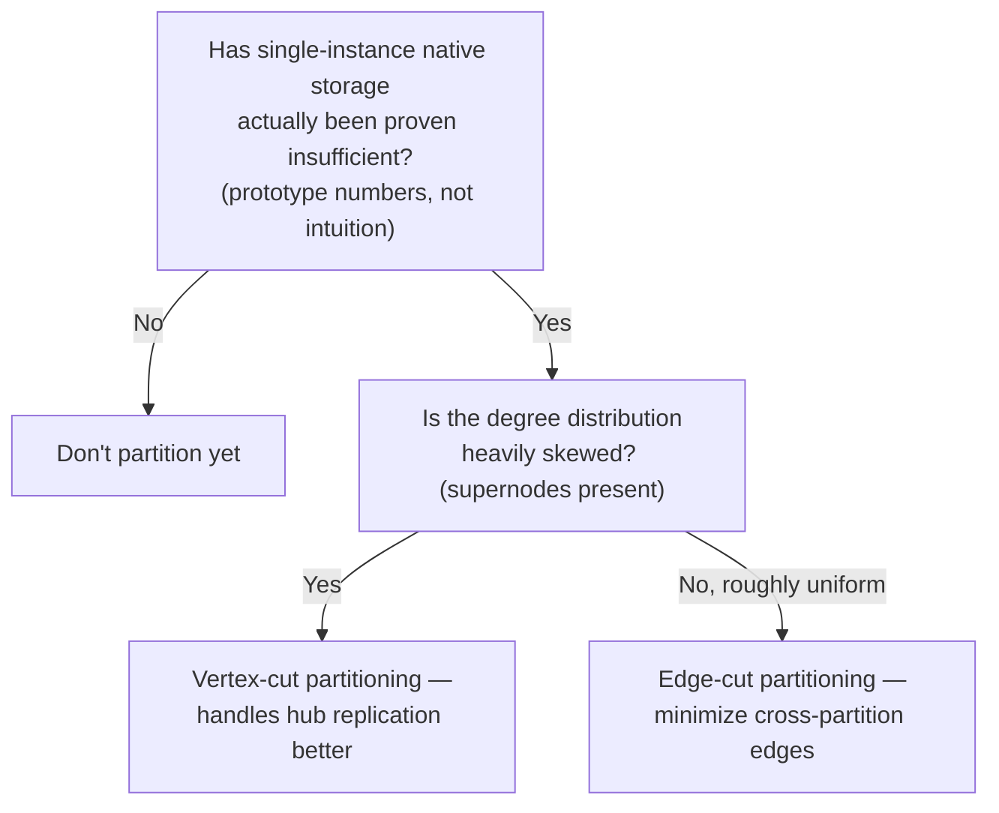
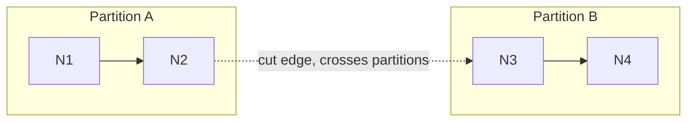

# 20 — Graph Partitioning and Sharding

> Part IV: Scale & Distributed Systems · Position 20 of 37 · ~12 min read

## Table

| # | Section | In this chapter |
|---|---|---|
| 1 | Introduction | Why naive sharding is worse for graphs than for almost anything else |
| 2 | Prerequisites | Chapters 15, 19 |
| 3 | Core Concepts | Edge-cut vs. vertex-cut partitioning |
| 4 | Internal Architecture | Why hash-based sharding destroys locality |
| 5 | Workflow | Deciding whether — and how — to partition |
| 6 | Syntax / Structure | Edge-cut and vertex-cut, visualized |
| 7 | Code Examples | Illustrating a cross-partition hop's real cost |
| 8 | Use Cases | Where each partitioning strategy fits |
| 9 | Performance Considerations | The network-hop tax, quantified conceptually |
| 10 | Security Considerations | Cross-partition consistency and access control |
| 11 | Best Practices | Prove single-instance can't handle it before partitioning at all |
| 12 | Common Errors | Hash-partitioning a graph the way you'd shard a table |
| 13 | Interview Questions | What you'll get asked, and how to answer well |
| 14 | Summary | Partitioning is a structural problem, not a load-balancing one |
| 15 | References & Further Reading | Where to go next |

## 1. Introduction

Sharding a table is largely a load-balancing problem — rows are mostly independent, so spreading them across machines by a hash of their key works fine. Sharding a graph is a fundamentally different, structural problem: nodes are connected, and a partitioning strategy that ignores that structure doesn't just balance load poorly, it destroys the locality that made single-instance native storage fast in the first place (chapter 15).

## 2. Prerequisites

Chapter 15's storage internals and chapter 19's supernode problem — partitioning decisions interact heavily with both.

## 3. Core Concepts

- **Edge-cut partitioning** — split nodes across partitions; some edges inevitably cross partition boundaries ("cut edges"). The optimization goal is minimizing cut edges, directly related to graph theory's min-cut problem.
- **Vertex-cut partitioning** — split *edges* across partitions instead; a node can be replicated across multiple partitions wherever its edges live. This is the approach several distributed graph-processing frameworks (chapter 21) use, since it can balance load more evenly on graphs with skewed degree distributions.

| | Edge-cut | Vertex-cut |
|---|---|---|
| What's split | Nodes | Edges |
| What crosses boundaries | Some edges | Replicated node copies |
| Handles supernodes well? | Poorly — a supernode's edges all want to stay together | Better — a supernode's edges can be spread across partitions |

## 4. Internal Architecture

Naive **hash-based sharding** — assigning each node to a partition based on a hash of its ID, the standard approach for sharding independent rows — ignores graph structure entirely. Because it doesn't account for which nodes are actually connected, nearly every edge ends up crossing a partition boundary purely by chance. Every traversal that would have been a local pointer dereference (chapter 15) becomes a network round-trip instead — the exact locality that made native storage fast is gone, replaced by network latency on almost every hop.

## 5. Workflow



## 6. Syntax / Structure



## 7. Code Examples

There's no meaningful application-level code for this chapter — partitioning strategy is a configuration and architecture decision made at the storage/cluster layer, not something expressed in query syntax. The conceptual cost is worth stating precisely instead:

```
Local hop (same partition): pointer dereference, ~microseconds
Cross-partition hop: network round-trip, ~milliseconds

A 4-hop query where 3 hops cross partitions can be
orders of magnitude slower than the same query fully local —
this is the real cost naive sharding introduces.
```

## 8. Use Cases

Edge-cut fits graphs with a relatively uniform degree distribution, where minimizing crossing edges genuinely balances both load and locality. Vertex-cut fits graphs with real supernodes (chapter 19), where an edge-cut approach would force enormous, unbalanced partitions just to keep a hub's edges together.

## 9. Performance Considerations

The core cost, stated plainly: a local hop against index-free adjacency is a pointer dereference; a cross-partition hop is a network round-trip, routinely several orders of magnitude slower. Partitioning strategy is, in large part, an exercise in minimizing how often a typical query's traversal pattern has to pay that cross-partition cost — which is precisely why understanding your actual traversal depth and shape (chapter 1's workflow) has to come before choosing a partitioning strategy, not after.

## 10. Security Considerations

Partitioned systems face genuine cross-partition consistency challenges (chapter 18's ACID discussion gets harder, not easier, once transactions can span network boundaries) and access-control questions that don't arise in a single instance — permission checks that need to traverse across partitions introduce both latency and additional failure modes where a partial, inconsistent view of permissions could be mistakenly treated as authoritative.

## 11. Best Practices

- Prove single-instance native storage genuinely can't handle the load — with real prototype numbers, not intuition about scale — before partitioning at all (echoing chapter 1's workflow and chapter 11's God-node lessons).
- Choose edge-cut or vertex-cut based on your actual degree distribution, not by default.
- Design schemas and query patterns to minimize cross-partition hops specifically, once partitioning is genuinely necessary.

## 12. Common Errors

- **Hash-partitioning a graph the way you'd shard a relational table** — treating nodes as independent when they're not, and destroying locality as a result.
- **Partitioning prematurely**, before single-instance capacity has actually been exhausted, paying the cross-partition-hop tax for no real benefit.

## 13. Interview Questions

**"Why is naive hash-based sharding a poor fit for graphs specifically?"**
It ignores connectivity structure entirely, so most edges end up crossing partition boundaries by chance, turning cheap local hops into expensive network round-trips.

**"When would you choose vertex-cut partitioning over edge-cut?"**
When the graph has a heavily skewed degree distribution — supernodes — that an edge-cut approach would struggle to balance without forcing enormous, unbalanced partitions.

## 14. Summary

Partitioning a graph is a structural problem about connectivity, not a load-balancing problem about independent records — the wrong approach doesn't just distribute unevenly, it actively destroys the locality that made the system fast to begin with. This is chapter 1's "don't distribute prematurely" warning made fully concrete.

## 15. References & Further Reading

**Within this library**
- Chapter 15 — Native Graph Storage Internals
- Chapter 19 — The Supernode Problem
- Chapter 21 — Distributed Graph Processing Frameworks
