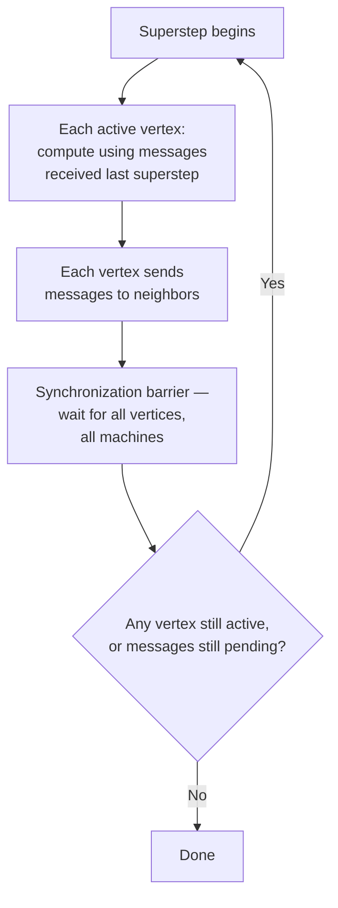

# 21 — Distributed Graph Processing Frameworks

> Part IV: Scale & Distributed Systems · Position 21 of 37 · ~12 min read

## Table

| # | Section | In this chapter |
|---|---|---|
| 1 | Introduction | "Think like a vertex" — the idea underneath Pregel, Giraph, and GraphX |
| 2 | Prerequisites | Chapters 4, 6, 20 |
| 3 | Core Concepts | The BSP model, and where each framework fits |
| 4 | Internal Architecture | Supersteps, message passing, and synchronization barriers |
| 5 | Workflow | One BSP superstep, as a flow |
| 6 | Syntax / Structure | A vertex program, conceptually |
| 7 | Code Examples | PageRank as a vertex program |
| 8 | Use Cases | When you actually need this, and when chapter 1 says you don't |
| 9 | Performance Considerations | Why synchronization barriers are the real cost |
| 10 | Security Considerations | A wide multi-machine attack surface |
| 11 | Best Practices | Prove you've outgrown single-instance before reaching here |
| 12 | Common Errors | Reaching for distributed processing before proving the need |
| 13 | Interview Questions | What you'll get asked, and how to answer well |
| 14 | Summary | The model that made batch graph analytics scale |
| 15 | References & Further Reading | Where to go next |

## 1. Introduction

Traversal (chapter 4) and centrality algorithms (chapter 6) both mentioned that certain computations "parallelize well" and are "a natural fit for distributed frameworks" — this chapter is where that claim gets made concrete. The core idea underneath nearly all of them is deceptively simple: **think like a vertex**. Instead of one program walking the whole graph, every node runs the same small program in parallel, communicating only with its direct neighbors.

## 2. Prerequisites

Chapter 4's traversal mechanics, chapter 6's iterative PageRank computation, and chapter 20's partitioning — distributed processing sits directly on top of all three.

## 3. Core Concepts

The dominant model is **BSP — Bulk Synchronous Parallel**, popularized for graphs by Google's **Pregel** system. Computation proceeds in **supersteps**: in each superstep, every active vertex runs its logic based on messages received from the previous superstep, then sends messages to its neighbors for the next one. A synchronization barrier separates supersteps — no vertex moves to the next round until all vertices have finished the current one.

| Framework | Relationship to the model |
|---|---|
| **Pregel** | Google's original system defining the "think like a vertex" BSP approach |
| **Apache Giraph** | Open-source implementation of the Pregel model |
| **Apache Spark GraphX** | Spark's graph library, using vertex-cut partitioning (chapter 20) inspired by the PowerGraph approach |

## 4. Internal Architecture

Each superstep has three parts: **compute** (each active vertex runs its logic using incoming messages), **message** (each vertex sends output to its neighbors for the next round), and **sync** (a barrier — the framework waits for every vertex across every machine to finish before starting the next superstep). This barrier is what makes the model easy to reason about correctness-wise — every vertex sees a consistent view of "last round's" messages — and it's also the model's main performance cost, covered in section 9.

## 5. Workflow



## 6. Syntax / Structure

A vertex program, conceptually — every vertex runs the same logic:

```
function compute(vertex, incoming_messages):
    new_value = aggregate(incoming_messages, vertex.current_value)
    vertex.current_value = new_value
    for neighbor in vertex.neighbors:
        send_message(neighbor, new_value / vertex.out_degree)
    if converged(vertex):
        vertex.vote_to_halt()
```

## 7. Code Examples

PageRank (chapter 6) is one of the canonical examples of a computation that maps cleanly onto this model — each superstep is exactly one iteration of the power-iteration loop from chapter 6's workflow:

```
function compute(vertex, incoming_messages):
    if superstep == 0:
        vertex.rank = 1.0 / total_vertices
    else:
        vertex.rank = (1 - damping) / total_vertices + damping * sum(incoming_messages)

    if superstep < max_iterations:
        share = vertex.rank / vertex.out_degree
        for neighbor in vertex.neighbors:
            send_message(neighbor, share)
    else:
        vertex.vote_to_halt()
```

Every vertex runs this identically, in parallel, across however many machines the graph is partitioned over (chapter 20).

## 8. Use Cases

Batch, whole-graph analytical computations that genuinely need distributed scale: PageRank and centrality at web scale, large-scale community detection, graph-wide aggregate statistics. This is explicitly **not** the right tool for low-latency, single-traversal OLTP queries (chapter 15's territory) — BSP's superstep model is built for iterative, whole-graph computation, not "look up this one user's immediate neighbors, fast."

## 9. Performance Considerations

The synchronization barrier (section 4) is the model's defining cost: every superstep runs only as fast as its **slowest** vertex or machine — a single straggler holds up the entire round. This "straggler problem" is a well-known, real cost of BSP-style systems, and is part of why some workloads increasingly favor asynchronous or hybrid models where strict global synchronization would be too costly, at the expense of the model's simpler correctness reasoning.

## 10. Security Considerations

A distributed processing cluster is a fundamentally wider attack surface than a single instance — more machines, more inter-machine network traffic (including the message-passing traffic in section 4, which needs to be secured in transit), and more operational surface area for misconfiguration. Treat the inter-machine communication layer with the same scrutiny as any other network boundary, not as an internal-only, implicitly trusted channel.

## 11. Best Practices

- Prove single-instance processing genuinely can't handle the workload before reaching for this — chapter 1's workflow principle, restated at the distributed-processing level specifically.
- Match the workload to the model: batch analytical computation, not low-latency OLTP traversal.
- Plan for the straggler problem explicitly in capacity planning (chapter 25) — a distributed job's latency is bounded by its slowest participant, not its average one.

## 12. Common Errors

- **Reaching for a distributed processing framework for OLTP-style queries** that would be far better served by a single native instance (chapter 15) — a mismatch between the workload shape and the tool's actual design intent.
- **Underestimating the straggler problem** in capacity planning, assuming average-case machine performance rather than accounting for the slowest participant setting the pace for every superstep.

## 13. Interview Questions

**"Explain the BSP model and why the synchronization barrier matters."**
Compute, message, then a barrier where every vertex waits for every other vertex to finish before the next round — it makes correctness easy to reason about, at the cost of the whole round being bounded by the slowest participant.

**"When would you reach for a distributed graph processing framework instead of a single native graph database?"**
Batch, whole-graph analytical computation at a scale genuinely proven to exceed single-instance capacity — not for low-latency, single-user traversal queries.

## 14. Summary

The "think like a vertex" BSP model, popularized by Pregel and implemented by systems like Giraph and GraphX, is what makes whole-graph iterative computation — PageRank, large-scale community detection — tractable at real distributed scale. It's a genuinely different tool from the OLTP graph databases covered in Part III, built for a different problem, and reaching for it before you've proven you need it is one of the more expensive mistakes this library warns against repeatedly.

## 15. References & Further Reading

**Within this library**
- Chapter 4 — Traversal Algorithms
- Chapter 6 — Centrality and Ranking Algorithms
- Chapter 20 — Graph Partitioning and Sharding

**Further reading**
- Malewicz et al. — "Pregel: A System for Large-Scale Graph Processing," the original Google paper defining this model.
