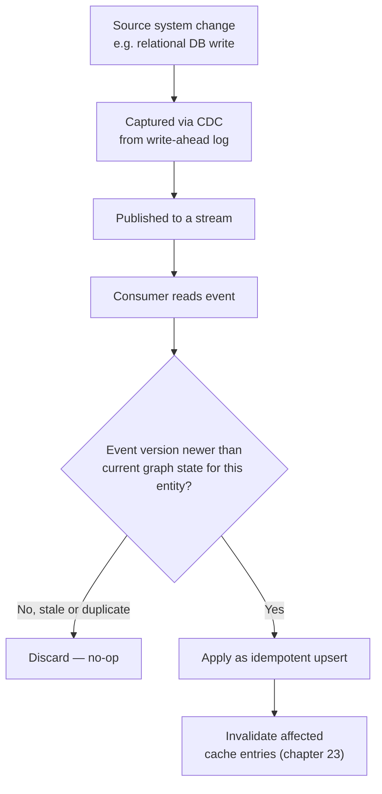

# 22 — Real-Time Graph Updates at Scale

> Part IV: Scale & Distributed Systems · Position 22 of 37 · ~11 min read

## Table

| # | Section | In this chapter |
|---|---|---|
| 1 | Introduction | Batch ETL was never designed to answer "what does the graph look like right now" |
| 2 | Prerequisites | Chapters 18, 20 |
| 3 | Core Concepts | CDC, streaming mutation, and the guarantees it needs |
| 4 | Internal Architecture | Why ordering and idempotency are the two hard parts |
| 5 | Workflow | A CDC pipeline into a live graph |
| 6 | Syntax / Structure | An idempotent upsert pattern |
| 7 | Code Examples | Handling out-of-order and duplicate events |
| 8 | Use Cases | Where near-real-time graph state actually matters |
| 9 | Performance Considerations | The tension between freshness and consistency |
| 10 | Security Considerations | A streaming pipeline is a new, continuously-open data path |
| 11 | Best Practices | Design for at-least-once delivery from day one |
| 12 | Common Errors | Assuming events arrive in order |
| 13 | Interview Questions | What you'll get asked, and how to answer well |
| 14 | Summary | Freshness has a real engineering cost, not just a latency number |
| 15 | References & Further Reading | Where to go next |

## 1. Introduction

Nightly batch ETL answers "what did the graph look like as of last night's load." Increasingly, real systems need "what does the graph look like right now" — fraud detection (chapter 30) and live recommendation are the clearest examples where a stale graph is a materially worse graph. Getting there means streaming mutations into the graph continuously, and that introduces real distributed-systems problems batch loading never had to face.

## 2. Prerequisites

Chapter 18's transactional guarantees and chapter 20's partitioning — streaming updates have to respect both while arriving continuously rather than in a controlled batch window.

## 3. Core Concepts

**Change Data Capture (CDC)** captures changes from a source system — commonly a relational database's write-ahead log — and streams them into the graph as they happen, rather than waiting for a batch window. This shifts three problems from "handled once, carefully, during a batch job" to "handled continuously, under load":

- **Ordering** — did this edge-delete event arrive before or after its corresponding edge-create event?
- **Idempotency** — most streaming systems offer at-least-once delivery, meaning the same event can arrive more than once; processing it twice must not corrupt state.
- **Consistency under load** — keeping indexes (chapter 17) and cached results (chapter 23) correct while writes are arriving continuously, not in a controlled window.

## 4. Internal Architecture

Ordering and idempotency are the two genuinely hard parts, and they interact: a naive "apply events in arrival order" approach breaks the moment events arrive out of order (common with distributed source systems and network variance), and a naive "just apply every event" approach breaks the moment any event is delivered twice. The standard architectural answer to both is designing every mutation to be an **idempotent upsert keyed on a stable identifier and a version or timestamp**, so applying the same event twice — or applying an older event after a newer one — is safe and doesn't corrupt state.

## 5. Workflow



## 6. Syntax / Structure

```cypher
// Idempotent upsert: safe to apply the same event any number of times,
// and safe against out-of-order arrival, because it checks the version
MERGE (a:Account {id: $account_id})
ON CREATE SET a.balance = $balance, a.version = $event_version
ON MATCH SET a.balance = CASE WHEN $event_version > a.version
                              THEN $balance ELSE a.balance END,
             a.version = CASE WHEN $event_version > a.version
                               THEN $event_version ELSE a.version END
```

## 7. Code Examples

```python
def apply_event(graph, event):
    current_version = graph.get_version(event.entity_id)
    if event.version <= current_version:
        return  # stale or duplicate — safe no-op, not an error
    graph.upsert(event.entity_id, event.data, event.version)
    invalidate_cache(event.entity_id)  # chapter 23
```

The version check is what makes both out-of-order arrival and duplicate delivery safe to handle with the same simple logic.

## 8. Use Cases

Fraud detection needing the current transaction graph, not last night's (chapter 30); live recommendation systems where a just-added relationship should influence the next request; any dashboard or monitoring system (chapter 35) claiming to show "current" graph health.

## 9. Performance Considerations

There's a real, unavoidable tension between freshness and consistency guarantees: the stronger the consistency guarantee (every reader sees every write immediately, in order), the more coordination overhead is required, which caps how fast updates can actually propagate under load. Most real systems make a deliberate, explicit tradeoff here — eventual consistency with a bounded, monitored lag, rather than either extreme.

## 10. Security Considerations

A streaming CDC pipeline is a new, continuously-open data path from the source system into the graph — it needs the same access-control and encryption-in-transit scrutiny as any other data path, and arguably more monitoring, since it's live and continuous rather than a bounded, auditable batch job with a clear start and end.

## 11. Best Practices

- Design every mutation as an idempotent upsert from the start — retrofitting idempotency after building for exactly-once assumptions is expensive.
- Assume at-least-once delivery and out-of-order arrival as the default, not an edge case to handle later.
- Monitor consistency lag explicitly (chapter 35) rather than assuming "real-time" without measuring it.

## 12. Common Errors

- **Assuming events arrive in order** — a common, costly assumption that breaks under real network conditions and distributed source systems.
- **Building for exactly-once delivery semantics** when the actual messaging infrastructure only guarantees at-least-once — a mismatch that surfaces as data corruption under load, often only in production.

## 13. Interview Questions

**"Why does a streaming graph-update pipeline need to handle both out-of-order and duplicate events?"**
Most real messaging infrastructure guarantees at-least-once delivery, not exactly-once or strictly ordered — both cases need to be handled by design, not treated as rare edge cases.

**"How would you design a mutation to be safely idempotent?"**
A version or timestamp check that only applies an update if it's newer than the current state — the pattern in sections 6 and 7.

## 14. Summary

Moving from batch ETL to real-time streaming updates trades a controlled, bounded batch window for continuous freshness — and that trade brings genuine distributed-systems problems (ordering, idempotency, consistency lag) that a well-designed system handles explicitly, by making every mutation an idempotent, version-aware upsert from the start.

## 15. References & Further Reading

**Within this library**
- Chapter 18 — ACID and Consistency in Graph Systems
- Chapter 23 — Caching Strategies for Graph Queries
- Chapter 30 — Fraud and Anomaly Detection Graphs
