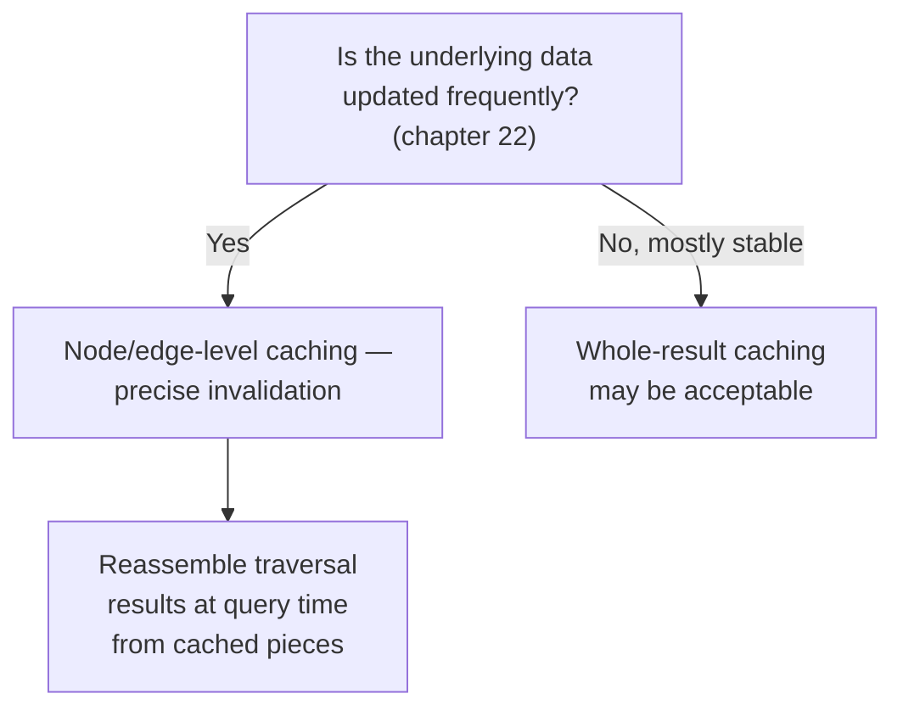

# 23 — Caching Strategies for Graph Queries

> Part IV: Scale & Distributed Systems · Position 23 of 37 · ~10 min read

## Table

| # | Section | In this chapter |
|---|---|---|
| 1 | Introduction | Why a technique that works great for tables works poorly for graphs |
| 2 | Prerequisites | Chapters 15, 22 |
| 3 | Core Concepts | Why graph query results resist simple key-based caching |
| 4 | Internal Architecture | Node/edge-level caching vs. whole-result caching |
| 5 | Workflow | Deciding what to cache, and at what granularity |
| 6 | Syntax / Structure | A cache-invalidation scope, compared |
| 7 | Code Examples | Node-level caching with targeted invalidation |
| 8 | Use Cases | Where caching helps most in a graph workload |
| 9 | Performance Considerations | The invalidation-storm failure mode |
| 10 | Security Considerations | Cache poisoning and stale-permission risk |
| 11 | Best Practices | Cache the small, stable pieces, not the large, volatile results |
| 12 | Common Errors | Caching full traversal results by naive query-hash |
| 13 | Interview Questions | What you'll get asked, and how to answer well |
| 14 | Summary | The invalidation problem, not the storage problem |
| 15 | References & Further Reading | Where to go next |

## 1. Introduction

Caching a relational query result by hashing the query and its parameters works well because table rows are largely independent — invalidating one row rarely needs to invalidate many other cached results. Graph query results depend on potentially large, hard-to-bound neighborhoods, and a single edge change can invalidate many different traversal results that happened to pass through it — the same underlying property that makes graphs powerful for querying makes them harder to cache well.

## 2. Prerequisites

Chapter 15's storage model and chapter 22's streaming updates — caching strategy has to account for both what's actually being read and how often the underlying data changes.

## 3. Core Concepts

The core problem: caching a full traversal result under a key like `hash(query + params)` means a single edge update anywhere in that traversal's reachable neighborhood should, in principle, invalidate the cached result — but the caching layer has no easy way to know which cached entries a given edge update actually affects, since that depends on the full shape of every cached query.

## 4. Internal Architecture

The standard mitigation is caching at a finer granularity: **node and edge-level caching** (cache individual node/edge data, reassemble traversal results from those cached pieces at query time) rather than **whole-result caching** (cache the entire assembled traversal output under one key). Node-level caching localizes invalidation precisely — when a node changes, you invalidate exactly that node's cache entry, and any query that reassembles from it will simply re-fetch the updated piece, without needing to know in advance which whole-query caches were affected.

| | Whole-result caching | Node/edge-level caching |
|---|---|---|
| Invalidation scope | Hard to determine precisely | Precise — exactly the changed node/edge |
| Cache hit value | High — full result ready | Lower per-hit — still needs reassembly |
| Fits well with frequent updates? | Poorly | Better |

## 5. Workflow



## 6. Syntax / Structure

```
Relational cache key: hash("SELECT * FROM orders WHERE user_id = 42")
→ invalidated cleanly when order rows for user 42 change

Graph whole-result cache key: hash("MATCH (u)-[:KNOWS*1..3]->(x) WHERE u.id=42")
→ invalidated by a change to ANY node/edge within 3 hops of user 42 —
  a much larger, harder-to-track invalidation surface
```

## 7. Code Examples

```python
def get_neighbors_cached(node_id, cache):
    cached = cache.get(f"node:{node_id}:neighbors")
    if cached is not None:
        return cached
    neighbors = graph.get_neighbors(node_id)  # chapter 15's adjacency walk
    cache.set(f"node:{node_id}:neighbors", neighbors)
    return neighbors

def on_edge_change(node_id, cache):
    # precise invalidation — only this node's cached neighbor list,
    # not any whole-query result that might have included it
    cache.delete(f"node:{node_id}:neighbors")
```

## 8. Use Cases

Node/edge-level caching helps most for hot, frequently-traversed entities under frequent updates — exactly the supernode-adjacent territory from chapter 19, where the read volume through a hub node is high enough that even a partial cache hit meaningfully reduces load.

## 9. Performance Considerations

The failure mode worth naming explicitly is an **invalidation storm**: a single update to a genuinely high-degree node (a supernode, chapter 19) can trigger invalidation across an enormous number of cached entries that reference it, all at once — potentially causing a thundering-herd of cache misses hitting the underlying store simultaneously right after the update. This is a real, specific interaction between the supernode problem and caching strategy worth planning for explicitly, not discovering during an incident.

## 10. Security Considerations

A caching layer introduces two graph-specific risks worth naming: **cache poisoning**, where an attacker manipulates cached traversal results to serve incorrect data to other users, and **stale-permission risk**, where a cached result reflects a permission state that has since been revoked — if access-control decisions are ever cached alongside data, invalidation on permission change needs to be at least as reliable as invalidation on data change.

## 11. Best Practices

- Cache the small, stable pieces (individual node/edge data) rather than large, volatile whole-query results, especially under frequent updates (chapter 22).
- Plan explicitly for invalidation storms around known supernodes (chapter 19) rather than discovering the interaction during an incident.
- Never cache permission-sensitive results without invalidation guarantees at least as strong as those for the underlying data.

## 12. Common Errors

- **Caching full traversal results under a naive query-hash key**, without a workable strategy for knowing what to invalidate when the underlying data changes.
- **Not accounting for invalidation storms around supernodes** specifically, where a single update can invalidate a disproportionate number of cache entries at once.

## 13. Interview Questions

**"Why is caching harder for graph queries than for relational ones?"**
Relational rows are largely independent, so invalidation scope is easy to determine; graph traversal results depend on potentially large neighborhoods, so a single edge change can affect many cached results in ways that are hard to enumerate precisely.

**"How would you design a caching strategy that handles frequent graph updates well?"**
Cache at node/edge granularity and reassemble at query time, rather than caching whole traversal results — this localizes invalidation to exactly what changed.

## 14. Summary

Graph query caching is fundamentally an invalidation-scoping problem, not a storage problem — the technique that works for independent relational rows breaks down against the connected, hard-to-bound nature of graph traversal results. Caching at node/edge granularity, and planning explicitly for invalidation storms around known supernodes, is what makes caching actually work here.

## 15. References & Further Reading

**Within this library**
- Chapter 19 — The Supernode Problem
- Chapter 22 — Real-Time Graph Updates at Scale
- Chapter 13 — Graph Normalization vs Denormalization
