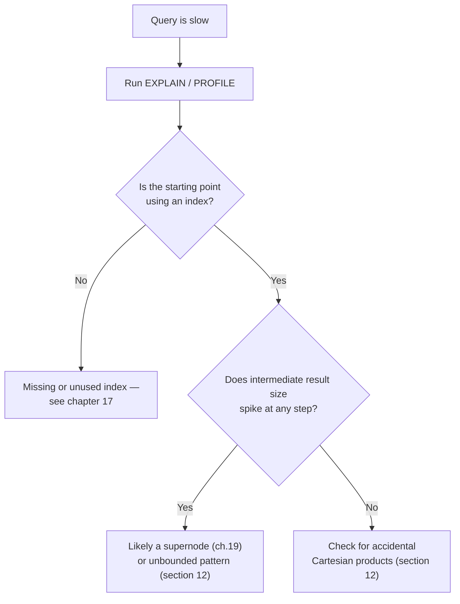

# 24 — Query Performance and Debugging

> Part IV: Scale & Distributed Systems · Position 24 of 37 · ~11 min read

## Table

| # | Section | In this chapter |
|---|---|---|
| 1 | Introduction | The skill that separates "it works" from "it works at scale" |
| 2 | Prerequisites | Chapters 16, 17 |
| 3 | Core Concepts | Reading a query plan, in principle |
| 4 | Internal Architecture | What a plan is actually telling you about physical execution |
| 5 | Workflow | A debugging decision tree for a slow query |
| 6 | Syntax / Structure | An EXPLAIN/PROFILE-style output, annotated |
| 7 | Code Examples | The two most common Cypher anti-patterns |
| 8 | Use Cases | When this skill actually gets used |
| 9 | Performance Considerations | Why the same query can have different plans on different days |
| 10 | Security Considerations | Query plans can leak schema and volume information |
| 11 | Best Practices | Review query plans as routine practice, not incident response |
| 12 | Common Errors | Unbounded variable-length paths, and accidental Cartesian products |
| 13 | Interview Questions | What you'll get asked, and how to answer well |
| 14 | Summary | Reading plans is the single highest-leverage debugging skill here |
| 15 | References & Further Reading | Where to go next |

## 1. Introduction

Chapter 16 introduced query planners as the mechanism that turns a declarative pattern into an execution order. This chapter is about actually reading what a planner decided — the single highest-leverage debugging skill for anyone running graph queries in production, and one that's rarely taught explicitly.

## 2. Prerequisites

Chapter 16's paradigm comparison and chapter 17's indexing — a query plan is essentially a report on how the planner used (or didn't use) the indexes and traversal structures those two chapters covered.

## 3. Core Concepts

A query plan (produced via an `EXPLAIN` or `PROFILE`-style command, present in some form across most declarative graph query languages) shows the actual physical steps the engine intends to take: which index it used (or didn't) to find a starting node, what order it expanded relationships in, and where large intermediate result sets appeared. Reading it is how you confirm a query is doing what you assumed, rather than something dramatically more expensive.

## 4. Internal Architecture

A plan is a report on physical execution, and the two things worth checking first are: **did it use an index at the starting point**, or is it scanning all nodes of a label to find a match (chapter 17's territory), and **where does the estimated or actual row/result count spike** — a sudden jump in intermediate result size usually points to exactly where a query touched something like a supernode (chapter 19) or an unintentionally unbounded pattern.

## 5. Workflow



## 6. Syntax / Structure

An annotated, simplified plan:

```
NodeIndexSeek (Person, email)        <- good: used the index from chapter 17
  Expand (COLLEAGUE_OF, 1 hop)       <- cheap, expected
    Expand (WORKS_AT, 1 hop)         <- rows jumped from 12 to 4,200,000 here
                                          ^ this is where a supernode (ch.19)
                                            or unbounded pattern got touched
```

The row-count jump is the single most useful signal in a plan — it tells you exactly which hop is expensive, not just that the overall query is.

## 7. Code Examples

```cypher
// Anti-pattern 1: unbounded variable-length path — can expand
// an unpredictably, dangerously large portion of the graph
MATCH (a:Person)-[:KNOWS*]->(b:Person) RETURN b

// Fixed: bounded depth, directly connecting to chapter 1's
// unbounded-traversal warning made concrete at the query level
MATCH (a:Person)-[:KNOWS*1..3]->(b:Person) RETURN b
```

```cypher
// Anti-pattern 2: accidental Cartesian product — two disconnected
// MATCH patterns combine every row of one with every row of the other
MATCH (a:Person), (b:Company) RETURN a, b

// Fixed: an actual relationship connects the two patterns
MATCH (a:Person)-[:WORKS_AT]->(b:Company) RETURN a, b
```

## 8. Use Cases

This skill gets used constantly, not just during incidents: reviewing a new query before it ships, investigating a slow endpoint, and validating that a schema change (chapter 11) didn't quietly turn a cheap query into an expensive one.

## 9. Performance Considerations

The same logical query can produce different plans over time as data grows, degree distributions shift (chapter 19, chapter 35), or index statistics change — a query that was cheap at launch isn't guaranteed to stay cheap, which is exactly why plan review deserves to be routine practice (section 11), not a one-time check.

## 10. Security Considerations

Query plans, especially in verbose `PROFILE`-style output, can leak real information about schema structure and approximate data volume to anyone who can trigger them — worth restricting plan-level debugging output to trusted/internal contexts, not exposing it through any user-facing error path.

## 11. Best Practices

- Review query plans as routine practice — before shipping a new query, not only after it's already caused an incident.
- Watch specifically for the row-count spike signal (section 6) rather than trying to read every line of a plan with equal attention.
- Re-check plans periodically for hot queries, since the same query's plan can change as the underlying data does (section 9).

## 12. Common Errors

- **Unbounded variable-length path patterns** — the query-level manifestation of chapter 1's unbounded-traversal warning, and one of the most common causes of a runaway query.
- **Accidental Cartesian products** from disconnected `MATCH` patterns that were meant to be related but aren't actually joined by any pattern — a subtle, easy-to-miss syntax mistake with a severe performance cost.

## 13. Interview Questions

**"How would you debug a graph query that's suddenly become slow?"**
Look for: reaching for the query plan first, specifically checking index usage at the starting point and watching for intermediate result-size spikes — not guessing at fixes before looking.

**"What's an accidental Cartesian product in a graph query, and how do you spot it?"**
Two or more `MATCH` patterns that were meant to relate but aren't actually connected by any relationship, causing every row of one to combine with every row of the other — visible in a plan as an unexpectedly large result size with no corresponding `Expand` step explaining it.

## 14. Summary

Reading a query plan is the single highest-leverage skill for keeping graph queries fast in production — it turns "this query is slow" into "this specific hop is expensive, for this specific reason," which is the difference between guessing at a fix and actually applying one.

## 15. References & Further Reading

**Within this library**
- Chapter 16 — Query Languages Compared
- Chapter 17 — Indexing Strategies for Graphs
- Chapter 19 — The Supernode Problem
