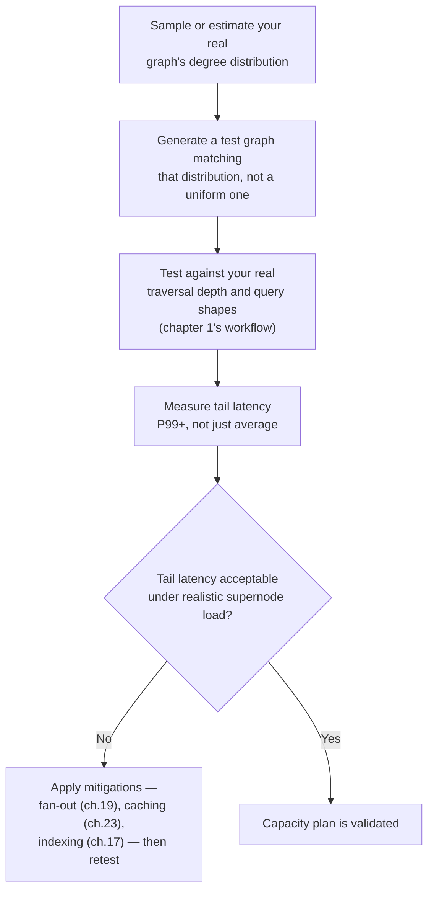
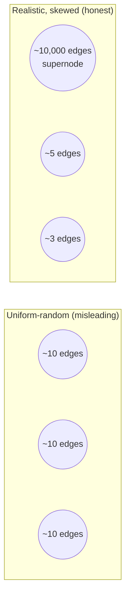

# 25 — Capacity Planning and Benchmarking

> Part IV: Scale & Distributed Systems · Position 25 of 37 · ~11 min read

## Table

| # | Section | In this chapter |
|---|---|---|
| 1 | Introduction | The chapter that closes Part IV's loop back to chapter 1's workflow |
| 2 | Prerequisites | Chapters 19, 20 |
| 3 | Core Concepts | Why synthetic benchmarks systematically lie about graph performance |
| 4 | Internal Architecture | Degree distribution as the variable that matters most |
| 5 | Workflow | Building a realistic benchmark |
| 6 | Syntax / Structure | Uniform-random vs. power-law-ish degree distributions, compared |
| 7 | Code Examples | Generating a more realistic test graph |
| 8 | Use Cases | What to actually load-test before launch |
| 9 | Performance Considerations | Why average-case numbers hide the real risk |
| 10 | Security Considerations | Load-testing your own denial-of-service exposure |
| 11 | Best Practices | Benchmark against your real traversal depth and your real degree distribution |
| 12 | Common Errors | Trusting a vendor benchmark that used a synthetic graph |
| 13 | Interview Questions | What you'll get asked, and how to answer well |
| 14 | Summary | A benchmark is only as honest as the graph it's run against |
| 15 | References & Further Reading | Where to go next |

## 1. Introduction

Chapter 1's workflow said "prototype against real query shapes, not a synthetic benchmark." This chapter is about why that instruction matters as much as it does, and how to actually do it — closing the loop Part IV has been building toward.

## 2. Prerequisites

Chapter 19's supernode problem and chapter 20's partitioning — both directly explain why synthetic benchmarks mislead in the specific way this chapter covers.

## 3. Core Concepts

The core "benchmarking lie": most synthetic or uniform-random test graphs have a **roughly uniform degree distribution** — every node has a similar number of connections. Almost no real-world graph looks like this. Real graphs — social networks, transaction graphs, knowledge graphs — typically have a **highly skewed, power-law-ish distribution**: a small number of supernodes (chapter 19) and a long tail of low-degree nodes. Benchmarking against a uniform-random graph systematically hides exactly the supernode-related performance problems you'll actually hit in production.

## 4. Internal Architecture

Degree distribution shape is the single variable most responsible for this gap. A uniform-random graph never produces a node whose relationship list is dramatically larger than average — so it never exercises the "one hop through a hub dominates the whole query" failure mode from chapter 19, or the "one edge update triggers an invalidation storm" failure mode from chapter 23. A benchmark run against such a graph can report excellent average-case latency numbers while missing the tail-latency behavior that actually determines whether the system holds up in production.

## 5. Workflow



## 6. Syntax / Structure



## 7. Code Examples

```python
import random

def generate_realistic_graph(n_nodes, hub_fraction=0.001, hub_degree=5000, normal_degree=8):
    """Illustrative sketch: a small fraction of nodes get a disproportionately
    high degree, approximating the skew real-world graphs actually have —
    rather than every node getting a similar, uniform degree."""
    nodes = list(range(n_nodes))
    hubs = set(random.sample(nodes, int(n_nodes * hub_fraction)))
    edges = []
    for node in nodes:
        degree = hub_degree if node in hubs else normal_degree
        targets = random.sample(nodes, min(degree, n_nodes - 1))
        edges.extend((node, t) for t in targets)
    return nodes, edges
```

## 8. Use Cases

Load-test before any launch involving a graph database: capacity planning for a new feature, validating a schema change hasn't introduced a new supernode risk (chapter 11, chapter 19), and re-validating periodically as real usage patterns evolve, since degree distributions shift over time (chapter 35's monitoring should feed back into this chapter's benchmarks).

## 9. Performance Considerations

Average-case latency numbers can look excellent while hiding the actual risk, which lives in the tail — the P99 or P999 latency, driven by the rare-but-real queries that happen to touch a supernode. Capacity planning that only looks at averages is capacity planning that will be surprised by production.

## 10. Security Considerations

A capacity-planning exercise doubles as a legitimate way to understand your own denial-of-service exposure (chapter 1, chapter 19, chapter 21) — if a realistic benchmark reveals that touching a known supernode can dominate system resources, that's the same vulnerability an attacker could exploit deliberately, and it's far better to discover it in a load test than in an incident.

## 11. Best Practices

- Benchmark against your actual traversal depth and your actual, measured or realistically-estimated degree distribution — not a vendor-provided or synthetic uniform benchmark.
- Measure and report tail latency explicitly, not just averages.
- Re-run capacity planning periodically, feeding in updated degree-distribution data from ongoing monitoring (chapter 35).

## 12. Common Errors

- **Trusting a vendor-published benchmark** without checking what kind of graph it was run against — a benchmark run on a uniform-random graph tells you little about your own, likely skewed, production graph.
- **Reporting only average latency**, missing the tail-latency risk that actually determines production reliability.

## 13. Interview Questions

**"Why can a benchmark that looks great on a synthetic graph fail to predict production performance?"**
Synthetic/uniform-random graphs typically lack the skewed degree distribution real graphs have, so they never exercise supernode-related failure modes that dominate real-world tail latency.

**"What would you check before trusting a published graph database benchmark?"**
What kind of test graph was used — uniform-random or realistically skewed — and whether the reported numbers are averages or include tail latency.

## 14. Summary

A benchmark is only as honest as the graph it's run against, and most synthetic benchmarks — including many vendor-published ones — use graphs that don't reflect the skewed degree distributions real-world graphs actually have. Closing that gap, by testing against realistic distributions and realistic traversal depth, and by measuring tail latency rather than just averages, is what turns a capacity plan from reassuring into actually reliable.

## 15. References & Further Reading

**Within this library**
- Chapter 1 — What Is Graph Engineering?
- Chapter 19 — The Supernode Problem
- Chapter 35 — Monitoring and Observability for Graph Systems
