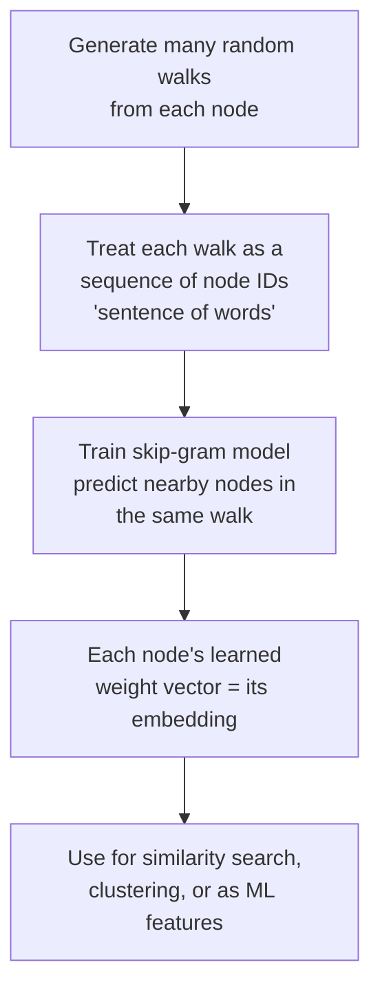

# 26 — Graph Embeddings Fundamentals

> Part V: Graph Machine Learning · Position 26 of 37 · ~11 min read

## Table

| # | Section | In this chapter |
|---|---|---|
| 1 | Introduction | Turning structure into a vector, and why that's worth doing |
| 2 | Prerequisites | Chapters 4, 6 |
| 3 | Core Concepts | DeepWalk and Node2Vec, and what each actually optimizes |
| 4 | Internal Architecture | Random walks as "sentences," borrowed from word2vec |
| 5 | Workflow | The embedding pipeline, end to end |
| 6 | Syntax / Structure | A random walk, and what it feeds into |
| 7 | Code Examples | A minimal random-walk generator |
| 8 | Use Cases | When embeddings beat a symbolic query |
| 9 | Performance Considerations | The tradeoff embeddings make, explicitly |
| 10 | Security Considerations | Embeddings can leak structural information indirectly |
| 11 | Best Practices | Don't reach for embeddings when a symbolic query answers the question |
| 12 | Common Errors | Treating embedding similarity as ground truth |
| 13 | Interview Questions | What you'll get asked, and how to answer well |
| 14 | Summary | A vector that approximates structure, not a replacement for it |
| 15 | References & Further Reading | Where to go next |

## 1. Introduction

Everything in Parts I through IV treats the graph as something you query directly — traverse it, pattern-match it, walk it. Graph embeddings do something different: they compress each node's structural context into a fixed-size vector, so "how similar are these two nodes, structurally" becomes a simple vector-distance calculation instead of a traversal.

## 2. Prerequisites

Chapter 4's traversal mechanics and chapter 6's centrality measures — embeddings are, informally, a way of capturing structural signal similar in spirit to what centrality measures capture, but as a general-purpose vector rather than a single scalar score.

## 3. Core Concepts

- **DeepWalk** — generates many random walks starting from each node, treats each walk as a "sentence" of node "words," and feeds these into a word2vec-style skip-gram model to learn node embeddings where structurally similar nodes end up close together in vector space.
- **Node2Vec** — extends DeepWalk with *biased* random walks, using tunable parameters to control whether walks behave more breadth-first (capturing local community structure) or more depth-first (capturing broader structural roles) — letting the notion of "similar" be tuned to the problem.

Both methods share the same core insight: nodes that show up in similar walk contexts, across many walks, are probably structurally similar — the same distributional intuition word2vec uses for words.

## 4. Internal Architecture

The random-walk-as-sentence idea is the whole trick: a random walk through the graph — a sequence of visited node IDs — is treated exactly like a sentence of words for the purposes of the underlying word2vec-style skip-gram training objective, which learns to predict nearby "words" (nodes) in the same "sentence" (walk). This is why DeepWalk and Node2Vec could be built directly on existing, well-understood word-embedding machinery rather than needing an entirely new training approach.

## 5. Workflow



## 6. Syntax / Structure

A random walk of length 5 starting from Deb: `[Deb, Priya, Marcus, Priya, Wei]`. This sequence is what feeds into the skip-gram training step in section 4 — node IDs standing in for words, walks standing in for sentences.

## 7. Code Examples

```python
import random

def random_walk(graph, start, length):
    walk = [start]
    current = start
    for _ in range(length - 1):
        neighbors = graph.get(current, [])
        if not neighbors:
            break
        current = random.choice(neighbors)
        walk.append(current)
    return walk

def generate_walks(graph, walks_per_node=10, walk_length=20):
    walks = []
    for node in graph:
        for _ in range(walks_per_node):
            walks.append(random_walk(graph, node, walk_length))
    return walks  # feed into a skip-gram trainer, e.g. gensim's Word2Vec
```

## 8. Use Cases

Embeddings beat a direct symbolic query when you need **similarity/nearest-neighbor reasoning** — "find nodes structurally like this one" — rather than an exact pattern match, or when you want to feed graph structure into a downstream ML model as a fixed-size feature vector (chapter 29), since most ML models expect fixed-size numeric input, not a variable-shaped subgraph.

## 9. Performance Considerations

Embeddings trade **precision for compactness and speed**: a symbolic query gives an exact, explainable answer about a specific pattern; an embedding gives an approximate, unexplainable notion of similarity that's cheap to compute distance on once trained, but expensive to retrain as the graph changes significantly, and offers no guarantee about *why* two nodes ended up close together.

## 10. Security Considerations

Embeddings can leak structural information indirectly, even when node identities are otherwise anonymized: two anonymized nodes with very similar embeddings are, by construction, structurally similar in the underlying graph, which can sometimes be enough — combined with other side information — to support re-identification, extending chapter 1's relationship-based re-identification warning into the embedding space specifically.

## 11. Best Practices

- Don't reach for embeddings when a direct symbolic query already answers the question precisely and explainably — embeddings are a tool for similarity and downstream ML, not a universal replacement for traversal.
- Retrain or update embeddings on a deliberate schedule as the graph changes meaningfully, rather than assuming they stay valid indefinitely.
- Treat embedding similarity as a hypothesis worth investigating, not a definitive structural claim.

## 12. Common Errors

- **Treating embedding-space similarity as ground truth** about real-world similarity, without validating what the embedding actually captured for the specific graph and walk parameters used.
- **Reaching for embeddings by default** for questions a direct, explainable traversal query would have answered more precisely and more cheaply.

## 13. Interview Questions

**"How does DeepWalk turn graph structure into something a word2vec-style model can learn from?"**
Random walks are treated as sequences of node IDs, structurally identical to sentences of words, so the same skip-gram training objective applies directly.

**"When would you use Node2Vec's biased walks instead of DeepWalk's uniform random walks?"**
When the notion of "similar" needs tuning — more breadth-first-biased walks capture local community structure, more depth-first-biased walks capture broader structural roles.

## 14. Summary

Graph embeddings compress structural context into a vector, trading the precision and explainability of a direct traversal query for compactness and downstream ML usability. They're a genuinely useful tool for similarity and feature engineering — and, per chapter 1's opening distinction, a subfield that assumes a queryable graph already exists, not a substitute for the traversal and modeling work covered in Parts I through IV.

## 15. References & Further Reading

**Within this library**
- Chapter 4 — Traversal Algorithms
- Chapter 6 — Centrality and Ranking Algorithms
- Chapter 27 — Graph Neural Networks Overview
- Chapter 29 — Graph ML Pipeline Engineering

**Further reading**
- Perozzi, Al-Rfou, and Skiena — "DeepWalk: Online Learning of Social Representations."
- Grover and Leskovec — "node2vec: Scalable Feature Learning for Networks."
