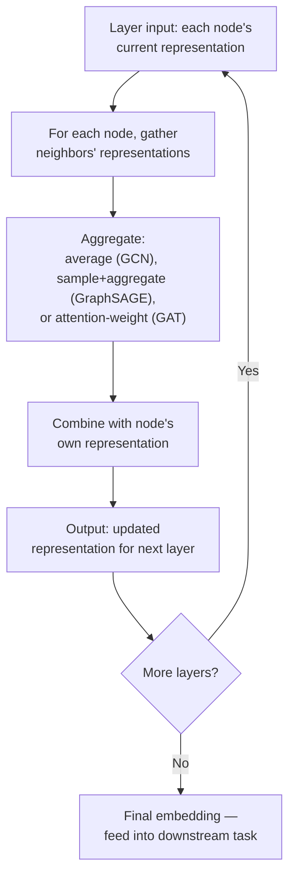

# 27 — Graph Neural Networks Overview

> Part V: Graph Machine Learning · Position 27 of 37 · ~12 min read

## Table

| # | Section | In this chapter |
|---|---|---|
| 1 | Introduction | Learning the embedding, instead of computing it from fixed walks |
| 2 | Prerequisites | Chapter 26 |
| 3 | Core Concepts | GCN, GraphSAGE, GAT — what each one actually changes |
| 4 | Internal Architecture | Neighborhood aggregation, layer by layer |
| 5 | Workflow | One GNN layer's forward pass, as a flow |
| 6 | Syntax / Structure | The aggregation step, in words |
| 7 | Code Examples | A minimal, illustrative aggregation step |
| 8 | Use Cases | Where GNNs earn their added complexity over chapter 26's methods |
| 9 | Performance Considerations | Inductive vs. transductive — the distinction that actually matters |
| 10 | Security Considerations | Adversarial examples in graph-structured input |
| 11 | Best Practices | Match the architecture to whether you need to generalize to new nodes |
| 12 | Common Errors | Using a transductive model where an inductive one was needed |
| 13 | Interview Questions | What you'll get asked, and how to answer well |
| 14 | Summary | Three architectures, one shared idea: learn from your neighbors |
| 15 | References & Further Reading | Where to go next |

## 1. Introduction

Chapter 26's methods compute embeddings from a fixed procedure — random walks feeding a skip-gram model. Graph Neural Networks (GNNs) take a different approach: they *learn* how to aggregate neighborhood information end-to-end, as part of training a model for a specific downstream task, rather than computing a general-purpose embedding upfront.

## 2. Prerequisites

Chapter 26 — understanding what a fixed-procedure embedding does makes it much easier to see what GNNs are actually adding.

## 3. Core Concepts

- **GCN (Graph Convolutional Network)** — each node's representation is updated by aggregating (a weighted average) its neighbors' representations, layer by layer. "Convolution" here means neighborhood aggregation, not image-style spatial convolution — a common early point of confusion worth naming directly.
- **GraphSAGE ("SAmple and aggreGatE")** — samples a fixed-size neighborhood rather than using every neighbor, which makes it **inductive**: it can generalize to nodes never seen during training, unlike vanilla GCN, which is typically **transductive** (learns representations tied to the specific training graph).
- **GAT (Graph Attention Network)** — adds learned attention weights, so a node's aggregation weighs different neighbors differently rather than uniformly — some neighbors matter more than others, and the model learns which.

| | Aggregation | Inductive? |
|---|---|---|
| GCN | Uniform/weighted average over full neighborhood | Typically no |
| GraphSAGE | Sampled, fixed-size neighborhood | Yes |
| GAT | Learned attention-weighted aggregation | Depends on implementation |

## 4. Internal Architecture

Every layer does the same fundamental operation: each node gathers information from its immediate neighbors, combines it with its own current representation, and produces an updated representation for the next layer. Stacking *k* layers means each node's final representation has effectively gathered information from everything within *k* hops — directly analogous to a *k*-hop traversal (chapter 4), except the "combination" at each hop is a learned function rather than a fixed traversal rule.

## 5. Workflow



## 6. Syntax / Structure

In words, one GCN-style layer's update for a node: the node's new representation equals some learned transformation of the average of its neighbors' current representations, combined with its own current representation, followed by a nonlinearity — structurally similar to a standard neural network layer, except the "input" is gathered from the graph's neighborhood rather than from a fixed input vector.

## 7. Code Examples

```python
# Illustrative sketch of one aggregation step — not a trainable implementation.
# Real production GNN work should use an established framework (e.g. PyTorch
# Geometric or DGL) rather than a hand-rolled version; getting the gradient
# computation and batching right is substantially harder than this sketch shows.

def aggregate_layer(node, graph, representations):
    neighbor_reprs = [representations[n] for n in graph[node]]
    if not neighbor_reprs:
        return representations[node]
    avg = sum(neighbor_reprs) / len(neighbor_reprs)  # GCN-style uniform aggregation
    return combine(representations[node], avg)  # a learned transformation in practice
```

## 8. Use Cases

GNNs earn their added complexity specifically when the downstream task benefits from **end-to-end learning** tied to a specific objective — node classification, link prediction (chapter 28) trained jointly with the embedding, or graph-level prediction tasks — rather than a general-purpose, task-agnostic embedding computed upfront the way chapter 26's methods produce.

## 9. Performance Considerations

The distinction that matters most in practice is **inductive vs. transductive**, not raw accuracy: a transductive model (vanilla GCN) needs to be retrained, at least partially, whenever new nodes appear, since it never learned a generalizable aggregation function independent of the specific training graph. GraphSAGE's inductive design means it can produce a reasonable representation for a node it's never seen, using only that node's local neighborhood — a real, practical requirement for any system with a constantly growing graph (new users, new products), which is most production systems.

## 10. Security Considerations

Graph-structured input introduces its own adversarial surface: small, carefully chosen structural perturbations — adding or removing a few strategic edges — can meaningfully change a GNN's output for a target node, an active area of adversarial-robustness research. Any GNN operating on partially user-influenced graph data (chapter 5's adversarial-edge warning, extended here) should treat structural perturbation as a real threat model, not just a data-quality concern.

## 11. Best Practices

- Choose GraphSAGE-style inductive architectures for any graph that grows continuously with new nodes — which describes most real production systems.
- Reserve transductive approaches (vanilla GCN) for genuinely static or infrequently-changing graphs where full retraining periodically is acceptable.
- Use established frameworks (PyTorch Geometric, DGL) for real implementation rather than hand-rolling the aggregation and gradient logic — the sketch in section 7 is illustrative, not production-ready.

## 12. Common Errors

- **Using a transductive model (vanilla GCN) on a graph that grows continuously**, then being surprised that new nodes can't get a meaningful representation without a full retrain.
- **Treating "convolution" in GCN as spatial/image-style convolution** rather than neighborhood aggregation — a common early conceptual confusion that leads to misapplied intuitions from computer vision.

## 13. Interview Questions

**"What does 'convolution' mean in a Graph Convolutional Network?"**
Neighborhood aggregation — combining a node's representation with its neighbors' — not spatial convolution in the image-processing sense.

**"Why is GraphSAGE described as inductive while vanilla GCN is typically transductive?"**
GraphSAGE learns a general aggregation function over sampled, fixed-size neighborhoods, which generalizes to unseen nodes; vanilla GCN's representations are tied more closely to the specific training graph.

## 14. Summary

GCN, GraphSAGE, and GAT all share the same underlying idea — learn a node's representation from its neighbors, layer by layer — while differing in how they aggregate and whether they generalize to unseen nodes. For most real, continuously-growing production graphs, that inductive-vs-transductive distinction matters more day to day than raw accuracy differences between architectures.

## 15. References & Further Reading

**Within this library**
- Chapter 26 — Graph Embeddings Fundamentals
- Chapter 28 — Link Prediction and Recommendation
- Chapter 29 — Graph ML Pipeline Engineering

**Further reading**
- Kipf and Welling — "Semi-Supervised Classification with Graph Convolutional Networks," the original GCN paper.
- Hamilton, Ying, and Leskovec — "Inductive Representation Learning on Large Graphs," the original GraphSAGE paper.
- Veličković et al. — "Graph Attention Networks," the original GAT paper.
