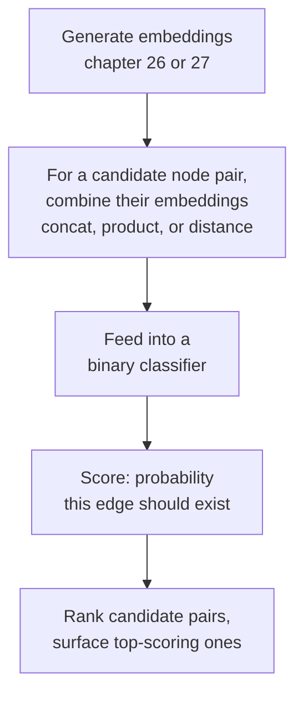

# 28 — Link Prediction and Recommendation

> Part V: Graph Machine Learning · Position 28 of 37 · ~10 min read

## Table

| # | Section | In this chapter |
|---|---|---|
| 1 | Introduction | The applied question everything in Part V has been building toward |
| 2 | Prerequisites | Chapters 26–27 |
| 3 | Core Concepts | Link prediction as binary classification over node pairs |
| 4 | Internal Architecture | Where embeddings feed into the classifier |
| 5 | Workflow | A link prediction pipeline, end to end |
| 6 | Syntax / Structure | A node-pair feature vector, conceptually |
| 7 | Code Examples | A minimal link-prediction scoring sketch |
| 8 | Use Cases | "People you may know," fraud ring expansion, knowledge graph completion |
| 9 | Performance Considerations | Why the negative-sampling choice matters enormously |
| 10 | Security Considerations | Link prediction can suggest sensitive connections |
| 11 | Best Practices | Sample negatives realistically, not randomly |
| 12 | Common Errors | Evaluating on randomly-sampled negatives that are trivially easy |
| 13 | Interview Questions | What you'll get asked, and how to answer well |
| 14 | Summary | A well-understood classification problem, wearing a graph costume |
| 15 | References & Further Reading | Where to go next |

## 1. Introduction

Predicting whether an edge should or will exist between two nodes is one of the most directly monetizable applications of everything covered in this Part — "people you may know," missing-data completion in knowledge graphs, and fraud ring expansion prediction (chapter 30) are all, structurally, the same underlying problem.

## 2. Prerequisites

Chapters 26 and 27 — link prediction typically consumes embeddings from one of those chapters as its input features.

## 3. Core Concepts

Link prediction is usually framed as **binary classification over node pairs**: given a pair of nodes, predict whether an edge should exist between them (or will, in a temporal setting). The features are typically derived from each node's embedding (chapter 26 or 27) — some combination (concatenation, elementwise product, or distance) of the two nodes' vectors becomes the input to a standard classifier.

## 4. Internal Architecture

The pipeline has two clearly separated stages: an **embedding stage** (chapter 26's random-walk methods or chapter 27's learned GNN aggregation) produces a vector per node, and a **prediction stage** takes a pair of these vectors, combines them into a single feature representation, and feeds that into a standard binary classifier (logistic regression, a small neural network, or similar) trained to predict edge existence.

## 5. Workflow



## 6. Syntax / Structure

A node-pair feature vector, conceptually: given embeddings `e_A` and `e_B` for nodes A and B, a common feature representation is their elementwise product `e_A * e_B`, or their concatenation `[e_A, e_B]` — either becomes the input row to a standard classifier.

## 7. Code Examples

```python
def pair_features(embeddings, node_a, node_b):
    e_a, e_b = embeddings[node_a], embeddings[node_b]
    return [a * b for a, b in zip(e_a, e_b)]  # elementwise product

# In practice: train a standard classifier (e.g. logistic regression)
# on labeled pairs — real edges as positives, sampled non-edges as
# negatives (section 9) — using pair_features() as the input.
```

## 8. Use Cases

"People you may know" and other friend/connection suggestions (chapter 32), missing-relationship completion in knowledge graphs (chapter 10), and fraud ring expansion — predicting which additional accounts are likely connected to a known bad actor, given the structural pattern of confirmed cases (chapter 30).

## 9. Performance Considerations

The single choice that matters most, and is most often done carelessly, is **negative sampling** — since real graphs have far more non-edges than edges, training and evaluation both need a strategy for selecting which non-existent pairs count as negative examples. Randomly sampling negatives from the entire space of non-edges produces mostly "obviously unrelated" pairs that are trivially easy to classify correctly, inflating reported accuracy without reflecting the model's real ability to distinguish genuinely plausible-but-nonexistent edges from real ones.

## 10. Security Considerations

Link prediction can surface genuinely sensitive suggested connections — inferring and displaying a "you may know" suggestion based on structural proximity can inadvertently reveal a relationship someone didn't intend to disclose (a shared connection through a support group, a workplace someone hasn't listed publicly). This deserves the same care as any other feature that infers private information from structure rather than from something the person explicitly shared.

## 11. Best Practices

- Sample negatives realistically — structurally plausible-but-nonexistent pairs (nodes with several shared neighbors that still aren't connected), not uniformly random pairs across the whole graph.
- Evaluate using metrics appropriate to a highly imbalanced classification problem (real edges are rare relative to all possible pairs), not raw accuracy.
- Consider the disclosure risk of any link-prediction-driven suggestion feature explicitly, not just its accuracy.

## 12. Common Errors

- **Evaluating link prediction using randomly-sampled negatives**, which inflates reported performance by making the task trivially easy — a genuinely common, easy-to-miss mistake in this space specifically.
- **Ignoring class imbalance** and reporting raw accuracy on a problem where "always predict no edge" would already score deceptively well.

## 13. Interview Questions

**"How would you frame link prediction as a machine learning problem?"**
Binary classification over node pairs, typically using combined node embeddings as features — the strongest answers immediately flag negative sampling as the part that needs the most care.

**"Why does negative sampling strategy matter so much for link prediction?"**
Randomly sampled negatives are usually trivially distinguishable from real edges, inflating reported performance without reflecting real-world difficulty — structurally plausible negatives give an honest evaluation.

## 14. Summary

Link prediction is a well-understood binary classification problem wearing a graph costume — embeddings in, a classifier over combined pairs, a score out. The part that actually separates a good implementation from a misleading one is negative sampling strategy, which decides whether the reported performance means anything close to what it claims to.

## 15. References & Further Reading

**Within this library**
- Chapter 26 — Graph Embeddings Fundamentals
- Chapter 27 — Graph Neural Networks Overview
- Chapter 30 — Fraud and Anomaly Detection Graphs
- Chapter 32 — Social and Recommendation Graphs
