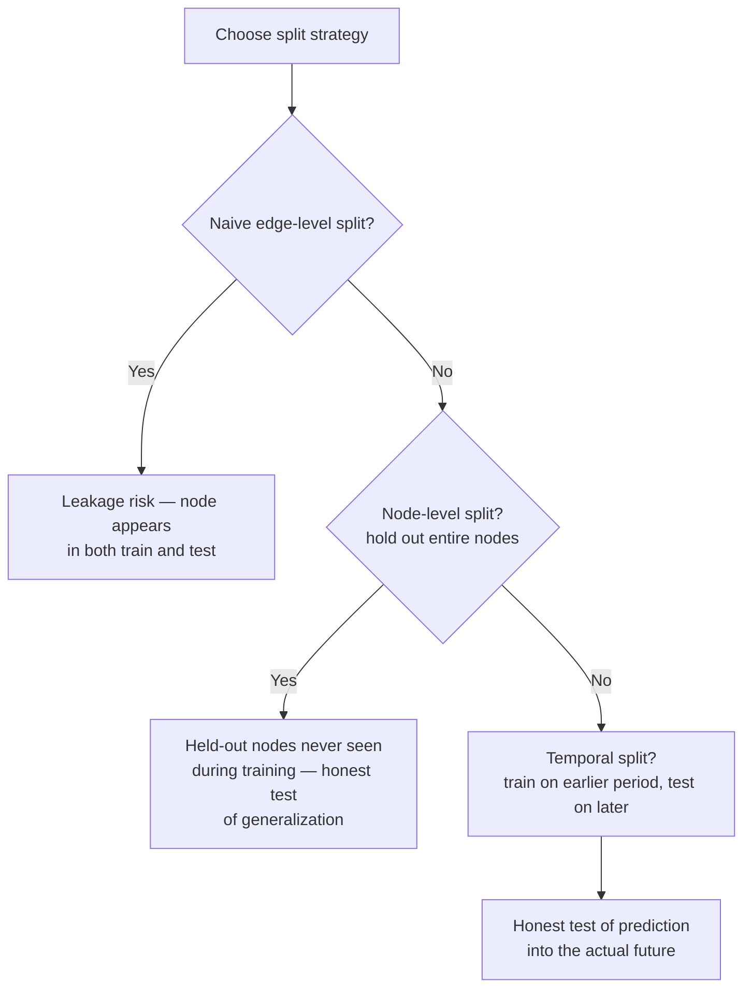

# 29 — Graph ML Pipeline Engineering

> Part V: Graph Machine Learning · Position 29 of 37 · ~11 min read

## Table

| # | Section | In this chapter |
|---|---|---|
| 1 | Introduction | The chapter that closes Part V by asking whether your evaluation was ever honest |
| 2 | Prerequisites | Chapters 26–28 |
| 3 | Core Concepts | Why graph data breaks the i.i.d. assumption most splitting relies on |
| 4 | Internal Architecture | How a naive edge split actually leaks information |
| 5 | Workflow | Building a leakage-safe evaluation |
| 6 | Syntax / Structure | Naive split vs. node/temporal split, compared |
| 7 | Code Examples | A node-level train/test split |
| 8 | Use Cases | Where this leakage risk bites hardest |
| 9 | Performance Considerations | Why a leaky evaluation reports numbers that don't survive production |
| 10 | Security Considerations | A model overfit via leakage can memorize sensitive structure |
| 11 | Best Practices | Split at the node or time level, not the edge level |
| 12 | Common Errors | The most common, least detected mistake in graph ML |
| 13 | Interview Questions | What you'll get asked, and how to answer well |
| 14 | Summary | The evaluation is only as trustworthy as the split it's built on |
| 15 | References & Further Reading | Where to go next |

## 1. Introduction

Every embedding and prediction technique in this Part is only as trustworthy as its evaluation. Graph data has a specific, genuinely tricky failure mode here — one common enough, and subtle enough, that it deserves its own chapter rather than a footnote.

## 2. Prerequisites

Chapters 26 through 28 — this chapter is about correctly evaluating everything those three chapters build.

## 3. Core Concepts

Most machine learning train/test splitting assumes examples are **independent and identically distributed (i.i.d.)** — training on some rows and testing on others is fair precisely because the rows don't inform each other. Graph data violates this assumption structurally: nodes are connected, so a **naive edge-level split** — randomly assigning individual edges to train or test — can put some of a node's edges in training and others in test, meaning the model has already effectively seen that node's neighborhood during training, even though a specific test edge was technically held out.

## 4. Internal Architecture

The leakage mechanism, concretely: if node X has ten edges, and a naive split puts eight in training and two in test, an embedding or GNN trained on the training set has already learned a representation for X informed by eight of its real neighbors. Evaluating on the two held-out edges then isn't really testing "can this model predict an unseen relationship" — it's testing "can this model recall a relationship for a node it already has substantial information about," a meaningfully easier and less honest question.

## 5. Workflow



## 6. Syntax / Structure

```
Naive edge split (leaky):
  Train: [A-B, A-C, D-E]
  Test:  [A-F]
  → Node A appears in both — the model already knows a lot about A

Node-level split (honest):
  Train nodes: [A, B, C]  → all of A, B, C's edges used for training
  Test nodes:  [D, E, F]  → D, E, F never appeared in training at all
```

## 7. Code Examples

```python
import random

def node_level_split(nodes, edges, test_fraction=0.2):
    test_nodes = set(random.sample(nodes, int(len(nodes) * test_fraction)))
    train_edges = [(a, b) for a, b in edges if a not in test_nodes and b not in test_nodes]
    test_edges = [(a, b) for a, b in edges if a in test_nodes and b in test_nodes]
    return train_edges, test_edges  # test_edges only connect nodes never seen in training
```

## 8. Use Cases

This leakage risk bites hardest anywhere a model's reported performance drives a real decision — publishing benchmark results, comparing architectures (chapter 27), or deciding whether a link-prediction model (chapter 28) is production-ready. A model that looks excellent under a leaky edge-level split can perform meaningfully worse in production, where it genuinely has to generalize to new nodes it's never encountered.

## 9. Performance Considerations

A leaky evaluation doesn't just overstate performance by a small margin — it can report numbers that simply don't survive contact with production, where new nodes (new users, new products, new accounts) genuinely have no training-time information behind them. This is directly the inductive-generalization concern from chapter 27, made concrete at the evaluation-methodology level.

## 10. Security Considerations

A model that's overfit via leakage hasn't just learned a misleadingly optimistic pattern — it may have effectively memorized specific structural details about specific nodes during "training," details that could be extractable from the model in ways connecting back to chapter 26's embedding re-identification risk, if the model or its embeddings are ever exposed, even indirectly, to a party who shouldn't have that structural information.

## 11. Best Practices

- Split at the **node level** (hold out entire nodes, not individual edges) or the **temporal level** (train on an earlier period, test on a later one) — never a naive random edge-level split for anything meant to estimate real-world generalization.
- Report which splitting strategy was used explicitly, alongside any performance numbers — this is a methodology detail that materially changes how trustworthy a number is.
- Re-validate periodically with fresh temporal splits as the graph evolves, rather than trusting a single historical evaluation indefinitely.

## 12. Common Errors

- **Using a naive random edge-level split**, the single most common and most under-detected mistake in graph ML evaluation — it's not obviously wrong the way a bug would be; it just quietly overstates performance.
- **Not distinguishing this from time-series leakage**, which it resembles but isn't identical to — graph leakage is about node non-independence, not necessarily about temporal ordering, though the two can compound in a temporal graph (chapter 12).

## 13. Interview Questions

**"Why can a naive random train/test split on graph edges overstate a model's real performance?"**
Because individual edges aren't independent — a node can appear in both training and test edges, meaning the model has effectively already seen part of that node's neighborhood before being "tested" on it.

**"How would you design a leakage-safe evaluation for a link prediction model?"**
Node-level or temporal splitting — holding out entire nodes never seen during training, or training on an earlier time period and testing on a later one.

## 14. Summary

Graph-structured data violates the independence assumption most train/test splitting quietly relies on, and a naive edge-level split can produce evaluation numbers that look excellent and mean very little. Node-level or temporal splitting is the honest alternative, and it's the single methodology detail most responsible for whether a graph ML evaluation can actually be trusted.

## 15. References & Further Reading

**Within this library**
- Chapter 26 — Graph Embeddings Fundamentals
- Chapter 27 — Graph Neural Networks Overview
- Chapter 28 — Link Prediction and Recommendation
- Chapter 12 — Temporal and Versioned Graphs
