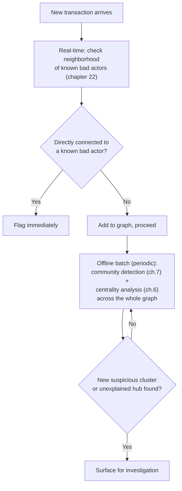
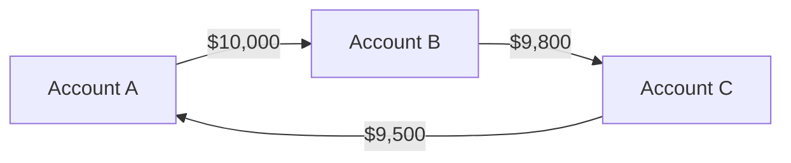

# 30 — Fraud and Anomaly Detection Graphs

> Part VI: Applied Systems & Production Wisdom · Position 30 of 37 · ~12 min read

## Table

| # | Section | In this chapter |
|---|---|---|
| 1 | Introduction | Where nearly every earlier chapter's warning becomes someone's actual defense |
| 2 | Prerequisites | Chapters 6, 7, 22, 28 |
| 3 | Core Concepts | Ring detection, and why fraud is often a cycle, not an outlier |
| 4 | Internal Architecture | Real-time plus batch, working together |
| 5 | Workflow | A fraud graph pipeline, end to end |
| 6 | Syntax / Structure | A laundering-ring pattern, visualized |
| 7 | Code Examples | A cycle-detection query for a known-suspect neighborhood |
| 8 | Use Cases | Money laundering, coordinated fake accounts, insurance fraud rings |
| 9 | Performance Considerations | Why this workload specifically needs both real-time and batch |
| 10 | Security Considerations | The fraud graph is itself a high-value target |
| 11 | Best Practices | Combine structural signal with centrality, don't rely on either alone |
| 12 | Common Errors | Treating every high-degree node as suspicious |
| 13 | Interview Questions | What you'll get asked, and how to answer well |
| 14 | Summary | Structure is the signal, here more than almost anywhere else |
| 15 | References & Further Reading | Where to go next |

## 1. Introduction

Fraud detection is where the field's theory most directly earns its keep: a transaction graph makes visible exactly the patterns — cycles, coordinated clusters, unusual centrality — that are invisible when you look at any single transaction row by row.

## 2. Prerequisites

Chapter 6's centrality measures, chapter 7's community detection, chapter 22's real-time updates, and chapter 28's link prediction all combine directly in a production fraud system.

## 3. Core Concepts

A classic money-laundering signature is a **cycle**: funds move A → B → C → back to A (or through a longer chain), disguising the origin through layering. This is invisible in a single transaction's data but immediately visible as a graph pattern — exactly the kind of structural signal that traversal (chapter 4) and cycle detection (chapter 4's DFS-based approach) exist to find. Beyond simple cycles, **unusually high centrality** (chapter 6) on an account that shouldn't structurally be a hub, and **coordinated clusters** found via community detection (chapter 7) that don't correspond to any legitimate business relationship, are both common fraud signals.

## 4. Internal Architecture

Production fraud systems typically combine two layers deliberately: a **real-time layer** (chapter 22) that checks a new transaction against the immediate neighborhood of known bad actors — fast, narrow, designed for low latency — and an **offline batch layer** (chapter 21's distributed processing) that runs community detection and centrality analysis across the whole graph periodically to surface previously unknown rings that no single real-time check would catch, since they only become visible in aggregate.

## 5. Workflow



## 6. Syntax / Structure



A cycle, with amounts shrinking slightly at each hop (a common layering pattern, fees or partial cash-out at each step) — visually obvious as a pattern, invisible in any single row.

## 7. Code Examples

```cypher
// Given a known bad actor, check for cycles within 4 hops —
// a real-time, narrow, low-latency check against their neighborhood
MATCH path = (bad:Account {flagged: true})-[:SENT_TO*1..4]->(bad)
RETURN path
```

The bounded depth here is deliberate — chapter 1 and chapter 24's unbounded-traversal warnings apply directly to any real-time fraud check.

## 8. Use Cases

Money laundering ring detection, coordinated fake account clusters (social platforms, review manipulation), insurance fraud rings (shared addresses, shared claim patterns forming an unusual cluster), and generally any domain where bad actors coordinate — coordination is a structural, graph-visible signal almost by definition.

## 9. Performance Considerations

This workload specifically needs both real-time and batch, because the two catch genuinely different things: real-time catches known bad actors' immediate expansion fast enough to block a transaction before it completes; batch catches structural patterns that only become visible in aggregate, days or weeks after individual transactions occurred, which real-time alone would never surface.

## 10. Security Considerations

A fraud detection graph is itself a high-value target: an attacker who understands how the system flags suspicious structure can deliberately design transaction patterns to stay just under the detection thresholds — spreading a ring across enough hops or enough accounts to avoid the bounded real-time check, or diluting centrality signal across many low-degree accounts instead of one obvious hub. Detection logic should be treated as sensitive, adversarially-targeted infrastructure, not just an internal analytics tool.

## 11. Best Practices

- Combine structural signal (cycles, community detection) with centrality analysis — relying on either alone misses patterns the other would catch.
- Keep real-time checks narrow and bounded (section 7), reserving broader pattern discovery for the batch layer.
- Treat detection thresholds and logic as sensitive, since a sophisticated bad actor may be actively probing for them.

## 12. Common Errors

- **Treating every high-degree node as suspicious** — legitimate hubs (large retailers, payment processors) are also naturally high-degree, and centrality alone, without additional context, produces significant false positives.
- **Relying only on real-time checks**, missing the slower, aggregate patterns that only batch community detection and centrality analysis can surface.

## 13. Interview Questions

**"How would you detect a money laundering ring using graph techniques?"**
Look for: cycle detection combined with centrality and community detection, run at both a real-time (narrow, bounded) and batch (broad, periodic) layer — not a single technique in isolation.

**"Why can't a high-degree node be treated as suspicious by itself?"**
Legitimate entities (large businesses, payment processors) are also naturally high-degree; centrality needs to be combined with other context to be a useful fraud signal rather than a source of false positives.

## 14. Summary

Fraud and anomaly detection is where this library's core thesis is most directly monetized: structure — cycles, clusters, unexplained centrality — carries signal that's invisible row by row and immediately visible as a graph pattern, and a production system needs both the fast, narrow real-time layer and the slower, broad batch layer to catch the full range of what bad actors actually do.

## 15. References & Further Reading

**Within this library**
- Chapter 6 — Centrality and Ranking Algorithms
- Chapter 7 — Community Detection and Clustering
- Chapter 22 — Real-Time Graph Updates at Scale
- Chapter 28 — Link Prediction and Recommendation
