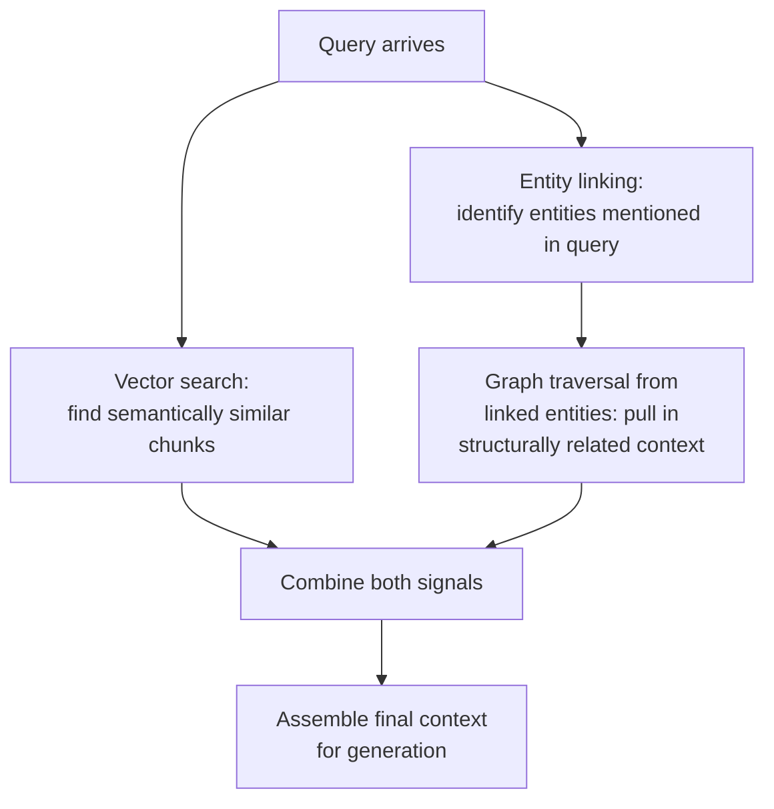

# 31 — Knowledge Graphs for Search and RAG

> Part VI: Applied Systems & Production Wisdom · Position 31 of 37 · ~11 min read

## Table

| # | Section | In this chapter |
|---|---|---|
| 1 | Introduction | Where this library connects most directly to retrieval-augmented systems |
| 2 | Prerequisites | Chapters 10, 26 |
| 3 | Core Concepts | Entity linking, and graph-augmented retrieval as a pattern |
| 4 | Internal Architecture | Where graph traversal fits alongside vector search |
| 5 | Workflow | A hybrid retrieval pipeline |
| 6 | Syntax / Structure | An entity-linked mention, notated |
| 7 | Code Examples | A minimal hybrid retrieval sketch |
| 8 | Use Cases | Where structural context genuinely improves retrieval |
| 9 | Performance Considerations | The added latency cost, and when it's worth paying |
| 10 | Security Considerations | Retrieval scope needs to respect access control, not just relevance |
| 11 | Best Practices | Use the graph to add context, not to replace vector search |
| 12 | Common Errors | Treating graph traversal as strictly better than vector similarity |
| 13 | Interview Questions | What you'll get asked, and how to answer well |
| 14 | Summary | Structure as a second retrieval signal, not a replacement for the first |
| 15 | References & Further Reading | Where to go next |

## 1. Introduction

Chapter 1 flagged this connection directly: knowledge graphs and RAG (retrieval-augmented generation) are one of this field's most active current intersections. Pure vector-similarity retrieval finds content that reads similarly; graph-augmented retrieval can additionally find content that's *structurally related* — connected through entities and relationships a pure similarity search would never surface.

## 2. Prerequisites

Chapter 10's RDF/knowledge graph modeling and chapter 26's embeddings — this chapter combines both with a retrieval system.

## 3. Core Concepts

**Entity linking** connects a mention in unstructured text ("the CEO of Acme") to a canonical entity node in a knowledge graph, disambiguating references and connecting free text to structured relationships. **Graph-augmented retrieval** then uses that link as a starting point: instead of relying purely on vector similarity to find related content, the system traverses the knowledge graph from linked entities to pull in structurally-related context — related people, related events, related documents — that a similarity search alone might miss because they don't happen to read similarly, even though they're genuinely relevant.

## 4. Internal Architecture

The two retrieval signals work at different levels: **vector search** (chapter 26's embedding-space similarity) finds content that's semantically similar in the sense of "reads about similar things." **Graph traversal** finds content that's *structurally connected*, regardless of whether it reads similarly — a document mentioning a company's subsidiary might be highly relevant to a query about that company, despite low text-similarity to the query itself, because a graph traversal from the company entity would surface it directly.

## 5. Workflow



## 6. Syntax / Structure

An entity-linked mention: the text span "the CEO of Acme" links to a canonical node `(company:Company {name:'Acme'})-[:HAS_CEO]->(person:Person)`, letting a downstream traversal step start from that specific person or company node rather than from unstructured text alone.

## 7. Code Examples

```python
def hybrid_retrieve(query, vector_index, graph):
    vector_hits = vector_index.search(query, top_k=10)
    linked_entities = entity_link(query, graph)  # chapter 10's modeling
    graph_context = []
    for entity in linked_entities:
        graph_context.extend(graph.get_neighbors(entity, max_hops=2))  # bounded — chapter 1
    return combine_and_rank(vector_hits, graph_context)
```

The bounded-hop traversal is deliberate — the same unbounded-traversal discipline from chapters 1 and 24 applies directly to any retrieval-time graph walk.

## 8. Use Cases

Structural context genuinely improves retrieval where relevant information is connected through relationships rather than shared vocabulary — organizational knowledge (who reports to whom, which teams own which systems), product/documentation graphs (related features, dependencies), and any domain where "this is relevant because it's connected to X" is a real, distinct signal from "this reads similarly to the query."

## 9. Performance Considerations

Graph traversal adds real latency on top of vector search — an additional retrieval step, not a free enhancement. This cost is worth paying specifically when structural relevance is common in the domain and when the added context measurably improves generation quality; it's not worth paying as a default addition to every retrieval pipeline regardless of whether the domain actually has meaningful relationship structure to exploit.

## 10. Security Considerations

Any graph traversal used for retrieval needs to respect the same access-control boundaries as the underlying documents — pulling in "structurally related" content from a knowledge graph must not bypass permissions that would have blocked direct access to that content, extending chapter 10's open-world-assumption warning directly into a retrieval context, where "reachable via traversal" must never be silently treated as "authorized to retrieve."

## 11. Best Practices

- Use graph traversal to *add* structural context alongside vector search, not to replace it — the two signals catch genuinely different kinds of relevance.
- Bound traversal depth and breadth explicitly at retrieval time, the same discipline as any other production graph query (chapters 1, 24).
- Enforce access control at the graph-traversal step itself, not only at the final document-serving step.

## 12. Common Errors

- **Treating graph traversal as strictly better than vector similarity** and over-relying on it — structural connection doesn't always mean semantic relevance, and pure structural traversal without a relevance filter can pull in a lot of true-but-unhelpful context.
- **Letting retrieval-time traversal bypass access control** that would have applied to direct document access.

## 13. Interview Questions

**"How does graph-augmented retrieval differ from pure vector-similarity retrieval?"**
Vector search finds content that reads similarly; graph traversal finds content that's structurally connected through entities and relationships, which can surface genuinely relevant material that doesn't share vocabulary with the query.

**"What's a risk specific to using graph traversal in a retrieval pipeline?"**
Unbounded or access-control-bypassing traversal — both need the same bounded-depth, permission-aware discipline as any other production graph query.

## 14. Summary

Graph-augmented retrieval adds a genuinely distinct relevance signal — structural connection — alongside vector similarity, and earns its added latency specifically in domains where relationships carry real meaning beyond shared vocabulary. It's an addition to a retrieval pipeline, not a replacement, and it inherits every discipline this library has emphasized about bounded, access-aware graph traversal.

## 15. References & Further Reading

**Within this library**
- Chapter 10 — RDF and Knowledge Graph Modeling
- Chapter 26 — Graph Embeddings Fundamentals
- Chapter 24 — Query Performance and Debugging
