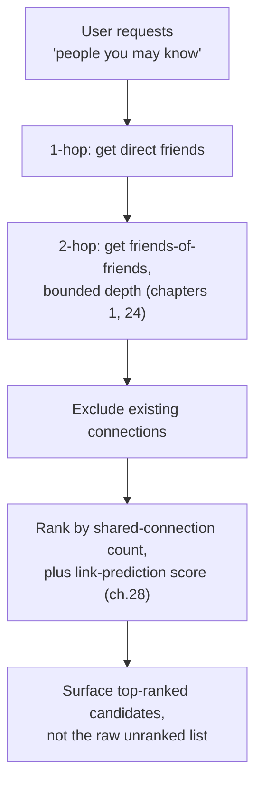

# 32 — Social and Recommendation Graphs

> Part VI: Applied Systems & Production Wisdom · Position 32 of 37 · ~10 min read

## Table

| # | Section | In this chapter |
|---|---|---|
| 1 | Introduction | The application everyone recognizes, built entirely from earlier chapters |
| 2 | Prerequisites | Chapters 4, 19, 28 |
| 3 | Core Concepts | Friend-of-friend traversal and feed-ranking graph signals |
| 4 | Internal Architecture | Why 2-hop traversal is exactly where supernodes bite hardest |
| 5 | Workflow | A "people you may know" pipeline |
| 6 | Syntax / Structure | A 2-hop friend-of-friend pattern |
| 7 | Code Examples | A bounded, ranked friend-of-friend query |
| 8 | Use Cases | Connection suggestions, feed ranking, content distribution |
| 9 | Performance Considerations | Why this is one of the most supernode-sensitive workloads in the field |
| 10 | Security Considerations | Suggestion features can leak relationships people didn't intend to share |
| 11 | Best Practices | Rank, don't just enumerate |
| 12 | Common Errors | Unranked, unbounded friend-of-friend expansion |
| 13 | Interview Questions | What you'll get asked, and how to answer well |
| 14 | Summary | The most familiar graph application, and one of the least forgiving at scale |
| 15 | References & Further Reading | Where to go next |

## 1. Introduction

"People you may know" and algorithmic feeds are the graph applications most people have actually used, even if they've never thought of them as graph problems. They're also, structurally, a direct composition of nearly everything covered so far: traversal, the supernode problem, and link prediction, applied to real user-facing product surfaces.

## 2. Prerequisites

Chapter 4's traversal, chapter 19's supernode problem, and chapter 28's link prediction — this chapter is largely those three, applied.

## 3. Core Concepts

**Friend-of-friend traversal** — a 2-hop walk from a user, filtered to exclude existing connections — is the structural core of most "people you may know" features. **Feed ranking** incorporates graph signals (the engagement graph between users and content: likes, shares, comments as edges) alongside other, non-graph ML features to decide what content to surface and in what order.

## 4. Internal Architecture

A 2-hop friend-of-friend query is exactly the operation chapter 19's supernode problem hits hardest: if any of a user's direct friends happens to be a high-degree hub, the second hop from that one friend alone can dwarf the second hop from every other friend combined, dominating both the traversal cost and, without careful ranking, the raw candidate list — a single well-connected friend can flood "people you may know" with candidates who have little else in common with the user besides both knowing that one hub.

## 5. Workflow



## 6. Syntax / Structure

```cypher
MATCH (user:Person {id: $id})-[:FRIEND]->(f:Person)-[:FRIEND]->(fof:Person)
WHERE NOT (user)-[:FRIEND]->(fof) AND fof <> user
RETURN fof, count(f) AS shared_connections
ORDER BY shared_connections DESC
LIMIT 20
```

The `count(f)` and `ORDER BY` are doing the real work here — without ranking, a single hub friend can dominate the raw result set (section 4).

## 7. Code Examples

```cypher
// Bounded, ranked, and limited — the three disciplines this chapter
// borrows directly from chapters 1, 19, and 24
MATCH (user:Person {id: $id})-[:FRIEND]->(f:Person)-[:FRIEND]->(fof:Person)
WHERE NOT (user)-[:FRIEND]->(fof) AND fof <> user
WITH fof, count(f) AS shared_connections
ORDER BY shared_connections DESC
LIMIT 20
RETURN fof, shared_connections
```

## 8. Use Cases

Connection/friend suggestions, algorithmic feed ranking, and content distribution more broadly — deciding which of a user's connections' activity to surface, weighted partly by relationship strength (shared connections, interaction frequency) as a graph-derived signal.

## 9. Performance Considerations

This is one of the more supernode-sensitive workloads in the field specifically because it's a **default 2-hop traversal from every active user, continuously** — not a rare analytical query, but a core, high-volume, latency-sensitive product feature. Any user with even one highly-connected friend routes straight into chapter 19's worst-case scenario, at real product scale, constantly.

## 10. Security Considerations

Suggestion features built on graph traversal can leak relationships someone didn't intend to make visible — surfacing "you may know X" based on a structural connection through, for example, a shared support group or a workplace someone hasn't publicly listed, can inadvertently disclose an association the person would have preferred to keep private. This deserves explicit product and privacy review, not just an engineering performance review.

## 11. Best Practices

- Always rank and limit friend-of-friend results — never surface a raw, unbounded candidate list (section 6's query pattern).
- Explicitly test this workload against realistic degree distributions (chapter 25), since it's specifically exposed to supernode risk on nearly every request.
- Review suggestion features for unintended relationship disclosure as a distinct concern from performance.

## 12. Common Errors

- **Running unranked, unbounded friend-of-friend expansion** — a query that works fine in testing against a small, uniform test graph and then degrades badly the first time it hits a real user with a well-connected friend.
- **Treating this as a rare analytical query** rather than the high-volume, latency-sensitive, continuously-run product feature it actually is.

## 13. Interview Questions

**"Why is 'people you may know' a particularly supernode-sensitive feature?"**
It's a default 2-hop traversal run continuously for every active user; any user with even one highly-connected friend routes directly into the supernode worst case, at real product scale and volume.

**"How would you prevent a single well-connected friend from dominating a friend-of-friend suggestion list?"**
Rank by shared-connection count (and ideally a link-prediction score) rather than surfacing the raw candidate list, and bound the traversal depth and result size explicitly.

## 14. Summary

Social and recommendation graphs are the most familiar graph application most people encounter, and also one of the least forgiving at scale — a default, continuous 2-hop traversal that runs straight into chapter 19's supernode problem on nearly every real user, unless ranking and bounding are treated as required, not optional.

## 15. References & Further Reading

**Within this library**
- Chapter 4 — Traversal Algorithms
- Chapter 19 — The Supernode Problem
- Chapter 28 — Link Prediction and Recommendation
