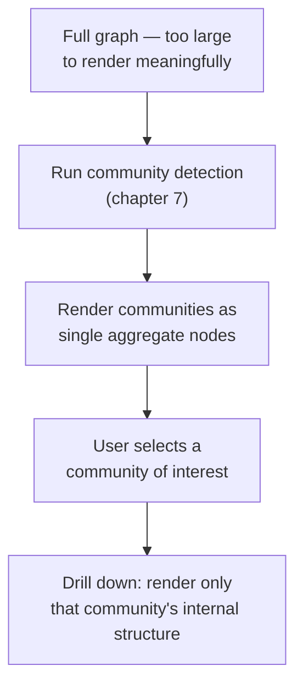
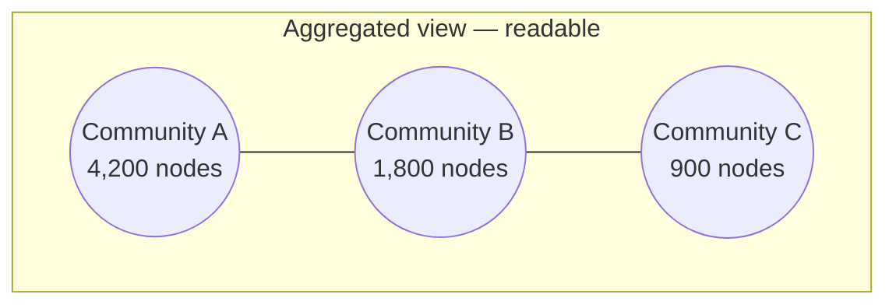

# 33 — Graph Visualization at Scale

> Part VI: Applied Systems & Production Wisdom · Position 33 of 37 · ~10 min read

## Table

| # | Section | In this chapter |
|---|---|---|
| 1 | Introduction | Rendering was never the bottleneck — perception is |
| 2 | Prerequisites | Chapter 7 |
| 3 | Core Concepts | The hairball problem, defined precisely |
| 4 | Internal Architecture | Why force-directed layout specifically breaks down at scale |
| 5 | Workflow | Aggregate, then drill down |
| 6 | Syntax / Structure | A hairball vs. an aggregated view |
| 7 | Code Examples | Visualizing communities instead of raw nodes |
| 8 | Use Cases | Where each visualization strategy fits |
| 9 | Performance Considerations | Why a faster renderer doesn't fix this |
| 10 | Security Considerations | A full-graph view can itself be a disclosure risk |
| 11 | Best Practices | Default to aggregated or filtered views |
| 12 | Common Errors | Reaching for a "better" layout algorithm instead of aggregation |
| 13 | Interview Questions | What you'll get asked, and how to answer well |
| 14 | Summary | Understanding at scale comes from metrics, not pictures |
| 15 | References & Further Reading | Where to go next |

## 1. Introduction

Chapter 1 flagged this as a misconception worth naming early: visualizing the graph is not the same as understanding it. This chapter explains precisely why — and it's not a rendering limitation. Modern hardware renders millions of points and lines without breaking a sweat. The limitation is human visual perception, which has no such hardware upgrade available.

## 2. Prerequisites

Chapter 7's community detection — the main practical fix in this chapter is built directly on it.

## 3. Core Concepts

The **hairball problem**: past a certain node and edge density — often just a few thousand nodes, well short of "big data" scale — a force-directed layout stops conveying structure and becomes a visually undifferentiated tangle. This isn't a fuzzy aesthetic complaint; it's a measurable consequence of edge crossings and overlaps growing far faster than a viewer's ability to visually trace individual paths through them.

## 4. Internal Architecture

A force-directed layout works by simulating physics: nodes repel each other like charged particles, edges act like springs pulling connected nodes together, and the simulation iterates until it settles into a stable configuration. This produces genuinely readable layouts for small, sparse graphs. The problem is that **edge crossings scale roughly with density**, and a dense or even moderately large graph accumulates far more visual crossings than a viewer can perceptually disentangle — the simulation converges to a "correct" physical layout well before it converges to a *readable* one, because the algorithm is optimizing spring/repulsion energy, not human legibility.

## 5. Workflow



## 6. Syntax / Structure



The raw graph behind this — thousands of individually rendered nodes and their edges — would be visually unreadable at this scale; the aggregated view compresses it into something a person can actually reason about.

## 7. Code Examples

```python
def prepare_aggregated_view(graph, communities):
    """communities: output of chapter 7's community detection.
    Render one node per community, sized by member count, edges
    weighted by the number of cross-community connections — not
    the raw underlying graph."""
    agg_nodes = {c: len(members) for c, members in communities.items()}
    agg_edges = count_cross_community_edges(graph, communities)
    return agg_nodes, agg_edges
```

## 8. Use Cases

Aggregated views fit executive dashboards and general health overviews. Filtered subgraph views (showing only the neighborhood relevant to a specific investigation) fit debugging and fraud investigation tooling (chapter 30). Full raw-graph rendering fits almost nothing at real production scale — it's usually only appropriate for genuinely small graphs, demos, or the smallest drilled-down view after aggregation has already narrowed the scope.

## 9. Performance Considerations

It's worth being precise about what actually limits this, because the common instinct — reach for a faster rendering engine or GPU acceleration — doesn't address the real bottleneck. Rendering a hundred thousand points and lines is computationally trivial for modern hardware. What doesn't scale is a human viewer's ability to visually trace structure through that many overlapping elements, and no rendering optimization changes that fixed perceptual limit.

## 10. Security Considerations

A "view the whole graph" feature, if broadly accessible, can itself be an information-disclosure risk — the aggregate shape and scale of a graph, or the existence of a large community around a particular entity, can reveal sensitive structural information even without exposing individual node identities, extending chapter 6 and chapter 7's structural-privacy warnings into the visualization layer specifically. Full-graph visualization access deserves the same scoping consideration as any other broad structural query.

## 11. Best Practices

- Default to aggregated (community-level) or filtered (scoped subgraph) views; treat raw full-graph rendering as an edge case, not the default.
- Use metrics and dashboards (chapter 35) for whole-graph health monitoring instead of relying on visual inspection at scale.
- Scope visualization access with the same care as any other broad structural query, given the disclosure risk in section 10.

## 12. Common Errors

- **Reaching for a "better" or faster layout algorithm** to fix a hairball, when the actual fix is aggregation or filtering — the problem is perceptual density, not algorithmic quality.
- **Treating a beautiful small-graph demo as evidence the same approach will scale** to a real production graph two or three orders of magnitude larger.

## 13. Interview Questions

**"Why doesn't a faster rendering engine fix a hairball visualization?"**
The bottleneck is human perceptual capacity to trace structure through overlapping elements, not rendering throughput — a fundamentally different kind of limit than computational performance.

**"How would you make a 100,000-node graph visually understandable?"**
Aggregate via community detection (chapter 7) into a much smaller number of summary nodes, and offer drill-down into individual communities on demand, rather than attempting to render the whole thing at once.

## 14. Summary

Past a fairly modest scale, visualization stops being a way to understand a graph and starts being decorative — the constraint is human perception, not rendering hardware, and no amount of layout-algorithm improvement changes that. Aggregation and filtered drill-down, not raw rendering, is what makes a large graph visually legible at all; metrics and dashboards, not pictures, are what actually convey whole-graph understanding at real scale.

## 15. References & Further Reading

**Within this library**
- Chapter 1 — What Is Graph Engineering?
- Chapter 7 — Community Detection and Clustering
- Chapter 35 — Monitoring and Observability for Graph Systems
