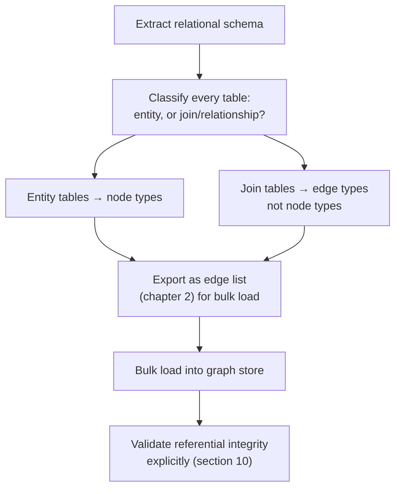

# 34 — Migration and ETL into Graphs

> Part VI: Applied Systems & Production Wisdom · Position 34 of 37 · ~11 min read

## Table

| # | Section | In this chapter |
|---|---|---|
| 1 | Introduction | Migration reveals which relational tables were secretly already graphs |
| 2 | Prerequisites | Chapter 9 |
| 3 | Core Concepts | The two heuristics that decide most of a migration |
| 4 | Internal Architecture | Bulk loading vs. row-by-row transactional inserts |
| 5 | Workflow | A migration pipeline, end to end |
| 6 | Syntax / Structure | A relational schema mapped to a graph schema |
| 7 | Code Examples | A join table becoming an edge-creation load |
| 8 | Use Cases | Why teams actually migrate |
| 9 | Performance Considerations | Why bulk load beats transactional insert for this |
| 10 | Security Considerations | Referential integrity was free — now it isn't |
| 11 | Best Practices | Classify every table before mapping anything |
| 12 | Common Errors | Translating every table 1:1, join tables included |
| 13 | Interview Questions | What you'll get asked, and how to answer well |
| 14 | Summary | One classification decision, most of the migration's quality |
| 15 | References & Further Reading | Where to go next |

## 1. Introduction

Migrating from a relational schema to a graph is, in large part, an exercise in recognizing which of your relational tables were already secretly modeling relationships rather than entities — and which of them were entities all along.

## 2. Prerequisites

Chapter 9's verb-vs-noun modeling discipline — migration is essentially that same discipline, applied retroactively to an existing schema instead of a new one.

## 3. Core Concepts

Two heuristics decide most of a migration's quality:

- **Foreign keys become edges.** A column referencing another table's primary key is, structurally, exactly what an edge is for.
- **Many-to-many join tables become edges directly — not nodes.** A join table's entire purpose was to represent a relationship the relational model couldn't express any other way; in a graph, that relationship can finally be expressed directly as an edge, and the join table itself typically shouldn't survive the migration as its own node type.

| Relational element | Graph element |
|---|---|
| Entity table (e.g., `users`, `products`) | Node type |
| Foreign key column | Edge |
| Many-to-many join table | Edge type (not a node) |

## 4. Internal Architecture

Mechanically, migration usually means extracting data as an **edge list** (chapter 2) — the natural shape for bulk export — rather than attempting row-by-row transactional inserts through the application layer. This matters enormously for the reason covered in section 9: bulk loading is built for exactly this access pattern, and transactional insert overhead compounds badly across millions of rows.

## 5. Workflow



## 6. Syntax / Structure

```
Relational:
  users(id, name)
  companies(id, name)
  employments(user_id, company_id, since)   <- a join table

Graph:
  (User)-[:EMPLOYED_AT {since}]->(Company)   <- the join table becomes the edge
```

## 7. Code Examples

```sql
-- Relational join table
SELECT user_id, company_id, since FROM employments;
```

```cypher
// Bulk-loaded directly as edges, not as an intermediate node type
LOAD CSV WITH HEADERS FROM 'file:///employments.csv' AS row
MATCH (u:User {id: row.user_id}), (c:Company {id: row.company_id})
CREATE (u)-[:EMPLOYED_AT {since: row.since}]->(c)
```

## 8. Use Cases

Teams migrate when deep-join query patterns (chapter 1's original trigger) start dominating their workload, when they're adding fraud, social, or recommendation features (Part VI) on top of an existing relational core, or when a knowledge graph initiative starts from an existing relational master-data store as its source of truth.

## 9. Performance Considerations

Bulk loading via an edge list format substantially outperforms row-by-row transactional inserts for an initial migration — transactional overhead (chapter 18's ACID guarantees) is valuable for live application traffic, but is mostly unnecessary ceremony for a one-time bulk load where the whole operation can be validated and, if needed, redone as a unit rather than requiring per-row transactional safety.

## 10. Security Considerations

A relational database's foreign key constraints enforce referential integrity automatically and for free — an insert referencing a nonexistent parent row simply fails. Once migrated to a graph, nothing enforces this automatically unless it's deliberately reimplemented: a migration script or subsequent application code can create an edge referencing a node that doesn't exist, or that's since been deleted, producing a "dangling edge" with no built-in mechanism catching it. This is a genuine, easy-to-miss integrity gap, not merely a style difference between the two models.

## 11. Best Practices

- Classify every relational table explicitly as "entity" or "join/relationship" before mapping anything — this single decision determines whether the migration reproduces chapter 9's core modeling discipline or violates it from the start.
- Bulk-load via edge list format for the initial migration rather than transactional row-by-row inserts.
- Explicitly re-implement referential integrity validation post-migration, on a recurring schedule, since it's no longer automatic.

## 12. Common Errors

- **Translating every relational table 1:1 into a node type**, including join tables — reproducing chapter 9's core anti-pattern (relationships modeled as awkward extra nodes) straight from the relational side of the migration.
- **Not validating referential integrity after migration**, allowing dangling edges to accumulate silently, sometimes for months, before a downstream query or audit surfaces the problem.

## 13. Interview Questions

**"How would you decide whether a relational table should become a node type or an edge type when migrating to a graph?"**
Look for the join-table heuristic specifically: if a table's only purpose was representing a many-to-many relationship, it should become an edge type, not a node.

**"What's lost when you migrate away from foreign-key constraints, and how do you compensate?"**
Automatic referential integrity enforcement — compensated for with explicit, deliberate validation logic and recurring integrity checks, since nothing does this automatically in most graph systems.

## 14. Summary

Most of a migration's quality comes down to one classification decision, applied consistently: is this relational table an entity, or was it secretly already representing a relationship? Getting that right reproduces chapter 9's modeling discipline; getting it wrong reproduces its core anti-pattern, permanently baked into the new schema from day one.

## 15. References & Further Reading

**Within this library**
- Chapter 2 — Graph Fundamentals and Representations
- Chapter 9 — Property Graph Modeling
- Chapter 18 — ACID and Consistency in Graph Systems
