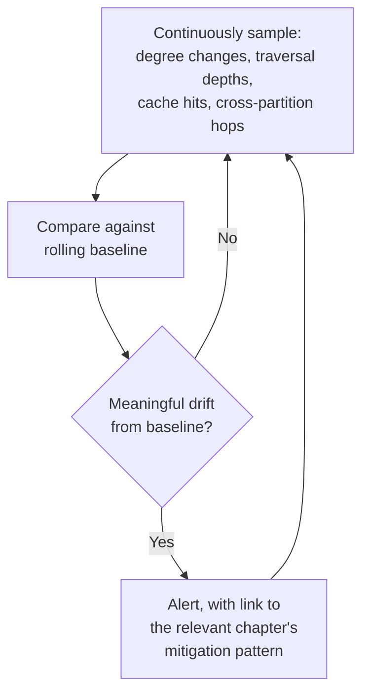

# 35 — Monitoring and Observability for Graph Systems

> Part VI: Applied Systems & Production Wisdom · Position 35 of 37 · ~11 min read

## Table

| # | Section | In this chapter |
|---|---|---|
| 1 | Introduction | Generic dashboards miss almost everything this library has warned about |
| 2 | Prerequisites | Chapters 19, 23, 24, 25 |
| 3 | Core Concepts | The four metrics that matter specifically because the data is graph-shaped |
| 4 | Internal Architecture | Sampling, not exhaustive computation, for continuous metrics |
| 5 | Workflow | A monitoring-and-alerting pipeline |
| 6 | Syntax / Structure | Metric → signal → chapter mapping |
| 7 | Code Examples | Sampling degree distribution continuously |
| 8 | Use Cases | Catching each failure mode before it's an incident |
| 9 | Performance Considerations | Monitoring granularity is itself a tradeoff |
| 10 | Security Considerations | Observability data is structural data — scope it accordingly |
| 11 | Best Practices | Alert on drift, not just absolute thresholds |
| 12 | Common Errors | Monitoring only generic database metrics |
| 13 | Interview Questions | What you'll get asked, and how to answer well |
| 14 | Summary | This library's failure modes, made visible before they're incidents |
| 15 | References & Further Reading | Where to go next |

## 1. Introduction

Standard database monitoring — latency, throughput, error rate — is necessary and nowhere near sufficient here. Nearly every failure mode this library has covered (an emerging supernode, traversal depth creep, a cache invalidation storm) is invisible in a generic dashboard until it's already an incident. This chapter is about making those specific failure modes observable ahead of time.

## 2. Prerequisites

Chapters 19, 23, 24, and 25 — each metric in this chapter exists specifically to catch a failure mode one of those chapters already described.

## 3. Core Concepts

Four metrics matter specifically because the underlying data is graph-shaped, beyond whatever generic database monitoring already covers:

| Metric | What it signals | Related chapter |
|---|---|---|
| **Degree distribution drift** | A new supernode may be emerging | 19, 25 |
| **Traversal depth distribution** | Live queries creeping toward unbounded, DoS-relevant territory | 1, 4, 24 |
| **Cache hit rate (node-level)** | Whether caching strategy is still matched to actual update frequency | 22, 23 |
| **Cross-partition hop rate** | Whether locality is degrading in a partitioned system | 20 |

## 4. Internal Architecture

Computing these exhaustively on every write would itself become a meaningful performance burden — the same tension chapter 6 faced with exact betweenness centrality at scale. The standard approach is **sampling**: track degree distribution and traversal depth from a representative sample of writes and queries rather than every single one, trading a small amount of measurement precision for a large reduction in monitoring overhead.

## 5. Workflow



## 6. Syntax / Structure

The table in section 3 is this chapter's core reference — each metric maps directly to a specific, previously-covered failure mode and its corresponding fix, rather than requiring new diagnostic work at alert time.

## 7. Code Examples

```python
import random

def sample_degree_update(node_id, new_degree, sample_rate=0.01, baseline=None):
    """Sampling-based tracking, not exhaustive computation on every write —
    chapter 6's betweenness-approximation logic, applied to monitoring."""
    if random.random() > sample_rate:
        return
    if baseline and new_degree > baseline.get(node_id, 0) * 10:
        alert(f"Node {node_id} degree grew 10x past baseline — possible emerging supernode (ch.19)")
```

## 8. Use Cases

Catching an emerging supernode (chapter 19) before it causes a traversal-cost incident; catching traversal depth creep (chapters 1, 4, 24) before an internal convenience becomes an external DoS vector (chapter 36's postmortem patterns); catching cache hit rate degradation (chapter 23) before an invalidation storm coincides with peak load.

## 9. Performance Considerations

Monitoring granularity is itself a tradeoff, not a free good: exhaustive, on-every-write metric computation adds real overhead to the exact hot paths you're trying to protect, while overly sparse sampling can miss a fast-emerging problem until it's already significant. The right sample rate is a deliberate choice, revisited periodically, not a default left unexamined.

## 10. Security Considerations

Observability data about a graph is, itself, structural data — degree distributions, traversal patterns, and partition topology can leak the same kind of sensitive structural information chapters 6, 7, and 33 already flagged as risky to expose broadly. Monitoring dashboards and alerting data deserve the same access scoping as any other view into the graph's structure, not blanket access for anyone with general observability tooling permissions.

## 11. Best Practices

- Alert on **distributional drift** — is the shape of degree distribution, traversal depth, or cache behavior changing — rather than only on fixed absolute thresholds that can become meaningless as the graph grows.
- Feed monitoring data back into capacity planning and benchmarking (chapter 25) on a recurring basis, not as a one-time exercise disconnected from ongoing operations.
- Scope access to structural monitoring data deliberately (section 10).

## 12. Common Errors

- **Monitoring only generic database metrics** — latency, throughput, error rate — and missing every graph-specific failure mode this library has covered, discovering them instead via an incident.
- **Alerting on fixed absolute thresholds** that made sense at launch but become meaningless (either too sensitive or not sensitive enough) as the graph grows by orders of magnitude.

## 13. Interview Questions

**"What metrics would you monitor specifically for a graph database that you wouldn't necessarily prioritize for a relational one?"**
Degree distribution drift, traversal depth distribution, and cache invalidation blast radius — metrics tied to graph-specific failure modes, not just generic latency and throughput.

**"How would you detect an emerging supernode before it causes an incident?"**
Continuous, sampled tracking of degree distribution against a rolling baseline, alerting on meaningful relative drift rather than waiting for an absolute, possibly-stale threshold.

## 14. Summary

This chapter is, in effect, a checklist of this library's own failure modes made observable ahead of time — degree drift for chapter 19's supernodes, traversal depth for chapter 1 and 24's unbounded queries, cache hit rate for chapter 23's invalidation risk, cross-partition rate for chapter 20's locality concerns. Generic database monitoring alone will miss all four.

## 15. References & Further Reading

**Within this library**
- Chapter 19 — The Supernode Problem
- Chapter 23 — Caching Strategies for Graph Queries
- Chapter 24 — Query Performance and Debugging
- Chapter 25 — Capacity Planning and Benchmarking
