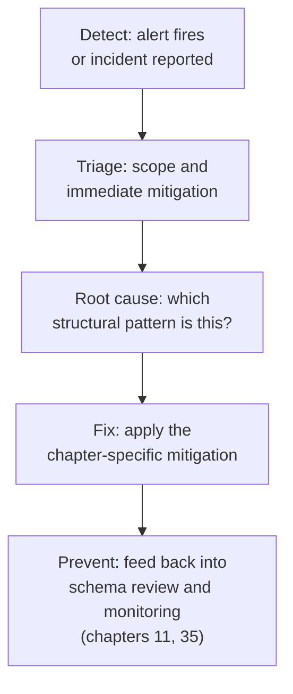
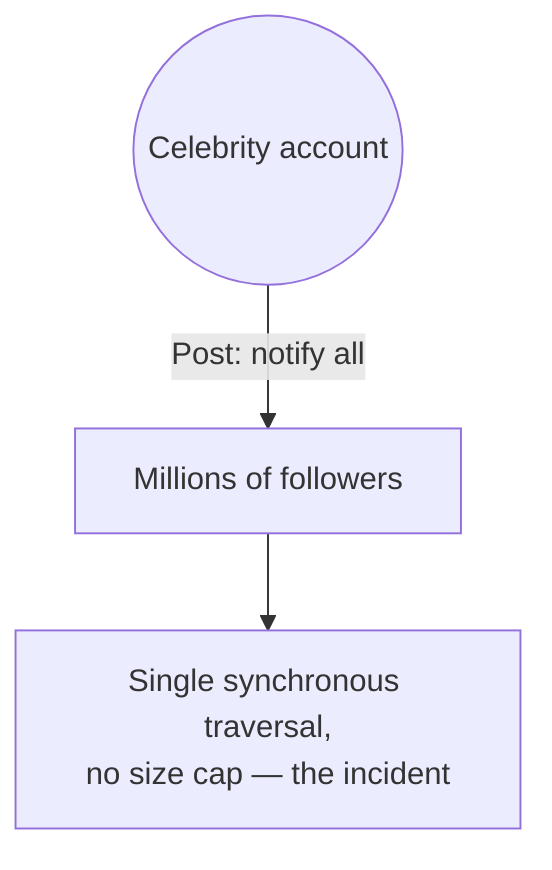

# 36 — Common Production Incidents and Postmortems

> Part VI: Applied Systems & Production Wisdom · Position 36 of 37 · ~13 min read

**A note before this chapter starts:** every incident below is a **composite, illustrative pattern**, synthesized from failure modes that are well-documented and widely recurring across this field generally. None of them describes a specific real company, a specific real event, or a verified account of anything that actually happened anywhere in particular. They're written this way deliberately — the value here is in the pattern repeating across many different real organizations, not in any single attributed case.

## Table

| # | Section | In this chapter |
|---|---|---|
| 1 | Introduction | Why this library ends with failure, not success |
| 2 | Prerequisites | Essentially everything so far |
| 3 | Core Concepts | The standard postmortem structure used throughout |
| 4 | Internal Architecture | Why these patterns recur — structure, not carelessness |
| 5 | Workflow | The generic postmortem flow |
| 6 | Syntax / Structure | Pattern one, visualized |
| 7 | Code Examples | Where each pattern's fix already lives in this library |
| 8 | Use Cases | Using these patterns as your own review checklist |
| 9 | Performance Considerations | Why these four repeat industry-wide |
| 10 | Security Considerations | The pattern that's a security incident, not just a performance one |
| 11 | Best Practices | Blameless review, fed back into schema and monitoring |
| 12 | Common Errors | Treating each incident as a unique surprise |
| 13 | Interview Questions | What you'll get asked, and how to answer well |
| 14 | Summary | Four patterns, and this whole library's worth of prevention |
| 15 | References & Further Reading | Where to go next |

## 1. Introduction

Every earlier chapter in this library has been building toward this one, in a specific sense: this is where the abstract warnings — unbounded traversal, supernodes, silent integrity loss, cache invalidation blast radius — become the four composite patterns that, across the field broadly, account for a disproportionate share of real graph-system incidents.

## 2. Prerequisites

This chapter draws on nearly everything covered so far; each pattern below names the specific earlier chapters it depends on.

## 3. Core Concepts

Every pattern below follows the same structure a real postmortem should: **situation** (what was happening), **root cause** (the actual structural reason, not just the trigger), **what helped** (the concrete fix), and **which chapter** already covered the prevention.

## 4. Internal Architecture

Worth naming directly: these patterns recur across many different organizations not because the teams involved were careless, but because they're **structural consequences of this field's core mechanics** — index-free adjacency's assumptions about relationship-list size (chapter 15), degree distributions that are skewed rather than uniform in essentially every real-world graph (chapter 25), and the fact that caching and referential integrity, both handled automatically in more familiar systems, require deliberate reimplementation here (chapters 23, 34). A blameless postmortem culture matters specifically because these are predictable, structural failure modes — the honest response is fixing the structural gap, not finding who to blame for not anticipating it.

## 5. Workflow

## 6. Syntax / Structure

**Pattern one — the celebrity-account supernode cascade**

*Situation:* a "notify all your connections" feature ran a direct, synchronous traversal from a posting account to every direct connection, unbounded, on every post. This worked fine at typical account sizes. Once some accounts reached very high follower counts, that single-hop traversal alone became enormous.

*Root cause:* the schema never applied fan-out mitigation (chapter 19) for known or emerging high-degree accounts, and the traversal had no size cap.

*What helped:* retroactive fan-out for known high-degree accounts, an explicit cap on synchronous traversal size, and moving large-account notification into an asynchronous, batched background process rather than the synchronous request path.

*Chapter:* 19.

## 7. Code Examples

**Pattern two — the internal tool that became an external DoS vector**

*Situation:* an internal support tool exposed a flexible query interface using an unbounded variable-length path pattern for investigative flexibility. A later, more limited customer-facing "explore your network" feature was built on the same underlying query, inheriting the unbounded pattern.

*Root cause:* the unbounded pattern (chapter 1, chapter 24's anti-pattern) was tolerable against trusted internal use and a moderate test dataset, and became a severe resource-exhaustion risk once adapted for a much larger, less trusted audience.

*What helped:* the depth cap and query-cost estimation pattern from chapter 24, applied retroactively, plus a policy that any internal debugging convenience gets re-hardened, not just reused, before external exposure.

*Chapter:* 1, 24. The exact fix — bounding the pattern with `*1..3` instead of an unbounded `*` — is the same snippet shown in chapter 24, section 7.

**Pattern three — the silent migration integrity gap**

*Situation:* a relational-to-graph migration (chapter 34) correctly mapped foreign keys to edges, but neither the migration script nor the application layer reimplemented the referential-integrity enforcement the relational database's foreign key constraints had provided automatically.

*Root cause:* referential integrity had been implicit and free in the relational system; migrating away from it silently removed that guarantee, and no one explicitly decided whether or how to replace it.

*What helped:* a sweep query auditing for dangling edges, a scheduled recurring integrity-check job, and explicit application-level enforcement added to every delete path.

*Chapter:* 34.

**Pattern four — the cache storm on an ordinary day**

*Situation:* a single, moderately-high-degree node received a routine update during a period of otherwise-normal peak traffic. Because whole-query-result caching (chapter 23's anti-pattern) was in use, that one update invalidated a large number of cached results simultaneously, all recomputed at once against the live store.

*Root cause:* whole-result caching produced an invalidation blast radius far larger and less predictable than node-level caching would have, and no one had explicitly load-tested an invalidation event landing during peak traffic.

*What helped:* migrating hot paths to node-level caching (chapter 23's fix), and adding invalidation-storm scenarios explicitly to the load-testing plan (chapter 25).

*Chapter:* 23, 25.

## 8. Use Cases

Use these four patterns as a review checklist against your own systems, not as historical trivia: has anything in your schema created an uncapped fan-out risk (pattern one)? Has an internal convenience been reused externally without re-hardening (pattern two)? Did a migration silently drop an integrity guarantee (pattern three)? Is caching granularity matched to actual update frequency and blast radius (pattern four)?

## 9. Performance Considerations

These four patterns repeat across the industry broadly for the same reason chapter 25 named directly: synthetic testing environments routinely fail to reproduce the skewed degree distributions and realistic load conditions that actually trigger them. A system can pass every test built on a uniform-random graph and still be fully exposed to all four patterns in production.

## 10. Security Considerations

Pattern two is worth calling out specifically as a security incident, not just a performance one — an unbounded query pattern exposed externally is a genuine denial-of-service vulnerability, and treating it purely as a performance bug misses that it should go through the same severity classification and response process as any other externally-exploitable resource-exhaustion issue.

## 11. Best Practices

- Run blameless postmortems specifically because these are structural, predictable patterns, not individual lapses — the useful output is a structural fix, not an assignment of fault.
- Feed every incident's lesson back into schema review (chapter 11) and ongoing monitoring (chapter 35), closing the loop rather than treating each incident as isolated.
- Use the four patterns above as a proactive review checklist (section 8), not only as a reference for after something has already gone wrong.

## 12. Common Errors

- **Treating each incident as a unique, unpredictable surprise** rather than recognizing it as one of a small number of recurring structural patterns — this is precisely the mindset a reference library like this one exists to prevent.
- **Fixing the symptom without fixing the structural gap** — adding a one-off cache, for instance, without addressing why whole-result caching was chosen in the first place.

## 13. Interview Questions

**"Walk me through a time a graph system failed in production and what you learned."**
An extremely common real question at this level. A strong answer names the specific structural pattern (not just "it was slow"), the root cause, the fix, and — critically — what changed afterward to prevent a recurrence, not just that specific incident.

**"What's the most common root cause of graph-system production incidents you'd watch for first?"**
A strong answer leads with unbounded traversal or supernode-related cascades specifically, since both are common, well-documented, and largely preventable with the disciplines covered in chapters 1, 19, and 24.

## 14. Summary

Four patterns — supernode cascade, unbounded-traversal exposure, silent integrity loss, cache invalidation storm — account for a disproportionate share of real graph-system incidents across the field broadly, and every one of them was already covered, with its fix, earlier in this library. That's the actual point of ending here: these aren't surprises if you've internalized what came before.

## 15. References & Further Reading

**Within this library**
- Chapter 1 — What Is Graph Engineering?
- Chapter 11 — Graph Schema Design Patterns
- Chapter 19 — The Supernode Problem
- Chapter 23 — Caching Strategies for Graph Queries
- Chapter 24 — Query Performance and Debugging
- Chapter 25 — Capacity Planning and Benchmarking
- Chapter 34 — Migration and ETL into Graphs
- Chapter 35 — Monitoring and Observability for Graph Systems
