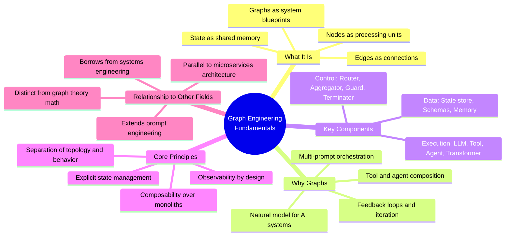
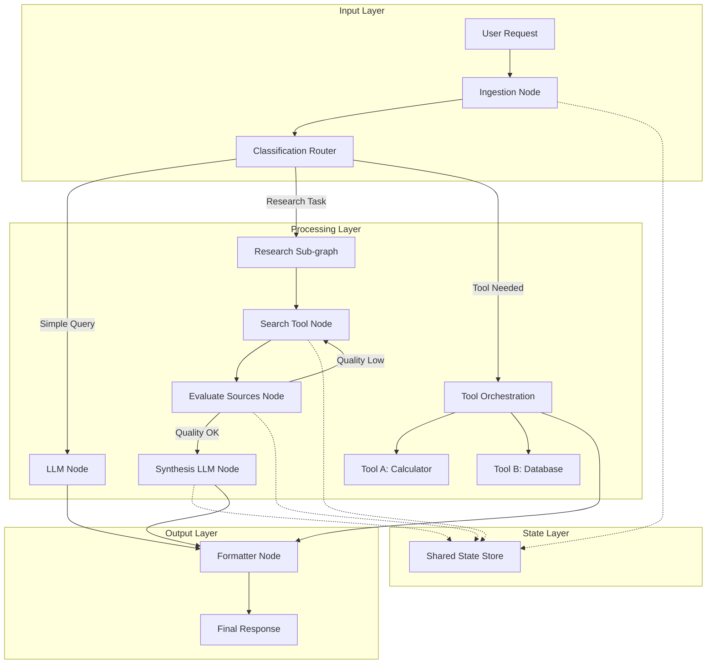
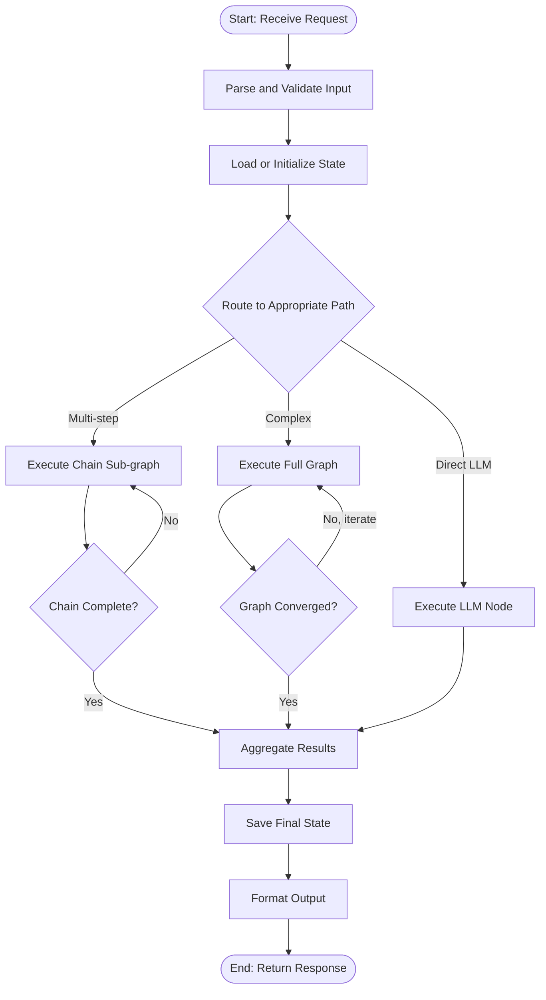
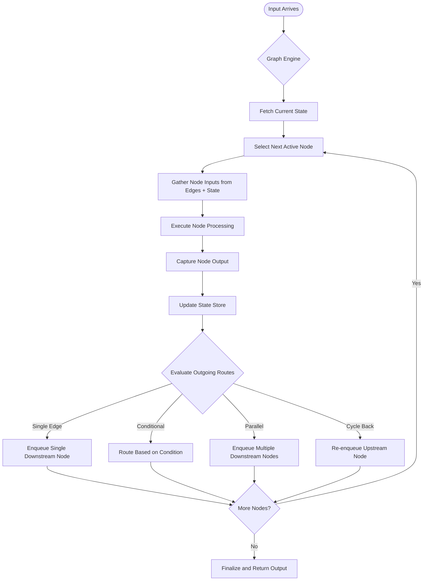
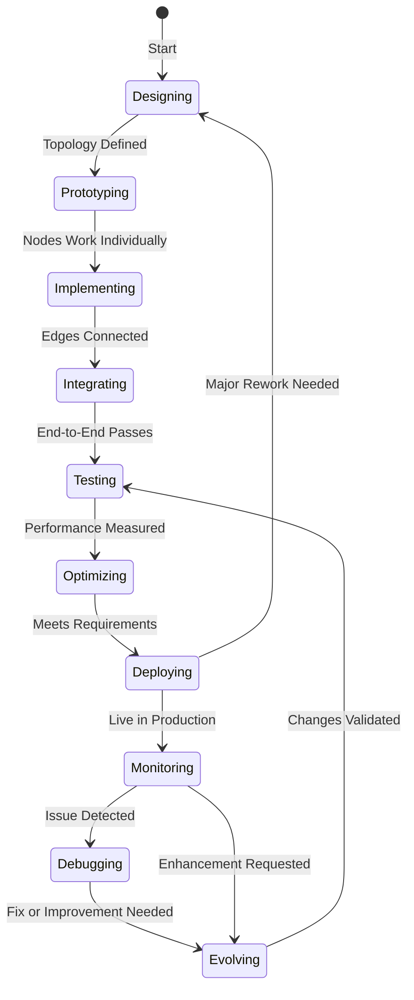
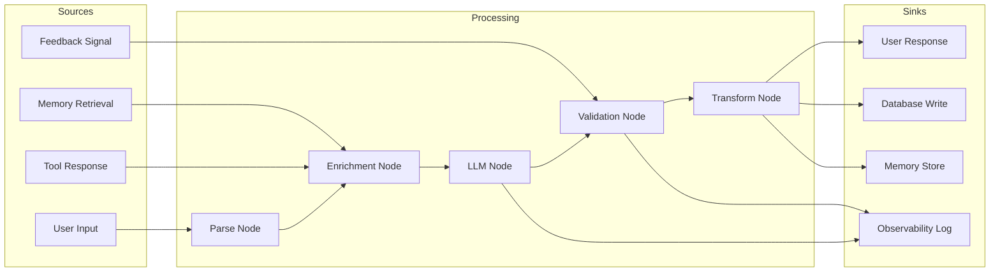
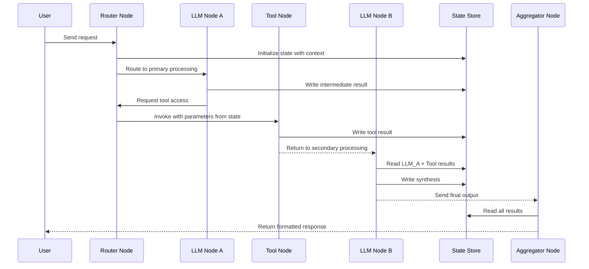

# Graph Engineering Fundamentals

## 📌 Overview

Graph Engineering is an emerging discipline within AI system design that treats prompts, context, memory, tools, and agents as interconnected nodes and edges in a directed graph rather than isolated, linear instruction chains. Where traditional prompt engineering focuses on crafting a single optimal prompt to elicit a desired response from a language model, Graph Engineering zooms out to consider the entire ecosystem of how those prompts connect, how data flows between processing stages, how tools and agents compose into larger workflows, and how state persists and transforms across interactions. This paradigm shift recognizes that real-world AI applications rarely consist of a single prompt-response pair and instead involve multiple LLM calls, tool invocations, decision branches, feedback loops, and memory systems that must all work together in concert.

The field draws inspiration from workflow orchestration, systems engineering, and service-oriented architecture, but it is fundamentally practical rather than mathematical. A Graph Engineer designs the topology of an AI system the way a systems architect designs a microservices network: considering throughput, redundancy, bottleneck identification, and emergent behavior that arises from component interactions. The goal is to create AI systems that are modular, debuggable, composable, and scalable. As covered in 03_Core_Concepts.md, the foundational vocabulary of nodes, edges, state, and flows provides the shared language that makes this possible across teams and frameworks.

Graph Engineering is not about graph theory algorithms like Dijkstra's shortest path or PageRank. Instead, it is about using graph structures as an architectural metaphor and practical design tool for building complex AI applications. The graph is a blueprint, not an equation. It describes how components connect and communicate, not how to compute optimal routes through a network. This distinction is critical because it keeps the discipline grounded in practical engineering concerns rather than abstract mathematics, making it accessible to practitioners with backgrounds in software engineering, product design, and AI application development rather than requiring advanced mathematical training.

## 🎯 Learning Objectives

After studying this document, you will be able to articulate what Graph Engineering is and how it differs from traditional prompt engineering and software architecture. You will understand why graph-based thinking provides a natural and powerful model for designing AI systems that involve multiple prompts, tools, agents, and decision points. You will be able to identify the key components of a graph-based AI system—nodes, edges, state, and flows—and explain how they interact to produce system behavior. You will recognize when a graph-based approach is appropriate for a given AI task and when simpler patterns suffice. You will also gain the conceptual foundation needed to explore the historical evolution of the field in 02_History_and_Evolution.md and the detailed vocabulary in 03_Core_Concepts.md.

Additionally, you will develop the ability to map real-world AI workflows onto graph structures, identifying natural nodes (processing steps, tool calls, agent decisions) and edges (data dependencies, control flow, conditional transitions). You will understand the relationship between graph topology and system properties like reliability, debuggability, and scalability. Finally, you will be prepared to evaluate graph-based AI frameworks and tools from an informed perspective, understanding what problems they solve and what trade-offs they embody.

## 🧠 Definition

Graph Engineering is the discipline of designing, building, and maintaining AI systems by modeling their components as nodes in a directed graph and their interactions as edges, with explicit management of state, data flows, and control flows throughout the system. A node in this context represents any discrete processing unit: a prompt template, an LLM call, a tool invocation, an agent decision, a data transformation, a validation check, or a sub-graph that encapsulates a reusable workflow. An edge represents any directed relationship between nodes: data passing from one node's output to another's input, a conditional branch decision, a loop-back for iterative refinement, or a parallel dispatch to multiple downstream nodes.

The definition encompasses both the structural aspect (designing the graph topology) and the behavioral aspect (defining how nodes execute, how state is managed, and how data flows through the graph at runtime). It is a holistic approach that considers the entire system rather than individual components in isolation. Graph Engineering also includes the operational concerns of monitoring graph execution, debugging failures that span multiple nodes, optimizing performance by identifying bottlenecks and parallelization opportunities, and evolving the graph structure as requirements change. In this sense, it is closer to systems engineering or platform engineering than to traditional software development, because it focuses on the relationships and interactions between components as much as on the components themselves.

## ❓ Why It Matters

Graph Engineering matters because the complexity of real-world AI tasks has outgrown the capabilities of single-prompt and linear-chain approaches. As organizations move beyond simple chatbots and into sophisticated AI applications—autonomous research assistants, multi-agent coding systems, complex data processing pipelines, adaptive customer service platforms—the systems they build involve dozens or hundreds of interconnected processing steps. Managing this complexity without a structured architectural approach leads to fragile, unmaintainable systems that are difficult to debug, impossible to scale, and risky to modify. Graph Engineering provides that structured approach, giving practitioners a shared vocabulary, proven patterns, and practical tools for taming complexity.

The discipline also matters because it enables a critical shift in how teams think about AI systems: from "prompt + model = output" to "graph topology + node implementations + state management = system behavior." This shift has profound practical implications. It means that improving an AI system is no longer just about crafting a better prompt; it can also involve restructuring the graph topology, adding feedback loops, introducing parallel processing, or improving state management. Each of these levers operates at a different level of abstraction and addresses different types of problems. A team that only knows how to optimize prompts is severely limited compared to a team that can also optimize graph structure, data flows, and state management strategies.

Furthermore, Graph Engineering matters because it creates a common language for interdisciplinary collaboration. When a product manager, a prompt engineer, a software developer, and a reliability engineer all look at the same graph diagram, they can discuss system behavior, identify problems, and propose solutions using a shared visual and conceptual framework. This shared language dramatically reduces miscommunication and accelerates iteration, which is essential in the fast-moving field of AI application development.

## 🏛️ Core Concepts

The foundational concepts of Graph Engineering can be organized into three categories: structural elements, behavioral elements, and system-level properties. The structural elements define the shape of the graph: **nodes** are the processing units, **edges** are the connections between them, and **sub-graphs** are encapsulated groups of nodes and edges that function as a single unit within a larger graph. These structural elements are static—they define what the system looks like before any execution begins. Understanding them is prerequisite to understanding how the system behaves at runtime.

The behavioral elements define how the graph operates: **state** is the shared data that persists across node executions, **flows** are the patterns of data and control movement through the graph, **cycles** are loop-back edges that enable iterative processing, and **routing logic** is the decision-making mechanism that determines which edges are followed at runtime. These behavioral elements are dynamic—they define what happens when the graph is executed. The interplay between structural and behavioral elements is where much of the complexity and power of Graph Engineering resides.

The system-level properties emerge from the combination of structural and behavioral elements: **composability** is the ability to combine graphs into larger systems, **decomposability** is the ability to break complex graphs into manageable sub-graphs, **observability** is the ability to understand what is happening inside the graph during execution, and **evolvability** is the ability to modify the graph structure without breaking existing behavior. These properties are not implemented by any single component but emerge from good design practices across the entire graph. Together, these three categories of concepts form the complete conceptual framework of Graph Engineering.

## 🧩 Key Components

The key components of a graph-based AI system can be divided into execution components, data components, and control components. **Execution components** include LLM nodes (which make model API calls), tool nodes (which invoke external services or APIs), agent nodes (which encapsulate autonomous decision-making logic), and transformer nodes (which perform deterministic data transformations like parsing, formatting, or validation). Each execution component has a well-defined interface: it receives input, performs processing, and produces output. This interface consistency is what enables flexible graph composition—you can swap one LLM node for another, or replace a tool node with a mock for testing, without affecting the rest of the graph.

**Data components** include the state store (a shared, mutable data structure that persists across node executions), input/output schemas (which define the shape of data flowing through edges), and memory systems (which provide long-term persistence across graph invocations). The state store is perhaps the most critical data component, because it is the mechanism by which nodes that are not directly connected can still share information. For example, in a research graph, a search node might write results to the state store, and a synthesis node might read those results from the state store even though there is no direct edge between them. This decoupling of data flow from control flow is a powerful pattern that enables more flexible graph topologies.

**Control components** include routers (which direct flow based on conditions), aggregators (which combine results from parallel branches), guards (which validate data and prevent invalid flow), and terminators (which determine when cycles should stop iterating). These control components are what transform a static graph structure into a dynamic, responsive system. Without them, a graph would be a fixed pipeline; with them, it becomes an adaptive system that can respond to varying inputs, handle errors gracefully, and optimize its own execution path based on intermediate results.

## 🧭 Mental Model

The most useful mental model for Graph Engineering is to think of it as designing a city's transportation network. Each intersection is a node—places where processing happens, decisions are made, or directions change. Each road is an edge—a path that data travels along to get from one node to another. The traffic on the roads is the data flowing through the system. The traffic signals and routing rules are the control components that determine which roads are open and when. The parking lots and depots are the state stores where vehicles (data) wait between trips. And the overall network topology—the pattern of intersections and roads—determines the system's capacity, resilience, and efficiency.

Just as a city planner must consider how adding a new intersection affects traffic throughout the network, a Graph Engineer must consider how adding a new node affects data flows and state throughout the graph. Just as a city has main arteries (high-throughput chains), residential streets (specialized branches), and roundabouts (cycles), a graph-based AI system has critical paths that must never be blocked, specialized processing branches for different input types, and iterative refinement loops that cycle until a quality threshold is met. And just as a good city plan includes clear signage (observability), redundant routes (fault tolerance), and room for growth (evolvability), a good graph design includes logging at every node, alternative paths for error recovery, and modular sub-graphs that can be extended without modifying the core topology.

This mental model also highlights an important principle: the value of the network is in its connections, not just its nodes. A city with many isolated buildings and no roads between them is useless, no matter how impressive each building is. Similarly, a collection of brilliant prompts with no well-designed edges connecting them cannot produce sophisticated system behavior. The graph topology—the pattern of connections—is where the engineering happens, and it is the primary leverage point for improving system capabilities.

## 🗺️ Mind Map

## 🏗️ Architecture Diagram

## 🔄 Workflow

## ⚙️ Internal Working

The internal working of a graph-based AI system can be understood as a three-phase process: initialization, execution, and finalization. During **initialization**, the system receives the incoming request, parses it into a structured format, and initializes the shared state store with any default values or context from previous interactions. The state store is typically implemented as a dictionary or typed object that provides scoped access—nodes can read from and write to specific keys in the state, and the graph execution engine ensures that state mutations are visible to downstream nodes. This initialization phase also determines the entry point into the graph, which may be fixed or determined by a preliminary routing node.

During **execution**, the graph engine traverses the graph according to the defined edges and routing logic. At each node, the engine performs several steps: it gathers the node's inputs (from incoming edges and/or the state store), invokes the node's processing function (which may be an LLM call, a tool invocation, or a deterministic transformation), captures the node's outputs, writes relevant outputs to the state store, and determines which outgoing edges to follow based on the routing logic associated with those edges. This process repeats for each node in the execution path, with the engine maintaining a record of which nodes have been visited, what data flowed through each edge, and the current state of the state store. For cyclic graphs, the engine also tracks iteration counts and convergence conditions to prevent infinite loops.

During **finalization**, the engine collects the final outputs from the terminal nodes, performs any post-processing (formatting, filtering, validation), persists relevant state to long-term memory if needed, and returns the final response to the user. The engine also generates execution traces—logs that record the complete path through the graph, the inputs and outputs of each node, and the state mutations at each step—which are essential for debugging and optimization. The execution trace is the graph engineer's primary tool for understanding what happened during a graph execution and why.

## 🔀 Execution Flow

## 📊 Lifecycle

## 📡 Data Flow

## 🤝 Interaction Flow

## 🌍 Real-World Analogy

Consider a professional kitchen in a high-end restaurant. The head chef (Graph Engineer) doesn't just write one recipe (one prompt) and expect a single cook (one LLM call) to produce the entire multi-course meal. Instead, the kitchen is organized as a graph of specialized stations: the prep station (data ingestion), the sauce station (context enrichment), the grill station (primary processing), the pastry station (specialized processing), the expeditor (routing and aggregation), and the plating station (output formatting). Each station is a node with a specific role, and the connections between stations—the edges—define how partially completed dishes flow through the kitchen.

Some dishes follow a linear path (appetizer: prep to grill to plate), while others branch (main course: prep splits to grill for protein and sauce station for sauce, then reconverges at plating). Some dishes involve cycles (a sauce that needs to be tasted, adjusted, tasted again—iterating until the flavor is right). The kitchen's shared workspace—the state store—holds ingredients, partially completed components, and the order tickets that keep everything coordinated. The head chef's role is to design this graph of stations and flows, ensure that the state store is properly managed, and adjust the topology when a new menu item requires a different processing path. This is Graph Engineering in a culinary context, and it captures the essential ideas: specialized nodes, directed edges, shared state, cycles for refinement, and topology design as the primary engineering activity.

## 💡 Practical Example

Imagine building an AI-powered code review assistant. A naive approach would use a single prompt: "Review this code and suggest improvements." But a graph-engineered approach decomposes the task into a specialized graph. The first node receives the code diff and classifies it by language and complexity. A router then directs the flow: simple changes go through a lightweight review path, while complex changes enter a thorough review graph. The thorough path includes parallel branches—one branch runs static analysis tools, another generates test suggestions, and a third checks for security vulnerabilities. All three branches write their findings to a shared state store.

An aggregator node then reads all findings from the state store and passes them to a synthesis LLM node that prioritizes the issues and generates a coherent review narrative. A validation node checks that the review is constructive and actionable, and if it's not, the synthesis node re-executes with adjusted parameters (a feedback cycle). Finally, a formatter node structures the review into categories (critical, warning, suggestion) and delivers it to the developer. This graph-based system produces dramatically better code reviews than a single prompt because each node can be optimized independently, the parallel branches reduce latency, the shared state enables cross-cutting analysis, and the feedback cycle ensures quality. Modifying the system—adding a new analysis type, changing the routing logic, or adjusting the synthesis parameters—means modifying specific nodes or edges without disrupting the entire system, which is exactly the modularity that Graph Engineering aims to provide.

## 🧪 Use Cases

Graph Engineering applies to a wide range of AI application domains. **Multi-agent research systems** use graph topologies to coordinate multiple specialized agents—a search agent, an analysis agent, a synthesis agent, and a fact-checking agent—connected by edges that define how research findings flow between them. These systems often include cycles where the fact-checking agent can send problematic findings back to the search agent for additional research. **Customer support platforms** use tree-structured graphs to classify incoming queries and route them to specialized handling sub-graphs, with escalation paths that form upward branches when initial handling is insufficient. The graph structure makes it straightforward to add new query types or handling paths without modifying existing ones.

**Software development assistants** use complex cyclic graphs that interleave code generation, testing, and refinement. A code generation node produces initial code, a testing node runs the tests, and if tests fail, a diagnosis node analyzes the failure and feeds information back to the code generation node for another attempt. This cycle continues until all tests pass or a maximum iteration count is reached. **Content pipeline systems** use directed acyclic graphs (DAGs) to orchestrate multi-stage content creation: research, outlining, drafting, editing, fact-checking, SEO optimization, and publishing. Each stage is a node, and the edges define the dependency order. **Data processing systems** use parallel graph structures to process large datasets through multiple transformation stages concurrently, with aggregation nodes combining results. In each of these use cases, the graph structure provides a natural and powerful way to model the system's behavior, and the graph engineering discipline provides the tools and patterns needed to design, implement, and maintain these systems effectively.

## ⚖️ Comparison

| Aspect | Traditional Prompt Engineering | Graph Engineering |
|--------|-------------------------------|--------------------|
| **Unit of Design** | Single prompt | Graph of connected nodes |
| **Scope** | One LLM interaction | Entire AI system |
| **State Management** | Implicit in prompt context | Explicit, shared state store |
| **Control Flow** | None (single call) | Rich: sequential, branching, cyclic, parallel |
| **Composability** | Limited (prompt chaining) | Native (sub-graphs, shared interfaces) |
| **Debuggability** | Examine one prompt-response pair | Trace full execution path through graph |
| **Tool Integration** | External to the prompt | First-class nodes in the graph |
| **Agent Coordination** | Not addressed | Explicit agent nodes with defined edges |
| **Scalability** | Limited by context window | Limited by graph topology and state design |
| **When to Use** | Simple, single-step tasks | Multi-step, multi-tool, multi-agent systems |
| **Complexity** | Low | Medium to High |
| **Learning Curve** | Gentle | Moderate, requires systems thinking |

## ✅ Best Practices

The single most important best practice in Graph Engineering is to start simple and add complexity only when needed. Begin with a chain (a linear graph) and only introduce branching when you have a concrete need for conditional routing. Introduce cycles only when you have a concrete need for iterative refinement. Introduce parallel paths only when you have a concrete need for concurrent processing. Each additional structural element—branches, cycles, parallel edges—increases the cognitive load of understanding the system, the difficulty of debugging, and the surface area for potential failures. The best graph designs are the simplest ones that meet the requirements, not the most impressive ones.

A second critical practice is to maintain a clear separation between graph topology and node implementation. The graph definition (which nodes exist, how they are connected, what the routing logic is) should be independent of the node implementations (what each node actually does when it executes). This separation allows you to modify the graph's routing logic without touching node code, swap node implementations without changing the graph structure, and test nodes in isolation by providing mock inputs. Most mature graph frameworks enforce this separation through distinct APIs for graph definition and node registration.

A third essential practice is to design for observability from the start. Every node should log its inputs, outputs, and execution duration. Every edge should be traceable so you can see what data flowed and where. The state store should be snapshotted at key points so you can inspect how state evolved during execution. This observability infrastructure is not a luxury—it is a necessity. Without it, debugging a graph-based system is like debugging a distributed system without logs: technically possible but practically miserable. Invest in observability early and you will save enormous amounts of time when the inevitable bugs appear.

## ❌ Common Mistakes

The most common mistake in Graph Engineering is creating overly complex graph topologies for problems that don't require them. Enthusiastic practitioners, excited by the power of graph-based design, sometimes build elaborate graphs with multiple branches, parallel paths, and feedback loops for tasks that could be handled by a simple chain or even a single prompt. This over-engineering introduces unnecessary complexity, makes the system harder to debug, increases latency due to framework overhead, and makes it difficult for new team members to understand the system. The antidote is ruthless simplicity: if removing a node or edge doesn't degrade system behavior, it shouldn't be there.

A second common mistake is poor state management. Because the state store is shared across all nodes, it can become a dumping ground for unstructured data, making it impossible to understand what information is available at any point in the graph. This leads to nodes reading stale data, overwriting each other's values, or failing silently because expected state keys are missing. The solution is to treat the state store with the same rigor as a database schema: define what keys exist, what types they hold, which nodes write to them, and which nodes read from them. Some frameworks support typed state schemas that enforce these constraints at runtime.

A third mistake is neglecting cycle termination conditions. Cycles are powerful but dangerous: without proper termination conditions, a cycle can loop indefinitely, consuming tokens, time, and money. Every cycle must have a maximum iteration count, a convergence criterion, or both. Additionally, the data that flows through the cycle must change on each iteration—if the same data flows through the same nodes repeatedly, the cycle will never converge. Design cycles carefully, test their termination behavior under edge cases, and monitor their iteration counts in production to catch regressions early.

## 🚀 Advanced Topics

For practitioners who have mastered the fundamentals, several advanced topics extend the power of Graph Engineering significantly. **Dynamic graph topology** is the practice of constructing or modifying the graph structure at runtime based on the input or intermediate results. Instead of a fixed graph that handles all inputs the same way, a dynamic graph can add or remove nodes, change edge connections, or even generate entirely new sub-graphs based on what it has learned during execution. This is the frontier of the field and is closely related to the concept of self-organizing AI systems.

**Hierarchical graph composition** is the practice of nesting graphs within graphs, where a node in one graph is itself a complete graph at a lower level of abstraction. This enables fractal-like system designs where each level of the hierarchy addresses a different level of concern. For example, a top-level graph might handle request routing, with each routing target being a sub-graph that handles a specific task type, and within each task sub-graph, there might be further sub-graphs for specific processing steps. Hierarchical composition is essential for managing complexity in large-scale AI systems and is a key differentiator between novice and expert graph engineers.

**Graph-level optimization** goes beyond optimizing individual nodes to optimize the graph as a whole. This includes identifying and eliminating bottlenecks (nodes that take disproportionately long to execute), introducing caching (storing node outputs so that identical inputs produce instant results without re-execution), and strategic parallelization (identifying independent sub-graphs that can execute concurrently to reduce end-to-end latency). These optimization techniques draw on classical computer science concepts but must be adapted for the unique characteristics of LLM-based nodes, where execution time is variable, outputs are non-deterministic, and the cost of execution is measured in tokens rather than CPU cycles.

**Cross-graph communication** addresses the challenge of sharing state and coordinating behavior between multiple independent graphs that need to work together. This is relevant in multi-tenant systems, microservice architectures, and federated AI systems where different graphs are owned by different teams or deployed on different infrastructure. Patterns like shared state stores, event-driven communication, and graph-level APIs enable coordination while maintaining the independence and modularity of each graph. These advanced topics represent the cutting edge of Graph Engineering and are active areas of research and development in the AI engineering community.
