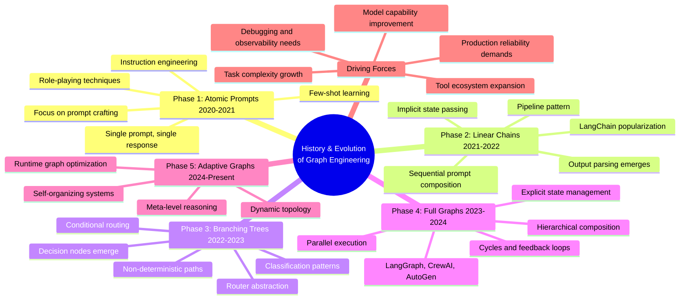
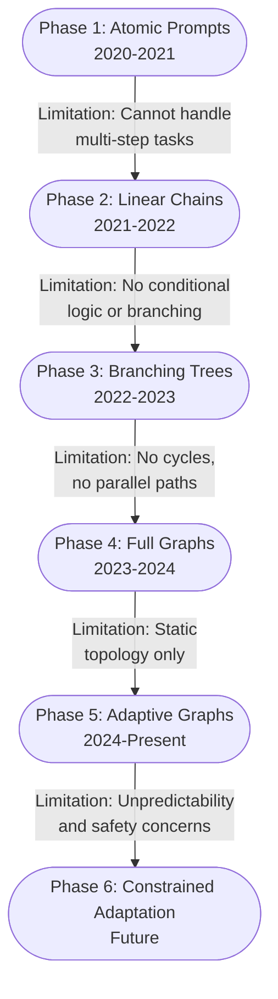
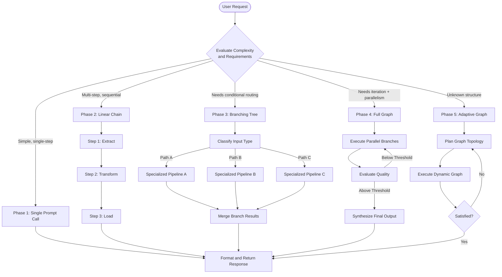
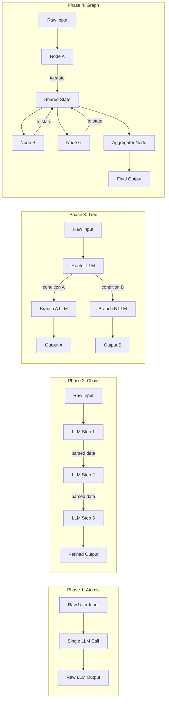
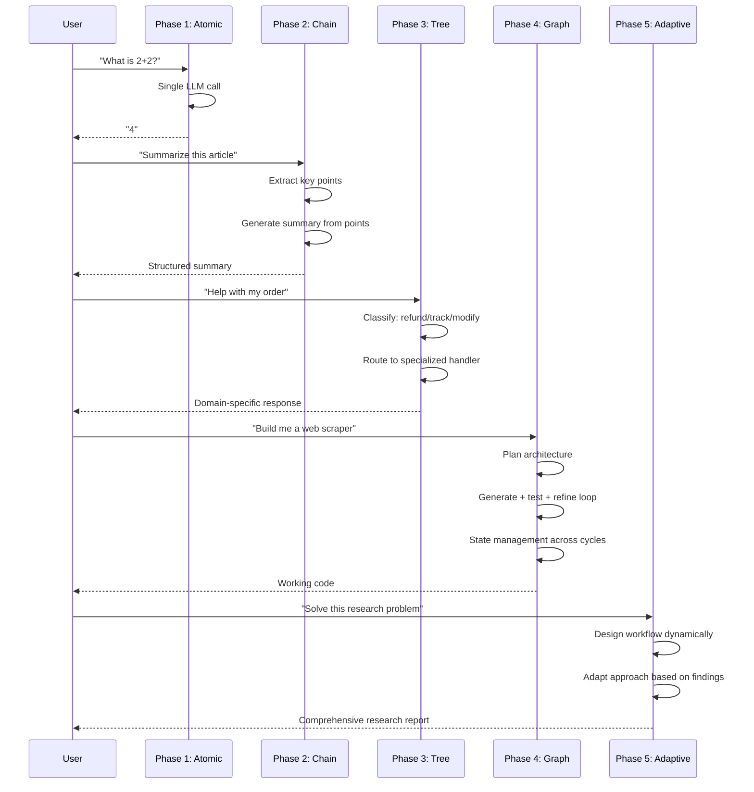

# History and Evolution of Graph Engineering

## 📌 Overview

The history of Graph Engineering is the story of how AI practitioners progressively discovered that the complexity of real-world tasks demanded richer, more interconnected system architectures than simple prompt-response pairs could provide. What began as an experimental practice of chaining text prompts together has evolved into a formal discipline with its own patterns, tools, and theoretical foundations. This evolution was not linear; it proceeded through distinct phases, each building on the limitations of the previous one and each bringing a new level of expressive power and practical capability to AI system design. Understanding this history is essential because the patterns and antipatterns of each phase are still present in modern systems, and recognizing them helps practitioners make better architectural decisions.

The evolution can be broadly understood as a progression along three axes. The **topology axis** moved from single nodes to linear chains to branching trees to cyclic graphs with parallel execution. The **state axis** moved from stateless interactions to implicit chain state to explicit, scoped state management with persistence. The **autonomy axis** moved from human-specified prompts to model-selected responses to model-designed workflows that adapt at runtime. Each transition along these axes was driven by a specific set of limitations becoming intolerable as AI systems were applied to more ambitious problems. This document traces that journey in detail, identifying the key milestones, the people and projects that drove each transition, and the lasting lessons that each phase contributed to the discipline of Graph Engineering as we know it today.

The history also reveals that Graph Engineering did not emerge from a single eureka moment. It was a gradual convergence of insights from multiple communities: prompt engineers who needed to compose multi-step tasks, workflow automation engineers who needed to incorporate LLM calls into existing pipelines, multi-agent researchers who needed to coordinate autonomous agents, and systems engineers who recognized that LLM-based systems had the same architectural challenges as distributed systems. The cross-pollination between these communities is what gave Graph Engineering its distinctive character—part prompt engineering, part systems design, part workflow orchestration, and entirely focused on building practical, production-ready AI applications.

## 🎯 Learning Objectives

After studying this document, you will be able to trace the complete evolution of AI system design from single prompts through chains, trees, and graphs to the current frontier of adaptive, self-modifying systems. You will understand the specific limitations that motivated each architectural transition and how those limitations were addressed by new patterns and tools. You will recognize the historical patterns and antipatterns that still influence modern graph-based AI system design, enabling you to avoid repeating mistakes of the past. You will be able to place current tools and frameworks—LangGraph, CrewAI, AutoGen, and others—in their proper historical context, understanding what specific problems each was designed to solve and what trade-offs they embody.

Furthermore, you will gain an appreciation for the trajectory of the field and where it is likely to evolve next, building on the foundational ideas established in 01_Fundamentals.md and preparing you for the deeper conceptual vocabulary in 03_Core_Concepts.md. You will also develop the ability to assess which evolutionary phase is appropriate for a given problem, avoiding both the trap of over-engineering with unnecessary graph complexity and the trap of under-engineering by forcing complex problems into simplistic architectures.

## 🧠 Definition

The history and evolution of Graph Engineering refers to the chronological development of architectural patterns for composing AI systems, from the earliest single-prompt interactions through increasingly complex multi-prompt, multi-tool, and multi-agent configurations. This evolution is not merely a historical curiosity; it represents a fundamental expansion in how practitioners conceptualize the relationship between AI models and the tasks they perform. Each phase introduced new abstractions—chaining introduced sequential composition, branching introduced conditional logic, full graphs introduced cycles and parallelism, and adaptive graphs introduced runtime topology modification—that collectively form the conceptual toolkit of modern Graph Engineering practice.

The evolution can be characterized as a progression of increasing architectural expressiveness. The **Atomic Prompt Era** could express only a single processing step. The **Chain Era** could express sequences of steps but not alternatives. The **Tree Era** could express alternatives but not cycles or parallelism. The **Graph Era** could express cycles and parallelism but had a fixed topology. The **Adaptive Graph Era** can express dynamic topologies that reconfigure themselves based on runtime conditions. Each phase was a strict superset of the previous one in terms of expressive capability, and the tools and frameworks of each era retained support for the simpler patterns of earlier eras as special cases. This backward compatibility is why modern graph frameworks can still execute a single prompt or a linear chain—the simpler patterns are just degenerate cases of the general graph model.

## ❓ Why It Matters

Understanding the history of Graph Engineering matters because it explains why the field's tools, patterns, and conventions look the way they do. Many design decisions that seem arbitrary—such as why graph frameworks emphasize explicit state management, why certain composition patterns are considered best practices, or why debugging tools are structured the way they are—are direct responses to problems encountered in earlier phases of the evolution. Without this historical context, practitioners risk re-discovering already-solved problems, repeating known antipatterns, or misunderstanding the design rationale behind current tools and frameworks. History provides the "why" behind the "what" of modern Graph Engineering.

The history also reveals recurring themes that transcend specific technologies and persist across every phase of the evolution. The tension between simplicity and expressiveness has been a constant companion: each new capability came with additional complexity, and practitioners have always needed to balance power against comprehensibility. The challenge of debugging interconnected systems grew with each phase, driving the development of increasingly sophisticated observability tools. The difficulty of managing state across multiple processing stages motivated the evolution from implicit to explicit state management. These themes are not historical artifacts—they are live concerns that every graph engineer faces today, and understanding how previous generations addressed them provides a valuable repertoire of strategies and cautionary tales.

Additionally, historical awareness helps practitioners avoid the hype cycle trap. Every phase of the evolution was accompanied by excessive enthusiasm that led to over-application of new patterns, followed by a correction period where practitioners pulled back to more appropriate use cases. By recognizing where we are in this cycle, practitioners can adopt new patterns with appropriate skepticism and avoid both the mistake of ignoring valuable innovations and the mistake of applying them indiscriminately to every problem.

## 🏛️ Core Concepts

The evolution of Graph Engineering can be organized into five distinct phases, each characterized by a dominant architectural pattern and a set of driving forces that motivated the transition to the next phase. The **Atomic Prompt Era** (roughly 2020–2021) was defined by the challenge of getting a single LLM call to produce useful output. Practitioners focused on prompt crafting, few-shot examples, instruction engineering, and role-playing techniques. The system architecture was trivially simple: one prompt in, one response out. There was no concept of state, routing, or composition because there was only one processing step. The driving limitation was the model's ability to follow instructions and produce coherent, relevant output from a single interaction.

The **Chain Era** (2021–2022) emerged when practitioners realized that complex tasks could be decomposed into sequential steps, each handled by a dedicated prompt. Frameworks like LangChain popularized this pattern, providing abstractions for chaining LLM calls together, inserting tool calls between them, and managing the implicit state that flowed from one step to the next. The architecture became a linear pipeline of prompt-response pairs, with each step receiving the output of the previous step as part of its input. The driving limitation that motivated the transition to trees was the inability to handle conditional logic—every input followed the same fixed path through the chain, regardless of its characteristics.

The **Tree Era** (2022–2023) introduced conditional branching, allowing systems to take different paths based on intermediate results. This was a fundamental shift because it introduced non-determinism into the architecture—the path through the system was no longer fixed but depended on runtime decisions made by router nodes or classifier prompts. Frameworks extended their routing capabilities to support if-then-else logic, classification-based routing, and priority-based dispatch. The driving limitation that motivated the transition to full graphs was the inability to handle cycles (no iterative refinement) and parallelism (no concurrent processing of independent sub-tasks).

The **Graph Era** (2023–2024) brought cycles, parallel execution, and explicit state management to AI systems. Frameworks like LangGraph, CrewAI, and Microsoft AutoGen provided native support for graph-based architectures, including feedback loops, concurrent branch execution, shared mutable state, and hierarchical sub-graph composition. This era established most of the patterns and vocabulary that define modern Graph Engineering. The driving limitation that motivates the current transition to adaptive graphs is the constraint of static topology—the graph structure is fixed at design time and cannot adapt to runtime conditions.

The **Adaptive Graph Era** (2024–present) represents the current frontier, where systems dynamically construct and modify their own graph topology at runtime based on task requirements, intermediate results, and resource constraints. An adaptive graph might decide to add additional processing nodes when the initial results are insufficient, skip optional nodes when resources are limited, or restructure its processing pipeline based on the characteristics of the current input. This era is still in its early stages, with active research and development in areas like self-modifying workflows, meta-level reasoning about graph structure, and runtime graph optimization.

## 🧩 Key Components

The key components that emerged across the evolutionary phases can be mapped directly to the timeline of their introduction and the specific limitations they were designed to address. **Prompt Templates** were the first component, emerging in the Atomic Prompt Era as a way to parameterize and reuse prompts with variable inputs. They remain foundational but are now understood as just one type of node configuration within a larger graph, rather than the entire system. Prompt templates introduced the idea that a prompt's content could be dynamically constructed from variables, which laid the groundwork for data flow between nodes.

**Chains** emerged in the second phase as a way to compose multiple prompt templates into a sequential pipeline. A chain is essentially a graph with a linear topology, and many modern graph systems still support chain-style composition as a simplifying special case. Chains introduced the critical concept of inter-prompt data flow: the output of one prompt becomes part of the input to the next. This was the first step toward graph-based thinking, even though the topology was still constrained to a single path. Chains also introduced the need for output parsing—transforming free-form LLM output into structured data that downstream steps could reliably consume.

**Routers and Decision Nodes** emerged during the Tree Era as the mechanism for conditional branching. These components evaluate conditions—often using an LLM call to classify the input or assess intermediate results—and direct flow along different edges based on the evaluation. Routers introduced the concept of edge conditions: not all edges are always followed, and the decision of which edges to follow is part of the system's runtime behavior. This was a significant leap in expressiveness and also introduced the first real need for debugging tools that could show which path was taken through the system for a given input.

**Memory and State Stores** became critical components during the Graph Era, when cycles and parallel paths made it impossible to rely solely on the implicit state passed along a linear chain. In a cyclic graph, a node may need access to data produced several iterations ago, which is not available in the immediate chain of inputs. In a parallel graph, multiple nodes may need to write results that will be consumed by a downstream aggregator, requiring a shared location for intermediate data. Explicit state stores, with well-defined scoping rules and access patterns, became a first-class component of graph systems. As covered in 08_Graph_Components.md, each of these components has a specific role in the graph architecture and represents a direct response to a specific limitation of earlier, simpler patterns.

## 🧭 Mental Model

Think of the evolution of Graph Engineering as the evolution of written language itself. The Atomic Prompt Era was like the invention of individual words—powerful in isolation but limited in what they could express. A single word can convey a concept but not a relationship between concepts. The Chain Era was like learning to form sentences—words (prompts) could now be combined in sequence to express more complex ideas, but the expression was still linear and one-directional, like a sentence that can only flow forward. The Tree Era was like learning to use conjunctions and conditional clauses—sentences could now branch, expressing alternatives, dependencies, and conditions. "If the weather is good, we will picnic; otherwise, we will go to a museum" is a branching tree of meaning.

The Graph Era was like learning to write paragraphs and essays—ideas could be connected in multiple directions, with cross-references, loops of argumentation ("as I mentioned earlier..."), and hierarchical structure (main argument, supporting points, examples). The current Adaptive Graph Era is analogous to interactive, hypertextual writing—where the structure of the document itself can change based on the reader's needs and responses, like a choose-your-own-adventure story or an adaptive learning system that restructures its content based on the learner's progress. Just as the evolution of writing didn't make individual words obsolete—they remain the building blocks of all written communication—the evolution of Graph Engineering hasn't made individual prompts obsolete. Each phase built on the previous one, adding new capabilities without removing old ones.

This mental model also explains why practitioners need fluency in all phases of the evolution, not just the latest one. A skilled writer uses individual words precisely (Atomic), constructs clear sentences (Chain), employs effective conditional logic (Tree), builds coherent paragraphs with internal references (Graph), and adapts their writing to the audience (Adaptive). Similarly, a skilled Graph Engineer chooses the right level of architectural sophistication for each part of their system, using atomic prompts where simplicity suffices, chains for sequential processing, trees for conditional routing, and full graphs only where cycles and parallelism are needed.

## 🗺️ Mind Map



## 🏗️ Architecture Diagram

```mermaid
graph TD
    subgraph "Phase 1: Atomic 2020-2021"
        P1[User Prompt] --> R1[LLM Response]
    end
    subgraph "Phase 2: Chain 2021-2022"
        P2A[Prompt A] --> R2A[Response A]
        R2A --> P2B[Prompt B]
        P2B --> R2B[Response B]
        R2B --> P2C[Prompt C]
        P2C --> R2C[Response C]
    end
    subgraph "Phase 3: Tree 2022-2023"
        P3A[Prompt A] --> R3A[Response A]
        R3A --> DEC3{Classifier Router}
        DEC3 -->|Type 1| P3B1[Branch 1 Pipeline]
        DEC3 -->|Type 2| P3B2[Branch 2 Pipeline]
        DEC3 -->|Type 3| P3B3[Branch 3 Pipeline]
        P3B1 --> MERGE3[Output]
        P3B2 --> MERGE3
        P3B3 --> MERGE3
    end
    subgraph "Phase 4: Graph 2023-2024"
        P4A[Node A] --> P4B[Node B]
        P4B --> P4C[Node C]
        P4C -->|feedback loop| P4A
        P4B -->|parallel| P4D[Node D]
        P4B -->|parallel| P4E[Node E]
        P4D --> P4F[Aggregator]
        P4E --> P4F
        P4F --> P4C
    end
    subgraph "Phase 5: Adaptive 2024+"
        P5A[Adaptive Planner] -->|generates topology| P5B[Dynamic Node]
        P5B --> P5A
        P5A -->|runtime modification| P5C[Modified Graph]
    end
```



## 🔄 Workflow



## ⚙️ Internal Working

The internal working of each evolutionary phase reflects a fundamental shift in how the execution engine processes the system and manages the flow of data and control. In the Atomic Prompt phase, the execution engine was trivially simple: send a prompt to an API, receive a response, and return it to the user. There was no state to manage, no routing decisions to make, and no coordination between components. The entire system's behavior was determined by a single function call and the quality of the prompt text. This simplicity made the systems easy to understand and debug but severely limited the complexity of tasks they could handle.

In the Chain phase, the execution engine became a sequential loop: execute the first prompt, capture its output, inject that output into the second prompt's template, execute the second prompt, and continue until the end of the chain. State was managed implicitly through the sequence of prompt-response pairs, with each step seeing only the output of the previous step plus any original input variables. The execution engine was responsible for string interpolation, output parsing (converting free-form LLM text into structured data for downstream consumption), and error handling (deciding what to do when a step failed). The key innovation was that the engine now had to manage a sequence of dependent operations, introducing concepts like step numbering, intermediate result storage, and partial execution recovery.

The Tree phase required a more sophisticated execution engine capable of evaluating conditions and choosing between multiple outgoing edges. This introduced the concept of a router—a component that could examine the current state or the output of a previous node and decide which branch to follow. The execution engine now needed to maintain a call stack or execution tree, tracking which branches were active and ensuring that results from different branches were properly collected. The Graph phase required a full graph traversal engine capable of handling cycles (with loop detection and termination condition checking), parallel execution (managing concurrent node invocations and collecting their results), and explicit state management (providing a shared, mutable state store that nodes could read from and write to with well-defined scoping rules). Each phase's execution engine was a strict superset of the previous one's capabilities.

The Adaptive Graph phase takes this further by making the execution engine capable of modifying the graph structure itself during execution. The engine must now support operations like adding nodes dynamically, creating new edges based on intermediate results, pruning unnecessary branches, and reorganizing the graph topology based on performance observations. This requires a meta-level of reasoning where the system can reason about its own structure and make modifications to improve its behavior. The execution engine becomes a graph editor as well as a graph executor, which introduces profound challenges around safety, predictability, and debuggability that the field is still working to address.

## 🔀 Execution Flow



## 📊 Lifecycle

```mermaid
stateDiagram-v2
    [*] --> AtomicEra: GPT-3 Launches 2020
    AtomicEra --> ChainEra: Tasks exceed single prompt capacity
    ChainEra --> TreeEra: Need conditional paths and routing
    TreeEra --> GraphEra: Need cycles, parallelism, shared state
    GraphEra --> AdaptiveEra: Need runtime topology flexibility
    AdaptiveEra --> GraphEra: Stabilize proven patterns
    GraphEra --> TreeEra: Simplify where full graph unnecessary
    TreeEra --> ChainEra: Reduce unnecessary branching
    ChainEra --> AtomicEra: Consolidate trivial chains
    AtomicEra: Single prompt paradigm
    note right of AtomicEra: Focus: prompt crafting
    ChainEra: Sequential composition paradigm
    note right of ChainEra: Focus: pipeline design
    TreeEra: Conditional branching paradigm
    note right of TreeEra: Focus: classification + routing
    GraphEra: Full graph paradigm
    note right of GraphEra: Focus: topology + state
    AdaptiveEra: Dynamic adaptation paradigm
    note right of AdaptiveEra: Focus: meta-level reasoning
```

## 📡 Data Flow



## 🤝 Interaction Flow



## 🌍 Real-World Analogy

Consider the evolution of manufacturing as a direct parallel to the evolution of Graph Engineering. In the beginning, a single craftsman made an entire product from start to finish—analogous to the Atomic Prompt Era where a single LLM call handled the entire task. The craftsman's skill (the prompt quality) determined the output quality, and there was no way to decompose or parallelize the work. As demand grew and products became more complex, the **assembly line** was invented, where each worker performed one specialized step and passed the partially completed product to the next worker—this is the Chain Era, where each prompt handles one step in a sequence and passes its output to the next.

As products became more diverse, factories introduced **branching lines**, where products were sorted onto different assembly paths based on their type or features. A car factory might have one line for sedans and another for SUVs, with a sorting station at the beginning directing each vehicle to the appropriate line. This is the Tree Era, where conditional routing directs queries to different specialized processing branches based on classification. Modern manufacturing uses **flexible manufacturing systems** where products can take multiple paths, revisit stations for rework or quality checks, and have components assembled in parallel before final integration—the Graph Era, with cycles for quality feedback, parallel paths for concurrent assembly, and shared inventory (state) for coordination between stations.

The cutting edge is **smart factories** that dynamically reconfigure their own production lines based on real-time demand, supply chain conditions, and quality metrics—the Adaptive Graph Era. A smart factory might decide to add an additional quality inspection station when defect rates rise, or skip a non-essential finishing step when deadline pressure is extreme. Each phase didn't eliminate the previous one; instead, it built on top of it. A smart factory still has individual workers (atomic prompts), assembly lines (chains), and sorting stations (routers). The evolution added new capabilities without removing old ones, exactly as Graph Engineering has evolved from single prompts to adaptive, self-modifying graph systems.

## 💡 Practical Example

Consider how a customer support AI might have been built in each evolutionary phase, illustrating the concrete impact of each architectural advancement. In Phase 1 (Atomic), the user types their question into a chat interface, and a single prompt sends the question plus the company's FAQ document to an LLM, hoping it generates a useful answer. The system is a single prompt-response pair with no memory, no routing, and no tool access. It works reasonably for simple, frequently asked questions but fails for complex multi-step issues like "I ordered the wrong size, can I exchange it, and will I be charged for return shipping?"

In Phase 2 (Chain), the system first extracts the customer's intent from their message, then looks up relevant policies, then drafts a response, and finally reviews it for accuracy. Each step is a separate prompt connected in a linear chain. This handles multi-step reasoning better but treats every customer query the same way regardless of type—a billing question goes through the same pipeline as a technical support question, wasting processing on irrelevant steps.

In Phase 3 (Tree), the system first classifies the query (billing, technical support, order management, general inquiry) and routes it to a specialized processing pipeline. Each pipeline has prompts tailored to its domain, producing much more relevant and accurate responses. In Phase 4 (Graph), the system includes parallel processing (checking order status and policy simultaneously), cycles (if the initial response doesn't resolve the issue, loop back for alternative solutions), and shared state (the customer's history, current order details, and conversation context are all available to every node). In Phase 5 (Adaptive), the system analyzes the conversation in real-time and adjusts its approach—if the customer seems frustrated, it escalates to a human; if the issue is novel, it searches for similar resolved cases and adapts its strategy accordingly. Each phase added concrete capabilities that directly improved the quality and reliability of the customer support experience.

## 🧪 Use Cases

The evolutionary phases map directly to real-world use cases of increasing complexity, and understanding this mapping helps practitioners choose the right architecture for each problem. **Simple Q&A and chatbot systems** remain well-served by the Atomic Prompt pattern—they don't need the overhead of a graph for straightforward queries like product information lookups or basic conversational responses. The simplicity of a single prompt means lower latency, lower cost, and easier maintenance. **Content transformation pipelines** such as translate-then-summarize-then-format workflows are naturally modeled as chains, where each step performs a well-defined transformation on the output of the previous step and the linear topology exactly matches the task structure.

**Customer support routing systems** benefit from the Tree pattern, where incoming queries are classified and routed to specialized handlers for different issue types. The tree structure provides natural extensibility—adding support for a new issue type means adding a new branch without modifying existing branches. **Software development assistants** require the full Graph pattern, with parallel branches for code generation, testing, and documentation, feedback loops for test-driven iteration, and shared state for maintaining context about the codebase across multiple iterations. The cyclic nature of the graph (generate, test, diagnose, regenerate) is essential for the iterative refinement process.

**Autonomous research agents** represent the cutting edge of the Adaptive Graph pattern, where the agent dynamically designs its own research workflow based on the topic, available tools, and intermediate findings. A research agent investigating a new scientific topic might start with a broad search, discover that some sources are more productive than others, dynamically add specialized analysis sub-graphs for the most productive sources, and prune search branches that aren't yielding useful results. In practice, most production AI systems use a mix of patterns from different phases—a customer support system might use a Tree for routing but include Chain sub-graphs for specific processing paths and Graph sub-graphs for complex troubleshooting workflows. Understanding the full evolution helps practitioners choose the right level of complexity for each part of their system.

## ⚖️ Comparison

| Aspect | Atomic Era | Chain Era | Tree Era | Graph Era | Adaptive Era |
|--------|-----------|-----------|----------|-----------|-------------|
| **Time Period** | 2020–2021 | 2021–2022 | 2022–2023 | 2023–2024 | 2024–Present |
| **Topology** | Single node | Linear chain | Branching tree | Cyclic + parallel | Dynamic/runtime |
| **State** | None | Implicit chain state | Implicit per branch | Explicit, shared, scoped | Self-managing |
| **Decision Making** | None | None | Static conditions | Dynamic conditions + cycles | Meta-level reasoning |
| **Key Framework** | Raw API calls | LangChain | LangChain + routers | LangGraph, CrewAI, AutoGen | Custom meta-frameworks |
| **Debuggability** | Trivial (one call) | Easy (linear log) | Moderate (branch tracing) | Complex (needs specialized tools) | Very complex (changing topology) |
| **Typical Node Count** | 1 | 3–10 | 5–25 | 10–100+ | Variable at runtime |
| **When to Use** | Simple queries | Sequential tasks | Classification + routing | Complex iterative workflows | Unknown or evolving task structures |
| **Primary Limitation** | No composition | No branching | No cycles | Static topology | Unpredictability |
| **Primary Innovation** | Prompt crafting | Sequential composition | Conditional routing | Cycles + parallelism | Runtime adaptation |

## ✅ Best Practices

The primary lesson from the history of Graph Engineering is to match your architecture to your problem's actual complexity, not to your ambition or imagination. Don't jump straight to the Graph Era if a Chain or even an Atomic prompt would suffice. Every additional layer of architectural complexity comes with real costs in development time, debuggability, cognitive load for your team, and runtime overhead from the framework. Start with the simplest architecture that could possibly work, and evolve toward more complex patterns only when you have concrete evidence that the simpler pattern is insufficient. This progressive approach mirrors the historical evolution itself and ensures that you don't pay the complexity tax before you actually need the capability.

A second critical lesson is to invest in observability and debugging tools as soon as your system moves beyond the Chain phase. The moment you add branching in the Tree phase, your system's execution path becomes non-deterministic, and debugging by stepping through a linear log becomes inadequate. Modern graph frameworks provide visualization and tracing tools that show which nodes executed, what data flowed along each edge, and how the state evolved. Adopt these tools early, before you need them, because retrofitting observability into a complex graph is much harder than building it in from the start. The historical record shows that teams that neglected observability during the Tree and early Graph eras spent disproportionate amounts of time debugging mysterious failures.

A third lesson is to maintain a clear separation between the graph's topology (its structural definition) and the nodes' implementations (their behavioral logic). This separation, which matured during the Graph Era, allows you to modify routing logic without touching node code, swap implementations for testing or optimization without changing the graph structure, and evolve the graph independently of the components it contains. Teams that tightly coupled topology and implementation during the Chain era often found it extremely expensive to migrate to more complex architectures, because refactoring the topology required simultaneously refactoring the node implementations. Designing for this separation from the start, even in simple chain systems, makes future architectural evolution dramatically easier.

## ❌ Common Mistakes

The most pervasive historical mistake is **premature graphification**—jumping to a complex graph architecture before the problem demands it. This was extremely common in 2023–2024 when graph frameworks first gained mainstream popularity, and teams would restructure perfectly functional chain-based systems into elaborate graphs without any clear benefit. The result was universally the same: increased complexity, harder debugging, slower development velocity, and higher infrastructure costs without any measurable improvement in output quality or system capability. The enthusiasm for the new pattern overshadowed the pragmatic assessment of whether the new pattern was actually needed. This mistake is the AI systems equivalent of the "greenfield microservices" antipattern in software engineering, where teams adopt distributed architectures for problems that don't require them.

A related mistake is **uniform complexity**—applying the same level of architectural sophistication to every part of the system regardless of its actual needs. In practice, most graph-based AI systems have some paths that are simple chains (process this, then format that), some that are branches (classify the input, then route), and only a few that require full graph patterns (iterative refinement, parallel processing, feedback loops). Forcing everything into the most complex available pattern wastes effort, obscures the system's actual structure, and makes the system harder for new team members to understand. The best graph designs use the simplest appropriate pattern at each point, reserving full graph complexity for the areas that genuinely need it.

Another historical antipattern is **ignoring the transition cost** when moving between phases. Teams that built large chain-based systems without considering future evolution often found it extremely expensive to migrate to graph-based architectures because the chain's implicit state management assumptions were deeply embedded in prompt templates and parsing logic. The lesson is to design for evolvability from the start: use explicit state management even in chain-phase systems, keep node interfaces clean and well-defined, and avoid embedding architectural assumptions in node implementations. Finally, **framework lock-in** has been a recurring mistake throughout the evolution. Each phase has been accompanied by a dominant framework, and teams that tightly couple their systems to framework-specific abstractions often struggle when the field moves on. Designing around the core concepts of Graph Engineering (nodes, edges, state, flows) rather than framework-specific APIs provides much better long-term resilience and portability.

## 🚀 Advanced Topics

Several advanced topics build directly on the historical foundation established in this document and represent the frontier of where the field is heading. **Pattern archaeology** is the practice of identifying legacy patterns from earlier evolutionary phases within modern systems. A node that receives input from only one upstream node and sends output to only one downstream node is effectively a chain link, regardless of the graph framework it's embedded in. A sub-graph with no cycles and no parallel paths is structurally a tree, even if it's defined within a graph framework. Recognizing these implicit structures helps practitioners simplify their mental models, optimize performance (a tree sub-graph can use simpler execution strategies than a full graph sub-graph), and identify opportunities to reduce unnecessary complexity. Pattern archaeology is the graph engineer's equivalent of code archaeology in software engineering—understanding the history embedded in the current structure.

**Evolutionary refactoring** is the systematic process of migrating a system from one architectural phase to another while preserving its external behavior. This is analogous to refactoring in software engineering but operates at the level of graph topology rather than code structure. Key techniques include extracting a repeated sequence of nodes into a chain sub-graph, replacing a chain with conditional branches when different inputs need different processing, adding cycles when iterative refinement is needed, and introducing parallel paths when independent sub-tasks can execute concurrently. Each of these refactoring operations has well-defined preconditions, steps, and verification criteria that make the migration systematic rather than ad hoc.

**Cross-phase composition** is the practice of deliberately mixing patterns from different evolutionary phases within a single system. A well-designed modern AI system might use Atomic prompts for simple sub-tasks (like format validation), Chains for sequential processing (like a translate-then-summarize pipeline), Trees for routing decisions (like query classification), and full Graphs for iterative workflows (like test-driven code generation). Understanding when and how to combine these patterns effectively—knowing which phase's pattern is appropriate for each part of the system—is a hallmark of mature Graph Engineering practice and one of the most practical skills a practitioner can develop.

**Predictive evolution** is an emerging area that attempts to anticipate which aspects of current systems will become problematic as requirements grow, proactively designing the graph topology to accommodate future architectural transitions. This forward-looking approach draws on the historical patterns documented here to make informed predictions about where a system's current architecture will become a bottleneck. For example, if a system is currently a chain but the product roadmap includes features that will require conditional routing, a predictive evolution approach would design the chain with clean node interfaces and explicit state management from the start, making the future transition to a tree architecture much smoother. These advanced topics represent the cutting edge of a field that is still rapidly evolving, building on the solid foundations laid by each preceding phase of its history.