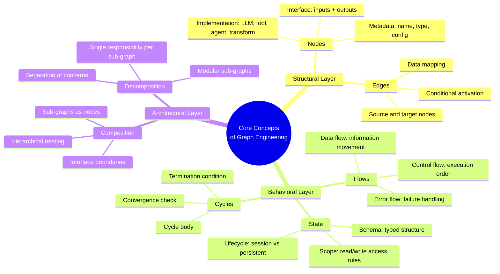
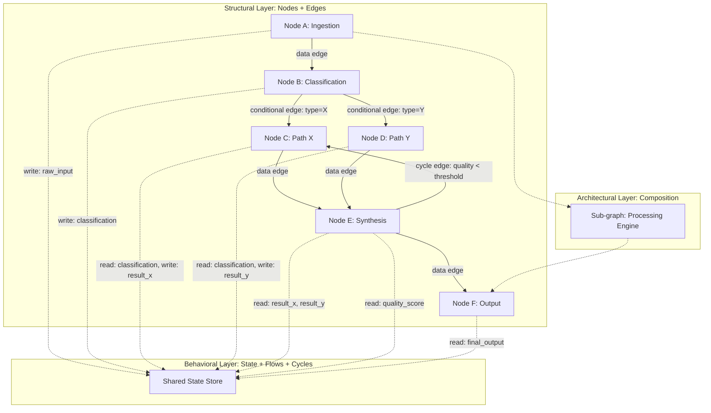
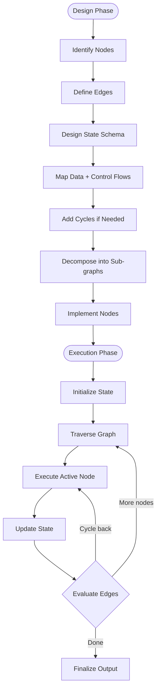
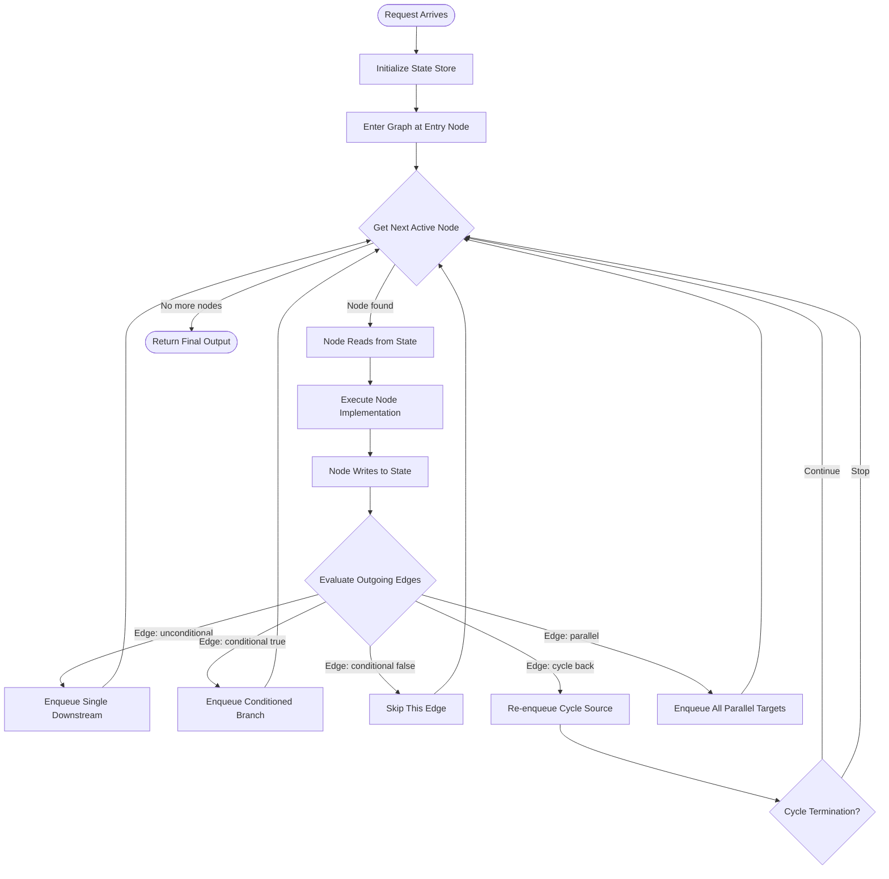
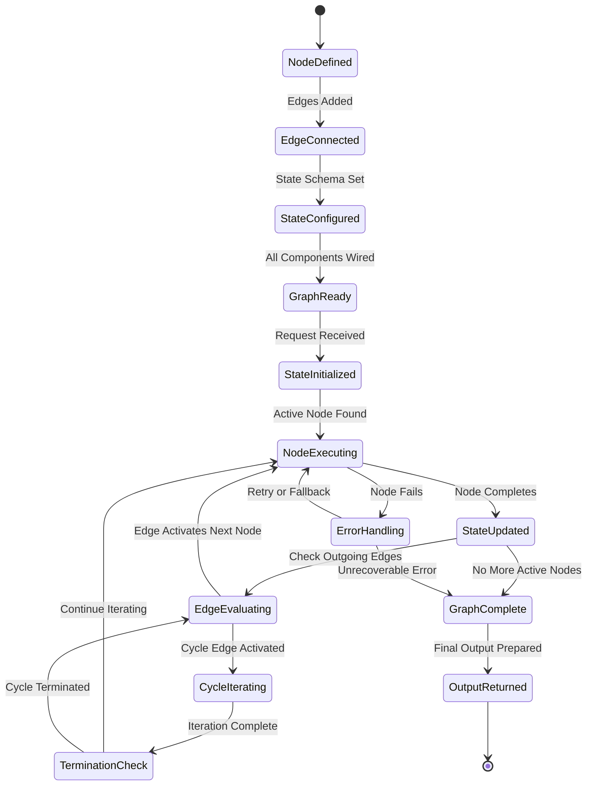
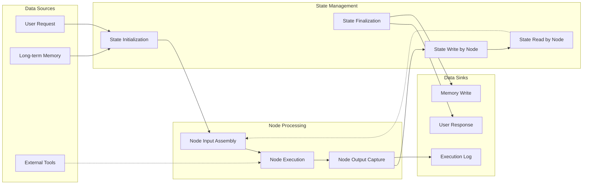
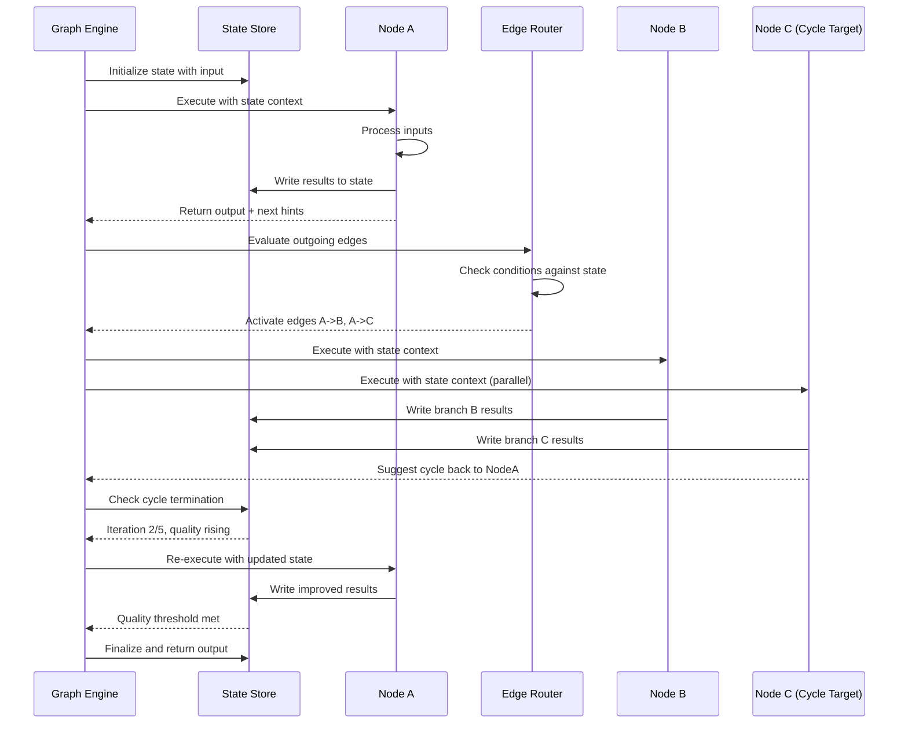

# Core Concepts of Graph Engineering

## 📌 Overview

Core Concepts of Graph Engineering establishes the essential vocabulary, mental framework, and formal foundations that every practitioner needs to work effectively with graph-based AI systems. While 01_Fundamentals.md introduced the high-level idea of Graph Engineering and its importance, and 02_History_and_Evolution.md traced how the field developed through distinct phases, this document dives into the precise definitions and relationships between the fundamental building blocks: nodes, edges, state, flows, cycles, composition, and decomposition. These concepts are not merely academic definitions—they form the shared language that enables teams to design, discuss, debug, and evolve graph-based systems with precision and clarity across different frameworks and organizational contexts.

Understanding these core concepts deeply is critical because they interact in subtle and non-obvious ways that create emergent system behavior. A change to edge routing logic can affect state management patterns, which can alter cycle termination conditions, which can shift the overall system behavior in ways that are extremely difficult to predict without a solid grasp of how the concepts interrelate at a fundamental level. This document builds from the most atomic concepts (nodes) to the most complex (composition and decomposition patterns), explaining the interactions between each level of abstraction and providing the conceptual toolkit needed to analyze, design, and discuss any graph-based AI system regardless of its specific implementation framework, programming language, or application domain.

The document also establishes the important distinction between the structural aspects of a graph (its static topology of nodes and edges) and its behavioral aspects (how data flows, how state changes, and how execution progresses through the topology at runtime). This distinction is fundamental to Graph Engineering because many design decisions, debugging strategies, and optimization techniques operate on one aspect or the other. A practitioner who can fluently move between structural and behavioral perspectives can diagnose problems faster, design more robust systems, and communicate more effectively with teammates who may be focused on a different aspect of the same system.

## 🎯 Learning Objectives

After studying this document, you will be able to define and distinguish between the seven core concepts of Graph Engineering: nodes, edges, state, flows, cycles, composition, and decomposition. You will understand the relationship between structural concepts (nodes and edges define the graph's topology) and behavioral concepts (state, flows, and cycles define the graph's runtime behavior). You will be able to identify these concepts in any graph-based AI system, regardless of the framework used to implement it, and use the correct terminology to discuss system design decisions with precision.

You will understand how nodes serve as the atomic units of processing, how edges serve as the directed channels of communication between nodes, and how state serves as the shared memory that enables nodes to share information beyond their direct connections. You will be able to explain the different types of flows (data flow, control flow, and error flow) and how they interact. You will understand when cycles are appropriate and how to manage their risks. Finally, you will be able to apply composition and decomposition patterns to manage complexity in large graph systems, creating hierarchical structures that are comprehensible, maintainable, and evolvable. These objectives provide the complete conceptual foundation needed for the more specialized topics covered in subsequent documents of this series.

## 🧠 Definition

The core concepts of Graph Engineering are the fundamental abstractions—nodes, edges, state, flows, cycles, composition, and decomposition—that together form the vocabulary and conceptual framework for designing, implementing, and reasoning about graph-based AI systems. These concepts are not arbitrary; they emerged from the practical experience of building increasingly complex AI systems, as documented in 02_History_and_Evolution.md, and they represent the minimal set of ideas needed to describe any graph-based AI system regardless of its specific implementation or application domain. Each concept addresses a distinct aspect of system design: nodes address processing, edges address connectivity, state addresses persistence, flows address movement, cycles address iteration, and composition and decomposition address complexity management.

These concepts are defined in practical, engineering terms rather than mathematical ones. A node is not an abstract vertex in a mathematical graph; it is a concrete processing unit with a defined interface, implementation, and role within the system. An edge is not an abstract connection; it is a directed channel that may carry data, enforce conditions, or represent dependencies. This practical orientation is what distinguishes Graph Engineering from graph theory and makes the concepts directly applicable to building real AI systems. The definitions provided in this document are designed to be framework-agnostic—they apply equally well to LangGraph, CrewAI, AutoGen, or any custom graph implementation—because they describe the underlying reality of graph-based AI systems rather than the specific APIs of any particular tool.

## ❓ Why It Matters

Mastering the core concepts matters because they are the language of Graph Engineering, and fluency in that language is prerequisite to effective practice. When a team discusses a graph-based system without shared terminology, conversations devolve into vague descriptions like "this thing connects to that thing and then it loops back." With shared terminology, the same conversation becomes precise: "the synthesis node reads from the shared state, and if quality is below threshold, the router sends control flow back to the research node via the feedback cycle." The precision of the second description enables unambiguous communication, which accelerates design, reduces misunderstandings, and makes code reviews and architectural discussions dramatically more productive.

The core concepts also matter because they reveal design options that would otherwise be invisible. A practitioner who thinks only in terms of "prompts" and "responses" cannot see the possibility of adding a feedback cycle, introducing parallel execution, or restructuring the topology to reduce latency. A practitioner who thinks in terms of nodes, edges, state, and flows can see all of these possibilities and make informed trade-offs between them. The core concepts expand the design space by making the full range of architectural options visible and nameable. Without this expanded design space, practitioners are limited to the simplest patterns and cannot take advantage of the full power of graph-based design.

Furthermore, the core concepts provide the foundation for systematic debugging and optimization. When a graph-based system produces incorrect output, the concepts provide a framework for diagnosis: Is the problem in a node (wrong processing logic), an edge (wrong data flowing between nodes), the state (stale or corrupted shared data), a flow (data taking the wrong path), or a cycle (not converging or converging incorrectly)? Without this conceptual framework, debugging a graph-based system is a process of random poking and hoping. With it, debugging becomes a systematic process of elimination that narrows down the problem space efficiently. The core concepts are not just theoretical—they are intensely practical tools that practitioners use every day.

## 🏛️ Core Concepts

The seven core concepts of Graph Engineering can be organized into a layered framework that reflects their relationships and dependencies. The **structural layer** consists of nodes and edges, which together define the graph's topology—its shape and connectivity. Nodes are the processing units, and edges are the connections between them. This layer is static; it defines what the system looks like before any execution begins. The structural layer is analogous to the floor plan of a building: it shows where rooms (nodes) are and how hallways (edges) connect them, but says nothing about what happens inside the rooms or how people move through the building.

The **behavioral layer** consists of state, flows, and cycles, which together define the graph's runtime behavior—how data moves, how state changes, and how execution progresses through the topology. State is the shared, persistent data that nodes read from and write to. Flows are the patterns of data and control movement through the graph. Cycles are loop-back edges that enable iterative processing, where the output of a later node feeds back to an earlier node for further processing. This layer is dynamic; it defines what happens when the graph is executed. The behavioral layer is analogous to the traffic patterns in the building: which hallways people use, how rooms share resources, and when people revisit rooms they've already been to.

The **architectural layer** consists of composition and decomposition, which together address the management of complexity in large graph systems. Composition is the practice of combining smaller graphs into larger ones, treating a sub-graph as a single node within a parent graph. Decomposition is the practice of breaking a complex graph into smaller, more manageable sub-graphs, each responsible for a well-defined aspect of the overall behavior. These are two sides of the same coin and represent the primary mechanism for scaling graph-based designs beyond what a single person can hold in their working memory. The architectural layer is analogous to the building's zoning plan: how individual floors (sub-graphs) relate to the building as a whole (parent graph).

## 🧩 Key Components

Each core concept has specific, well-defined components that practitioners must understand to work effectively. **Nodes** have three essential components: an interface (the defined inputs and outputs), an implementation (the processing logic that transforms inputs into outputs), and metadata (the node's name, type, description, and configuration). The interface is what connects a node to the rest of the graph, and its design is critical for composability—a node with a clean, well-defined interface can be reused in multiple graphs without modification. The implementation may be an LLM call, a tool invocation, a deterministic function, or a reference to a sub-graph. The metadata supports observability, debugging, and documentation.

**Edges** have four essential components: a source node (where the edge originates), a target node (where the edge terminates), a data mapping (what data from the source flows to the target), and optionally a condition (when the edge is active). The data mapping is crucial because it defines exactly what information flows between nodes—a source node may produce multiple outputs, but a specific edge may carry only a subset of them. The condition transforms a static connection into a conditional one, enabling branching behavior. Together, these components make edges much more than simple connections; they are active participants in the system's behavior that can filter, transform, and gate the flow of information.

**State** has three essential components: a schema (the defined structure of the state), a scope (which nodes can read and write which parts of the state), and a lifecycle (when the state is created, updated, and destroyed). The schema is critical for preventing the chaos of unstructured state—if any node can write any data to any key, the state quickly becomes an unmaintainable mess. The scope defines access boundaries, ensuring that nodes only interact with the state they need and preventing unintended side effects. The lifecycle determines whether state persists across graph invocations (long-term memory), within a single invocation (session state), or within a single node execution (local state).

**Flows** have three types: data flow (what information moves between nodes), control flow (which nodes execute and in what order), and error flow (what happens when a node fails). These three flow types interact in complex ways—a node failure in the error flow may redirect the control flow to an error handler, which may modify the state before the data flow resumes from a different node. **Cycles** have three essential components: a cycle body (the set of nodes and edges that form the loop), a termination condition (when the cycle stops), and a convergence check (whether the cycle is making progress toward its goal). **Composition** and **decomposition** share the component of a sub-graph boundary—the defined interface through which a sub-graph interacts with its parent graph, analogous to a function's signature in software engineering.

## 🧭 Mental Model

The most effective mental model for the core concepts of Graph Engineering is to think of them as the anatomy and physiology of a living organism. **Nodes** are the cells—specialized units that perform specific functions. Just as the body has muscle cells, nerve cells, and blood cells, a graph has LLM nodes, tool nodes, and transformer nodes. Each type of cell (node) has a specific role and a specific interface for interacting with its environment. **Edges** are the connections between cells—the synapses between neurons, the gap junctions between muscle cells, the vascular connections between organs. These connections are not passive wires; they actively regulate what signals pass through them and when, just as graph edges have data mappings and conditions.

**State** is the organism's internal environment—the bloodstream that carries nutrients and signals to every cell, the extracellular matrix that provides structural support, and the nervous system's memory networks that store patterns from past experience. The state is what allows cells (nodes) that are not directly connected to still influence each other: a hormone released by one organ travels through the bloodstream and affects cells throughout the body, just as a node's output written to the state store can be read by any node in the graph. **Flows** are the physiological processes—the circulation of blood, the transmission of nerve signals, the flow of lymph. Different flow types (data, control, error) correspond to different physiological systems (circulatory, nervous, immune), each with its own pathways and regulatory mechanisms.

**Cycles** are the homeostatic feedback loops—the body's temperature regulation system, blood sugar control, and stress response all involve cycles where sensors detect a condition, effectors respond, and the response is fed back to the sensors for continuous adjustment. **Composition** is the hierarchical organization of the body—cells compose tissues, tissues compose organs, organs compose organ systems, and organ systems compose the organism. Each level of the hierarchy has its own internal complexity but presents a simplified interface to the level above. This biological metaphor captures the essential character of each core concept: specialization (nodes), regulated connection (edges), shared medium (state), directed movement (flows), self-regulation (cycles), and hierarchical complexity management (composition and decomposition).

## 🗺️ Mind Map

## 🏗️ Architecture Diagram

## 🔄 Workflow

## ⚙️ Internal Working

The internal working of a graph-based AI system, viewed through the lens of core concepts, proceeds through a well-defined sequence of operations that engages each concept in turn. When a request arrives, the **state** is initialized with the input data and any contextual information from long-term memory. This state initialization is the system's first behavioral act—it creates the shared data environment that all subsequent nodes will operate within. The state schema defines what keys exist and what types they hold, and the initialization process populates these keys with their starting values. Proper state initialization is critical because nodes that read state keys expect them to exist and contain valid data.

Once the state is initialized, the execution engine begins **traversing the graph** by following **edges** from node to node. At each **node**, the engine performs a precise sequence: gather inputs from incoming edges and the state store, invoke the node's implementation with those inputs, capture the node's outputs, write relevant outputs to the state store, and determine which outgoing edges to activate based on edge conditions. This node execution sequence is the fundamental unit of graph computation, and it repeats for every node in the execution path. The **data flow** is the movement of information through this sequence—from state and edges into the node, through the node's processing, and back out to state and edges.

When the execution path reaches a **cycle**, the engine enters a loop: it executes the cycle body, checks the termination condition (typically a maximum iteration count, a quality threshold, or both), and either continues iterating or exits the cycle. During each iteration, the cycle's **convergence check** examines whether the state is changing in a productive direction—if the same state is being produced repeatedly, the cycle has stalled and should be terminated even if the formal termination condition hasn't been met. The **control flow** determines which nodes execute and in what order, while the **error flow** activates when a node fails, redirecting execution to error handlers or retry nodes. Throughout all of this, the **composition** hierarchy determines which sub-graphs are active and how they interact through their defined interfaces.

## 🔀 Execution Flow

## 📊 Lifecycle

## 📡 Data Flow

## 🤝 Interaction Flow

## 🌍 Real-World Analogy

Consider a hospital as a rich analogy for the core concepts of Graph Engineering. The hospital's **nodes** are the specialized departments and stations: the emergency room (ingestion and triage), the radiology department (diagnostic imaging), the laboratory (blood tests and analysis), the pharmacy (medication preparation), the surgical ward (procedural intervention), and the discharge office (output formatting and delivery). Each department has a well-defined interface—it receives patients with specific conditions and produces diagnoses, treatments, or referrals. The **edges** are the pathways and referral routes that connect departments: a patient flows from the emergency room to radiology based on a doctor's referral (conditional edge), and from radiology back to the emergency room with the imaging results (data-carrying edge).

The hospital's **state** is the patient's medical record—a shared, persistent data store that every department can read from and write to. When the emergency room doctor examines the patient, they write their observations to the medical record. When the radiologist reviews the images, they read the doctor's observations from the record and write their own findings. The medical record enables departments that never directly interact to still share critical information. The **flows** are the movements of patients, information, and decisions through the hospital: data flow (test results moving from lab to doctor), control flow (the doctor deciding which department to refer the patient to next), and error flow (a test failing and needing to be re-run, or a patient having an adverse reaction and being routed to emergency intervention).

The hospital has **cycles** too: a patient may be diagnosed, treated, and then reassessed in a follow-up visit that loops back through parts of the same process. If the treatment was effective, the cycle terminates and the patient is discharged; if not, the cycle continues with adjusted treatment. The hospital's **composition** hierarchy is also clear: individual departments are sub-graphs with their own internal nodes and edges (a surgical ward has pre-op, surgery, and post-op nodes), and the hospital as a whole is the parent graph that connects these sub-graphs. A hospital administrator who can see both the individual department level and the hospital-wide level—who can think in terms of nodes, edges, state, flows, and cycles—is performing exactly the kind of multi-level analysis that Graph Engineering requires.

## 💡 Practical Example

Consider a document analysis pipeline that demonstrates all seven core concepts working together in a concrete system. The system receives a legal contract and needs to extract key clauses, assess risk levels, check for compliance issues, and generate a summary report. The **nodes** are: an ingestion node (parses the document), a clause extractor node (uses an LLM to identify and extract key clauses), a risk assessor node (evaluates each clause for risk), a compliance checker node (compares clauses against regulatory requirements), and a report generator node (synthesizes findings into a structured report). Each node has a clear interface and a specific implementation.

The **edges** connect these nodes in a purposeful topology. The ingestion node connects to the clause extractor via a data edge that carries the parsed document text. The clause extractor connects to both the risk assessor and the compliance checker via parallel edges—these two analyses can happen simultaneously because they don't depend on each other. Both the risk assessor and compliance checker connect to the report generator, which also has a cycle edge back to the clause extractor. This cycle edge is conditioned on the quality of the extraction: if the report generator finds that the risk assessment references clauses that weren't extracted, it sends a signal back to the clause extractor to re-extract with additional context.

The **state** holds the parsed document, the extracted clauses, the risk assessments, the compliance results, and the quality metrics. Each node reads the state entries it needs and writes its results to the appropriate state keys. The **flows** are: data flow moves the document through extraction, assessment, and report generation; control flow determines which nodes execute and when (parallel branches for risk and compliance, conditional cycle for re-extraction); and error flow handles cases where a node fails (e.g., the compliance checker can't access the regulatory database, triggering a fallback to a cached version). The **cycle** (report generator back to clause extractor) iterates until extraction quality meets a threshold or a maximum of three iterations is reached. The **composition** pattern is used to package the entire analysis pipeline as a sub-graph that can be reused as a single node within a larger document processing system that handles multiple document types.

## 🧪 Use Cases

The core concepts of Graph Engineering apply to a diverse range of AI application domains, each leveraging different aspects of the conceptual framework. **Multi-agent coding systems** rely heavily on nodes (specialized agent nodes for code generation, testing, and review), edges (connecting agents in a workflow), state (maintaining the codebase context, test results, and review feedback), and cycles (iterative code-test-fix loops until all tests pass). The graph structure makes the coding process transparent and debuggable—every code change, test failure, and fix attempt is recorded as a node execution with inputs, outputs, and state changes.

**Research and analysis platforms** demonstrate the importance of flows and state. Data flows from search nodes through evaluation nodes to synthesis nodes, while control flow manages the decision of when to search deeper versus when to start synthesizing. The state store holds the accumulated research findings, source quality assessments, and the current research direction, enabling nodes that are not directly connected to still access shared knowledge. Cycles enable iterative deepening—each synthesis attempt may reveal gaps in the research that trigger additional search cycles.

**Customer experience platforms** showcase the power of edges and decomposition. Complex customer journeys (browse, compare, purchase, support, return) are modeled as a graph where edges represent the transitions between journey stages. Conditional edges handle routing (a customer with a return reason of "defective" goes to a different sub-graph than one with "changed mind"). Decomposition allows each journey stage to be implemented as an independent sub-graph that can be developed, tested, and modified by different teams. **Data pipeline systems** leverage composition heavily, where individual data transformation steps are nodes, the pipeline is a chain sub-graph, and the overall data platform is a parent graph that orchestrates multiple pipelines with shared state for configuration, monitoring, and error recovery.

## ⚖️ Comparison

| Concept | Category | What It Defines | Key Design Question | Common Mistake |
|---------|----------|----------------|---------------------|----------------|
| **Nodes** | Structural | Processing units | What does this component do? | Making nodes too broad or too narrow |
| **Edges** | Structural | Connections between nodes | How do components communicate? | Ignoring edge conditions and data mappings |
| **State** | Behavioral | Shared persistent data | What information persists across nodes? | Unstructured state with no schema or scoping |
| **Flows** | Behavioral | Movement patterns | How does data and control move? | Confusing data flow with control flow |
| **Cycles** | Behavioral | Iterative loops | When and how does the system iterate? | Missing termination conditions |
| **Composition** | Architectural | Combining sub-graphs | How do smaller systems build larger ones? | Excessively deep nesting |
| **Decomposition** | Architectural | Breaking into sub-graphs | How do we manage complexity? | Arbitrary decomposition with no clear boundaries |

## ✅ Best Practices

For **nodes**, the primary best practice is to design clean, narrow interfaces. Each node should have a single, well-defined responsibility and a minimal interface that exposes only the inputs it needs and the outputs it produces. This principle of single responsibility makes nodes easier to test (you can test them in isolation with mock inputs), easier to reuse (they can be dropped into different graphs without modification), and easier to understand (a newcomer can grasp what a node does by reading its interface and description). Avoid creating "god nodes" that try to do everything—these are the graph equivalent of monolithic functions in software engineering, and they suffer from the same maintainability and testability problems.

For **edges**, always define explicit data mappings rather than relying on implicit conventions. An edge that says "send Node A's output to Node B" is ambiguous—which specific fields from Node A's output does Node B need? An edge that says "send Node A's output.summary and output.confidence to Node B's input.context and input.assessment_threshold" is precise and unambiguous. This precision prevents subtle bugs where a node receives unexpected data formats or missing fields. Also, make edge conditions as simple and testable as possible—complex conditions that depend on multiple state keys are difficult to reason about and prone to unexpected behavior.

For **state**, define a typed schema and enforce it. Every key in the state store should have a defined type, a description of what it contains, a list of nodes that write to it, and a list of nodes that read from it. This schema documentation is invaluable for debugging and for onboarding new team members. Use scoped state to prevent unintended interactions—nodes should only have access to the state keys they need, not the entire state store. For **cycles**, always implement both a maximum iteration count and a convergence check. The maximum iteration count is your safety net against infinite loops. The convergence check ensures that the cycle is making progress—if the state isn't changing significantly between iterations, the cycle has stalled and should be terminated early, saving tokens and time. For **composition and decomposition**, define clear sub-graph interfaces and keep sub-graphs focused on a single aspect of the system's behavior. A sub-graph that tries to handle too many concerns will become as difficult to understand as a single large graph, negating the benefits of decomposition.

## ❌ Common Mistakes

The most common mistake with **nodes** is making them either too broad or too narrow. A node that is too broad—handling extraction, analysis, and formatting in a single LLM call—is difficult to debug (if the output is wrong, which part failed?), difficult to optimize (you can't tune extraction without also affecting analysis), and difficult to reuse (the node is too specialized for its original context to be useful elsewhere). A node that is too narrow—splitting a single logical operation into multiple nodes for no clear benefit—adds unnecessary edges, state writes, and execution overhead. The right level of node granularity is the level at which each node's failure mode is diagnosable and each node's behavior is independently optimizable. This usually means one LLM call or one tool invocation per node, with deterministic transformations grouped when they form a single logical step.

The most common mistake with **edges** is treating them as passive connections rather than active, configurable components. An edge without a data mapping passes the entire output of the source node to the target node, which may include irrelevant or confusing information. An edge without a condition is always active, which means the target node will always execute regardless of whether its processing is needed. Both of these oversights lead to inefficient execution and can cause nodes to receive input they weren't designed to handle. Always think of edges as first-class components with their own configuration, not just lines on a diagram.

The most common mistake with **state** is using it as an unstructured dumping ground. When any node can write any data to any key in the state store, the state quickly becomes an unmanageable mess where no one knows what data is available, where it came from, or whether it's still valid. This leads to nodes reading stale data, overwriting each other's values, and failing silently because expected state keys are missing. The solution is to treat the state store with the same rigor as a database schema: define what keys exist, what types they hold, which nodes write to them, which nodes read from them, and what the lifecycle of each key is. For **cycles**, the most dangerous mistake is omitting termination conditions. A cycle without a maximum iteration count will run until the system runs out of resources, potentially consuming enormous amounts of tokens, time, and money. Always include both a hard limit on iterations and a soft convergence criterion.

## 🚀 Advanced Topics

Several advanced topics extend the core concepts into more sophisticated design territory. **Typed state machines** combine the state concept with formal type systems, using strongly typed state schemas (implemented with TypeScript interfaces, Pydantic models, or similar) that are enforced at runtime. This prevents an entire category of bugs where nodes write data in unexpected formats to state keys, causing downstream nodes to fail when they try to read and use that data. Typed state machines also enable better IDE support, autocompletion, and compile-time checking, making graph development feel more like traditional software engineering.

**Edge middleware** is the practice of attaching processing logic to edges rather than nodes. An edge middleware function might transform data as it flows through the edge (converting a timestamp format, filtering out irrelevant fields), enrich the data (adding metadata about the source node), or gate the flow (checking rate limits or access permissions). Edge middleware enables cross-cutting concerns like logging, validation, and transformation to be applied consistently across all edges without duplicating logic in every node. This pattern is analogous to HTTP middleware in web frameworks and provides similar benefits for modularity and consistency.

**Cycle patterns** are named, reusable patterns for common types of iterative processing. The **refine-until-quality** pattern iterates a generation-quality assessment cycle until a quality threshold is met. The **expand-and-prune** pattern generates multiple candidate solutions in parallel, evaluates them, and prunes the worst ones before generating more candidates. The **self-correction** pattern compares a node's output against its input and, if the output has diverged from the intended task, feeds the discrepancy back to the node for correction. Each of these patterns has specific structural and behavioral characteristics that can be documented, tested, and reused across different graph systems. **Dynamic composition** is the practice of constructing the graph's composition hierarchy at runtime, selecting which sub-graphs to instantiate based on the input characteristics. This enables a single parent graph to adapt its structure to different types of tasks without containing all possible sub-graphs in a static definition, reducing complexity while maintaining flexibility.