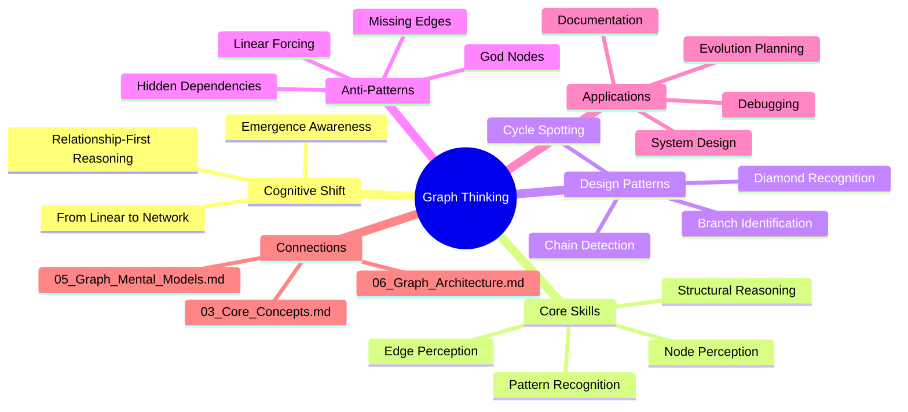
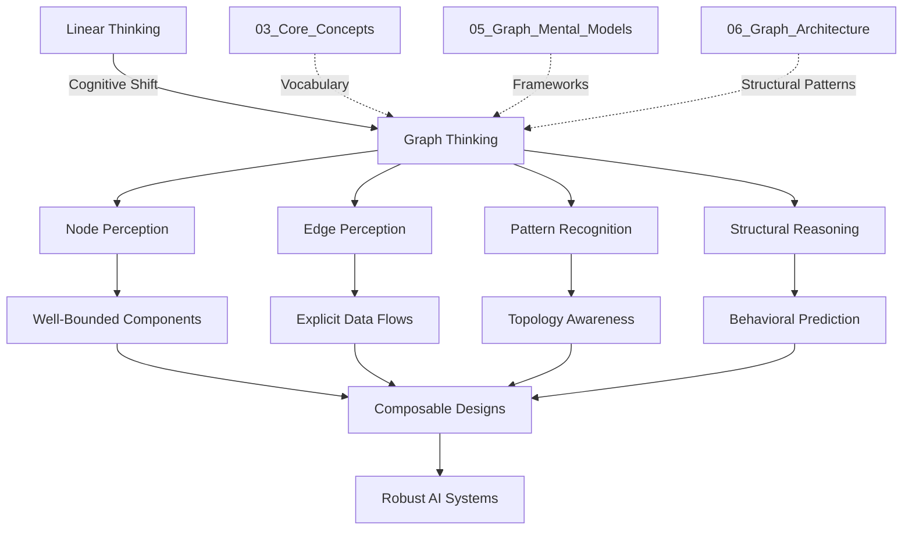
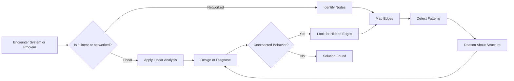
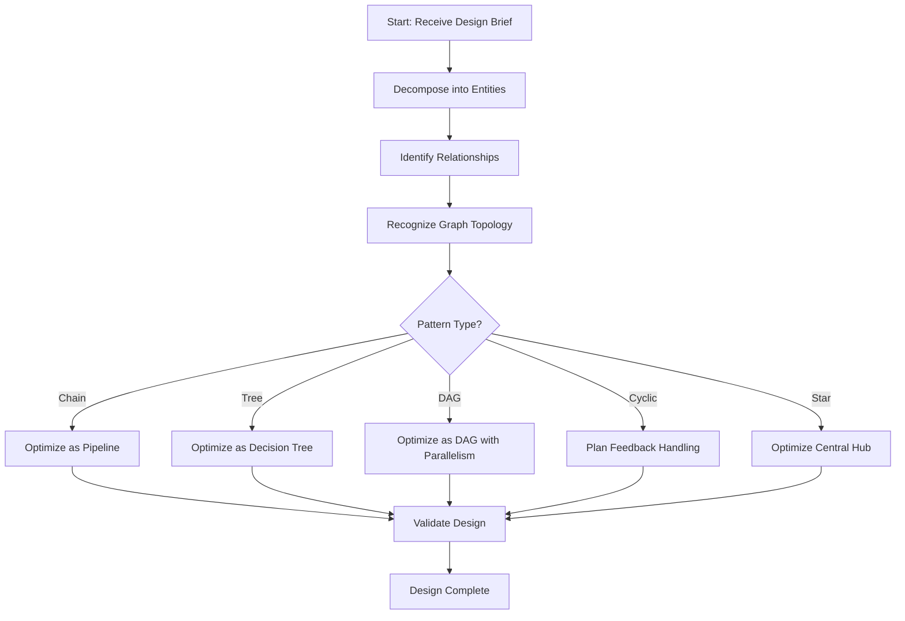
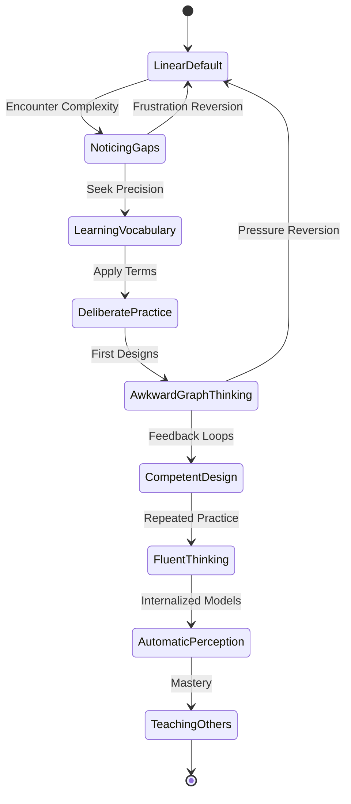
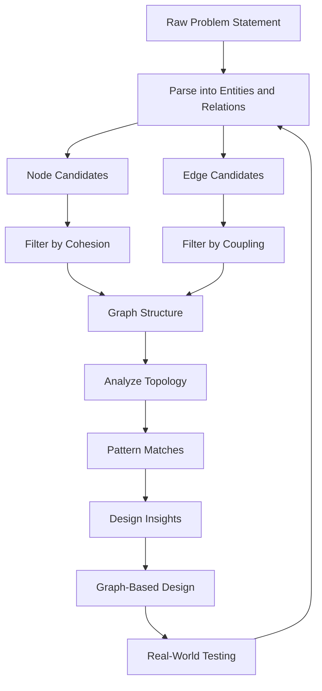
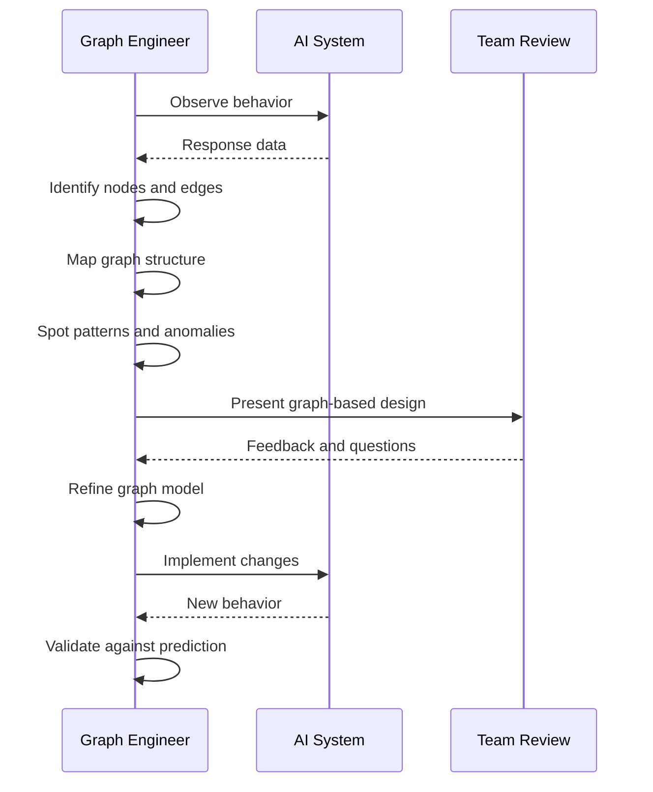

# Graph Thinking for AI Systems

## 📌 Overview

Graph Thinking is the cognitive shift from linear, sequential reasoning to network-based reasoning when designing, analyzing, and troubleshooting AI systems. Most people naturally think in straight lines: first do this, then do that, then do the next thing. This linear thinking served us well when AI systems were simple prompt-response pairs or even when they were linear chains of calls. But as systems have grown to include branching, parallelism, feedback loops, and multi-agent coordination, linear thinking becomes a liability. It leads to designs that are more complex than necessary, debugging sessions that miss the true source of problems, and missed opportunities for elegant solutions that a graph perspective would reveal immediately.

Graph Thinking is not about memorizing graph theory mathematics or learning to draw formal diagrams. It is about developing an intuition for seeing the world—and specifically, AI systems—as interconnected networks where the relationships between components matter as much as the components themselves. A graph thinker looks at a customer support system and sees not a sequence of steps but a network of specialized capabilities connected by data flows and decision points. They look at a debugging problem and consider not just what a specific node is doing wrong, but how the pattern of data flowing through edges might be causing unexpected behavior. This document provides practical techniques for developing this cognitive skill, building on the conceptual vocabulary established in 03_Core_Concepts.md.

## 🎯 Learning Objectives

By the end of this document, you will be able to recognize the limitations of linear thinking when applied to complex AI systems. You will understand the key differences between sequential, branching, and networked mental models for system design. You will be able to identify graph patterns in existing systems that were designed linearly, revealing hidden relationships and potential improvements. You will develop practical techniques for deliberately shifting your thinking from linear to graph-based reasoning during design sessions. You will also be able to communicate graph-based designs more effectively to teammates who are still thinking linearly, bridging the gap between these two cognitive styles.

These objectives build directly on the foundational concepts from 01_Fundamentals.md and the structural vocabulary from 03_Core_Concepts.md. They prepare you for the mental models cataloged in 05_Graph_Mental_Models.md and the architectural patterns described in 06_Graph_Architecture.md. Think of this document as the cognitive prerequisite—before you can design graph architectures or apply mental models, you must first learn to see the world in graphs.

## 🧠 Definition

Graph Thinking, in the context of AI systems engineering, is a cognitive orientation that prioritizes relationships, connections, and network structures over linear sequences and hierarchical containment. It is the habitual practice of asking "what connects to what" and "what flows between them" rather than "what comes after what." A graph thinker naturally decomposes problems into entities and their inter-relationships, spotting opportunities for parallelism, shared state, and feedback loops that a sequential thinker would miss. This orientation applies equally to designing new systems, understanding existing ones, and diagnosing failures.

Graph Thinking is distinct from Graph Theory. You do not need to understand adjacency matrices, Dijkstra's algorithm, or graph coloring to be an effective graph thinker. Graph Thinking is about practical system intuition, not mathematical formalism. It is closer to what software architects call "systems thinking" but with a specifically relational emphasis. Where systems thinking focuses on feedback loops and emergent behavior, Graph Thinking adds a precise vocabulary of nodes, edges, state, and composition that makes these intuitions explicit and communicable. This distinction matters because many practitioners are intimidated by the mathematical connotations of "graph" and assume they need formal training before they can begin. In reality, the core shift is conceptual, not mathematical.

## ❓ Why It Matters

Graph Thinking matters because the complexity ceiling of linear thinking is being hit across the AI industry. Early AI applications were simple: one prompt in, one response out. Then they evolved into chains—extract this, then transform that, then format the result. Chains are still fundamentally linear, and linear thinking handles them adequately. But modern AI systems involve retrieval-augmented generation with multiple knowledge sources, multi-agent debates, tool-calling with conditional branching, human-in-the-loop approval gates, and adaptive routing based on confidence scores. These systems are irreducibly graph-shaped, and trying to design or debug them with linear thinking is like trying to navigate a city with only a straight-edge compass.

The practical consequences of linear thinking in a graph-shaped world are severe. Designs become over-complicated because designers force graph-shaped problems into linear molds, adding unnecessary conditional logic and state variables to simulate what edges and nodes would express naturally. Debugging becomes frustrating because the root cause of a problem often lies not in a single node but in the interaction pattern between nodes—a relationship failure rather than a component failure. Onboarding new team members becomes slow because linear documentation cannot capture the true structure of the system. And evolution becomes risky because the hidden dependencies between non-adjacent nodes mean that changes have unpredictable ripple effects. Graph Thinking eliminates all of these problems by making the true structure of the system visible and manipulable.

## 🏛️ Core Concepts

The foundation of Graph Thinking rests on several interconnected concepts that together form a coherent cognitive framework. First is the concept of **relational primacy**: the recognition that in complex systems, the relationships between components often carry more information and have more impact than the components themselves. A prompt template is just text; it becomes powerful only when connected to context sources, tool definitions, and output validators through well-designed edges. Second is the concept of **emergent behavior**: the understanding that graph-structured systems can produce behaviors that no individual node could produce alone, and that these emergent behaviors are often the most valuable (and most dangerous) properties of the system.

Third is the concept of **structural isomorphism**: the ability to recognize when two systems have the same graph structure even when their content differs completely. A customer support workflow, a code review pipeline, and a research synthesis system might all share the same underlying graph topology—retrieve, evaluate, branch, aggregate—despite operating on entirely different domains. Recognizing these isomorphisms allows you to transfer design knowledge across domains. Fourth is the concept of **local reasoning**: the understanding that in a well-designed graph, each node only needs to understand its immediate neighbors and its own inputs/outputs, not the entire system. This is what makes graph systems scalable and composable. These concepts are explored in greater structural detail in 03_Core_Concepts.md and given practical form in 05_Graph_Mental_Models.md.

## 🧩 Key Components

Graph Thinking as a cognitive practice has several key components that work together. The first is **node perception**: the ability to look at a system or problem and identify the natural boundaries of discrete processing units. This means recognizing when a chunk of logic should be a single node versus when it should be decomposed further. A node that does too much is hard to test, reuse, and reason about; a node that does too little adds unnecessary complexity to the graph. Developing good node perception requires practice and feedback, and it improves dramatically once you have the vocabulary from 03_Core_Concepts.md for what a node's responsibilities should be.

The second component is **edge perception**: the ability to see the data, control, and dependency flows between nodes. This is often harder than node perception because edges are invisible in most code representations. When you look at a Python function, you can see the code (the node) but the data flowing into and out of it (the edges) is implicit in the call signatures and return values. Graph Thinkers learn to make edges explicit and visible, both in their designs and in their code. The third component is **pattern recognition**: the ability to spot common graph topologies—chains, stars, trees, cycles, diamonds—in the wild. The fourth component is **structural reasoning**: the ability to predict system behavior by reasoning about the graph structure rather than by tracing through individual node logic. Together, these components form the cognitive toolkit that enables effective Graph Thinking.

## 🧭 Mental Model

The primary mental model for Graph Thinking is the **city map model**. Imagine you are looking at a city from above. You see buildings (nodes), roads connecting them (edges), intersections where multiple roads meet (junction nodes), and neighborhoods where buildings of similar purpose cluster (sub-graphs). You understand that a city's character comes not from any single building but from the pattern of connections between buildings. A highway connects the airport to the downtown core; a side street connects a café to a residential area. Changing a single building has limited impact, but blocking a key intersection or removing a bridge can paralyze the entire city. This is exactly how graph-based AI systems work, and the city map model gives you an intuitive handle on concepts like bottlenecks, single points of failure, clustering, and path optimization.

A secondary mental model is the **ecosystem model**. Think of a forest ecosystem: trees, animals, fungi, water sources, and soil nutrients form a dense network of relationships. Removing a single species can cascade through the entire system in unpredictable ways. Adding a new species can have positive or negative effects depending on how it connects to existing species. The ecosystem model is particularly useful for understanding why interventions in AI systems often have unexpected side effects, and why adding a new node (like a retrieval step) can fundamentally change the behavior of seemingly unrelated parts of the system. Both of these mental models are elaborated in 05_Graph_Mental_Models.md, which catalogs six specific frameworks for reasoning about graph systems.

## 🗺️ Mind Map

## 🏗️ Architecture Diagram

## 🔄 Workflow

## ⚙️ Internal Working

Developing Graph Thinking follows a predictable internal process that strengthens with deliberate practice. The first stage is **awareness**, where you begin noticing that linear descriptions of systems feel incomplete. You might notice that a flowchart for your AI system has so many conditional branches that it looks more like a spider web than a straight line. This awareness is uncomfortable but essential—it signals that your cognitive model is expanding beyond its original boundaries. During this stage, you should actively seek out graph representations of systems you work with daily, even if you have to draw them yourself.

The second stage is **vocabulary acquisition**, where you learn the precise terms for the patterns you are noticing. This is where 03_Core_Concepts.md becomes essential: terms like node, edge, state, fan-out, fan-in, cycle, and composition give you the words to describe what you are seeing. Without this vocabulary, your graph intuitions remain vague and hard to communicate. With it, you can name specific patterns and discuss them precisely with colleagues. The third stage is **deliberate application**, where you consciously force yourself to think in graphs during design sessions. This feels slow and awkward at first, like writing with your non-dominant hand. The fourth stage is **automaticity**, where graph thinking becomes your default mode. You see graphs everywhere—conversations, organizations, codebases—and you naturally reason about them in terms of nodes, edges, and emergent behavior.

## 🔀 Execution Flow

## 📊 Lifecycle

## 📡 Data Flow

## 🤝 Interaction Flow

## 🌍 Real-World Analogy

Consider the difference between a recipe and a restaurant kitchen. A recipe is linear: do step one, then step two, then step three. It works perfectly when you are cooking alone in your home kitchen. A restaurant kitchen, however, is a graph. Multiple cooks work at different stations (nodes), each receiving ingredients and partially completed dishes from other stations (edges). The expeditor routes orders to the appropriate stations based on dish type and current load (dynamic routing). Some dishes require components from multiple stations that must arrive simultaneously (synchronization). When the grill station falls behind, the expeditor reroutes orders or adjusts timing (adaptive behavior). The kitchen's efficiency comes not from any single cook's speed but from the graph structure of stations, flows, and routing decisions.

Most AI system designers are still writing recipes when they should be designing kitchens. They specify a fixed sequence of operations that works for the happy path but collapses when any step takes longer than expected, produces unexpected output, or needs to branch based on incoming data. A graph-thinking designer would instead identify the natural processing stations (retrieval, transformation, validation, formatting), connect them with explicit data flows, and add routing logic that can adapt to varying conditions. The kitchen analogy also illustrates why Graph Thinking scales: adding a new dish to a recipe means adding a whole new linear sequence, but adding a new dish to a kitchen often just means connecting existing stations in a new pattern. This compositional power is central to the architectural patterns in 06_Graph_Architecture.md.

## 💡 Practical Example

Imagine you are building an AI system that processes customer support tickets. A linear thinker would design it as a sequence: receive ticket, classify category, generate response, send to customer. This works until you need to handle escalations, require manager approval for refunds over a certain amount, check a knowledge base for known issues, or route technical questions to a specialist agent. Each new requirement adds another conditional branch to the linear flow, making the code increasingly tangled and the behavior increasingly hard to predict.

A graph thinker approaches the same problem differently. They identify the natural nodes: a ticket classifier, a knowledge base retriever, a response generator, a refund handler, a specialist router, and an approval gate. Then they map the edges: the classifier fans out to both the retriever and the specialist router based on category; the refund handler connects to the approval gate for amounts over the threshold; the approval gate connects back to the response generator with the approved or rejected refund decision. The result is a clean, modular graph where each node has a single responsibility and each edge has a clear purpose. Adding a new requirement—say, sentiment analysis to detect frustrated customers—means adding a sentiment node and connecting it to the routing logic, without touching any existing nodes. This example illustrates the compositional flexibility that Graph Thinking enables, and it previews the architectural patterns detailed in 06_Graph_Architecture.md.

## 🧪 Use Cases

Graph Thinking is valuable in several concrete scenarios that AI practitioners encounter regularly. The first is **system design**: when you are architecting a new AI system from scratch, Graph Thinking helps you identify the natural node boundaries and edge connections before you write any code. This upfront structural clarity saves enormous time downstream because the code structure mirrors the graph structure, making the system easier to build, test, and evolve. The second is **debugging**: when a system produces unexpected output, Graph Thinking directs your attention to the edges between nodes rather than just the nodes themselves. Often the bug is not in a node's logic but in the data flowing through an edge—a type mismatch, a missing field, or a routing error that sends data to the wrong node.

The third use case is **system evolution**: when you need to add new capabilities to an existing system, Graph Thinking helps you identify where new nodes should connect and whether the existing graph topology can accommodate the change without restructuring. The fourth is **team communication**: when you need to explain a complex system to a new team member, a graph diagram communicates the system's structure far more effectively than a linear description or a code walkthrough. The fifth is **cross-system analysis**: when you are comparing multiple AI systems or looking for reusable patterns across projects, Graph Thinking helps you recognize structural isomorphisms—cases where different systems share the same graph topology and can therefore share design knowledge and even implementation components.

## ⚖️ Comparison

| Aspect | Linear Thinking | Graph Thinking |
|--------|----------------|----------------|
| **Primary Question** | What happens next? | What is connected to what? |
| **System View** | Sequence of steps | Network of relationships |
| **Complexity Handling** | Conditionals and flags | Topology and routing |
| **Debugging Focus** | Individual component logic | Edge data and interaction patterns |
| **Evolution Model** | Insert steps into sequence | Add nodes and connect edges |
| **Scalability** | Degrades with branching | Scales with modularity |
| **Communication** | Narratives and lists | Diagrams and topology |
| **Failure Mode** | Hidden dependencies | Visible bottlenecks |
| **Cognitive Load** | Low initially, high at scale | Moderate initially, low at scale |
| **Best For** | Simple pipelines | Complex, evolving systems |

The comparison reveals that neither approach is universally superior. Linear thinking is appropriate for simple, stable systems where the processing sequence never changes. Graph Thinking is appropriate for complex, evolving systems where the relationships between components matter more than any fixed sequence. The mistake is applying linear thinking to graph-shaped problems—or, less commonly, over-engineering a simple system with unnecessary graph complexity. As discussed in 06_Graph_Architecture.md, the right approach often starts simple and adds graph structure as complexity demands it.

## ✅ Best Practices

The most effective practice for developing Graph Thinking is **explicit graph mapping**. Before designing any AI system, draw the graph: identify the nodes, draw the edges, label the data flowing on each edge, and annotate any decision points. This does not need to be a formal diagram—even a whiteboard sketch is sufficient. The act of drawing forces you to make your implicit structural assumptions explicit, which is where most design errors live. A second powerful practice is **topology-first design**: instead of starting with what each node does, start with how nodes connect. Decide on the overall graph shape (chain, tree, DAG, star) before specifying individual node behavior. This ensures the system's structure is sound before you invest in implementation details.

A third practice is **edge auditing**: periodically review the edges in your system, not just the nodes. Are there edges carrying unnecessary data? Are there missing edges that force nodes to communicate indirectly through intermediaries? Are there edges with implicit contracts that should be made explicit? This practice catches many design smells that code reviews miss. A fourth practice is **pattern library maintenance**: keep a catalog of graph topologies you have used successfully, with notes on when each pattern is appropriate. Over time, this library becomes your most valuable design tool, allowing you to recognize situations where a known pattern applies and avoiding the temptation to invent a novel structure when a proven one exists. These practices connect directly to the mental models in 05_Graph_Mental_Models.md and the architectural patterns in 06_Graph_Architecture.md.

## ❌ Common Mistakes

The most common mistake is **premature graphification**: applying graph structure to problems that are genuinely linear. Not every system needs to be a graph, and forcing graph structure onto a simple pipeline adds complexity without benefit. If a system truly is a sequence of steps with no branching, no parallelism, and no feedback, represent it as a chain and move on. A related mistake is **over-decomposition**: breaking a system into too many tiny nodes that each do almost nothing. This creates a graph that is technically correct but practically unreadable, with so many nodes and edges that the overall structure is lost in the noise. The antidote is to ensure each node represents a meaningful, cohesive unit of work—as discussed in 03_Core_Concepts.md.

Another frequent mistake is **ignoring edge semantics**: drawing edges between nodes without clearly defining what data flows on those edges, what format it takes, and what the sending and receiving nodes expect. An edge without clear semantics is worse than no edge at all because it creates a false sense of connection. A fourth mistake is **static graph thinking**: treating the graph as a fixed structure that never changes. In practice, many AI systems have dynamic graphs where nodes are added, removed, or reconnected at runtime based on the input. Failing to account for this dynamism leads to designs that are correct for the initial configuration but break as the system evolves. The architectural patterns in 06_Graph_Architecture.md address how to handle both static and dynamic graph structures.

## 🚀 Advanced Topics

For practitioners who have internalized the basics of Graph Thinking, several advanced topics offer deeper capabilities. **Dynamic graph topology** involves systems where the graph structure itself changes at runtime based on the data being processed. An example is an AI research assistant that adds new retrieval nodes when it discovers a new knowledge domain relevant to the query. Designing for dynamic topology requires thinking about graph mutation as a first-class concern, with explicit rules for when and how nodes and edges are added or removed. This connects to the adaptive architecture patterns in 06_Graph_Architecture.md.

**Multi-scale graph reasoning** involves simultaneously reasoning about a system at multiple levels of abstraction: the macro level (overall system topology), the meso level (sub-graph structures and their interactions), and the micro level (individual node and edge behavior). Expert Graph Engineers fluently shift between these scales, using macro-level reasoning for architectural decisions, meso-level reasoning for design reviews, and micro-level reasoning for debugging. This multi-scale capability is a hallmark of expertise and is supported by the mental models in 05_Graph_Mental_Models.md. A third advanced topic is **graph isomorphism detection**: the ability to recognize when two seemingly different systems share the same underlying graph structure, enabling design knowledge transfer and component reuse across projects and domains. This is perhaps the most powerful application of Graph Thinking because it allows expertise gained in one context to compound across all future contexts.