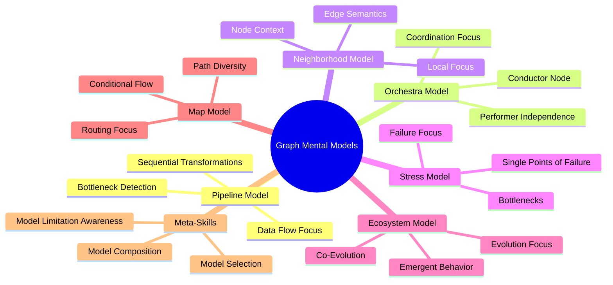
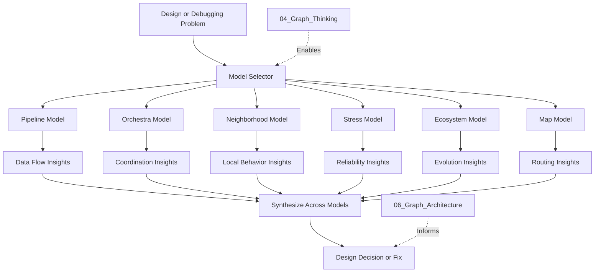
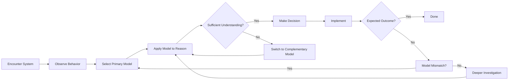
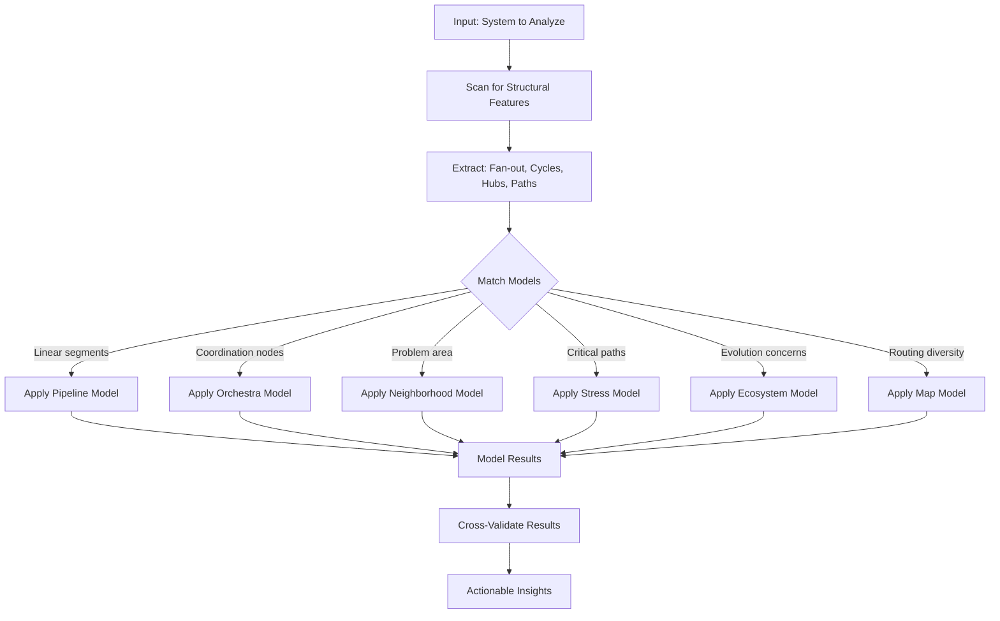
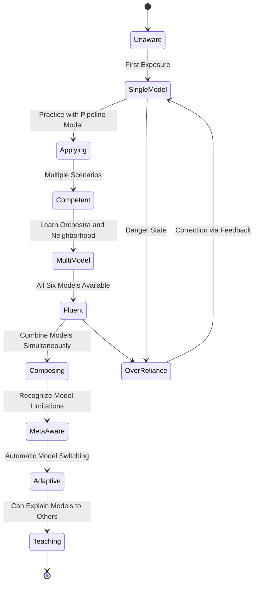
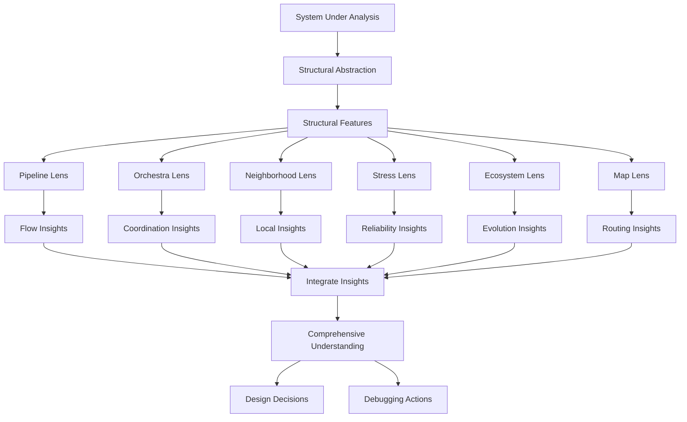
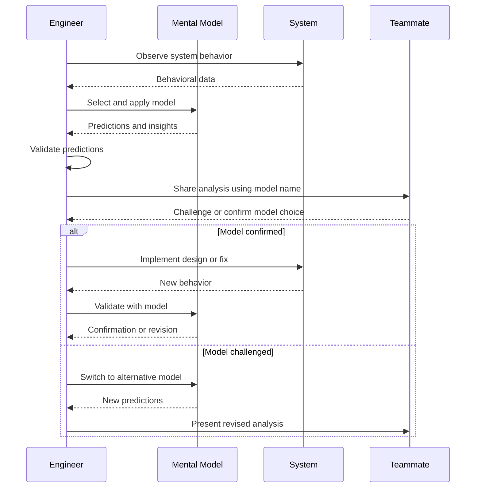

# Graph Mental Models

## 📌 Overview

Mental models are the internal cognitive frameworks that allow us to understand, reason about, and predict the behavior of complex systems. In Graph Engineering, mental models serve as the bridge between the abstract formalism of nodes, edges, and state covered in 03_Core_Concepts.md and the practical reality of designing and debugging AI systems. While 04_Graph_Thinking.md described the cognitive shift from linear to networked reasoning, this document catalogs the specific mental models that experienced Graph Engineers use to make sense of graph-based systems. These models are not theoretical constructs—they are practical tools that practitioners use daily to design systems, diagnose problems, and communicate with teammates about structural decisions.

A mental model for a graph system serves three critical functions. First, it provides a **predictive framework** that lets you anticipate how the system will behave under various conditions without having to run it. Second, it provides a **diagnostic framework** that helps you locate the source of problems when the system behaves unexpectedly. Third, it provides a **communicative framework** that enables concise, precise discussion about system design and behavior with other engineers. This document presents six mental models that have proven most effective for Graph Engineering, explains when each is most useful, and shows how to apply them to real-world design and debugging scenarios that arise in AI system development.

## 🎯 Learning Objectives

By completing this document, you will be able to identify and apply six core mental models for reasoning about graph-based AI systems. You will understand when each model is most appropriate and when it might lead you astray. You will be able to switch between models fluidly during a single design or debugging session, using each model's strengths to compensate for the others' weaknesses. You will also be able to communicate your reasoning to teammates by naming the model you are using, which dramatically improves design discussions by making implicit assumptions explicit. These capabilities build on the cognitive shift described in 04_Graph_Thinking.md and prepare you for the architectural decisions in 06_Graph_Architecture.md.

The models presented here are ordered from most commonly used to most specialized. You should internalize the first three models thoroughly before moving to the more advanced ones. Each model is presented with its core intuition, its domain of applicability, its known limitations, and a concrete example applied to an AI system. Together, they form a comprehensive cognitive toolkit for Graph Engineering that will serve you throughout your career, regardless of how the specific technologies and frameworks evolve over time.

## 🧠 Definition

A Graph Mental Model is a simplified, internal representation of a graph-structured system that preserves the essential structural features relevant to a particular reasoning task while abstracting away irrelevant details. It is not a diagram or a document—it is a cognitive structure that lives in your mind and allows you to simulate the system's behavior, predict the effects of changes, and diagnose the causes of failures. Mental models are inherently lossy: they simplify reality in order to make it tractable for human reasoning. The skill lies in choosing simplifications that preserve the features that matter for the task at hand while discarding features that do not.

In Graph Engineering specifically, mental models operate at the intersection of structure and behavior. They allow you to reason about how the graph's structure determines its behavior, and how behavioral observations constrain the possible structures that could have produced them. This bidirectional reasoning—from structure to behavior and from behavior to structure—is the hallmark of expertise in Graph Engineering. Novices can reason forward (given this structure, what will happen?) but struggle to reason backward (given this behavior, what structure must exist?). The mental models in this document are designed to support both directions of reasoning, making them powerful tools for both design and debugging.

## ❓ Why It Matters

Mental models matter because they determine the quality of your design decisions and the speed of your debugging. When you approach a complex AI system without a clear mental model, you are forced to reason about it from first principles every time, which is slow and error-prone. With a well-developed mental model, you can quickly categorize a system's structure, predict its behavior, identify potential problems, and communicate your analysis to others. The difference between an engineer with good mental models and one without is not a difference of intelligence—it is a difference of having efficient cognitive tools that reduce the cognitive load of complex reasoning.

In the context of AI systems specifically, mental models matter because these systems are inherently opaque. Unlike traditional software where you can read the code and trace the execution path, AI systems involve non-deterministic components (language models, retrieval systems) whose behavior cannot be predicted from code inspection alone. Mental models become even more critical when you cannot rely on code-level reasoning. They allow you to reason about the system at a structural level, identifying potential failure modes based on the graph topology rather than the implementation details of individual nodes. This structural reasoning is robust across implementation changes, making your expertise durable even as specific AI models and frameworks evolve. The architectural patterns in 06_Graph_Architecture.md are built on the assumption that you can reason about them using these mental models.

## 🏛️ Core Concepts

The mental models presented in this document rest on several foundational concepts. The first is **structural abstraction**: the ability to ignore implementation details and focus on the graph's shape. When using a mental model, you should think in terms of "this node connects to that node" rather than "this Python function calls that API." This abstraction is what makes mental models portable across different implementations and technology stacks. The second concept is **behavioral implication**: the understanding that each structural pattern implies specific behavioral properties. A cycle implies potential for feedback loops and oscillation. A fan-out implies potential for parallelism but also for consistency challenges. A diamond implies potential for redundant computation that needs coordination.

The third concept is **model selection**: the ability to choose the right mental model for the task at hand. No single model captures everything important about a system. The pipeline model is great for understanding data flow but poor for understanding feedback dynamics. The ecosystem model is great for understanding emergent behavior but poor for understanding individual node behavior. Expert Graph Engineers maintain a repertoire of models and switch between them fluidly, using each model's strengths while remaining aware of its blind spots. The fourth concept is **model composition**: the ability to combine multiple mental models to reason about different aspects of a system simultaneously. You might use the pipeline model to understand the primary data flow while simultaneously using the stress model to identify potential failure points. These four concepts form the meta-framework for using the six specific models presented in the following sections.

## 🧩 Key Components

The six mental models that form the core toolkit for Graph Engineering are: the **Pipeline Model**, which views the graph as a data processing pipeline where information flows through a sequence of transformations; the **Orchestra Model**, which views the graph as a collection of independent performers coordinated by a conductor node; the **Neighborhood Model**, which focuses on a single node and its immediate surroundings, treating the rest of the graph as context; the **Stress Model**, which identifies the points in the graph most likely to fail under load or unusual conditions; the **Ecosystem Model**, which views the graph as a living system where nodes co-evolve and influence each other's behavior; and the **Map Model**, which views the graph as a terrain where data takes different paths depending on routing conditions.

Each model emphasizes different aspects of the graph and is suited to different tasks. The Pipeline Model is best for understanding data transformations and identifying unnecessary processing steps. The Orchestra Model is best for understanding coordination and synchronization in multi-agent systems. The Neighborhood Model is best for debugging a specific node's behavior in context. The Stress Model is best for reliability analysis and capacity planning. The Ecosystem Model is best for understanding long-term system evolution and emergent behaviors. The Map Model is best for understanding routing logic and data flow diversity. Knowing when to apply each model—and when a model is leading you astray—is a core skill that develops with practice and is supported by the cognitive foundations in 04_Graph_Thinking.md.

## 🧭 Mental Model

The meta-mental-model for this entire document is the **lens kit metaphor**. Just as a photographer carries multiple lenses and switches between them to capture different aspects of a scene—a wide-angle lens for landscapes, a macro lens for details, a telephoto lens for distant subjects—a Graph Engineer carries multiple mental models and switches between them to reason about different aspects of a system. No single lens captures the complete scene, and no single mental model captures the complete system. The skill is in knowing which lens to use for which purpose, and in learning to see the same system through different lenses to build a more complete understanding than any single lens could provide.

This metaphor also highlights an important limitation: just as a lens can distort as well as reveal, a mental model can mislead as well as clarify. A wide-angle lens exaggerates perspective; the Pipeline Model can make you see cycles where none exist by mentally straightening feedback loops. A macro lens has extremely shallow depth of field; the Neighborhood Model can make you lose sight of system-level behavior by focusing too narrowly. Expertise is not just about knowing when to use each model but also about recognizing when a model is distorting your perception and consciously switching to a different one. This meta-awareness—thinking about your own thinking—is what separates competent practitioners from true experts.

## 🗺️ Mind Map

## 🏗️ Architecture Diagram

## 🔄 Workflow

## ⚙️ Internal Working

Applying a mental model internally involves four cognitive steps that happen rapidly and often unconsciously in experienced practitioners. The first step is **pattern matching**: recognizing which of your available models best fits the current situation. When you look at a customer support AI system, your brain rapidly matches it against the Pipeline Model (it processes tickets through stages), the Orchestra Model (multiple agents need coordination), and the Map Model (tickets take different routes based on category). This matching happens below conscious awareness and is based on structural features you have learned to recognize through the Graph Thinking practices described in 04_Graph_Thinking.md.

The second step is **projection**: using the selected model to predict the system's behavior or identify potential issues. If you are using the Pipeline Model, you project the data through each stage and look for transformations that lose information, introduce latency, or create bottlenecks. If you are using the Stress Model, you project load onto each node and look for the points where capacity is most likely to be exceeded. The third step is **validation**: checking whether the model's predictions match observed reality. If they do not, you either adjust your understanding of the system or switch to a different model. The fourth step is **articulation**: translating your model-based reasoning into language or diagrams that others can understand. This step is crucial for team effectiveness and is where explicitly naming the model you are using becomes valuable—it allows teammates to follow your reasoning and to point out if you are applying a model inappropriately.

## 🔀 Execution Flow

## 📊 Lifecycle

## 📡 Data Flow

## 🤝 Interaction Flow

## 🌍 Real-World Analogy

Consider the difference between how a novice and an expert doctor diagnose a patient. A novice doctor works through a checklist: check temperature, check blood pressure, ask about symptoms, order blood tests. This is like having only one mental model—the checklist model—and applying it mechanically regardless of the situation. An experienced doctor, by contrast, has multiple diagnostic frameworks: the infectious disease model (look for fever, exposure history, symptom clusters), the musculoskeletal model (look for pain patterns, range of motion, injury history), the cardiovascular model (look for chest pain, shortness of breath, risk factors). Within seconds of meeting a patient, the experienced doctor has unconsciously matched the patient's presentation against multiple models, selected the most promising ones, and begun gathering information to confirm or reject hypotheses generated by those models.

Graph Engineering works the same way. A novice looks at an AI system and sees a flat list of components. An expert looks at the same system and simultaneously sees it through multiple lenses: the data flow pipeline, the coordination orchestra, the stress points, the routing map. Each lens highlights different features and suggests different potential problems or improvements. The expert does not consciously switch between models—they activate simultaneously, like a doctor who is simultaneously considering infectious, cardiac, and pulmonary causes while examining a patient with a cough and fever. This parallel model activation is what makes experts fast and thorough. The doctor analogy also illustrates the danger of model fixation: just as a doctor who is too focused on cardiac causes might miss a pulmonary embolism, a Graph Engineer who is too focused on the Pipeline Model might miss a coordination failure that the Orchestra Model would have revealed immediately.

## 💡 Practical Example

Imagine you are debugging an AI content moderation system that occasionally allows harmful content through. A novice engineer looks at the classification node and starts tweaking its prompt, temperature, and threshold settings. An engineer with the Pipeline Model examines the entire data flow and discovers that the text preprocessing node is stripping certain Unicode characters that the classifier relies on to detect obfuscated harmful content. The Pipeline Model revealed this because it tracks data transformations at each stage, making information loss visible. An engineer with the Neighborhood Model, focusing on the classifier node, examines its incoming edges and discovers that one of the three retrieval nodes is returning cached results from hours ago, missing recent policy updates. The Neighborhood Model revealed this because it focuses on everything flowing into and out of a specific node.

An engineer with the Stress Model examines the system under high load and discovers that the queue between the retrieval stage and the classification stage overflows during traffic spikes, causing some content to bypass the classifier entirely. The Stress Model revealed this because it focuses on capacity constraints and failure modes under pressure. An engineer with the Map Model examines the routing logic and discovers that content flagged as "borderline" is routed to a human reviewer queue that has a maximum wait time; when the queue is full, borderline content is automatically approved instead of being held for review. Each model revealed a different root cause, and the true solution required addressing all four issues. This example demonstrates why model composition—the ability to apply multiple models simultaneously—is essential for thorough analysis. These structural reasoning capabilities directly support the architectural decisions in 06_Graph_Architecture.md.

## 🧪 Use Cases

The six mental models apply to a wide range of practical scenarios in AI system development. The **Pipeline Model** is most useful during initial system design, when you need to identify the core data transformations and ensure nothing important is lost between stages. It is also valuable during performance optimization, where bottlenecks in the pipeline are often the primary source of latency. The **Orchestra Model** is essential for multi-agent systems, where the challenge is not individual agent capability but coordination between agents. If you are building a system where a planner agent delegates to specialist agents, the Orchestra Model helps you design the conductor node and the communication protocols between performers.

The **Neighborhood Model** is the go-to model for debugging. When a specific node is producing unexpected output, zooming in on its neighborhood—its inputs, outputs, upstream dependencies, and downstream consumers—usually reveals the issue faster than examining the entire system. The **Stress Model** is critical for production systems that must handle variable load. Before deploying, applying the Stress Model helps you identify and mitigate single points of failure, capacity bottlenecks, and graceful degradation strategies. The **Ecosystem Model** is most valuable for long-lived systems that evolve over time. If you are planning a major refactor or adding significant new capabilities, the Ecosystem Model helps you predict how changes will propagate through the system and what emergent behaviors might result. The **Map Model** is essential for systems with complex routing logic, such as customer support systems that route different query types to different processing paths.

## ⚖️ Comparison

| Model | Primary Question | Best For | Blind Spot | Complexity Level |
|-------|-----------------|----------|------------|-----------------|
| **Pipeline** | What transforms the data? | Data flow analysis, optimization | Feedback loops, coordination | Low |
| **Orchestra** | Who coordinates whom? | Multi-agent systems, synchronization | Data flow details, edge cases | Medium |
| **Neighborhood** | What surrounds this node? | Debugging, node-level design | System-level patterns | Low |
| **Stress** | What breaks first? | Reliability, capacity planning | Normal operation behavior | Medium |
| **Ecosystem** | How does it evolve? | Long-term planning, refactoring | Immediate technical issues | High |
| **Map** | Where does data go? | Routing, conditional flows | Node internals, transformations | Medium |

The comparison table reveals that no single model dominates across all dimensions. The Pipeline Model is the easiest to learn and apply but misses coordination and feedback issues entirely. The Ecosystem Model is the most comprehensive but requires the most experience to apply effectively. The Neighborhood Model is the most focused, making it ideal for targeted debugging but inappropriate for system-level design. In practice, expert Graph Engineers use the Pipeline Model as their default and switch to other models as the situation demands. This progressive model adoption mirrors the learning path described in 04_Graph_Thinking.md and prepares you for the architectural perspective in 06_Graph_Architecture.md.

## ✅ Best Practices

The single most impactful practice for developing mental model expertise is **explicit model naming** in design discussions. When presenting a design or debugging analysis, start by stating which model you are using: "Looking at this through the Pipeline Model, I see three potential information loss points." This practice serves multiple purposes: it makes your reasoning transparent, it allows teammates to challenge your model choice if they think a different model would be more appropriate, and it gradually builds a shared vocabulary within the team. Over time, team members develop a shorthand where simply naming a model evokes an entire framework of analysis, dramatically speeding up design discussions.

A second powerful practice is **model rotation exercises**: deliberately analyzing the same system through all six models in sequence. This exercise builds model-switching fluency and often reveals insights that a single-model analysis would miss. Set a timer for five minutes per model and force yourself to generate at least three observations or predictions using each model. A third practice is **model failure post-mortems**: when a mental model led you to an incorrect conclusion, document what went wrong and why. Did you apply the model outside its domain of applicability? Did the model's simplifications hide a critical detail? Over time, these post-mortems build a catalog of model limitations that helps you avoid similar mistakes in the future. A fourth practice is **model teaching**: explaining mental models to others forces you to articulate implicit assumptions and deepens your own understanding. These practices are most effective when combined with the Graph Thinking techniques from 04_Graph_Thinking.md.

## ❌ Common Mistakes

The most dangerous mistake is **model monotheism**: becoming so attached to one mental model that you apply it to every situation regardless of fit. Engineers who discovered the Pipeline Model early in their careers often fall into this trap, analyzing every system as a data pipeline and missing coordination failures, routing errors, and evolutionary dynamics that other models would reveal. The antidote is to deliberately cultivate model diversity and to practice model switching, as described in the workflow section above. A related mistake is **model conflation**: treating two different models as if they are the same thing. The Pipeline Model and the Map Model both deal with data flow, but they ask different questions and highlight different features. Conflating them leads to muddled analysis.

Another common mistake is **over-abstracting**: applying a mental model at such a high level of abstraction that it loses all predictive power. If your application of the Orchestra Model tells you only that "nodes need to coordinate" without identifying specific coordination challenges, the model is not earning its cognitive keep. Good mental model application produces specific, testable predictions. A fourth mistake is **ignoring model context**: applying a model developed for one type of system to a fundamentally different type. The Orchestra Model works well for multi-agent AI systems but poorly for simple retrieval-augmented generation pipelines. Forcing the model onto an inappropriate system leads to analysis that sounds sophisticated but produces no actionable insights. Finally, a subtle but important mistake is **failing to update models**: as a system evolves, the mental model that was accurate at launch may become increasingly inaccurate. Regularly revisiting and updating your mental models ensures they remain aligned with reality. These pitfalls are mitigated by the architectural awareness developed in 06_Graph_Architecture.md.

## 🚀 Advanced Topics

For practitioners who have mastered the six core models, several advanced topics extend their capabilities further. **Model hybridization** involves creating custom mental models by combining elements of two or more core models. For example, combining the Pipeline Model with the Stress Model creates a "Stressed Pipeline" model that specifically tracks how bottlenecks in the data flow degrade under increasing load. This hybrid model is more powerful than either parent model alone for performance analysis of production systems. Developing effective hybrids requires deep familiarity with the component models and clear understanding of what each contributes.

A second advanced topic is **organizational mental models**: extending the concept of mental models from individual cognition to team and organizational cognition. When a team shares a set of mental models, design discussions become dramatically more efficient because everyone is operating from the same cognitive framework. Building organizational mental models requires deliberate investment in training, documentation, and vocabulary standardization. A third advanced topic is **computational mental models**: using AI systems themselves to assist in applying mental models. An AI agent trained on graph analysis patterns can help you identify which model is most appropriate for a given system and can even generate predictions using a specified model. This creates a powerful human-AI collaboration loop where the AI handles the mechanical aspects of model application while the human provides the judgment about model selection and interpretation. These advanced topics connect directly to the architectural scaling challenges addressed in 06_Graph_Architecture.md, particularly the challenge of maintaining cognitive clarity as systems grow to hundreds of nodes across multiple teams.