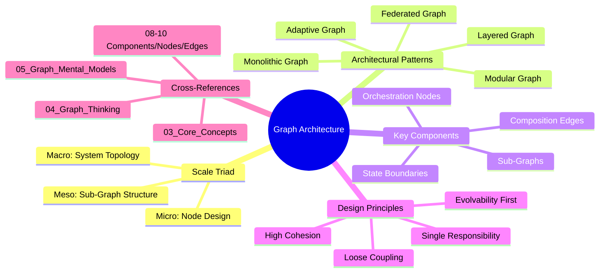
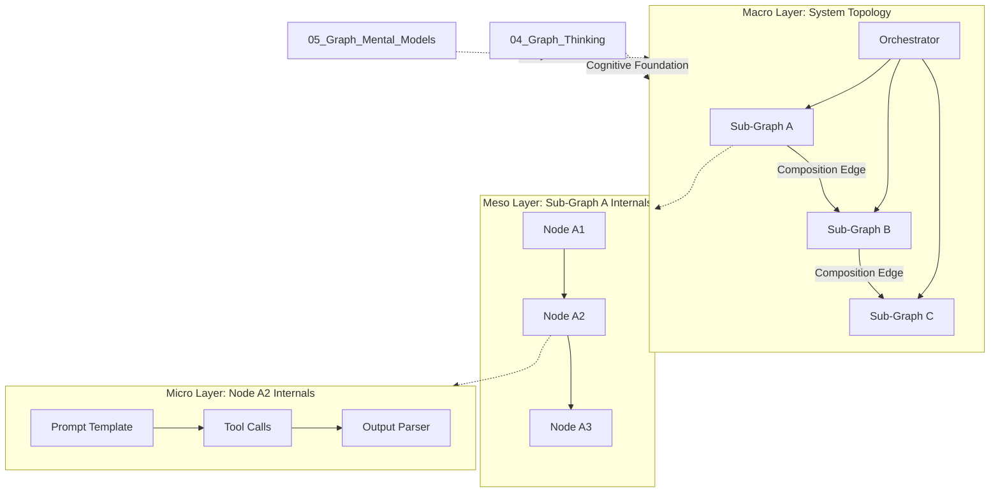
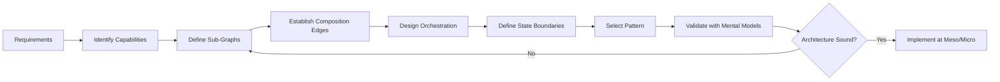
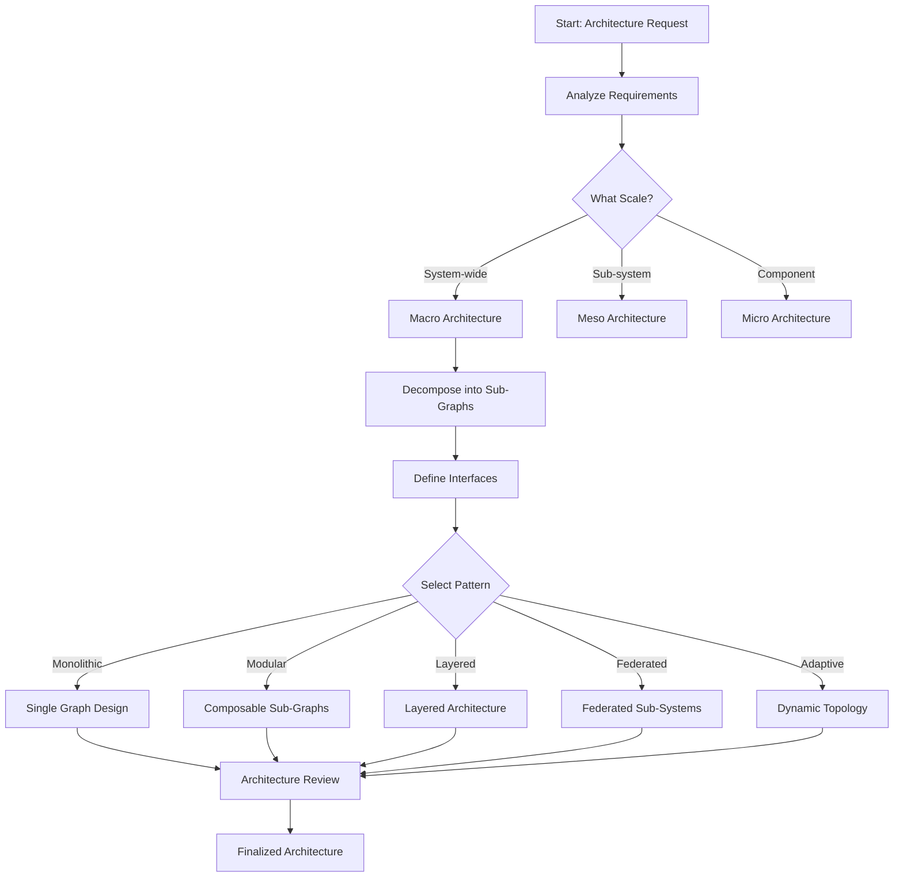
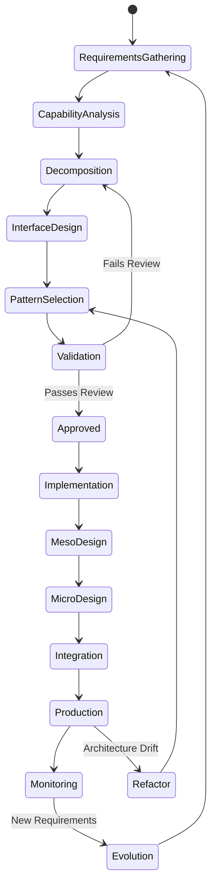
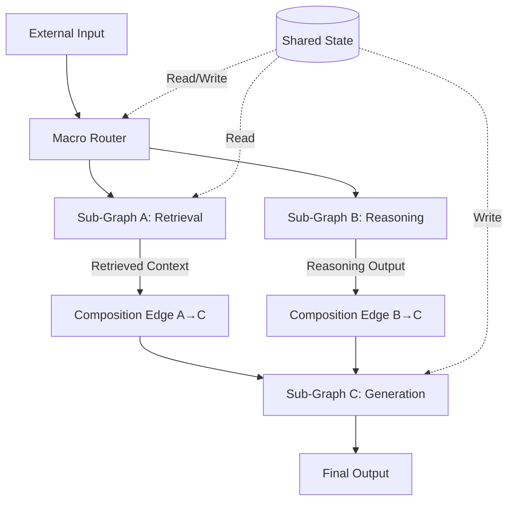
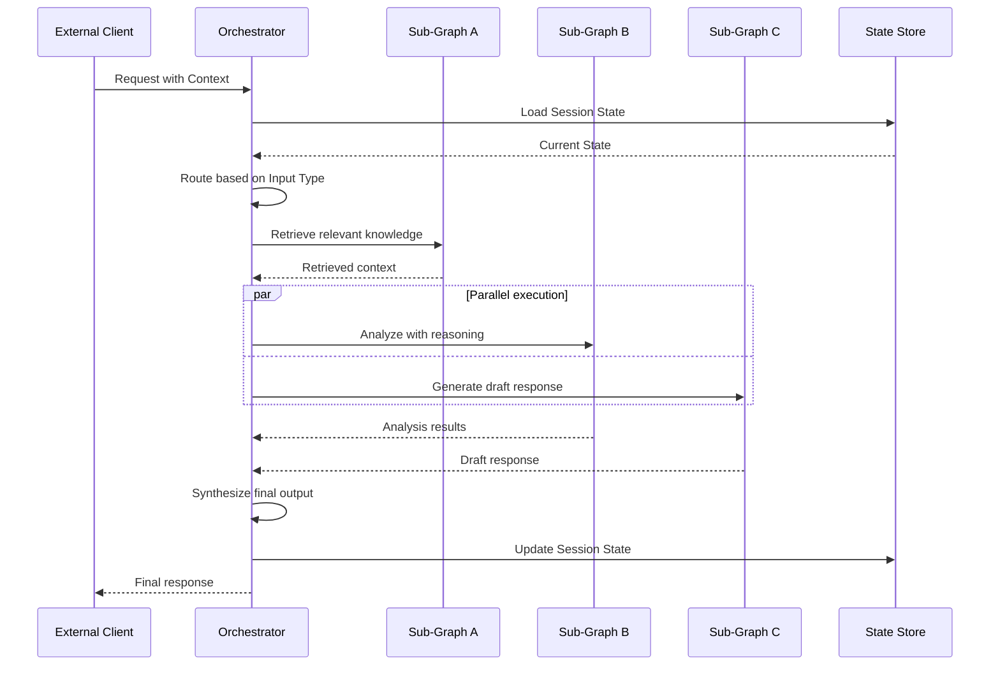

# Graph Architecture for AI Systems

## 📌 Overview

Graph Architecture for AI Systems addresses the high-level structural patterns and design principles that govern how graph-based AI systems are organized at scale. While the core concepts in 03_Core_Concepts.md defined the individual building blocks and 05_Graph_Mental_Models.md provided frameworks for understanding them, this document zooms out to the architectural level: how do graphs compose into layers? How do you organize a system with hundreds of nodes? What are the proven architectural patterns that experienced Graph Engineers use to manage complexity, ensure reliability, and enable evolution? These are the questions that Graph Architecture answers, building directly on the cognitive shift introduced in 04_Graph_Thinking.md.

Architecture in the context of Graph Engineering is not about choosing specific technologies or frameworks. It is about making structural decisions that have long-term consequences for the system's maintainability, performance, and evolvability. Should the system be a single monolithic graph or a collection of composed sub-graphs? Should state be centralized or distributed? How should the system handle failures and degradation? These decisions are architectural because they are expensive to change once the system is built, and they constrain or enable many downstream design choices. This document presents the architectural patterns, layers, and principles that help you make these decisions well, drawing on the mental models from 05_Graph_Mental_Models.md as analytical tools.

## 🎯 Learning Objectives

By the end of this document, you will be able to identify and apply the three-layer architectural framework—macro, meso, and micro—that organizes graph-based AI systems at different scales. You will understand the five fundamental architectural patterns—monolithic, modular, layered, federated, and adaptive—and know when each is appropriate. You will be able to make informed decisions about state management, error handling, and composition boundaries in graph systems. You will also understand how architectural decisions interact with the mental models from 05_Graph_Mental_Models.md and the cognitive skills from 04_Graph_Thinking.md, giving you a complete toolkit for designing graph-based AI systems.

These objectives require that you are already comfortable with the core vocabulary from 03_Core_Concepts.md and have begun developing the graph-oriented thinking described in 04_Graph_Thinking.md. Architecture is the highest level of design abstraction in Graph Engineering, and it depends on a solid foundation of concepts, thinking skills, and mental models. If you find the material in this document challenging, return to the earlier documents and strengthen your foundation before proceeding. The architectural patterns presented here will be referenced throughout the rest of the series, including the component-level details in 08_Graph_Components.md, 09_Graph_Nodes.md, and 10_Graph_Edges.md.

## 🧠 Definition

Graph Architecture is the discipline of organizing graph-based AI systems into coherent structural layers, establishing composition boundaries between sub-systems, and selecting architectural patterns that balance competing concerns like performance, reliability, maintainability, and evolvability. It is analogous to software architecture in traditional engineering but adapted for the unique properties of graph-structured systems: their emphasis on relationships over components, their potential for dynamic topology, and their frequent use of non-deterministic nodes such as language models and retrieval systems. A Graph Architecture defines not what individual nodes do but how nodes are grouped, connected, and managed as a coherent system.

Graph Architecture operates at a level above individual node design and below organizational strategy. It is concerned with questions like: Should this collection of nodes be a single sub-graph or should it be decomposed into separate sub-graphs that communicate through well-defined interfaces? Should the routing logic be centralized in a single orchestrator node or distributed across multiple decision points? Should the system's state be maintained in a shared store or partitioned across local node state? These are structural decisions that affect every aspect of the system's behavior, and they are difficult or impossible to change once the system is built. The architectural patterns in this document provide proven answers to these questions, while the mental models in 05_Graph_Mental_Models.md provide the analytical tools for evaluating trade-offs when no standard pattern fits perfectly.

## ❓ Why It Matters

Graph Architecture matters because the gap between a system that works and a system that works well at scale is entirely an architectural gap. A small AI system with five nodes can work fine with minimal architectural thought—you connect them, test them, and ship them. But as the system grows to fifty nodes, then five hundred, then five thousand, the lack of architectural structure becomes a crippling liability. Nodes become entangled with each other, making changes risky. State becomes scattered and inconsistent. Failure modes become unpredictable because the interaction effects between nodes exceed any individual's ability to reason about them. The system that was easy to build becomes impossible to evolve, and the team is forced to either accept stagnation or undertake a costly rewrite.

Architecture also matters because it determines the system's organizational properties. A well-architected graph system can be developed by multiple teams working in parallel, each owning a sub-graph with clear interfaces. A poorly architected system requires every change to be coordinated across the entire team, creating bottlenecks and frustration. Architecture determines observability: a well-structured system can be monitored at the sub-graph level, with clear boundaries that make it easy to identify where problems are occurring. A poorly structured system produces opaque failures that require deep investigation to diagnose. Finally, architecture determines evolvability: a well-architected system can absorb new requirements by adding new nodes and connections without restructuring existing ones, while a poorly architected system requires constant refactoring. These benefits compound over time, making early architectural investment one of the highest-return activities in Graph Engineering.

## 🏛️ Core Concepts

The foundation of Graph Architecture rests on three core concepts that organize all architectural thinking. The first is the **scale triad**: the recognition that graph systems must be understood at three distinct scales—macro, meso, and micro—each with its own design concerns and patterns. The macro scale concerns the overall system topology and the major subsystem boundaries. The meso scale concerns the internal structure of individual subsystems, including their node organization and internal routing. The micro scale concerns individual node design, including prompt engineering, tool integration, and output parsing. These three scales form a hierarchy where macro decisions constrain meso decisions, which in turn constrain micro decisions. Changes at the macro scale are rare and expensive; changes at the micro scale are frequent and cheap.

The second core concept is **composition boundaries**: the interfaces between sub-graphs that define what data flows across them, what contracts each side must honor, and what failure modes each side must handle. Composition boundaries are the architectural equivalent of API contracts in traditional software, but they operate at the graph level, specifying not just data formats but also behavioral expectations, latency requirements, and degradation strategies. Well-designed composition boundaries allow sub-graphs to be developed, tested, and deployed independently, which is the key to scaling both the system and the team. The third core concept is **architectural patterns**: proven structural arrangements that address common design challenges. Just as traditional software architecture has patterns like microservices, event sourcing, and CQRS, Graph Architecture has patterns for organizing nodes, managing state, handling failures, and enabling evolution. These patterns are described in detail later in this document.

## 🧩 Key Components

A Graph Architecture consists of several key components that work together to provide structural clarity. The first is **sub-graphs**: cohesive clusters of nodes that together provide a meaningful capability, with well-defined interfaces to the rest of the system. A sub-graph might be a "knowledge retrieval" cluster that includes a query reformulation node, a vector search node, a reranking node, and a result formatting node. Externally, this cluster appears as a single unit with one input (the user query) and one output (the retrieved context). Internally, it has its own graph structure with its own routing, state, and error handling. The ability to define and reason about sub-graphs is essential for managing complexity and is directly supported by the mental models in 05_Graph_Mental_Models.md.

The second component is **composition edges**: the edges that connect sub-graphs to each other and to the overall system. These edges are architecturally significant because they define the system's major data flows and dependency relationships. A composition edge between a retrieval sub-graph and a generation sub-graph, for example, carries the retrieved context and has specific requirements for format, completeness, and latency. The third component is **orchestration nodes**: nodes whose primary responsibility is routing, coordinating, or managing the flow of data between sub-graphs rather than performing data transformations themselves. Orchestration nodes are the architectural glue that holds the system together, and their design is critical for the system's flexibility and robustness. The fourth component is **state boundaries**: the points where state transitions from one management domain to another—for example, from a shared system state to a local node state, or from a persistent database to an in-memory cache.

## 🧭 Mental Model

The primary mental model for Graph Architecture is the **city planning model**, which extends the city map metaphor from 04_Graph_Thinking.md to the architectural level. A city planner does not design individual buildings—that is the job of architects and builders. Instead, the city planner designs the overall structure: where residential, commercial, and industrial zones are located; how major roads connect them; where utilities run; and how the city can grow over time. Similarly, a Graph Architect does not design individual nodes but designs the overall structure: where sub-graphs are located, how they connect, what infrastructure they share, and how the system can evolve.

A secondary mental model is the **Russian doll model** (nested composition). Just as a set of Russian dolls nests inside each other, a graph system nests sub-graphs inside larger structures. The outermost doll is the system-level graph, which contains sub-graphs, which in turn contain their own internal graphs, and so on down to individual nodes. Each level of nesting has its own internal structure and its own interfaces to the level above and below. This model helps you reason about where a given design decision should be made: at the system level, the sub-graph level, or the node level. Confusing these levels is a common source of architectural problems—for example, putting system-level routing logic inside a node, or embedding node-level prompt details in a system-level specification. The city planning model and the Russian doll model together provide a powerful framework for making and communicating architectural decisions, complementing the more analytical models in 05_Graph_Mental_Models.md.

## 🗺️ Mind Map

## 🏗️ Architecture Diagram

## 🔄 Workflow

## ⚙️ Internal Working

Designing a Graph Architecture follows a systematic internal process that moves from requirements through decomposition to composition. The first phase is **capability decomposition**: identifying the major capabilities the system must provide and mapping each to a sub-graph. This requires the Graph Thinking skills from 04_Graph_Thinking.md to identify natural node boundaries and the mental models from 05_Graph_Mental_Models.md to evaluate decomposition alternatives. A common mistake at this stage is decomposing based on organizational structure rather than system structure—creating sub-graphs that mirror team boundaries rather than capability boundaries. This leads to tight coupling across teams and should be actively resisted.

The second phase is **interface definition**: specifying the composition edges between sub-graphs, including the data formats, behavioral contracts, and failure handling expectations. Each composition edge should be documented with at least four pieces of information: what data flows on it, what format the data takes, what the sender guarantees about the data, and what the receiver should do if the data is missing, malformed, or late. This documentation becomes the contract between sub-graph owners and enables independent development and testing. The third phase is **orchestration design**: determining how data flows between sub-graphs and which node (or nodes) are responsible for routing decisions. The fourth phase is **state architecture**: deciding where state lives, how it is shared, and how it is kept consistent. The fifth phase is **pattern selection**: choosing the overall architectural pattern (monolithic, modular, layered, federated, or adaptive) that best fits the system's requirements and constraints. These phases are iterative, not sequential—decisions made in later phases often require revisiting earlier ones.

## 🔀 Execution Flow

## 📊 Lifecycle

## 📡 Data Flow

## 🤝 Interaction Flow

## 🌍 Real-World Analogy

Consider the architecture of a modern hospital. At the macro level, the hospital is organized into departments: emergency, surgery, radiology, pharmacy, and administration. Each department is a sub-graph with its own internal structure, its own staff, and its own equipment. The emergency department has triage nurses (routing nodes), examination rooms (processing nodes), and a trauma bay (critical processing path). The pharmacy has a receiving area, a dispensing counter, and a quality check station. At the meso level, each department's internal structure is designed for its specific workflow. At the micro level, each staff member has their specific skills and tools.

What makes the hospital architecture effective is not any single department but the composition edges between them: the referral system that routes patients from emergency to surgery, the prescription system that connects doctors to pharmacy, the imaging system that connects radiology to both emergency and surgery. These composition edges have clear contracts—a referral includes the patient's history, current condition, and urgency level—and clear failure handling—if radiology is unavailable, the emergency department has a portable X-ray as a fallback. The hospital also has an overarching orchestration layer—the admissions and discharge system—that manages patient flow across all departments. This analogy captures the essence of Graph Architecture: it is not about designing individual capabilities but about composing capabilities into a coherent, resilient, evolvable system through well-designed interfaces and orchestration.

## 💡 Practical Example

Consider building an AI-powered research assistant that helps scientists synthesize information across multiple domains. At the macro level, the system decomposes into four sub-graphs: a Query Understanding sub-graph that interprets the scientist's intent, a Multi-Source Retrieval sub-graph that searches across papers, databases, and web sources, a Synthesis sub-graph that combines and contrasts findings, and a Communication sub-graph that presents results in the scientist's preferred format. Each sub-graph has its own internal graph structure—the Retrieval sub-graph, for example, fans out to multiple source-specific retrievers in parallel and then fans in through a reranking node.

The composition edges between sub-graphs carry specific data contracts. The edge from Query Understanding to Retrieval carries a structured query with domain identifiers, key terms, and temporal scope. The edge from Retrieval to Synthesis carries ranked results with source metadata and relevance scores. The edge from Synthesis to Communication carries a structured argument with claims, evidence, and confidence levels. The orchestration node manages the overall flow, including conditional logic: if the Query Understanding sub-graph detects an ambiguous intent, it routes to a Clarification sub-graph before proceeding to Retrieval. The state architecture uses a session state that persists the scientist's research context across multiple queries, enabling the system to build on previous findings. This architecture is modular, allowing each sub-graph to be developed and improved independently, and it is evolvable, allowing new sub-graphs (like a Citation Verification sub-graph) to be added without restructuring existing ones. The mental models from 05_Graph_Mental_Models.md help evaluate this architecture: the Pipeline Model validates the data flow, the Orchestra Model validates the coordination, and the Stress Model identifies the retrieval sub-graph as the primary reliability risk.

## 🧪 Use Cases

Graph Architecture patterns apply to several critical scenarios in AI system development. The **modular pattern** is ideal for organizations building a platform of reusable AI capabilities. If your company needs a shared retrieval service, a shared generation service, and a shared evaluation service that can be composed differently for different products, the modular pattern provides the composition boundaries and interface contracts that make this possible. The **layered pattern** is ideal for systems that need clear separation between infrastructure concerns and business logic. If you want to swap out the underlying LLM provider without changing the system's graph structure, a layered architecture with an abstraction layer between the graph logic and the LLM interface provides this flexibility.

The **federated pattern** is ideal for systems that span organizational boundaries. If you are building an AI system that must incorporate capabilities from multiple partner organizations—each maintaining their own sub-graphs with their own data and models—the federated pattern provides the governance framework, security boundaries, and interface contracts that make this possible. The **adaptive pattern** is ideal for systems whose optimal structure depends on the input. If you are building a general-purpose AI assistant that might need to write code, analyze data, or create content depending on the user's request, an adaptive architecture dynamically assembles the appropriate sub-graph for each request. Finally, the **monolithic pattern** is ideal for small, stable systems where the overhead of sub-graph boundaries would add unnecessary complexity. Not every system needs modular architecture, and recognizing when simplicity is the right choice is itself an architectural skill supported by the mental models in 05_Graph_Mental_Models.md.

## ⚖️ Comparison

| Pattern | Complexity | Flexibility | Team Scaling | Best For |
|---------|-----------|-------------|-------------|----------|
| **Monolithic** | Very Low | Low | Single team | Prototypes, simple pipelines |
| **Modular** | Medium | High | Multiple teams | Reusable capability platforms |
| **Layered** | Medium-High | Medium | Multiple teams | Multi-provider systems |
| **Federated** | High | Very High | Cross-org teams | Multi-organization systems |
| **Adaptive** | Very High | Very High | Specialized team | Dynamic, input-dependent systems |

The comparison reveals a clear trade-off between complexity and flexibility. The monolithic pattern is the simplest to build and understand but the hardest to evolve. The adaptive pattern is the most flexible but the most complex to design, implement, and debug. In practice, most systems should start monolithic and evolve toward modularity as complexity demands it. The layered pattern is a good intermediate step when you need some separation of concerns without the full overhead of modular composition. The federated and adaptive patterns should be reserved for systems that genuinely need their unique capabilities, as their complexity costs are substantial. These trade-offs should be evaluated using the mental models from 05_Graph_Mental_Models.md, particularly the Stress Model for reliability implications and the Ecosystem Model for long-term evolution implications.

## ✅ Best Practices

The most impactful architectural practice is **boundary first design**: before designing any sub-graph internals, define the composition edges between sub-graphs. This forces you to think about what data flows between capabilities before you get lost in the details of how each capability works. It also creates natural interfaces that enable parallel development and independent testing. A second critical practice is **minimum viable decomposition**: decompose the system into the fewest sub-graphs that provide clear benefits. Over-decomposition creates unnecessary interface complexity and coordination overhead. Each sub-graph should justify its existence by providing one of three benefits: independent deployability, independent scalability, or independent team ownership.

A third practice is **explicit state architecture**: document where state lives, how it flows between sub-graphs, and how consistency is maintained. State is the most common source of architectural bugs in graph systems because it often accumulates implicitly through shared references and side effects. Making state explicit and designing its flow deliberately prevents entire categories of bugs. A fourth practice is **failure mode analysis at the architecture level**: for each composition edge, specify what happens when the downstream sub-graph fails, returns an error, times out, or returns unexpected data. This analysis should happen during architecture design, not after deployment. A fifth practice is **architecture fitness functions**: define measurable criteria that the architecture must satisfy, such as maximum latency between any two sub-graphs, maximum state consistency lag, or minimum independent deployability of each sub-graph. These fitness functions can be tested automatically, ensuring that the architecture degrades gracefully rather than silently as the system evolves.

## ❌ Common Mistakes

The most common architectural mistake is **premature decomposition**: breaking a system into sub-graphs before the natural capability boundaries are clear. This often happens when teams adopt a microservices mindset and try to make every capability independently deployable from day one. The result is a system with many small sub-graphs connected by complex interfaces, where the interface overhead exceeds the benefit of decomposition. The antidote is to start with a monolithic or lightly modular architecture and decompose only when a specific sub-graph demonstrates a clear need for independence. A related mistake is **misaligned boundaries**: creating sub-graphs that do not correspond to natural capability boundaries. If a sub-graph contains nodes from two different capabilities, or if a single capability is split across multiple sub-graphs, the architecture will create more problems than it solves.

Another frequent mistake is **ignoring the orchestration layer**: focusing on sub-graph design while treating the orchestration logic as an afterthought. In practice, the orchestration layer often contains the most critical and most complex logic in the system—it determines routing, handles failures, manages state, and coordinates parallel execution. Treating it as an afterthought leads to brittle, hard-to-evolve orchestration that becomes the system's primary liability. A fourth mistake is **static architecture in a dynamic world**: designing an architecture for the initial requirements and failing to plan for evolution. Every architectural decision should be evaluated not just against current requirements but against likely future requirements. This does not mean over-engineering for hypothetical futures—it means choosing patterns that are easy to extend and making evolution a first-class architectural concern. The mental models in 05_Graph_Mental_Models.md, particularly the Ecosystem Model, help evaluate the evolutionary implications of architectural decisions.

## 🚀 Advanced Topics

For architects ready to push beyond the foundational patterns, several advanced topics offer deeper capabilities. **Dynamic graph architectures** involve systems where the graph topology itself is determined at runtime based on the input. This goes beyond simple conditional routing—it means that nodes and edges are created, connected, and destroyed in response to the data flowing through the system. An example is an AI research system that discovers a new relevant domain during processing and dynamically adds a specialized retrieval sub-graph for that domain. Designing for dynamic topology requires treating graph mutation as a first-class architectural concern, with explicit rules for when and how the structure can change and what consistency guarantees must be maintained during transitions.

**Cross-system graph composition** involves connecting multiple independently designed and deployed graph systems into a larger meta-graph. This is the architectural challenge that arises when organizations want to compose capabilities from different teams, products, or even companies into unified AI experiences. It requires standardized composition protocols, secure interface contracts, and governance frameworks that no single system architect controls. A third advanced topic is **self-optimizing architectures**: systems that monitor their own performance and dynamically adjust their graph structure—adding caching nodes, rerouting around slow paths, or activating fallback sub-graphs—without human intervention. This requires embedding the Stress Model and Map Model from 05_Graph_Mental_Models.md into the system itself, creating an architectural feedback loop where the system continuously evaluates and improves its own structure. These advanced topics represent the frontier of Graph Architecture and will be increasingly important as AI systems continue to grow in complexity and capability.