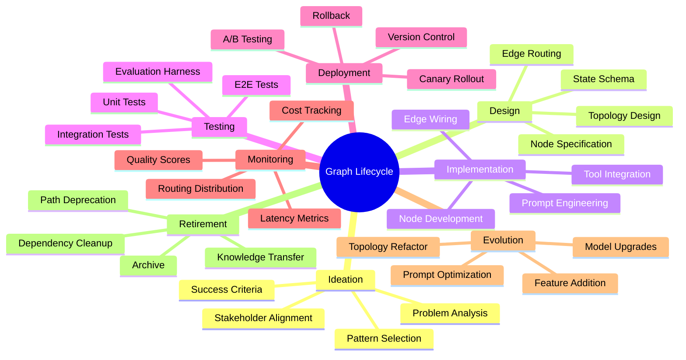
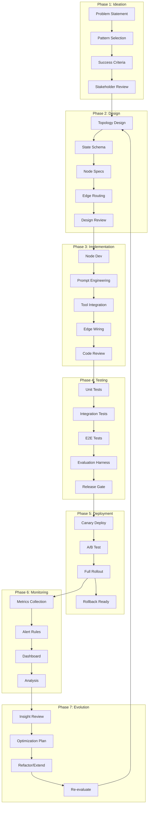
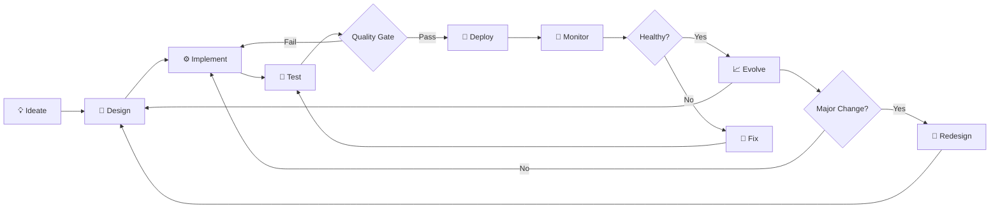
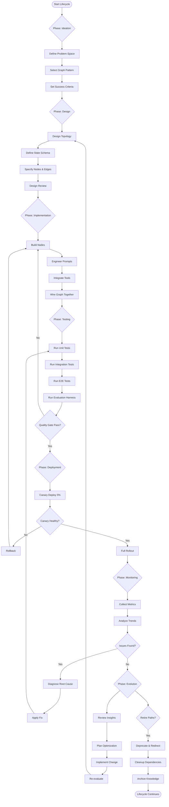
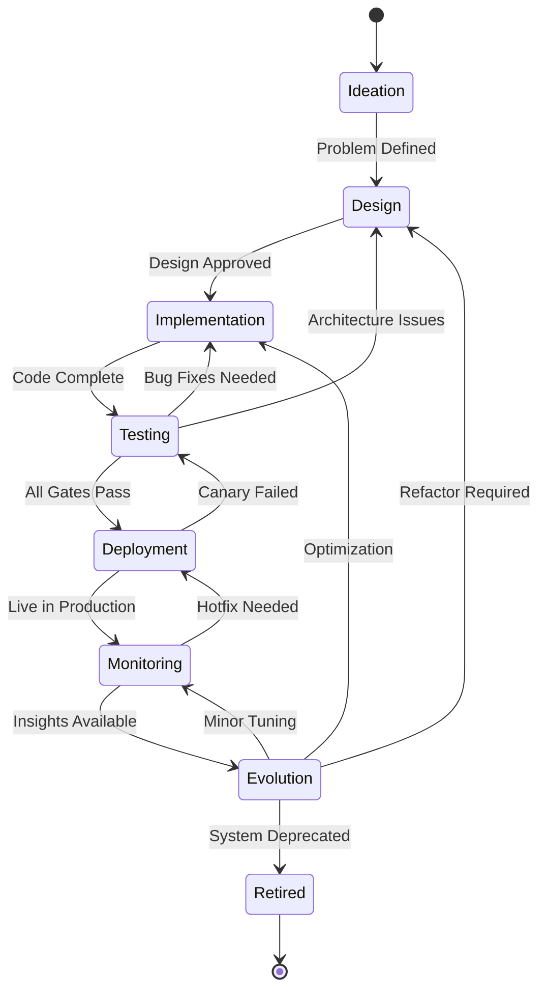
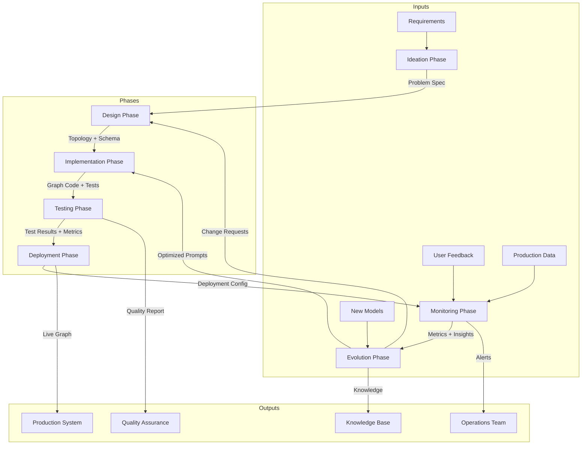
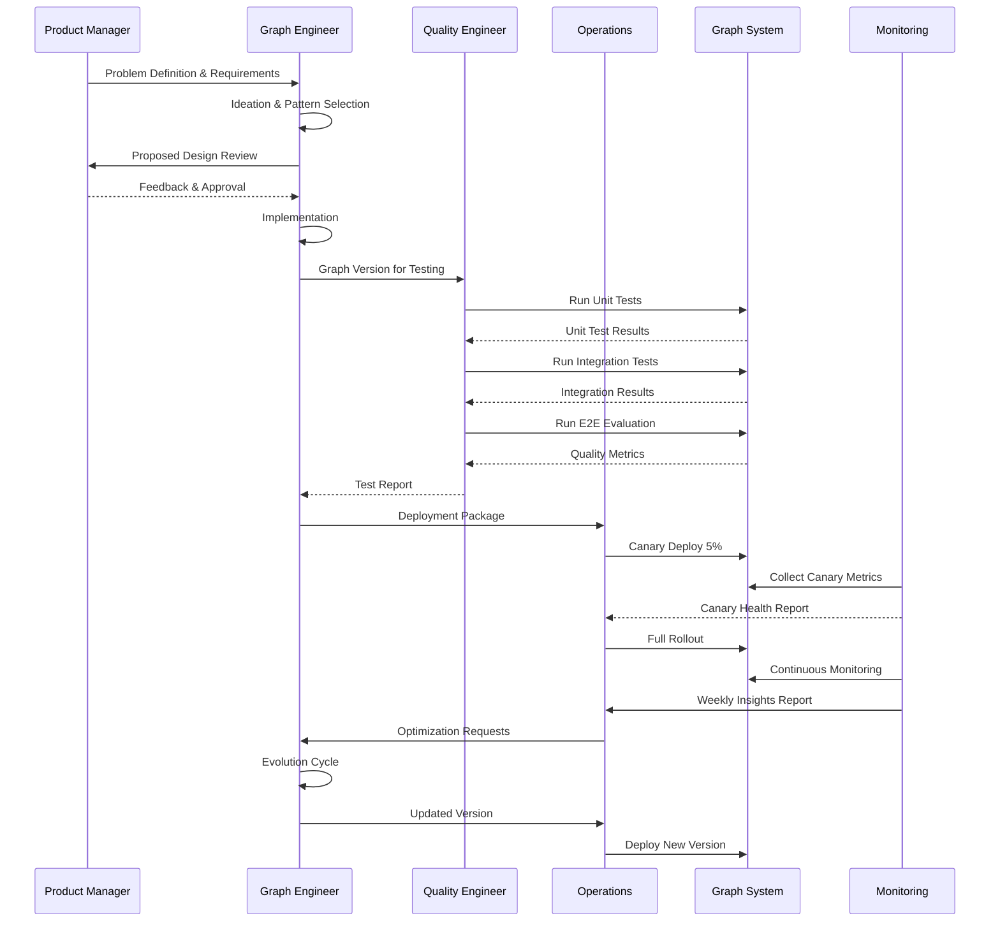

# Graph Lifecycle Management

## 📌 Overview

Graph Lifecycle Management addresses the full journey of a graph-based AI system from initial conception through design, implementation, testing, deployment, monitoring, and eventual retirement. While 06_Graph_Architecture.md focused on the structural decisions that shape a system at a point in time, this document focuses on the temporal dimension: how do you manage a graph system as it changes over weeks, months, and years of production operation? A graph that is well-designed but poorly managed will degrade over time as requirements change, models are updated, and the operational environment shifts. Lifecycle management provides the processes, practices, and tooling needed to keep a graph system healthy throughout its entire operational life.

The lifecycle of a graph system differs significantly from traditional software in several critical ways. Graph systems involve non-deterministic components such as LLMs whose behavior can change when models are updated, even if the graph topology and node configurations remain identical. They also involve complex emergent behaviors that may not appear during testing but emerge only under specific production conditions and edge cases. Furthermore, they often require continuous optimization—adjusting prompts, model parameters, and routing logic based on production data—to maintain output quality over time. These characteristics make lifecycle management both more important and more challenging for graph systems than for traditional software, demanding a disciplined, data-driven approach to every phase.

## 🎯 Learning Objectives

After studying this document, you will be able to identify and describe the seven major phases of the graph lifecycle, from ideation through retirement. You will understand the specific challenges that non-deterministic AI components introduce at each phase and how to mitigate them through appropriate processes and tooling. You will learn how to design a graph system for testability, deployability, and observability from the outset rather than retrofitting these concerns later. You will gain practical knowledge of versioning strategies for graph topologies, prompts, model configurations, and tool interfaces. You will be able to design monitoring systems that capture the metrics most relevant to graph system health, including per-node latency, routing distribution, state drift, and output quality scores. Finally, you will understand how to manage the evolution of a graph system over time, including when and how to refactor the topology, upgrade models, and decommission deprecated paths.

## 🧠 Definition

Graph Lifecycle Management is the discipline of planning, executing, and governing the complete lifespan of a graph-based AI system, encompassing all activities from initial requirements analysis through system retirement. It integrates practices from MLOps, DevOps, prompt engineering, and software architecture to address the unique challenges of systems whose behavior emerges from the interaction of non-deterministic AI components connected through defined topological structures. The discipline recognizes that a graph system is never truly "finished"—it exists in a continuous state of evaluation, optimization, and adaptation that requires ongoing investment and attention.

At its core, lifecycle management establishes feedback loops between every phase of the system's existence. Data from monitoring informs design decisions; test results inform deployment strategies; production behavior informs model selection and prompt engineering. These feedback loops are essential because the non-deterministic nature of LLM-based components means that system behavior can only be fully understood through continuous observation in realistic conditions. A lifecycle management approach treats the graph as a living system that must be nurtured, measured, and adapted rather than a static artifact that is built once and deployed forever.

## ❓ Why It Matters

Without structured lifecycle management, graph systems rapidly accumulate technical debt that is extremely difficult to address. Consider a customer support agent graph that was designed for one product line and is gradually extended to handle three more. Without version control for the graph topology, it becomes unclear which paths handle which product, and changes intended for one product inadvertently break another. Without systematic testing that covers all routing paths, new requirements introduce regressions in existing functionality. Without monitoring that tracks routing distributions, a subtle shift in model behavior might silently redirect a significant percentage of traffic to an incorrect handler, degrading quality without triggering any alert.

The consequences of poor lifecycle management are not merely technical—they are business-critical. A graph system that produces subtly different outputs after a model update can erode user trust. A system whose quality degrades gradually over time because prompts were not re-optimized for the current model version can lose competitive advantage. A system that cannot be quickly rolled back when a deployment causes issues can create extended outages. Lifecycle management is not overhead; it is the operational discipline that separates graph systems that deliver sustained value from those that degrade into unmaintainable, unreliable, and eventually abandoned experiments.

## 🏛️ Core Concepts

The graph lifecycle is organized around seven distinct phases, each with its own objectives, deliverables, and quality gates. The Ideation phase focuses on understanding the problem, identifying the graph pattern that best addresses it, and defining success criteria. The Design phase translates the ideation outputs into a concrete graph topology, selecting node types, defining state schemas, and specifying edge routing logic. The Implementation phase builds the graph, creating individual nodes, wiring edges, and integrating external tools and data sources. The Testing phase validates the graph against requirements, covering unit tests for individual nodes, integration tests for paths, and end-to-end tests for system behavior.

The Deployment phase moves the tested graph into production, managing versioning, rollout strategies, and rollback capabilities. The Monitoring phase continuously observes the running system, collecting metrics on performance, quality, routing behavior, and cost. The Evolution phase uses monitoring insights and new requirements to drive iterative improvements, including topology refactoring, prompt optimization, model upgrades, and feature additions. The Retirement phase manages the graceful decommissioning of graph paths, nodes, or entire systems that are no longer needed, ensuring that dependent systems are updated and that knowledge is preserved.

Each phase has defined entry and exit criteria, ensuring that work does not proceed to the next phase prematurely. Each phase also generates artifacts that feed into subsequent phases and into the feedback loops that connect later phases back to earlier ones. For example, monitoring data from the Monitoring phase feeds directly into the Evolution phase's decision-making and may also trigger a return to the Design phase if fundamental architectural changes are needed.

## 🧩 Key Components

The key components of graph lifecycle management include the graph registry, which serves as the single source of truth for all versions of a graph's topology, configuration, and deployment history. The graph registry enables you to answer questions like "What changed between version 3.2 and 3.3?" and "Which version was deployed on March 15th when the quality regression occurred?" Without a registry, lifecycle management degenerates into ad hoc file management that cannot support the rigor needed for production systems.

Another critical component is the evaluation harness, which provides automated assessment of graph behavior across a curated dataset of test inputs. Unlike traditional unit tests that check for exact outputs, graph evaluation must account for non-determinism by using metrics like semantic similarity scores, classification accuracy, and human preference alignment. The evaluation harness must be fast enough to run frequently during development but comprehensive enough to catch regressions that only appear on specific input patterns.

Additional components include the deployment pipeline, which manages the transition of graph versions from testing to production environments with support for canary deployments, A/B testing, and instant rollback. The observability stack captures runtime metrics including per-node latency, token consumption, routing distributions, error rates, and custom quality scores. The configuration management system separately version-controls prompts, model parameters, tool configurations, and routing rules so that changes to any of these can be tracked, reverted, and A/B tested independently of topology changes.

## 🧭 Mental Model

Think of graph lifecycle management as managing a garden rather than constructing a building. A building is designed once, constructed according to blueprints, and then maintained with minor repairs. A garden requires continuous attention: planting, pruning, watering, fertilizing, and adapting to changing seasons. Similarly, a graph system must be continuously tended—pruning underperforming paths, fertilizing with better prompts, adapting to new model capabilities, and responding to changing user needs. The gardener does not expect the garden to remain static, and neither should the graph engineer expect their system to remain unchanged after initial deployment.

This mental model also highlights the importance of observation. A skilled gardener walks through the garden daily, noting which plants are thriving and which are struggling, which areas need more water and which need less. Similarly, effective lifecycle management requires continuous observation of the running system through comprehensive monitoring. You cannot manage what you do not measure, and you cannot evolve what you do not understand. The monitoring phase is not an afterthought—it is the sensory system that makes informed evolution possible.

## 🗺️ Mind Map

## 🏗️ Architecture Diagram

## 🔄 Workflow

## ⚙️ Internal Working

The lifecycle begins with Ideation, where stakeholders and engineers collaborate to define the problem space and identify the appropriate graph pattern. This involves analyzing the input domain, identifying the types of processing required, and mapping these to known graph patterns such as sequential chains, branching classifiers, parallel aggregation, or iterative refinement loops. The output of ideation is a problem specification document and a preliminary pattern selection, both of which serve as inputs to the Design phase.

During Design, engineers translate the problem specification into a concrete graph topology. This involves selecting specific node types for each processing step, defining the state schema that will carry data between nodes, specifying the edge routing logic that determines execution paths, and documenting the expected behavior at each decision point. Design artifacts include a topology diagram, a state schema definition, node specification documents, and edge routing tables. A design review ensures that the topology is well-structured, the state schema is minimal but sufficient, and the routing logic is complete and unambiguous.

Implementation involves building each node according to its specification, writing the prompts that drive LLM-based nodes, integrating external tools and data sources, and wiring everything together with the defined edges. Each node is developed and tested in isolation before being integrated, following a test-driven development approach where possible. Prompt engineering is a significant part of implementation, requiring iterative refinement against evaluation metrics. The implementation phase produces the complete, runnable graph along with its test suite and documentation.

Testing validates the graph at multiple levels. Unit tests verify individual node behavior in isolation, mocking dependencies where appropriate. Integration tests verify that connected nodes interact correctly, testing each major path through the graph. End-to-end tests run the complete graph against a representative set of inputs and evaluate the outputs against expected quality criteria. The evaluation harness runs a larger dataset and computes aggregate quality metrics, providing a quantitative assessment of system performance. Only when all quality gates pass does the system proceed to deployment.

Deployment manages the transition to production through a controlled rollout process. A canary deployment routes a small percentage of traffic to the new version while monitoring for regressions. If the canary performs well, traffic is gradually increased to 100%. A/B testing compares two versions side by side, using statistical methods to determine which performs better. Rollback capability ensures that any deployment can be instantly reverted to the previous version if issues are detected.

Monitoring establishes continuous observation of the running system, collecting metrics on latency, throughput, error rates, routing distributions, token consumption, and output quality. Dashboards provide real-time visibility, and alert rules notify engineers when metrics exceed acceptable thresholds. Regular analysis of monitoring data identifies trends, anomalies, and optimization opportunities that feed into the Evolution phase.

Evolution uses insights from monitoring, user feedback, and new requirements to drive iterative improvements. This may involve optimizing prompts for better quality, upgrading to newer model versions, refactoring the topology to improve performance or maintainability, adding new features and capabilities, or removing deprecated functionality. Each evolutionary change goes through the design, implementation, and testing phases again, creating a continuous improvement cycle. Over time, this cycle may lead to fundamental architectural changes that require a return to the Ideation phase.

## 🔀 Execution Flow

## 📊 Lifecycle

## 📡 Data Flow

## 🤝 Interaction Flow

## 🌍 Real-World Analogy

Consider the lifecycle of a major highway interchange. The process begins with transportation engineers studying traffic patterns, predicting future growth, and selecting an interchange design pattern (ideation). Civil architects then produce detailed blueprints specifying every ramp, lane, and signal (design). Construction crews build each component according to specification, with inspectors verifying each element before it is connected to the whole (implementation and testing). The interchange opens to a fraction of traffic while engineers monitor for congestion and safety issues (canary deployment). Once validated, all traffic is routed through the new interchange (full rollout). Sensors continuously monitor traffic flow, detecting accidents, congestion, and wear (monitoring). Over years, new ramps are added, lanes are widened, and signals are re-timed based on observed patterns (evolution). Eventually, if a new highway makes the interchange obsolete, it is decommissioned (retirement).

The analogy is apt because both highway interchanges and graph systems are infrastructure that must handle variable, unpredictable loads. A highway engineer cannot perfectly predict every traffic pattern, just as a graph engineer cannot predict every input the system will encounter. Both require continuous monitoring, gradual optimization, and the ability to handle peak loads without failure. Both also demonstrate that the initial design, while critical, is only the beginning of a long operational life that requires ongoing investment and attention.

## 💡 Practical Example

Imagine building a multi-step research assistant that takes a user question, classifies the research domain, retrieves relevant documents, synthesizes findings, and generates a structured report. During Ideation, you identify that this requires a branching pattern with parallel document retrieval and sequential synthesis. You define success criteria: reports should be factually accurate, cover the relevant domain, and be generated in under 30 seconds. During Design, you create a topology with five nodes connected by conditional edges, define a state schema that carries the user question, classified domain, retrieved documents, and draft report, and specify routing rules for domain classification.

During Implementation, you build each node—writing the classification prompt, integrating the search API, crafting the synthesis prompt, and formatting the report template. You write unit tests for each node using mocked inputs and integration tests for each path through the graph. The evaluation harness runs the graph against 200 labeled research questions and measures factual accuracy at 87% and latency at 24 seconds. During Deployment, you canary-deploy to 5% of users and monitor for quality regressions. After a successful canary, you roll out to 100%.

Three months into production, monitoring reveals that the classification node's accuracy has dropped from 94% to 89%, causing some questions to be routed to incorrect document sources. This triggers the Evolution phase: you investigate, discover that a model update changed classification behavior, optimize the classification prompt for the new model, re-run the evaluation harness to confirm the fix, and deploy the updated version through the standard canary process.

## 🧪 Use Cases

One critical use case is managing model migrations in a production graph system. When a new LLM version is released, the lifecycle process ensures that every node using the old model is identified, tested against the new model, and either migrated or explicitly retained with the old version. This prevents the common anti-pattern where a model update silently degrades system quality because no one re-evaluated the prompts and routing logic that were tuned for the previous model. The evaluation harness plays a central role here, providing before-and-after comparisons that quantify the impact of the migration.

Another important use case is managing the expansion of a graph system as new capabilities are added. A chatbot that initially handled FAQs might be extended to handle order management, technical support, and appointment scheduling. Without lifecycle management, these additions create a tangled graph with unclear routing, duplicated nodes, and conflicting state updates. With lifecycle management, each extension goes through proper design, implementation, and testing, ensuring that the graph remains well-structured as it grows. Version control allows you to track when each capability was added and by whom, supporting accountability and debugging.

A third use case is incident response and root cause analysis. When a production issue occurs, the graph registry and monitoring data together provide a complete picture of what version was deployed, what the routing distribution looked like, and what metrics indicated the problem. This enables rapid diagnosis and resolution, minimizing the duration and impact of incidents. The rollback capability in the deployment pipeline ensures that the fastest resolution—reverting to the last known good version—is always available.

## ⚖️ Comparison

| Aspect | Traditional Software Lifecycle | Graph System Lifecycle |
|---|---|---|
| **Determinism** | Outputs are predictable and repeatable | Outputs vary due to LLM non-determinism |
| **Testing** | Exact output matching | Statistical evaluation, quality metrics |
| **Versioning** | Code versioning suffices | Topology, prompts, models, and configs all versioned |
| **Deployment** | Blue-green or rolling updates | Canary with quality metric gates |
| **Monitoring** | Error rates and latency | Routing distribution, quality scores, token costs |
| **Evolution** | Feature additions and bug fixes | Prompt optimization, model migration, topology refactor |
| **Rollback** | Revert code commit | Revert topology, prompts, or model independently |
| **Regression Risk** | Generally low with good tests | High due to non-deterministic component interactions |

The key difference is that graph systems require continuous evaluation of behavioral quality, not just functional correctness. A traditional software test can verify that a function returns the correct value for a given input. A graph system test must verify that the system produces outputs of acceptable quality across a distribution of inputs, accounting for the inherent variability of LLM responses. This requires fundamentally different testing and monitoring strategies.

## ✅ Best Practices

Version everything independently. Maintain separate version control for your graph topology, prompt templates, model configurations, tool interfaces, and routing rules. This allows you to change any one of these dimensions without affecting the others, and it enables precise rollback when an issue is traced to a specific change. A monolithic version that bundles everything together makes it impossible to identify which change caused a regression or to roll back selectively.

Implement comprehensive evaluation from day one. Do not treat evaluation as a phase that happens after implementation—build the evaluation harness alongside the graph itself. Start with a small set of high-quality test inputs and expand it over time based on production observations. The evaluation harness should compute multiple quality metrics, not just a single pass/fail score, so that you can diagnose the specific dimension on which quality has degraded.

Design for observability from the outset. Every node should emit structured logs that include its inputs, outputs, latency, token consumption, and any routing decisions it made. Every edge transition should be logged. This telemetry is essential for debugging production issues, understanding system behavior, and identifying optimization opportunities. Retrofitting observability into a graph that was not designed for it is extremely difficult and expensive.

Automate the deployment pipeline end to end. Manual deployments introduce human error and slow down the feedback loop. The pipeline should support canary deployments, automated quality gates, and one-click rollback. Every deployment should be traceable: given any production issue, you should be able to identify exactly which version of the graph, prompts, and model were running at the time.

## ❌ Common Mistakes

The most common and costly mistake is treating the graph as a one-time project rather than a living system. Teams that design and deploy a graph and then move on to the next project invariably find that quality degrades over time as models change, user needs evolve, and edge cases accumulate. The graph becomes a legacy system that everyone is afraid to modify because no one understands its current behavior. This outcome is entirely preventable with disciplined lifecycle management.

Another frequent mistake is testing only the happy path. A graph may work perfectly for the common case but fail catastrophically for unusual inputs, ambiguous queries, or adversarial prompts. Comprehensive testing must cover edge cases, error conditions, and boundary inputs. The evaluation dataset should include difficult examples that stress the system's routing logic and error handling, not just easy examples that make the metrics look good.

A third common mistake is making topology changes without understanding their impact on routing distributions. Adding a new edge or changing a routing condition can shift significant traffic between paths, potentially overwhelming a node that was provisioned for lower volume or exposing a path that has not been adequately tested. Every topology change should be accompanied by an analysis of its expected impact on routing distributions, validated by the evaluation harness before deployment.

Ignoring the cost dimension is another widespread mistake. Graph systems can be expensive to operate, and costs can grow rapidly as traffic increases or as model versions change their token consumption patterns. Lifecycle management should include cost tracking as a first-class metric, with budget alerts and regular cost optimization reviews. A graph that produces excellent results but costs ten times more than the business can sustain is not a successful system.

## 🚀 Advanced Topics

Graph lifecycle management intersects with several advanced topics that represent the frontier of the field. Infrastructure-as-code for graph systems applies the principles of Terraform and Pulumi to graph topology management, enabling declarative specification, automated diffing, and reproducible deployments. This approach treats the graph topology as code that can be reviewed, tested, and deployed through the same pipelines used for infrastructure provisioning.

Continuous prompt optimization applies machine learning techniques to automatically improve prompt performance over time. Using production data and quality signals, an optimization loop can systematically explore prompt variations, evaluate them against the evaluation harness, and deploy improvements automatically. This creates a self-improving graph system where the prompts get better without manual intervention, though human oversight remains essential to ensure that optimizations align with business objectives.

Multi-model lifecycle management addresses the challenge of systems that use multiple LLM providers or models for different nodes. Each model has its own release cadence, pricing changes, and capability evolution. Managing these independently while ensuring that the overall system remains coherent requires sophisticated versioning, testing, and deployment strategies. A node that uses GPT-4 for complex reasoning and Claude for summarization must be able to upgrade each model independently, testing the impact on overall system quality for each change.

Finally, graph system resilience engineering applies principles from chaos engineering to proactively test the system's ability to handle failures. This includes intentionally degrading model quality, introducing latency in tool responses, and simulating partial outages to verify that the graph degrades gracefully rather than failing catastrophically. Resilience testing is especially important for graph systems because their non-deterministic components make it difficult to predict exactly how they will behave under adverse conditions.