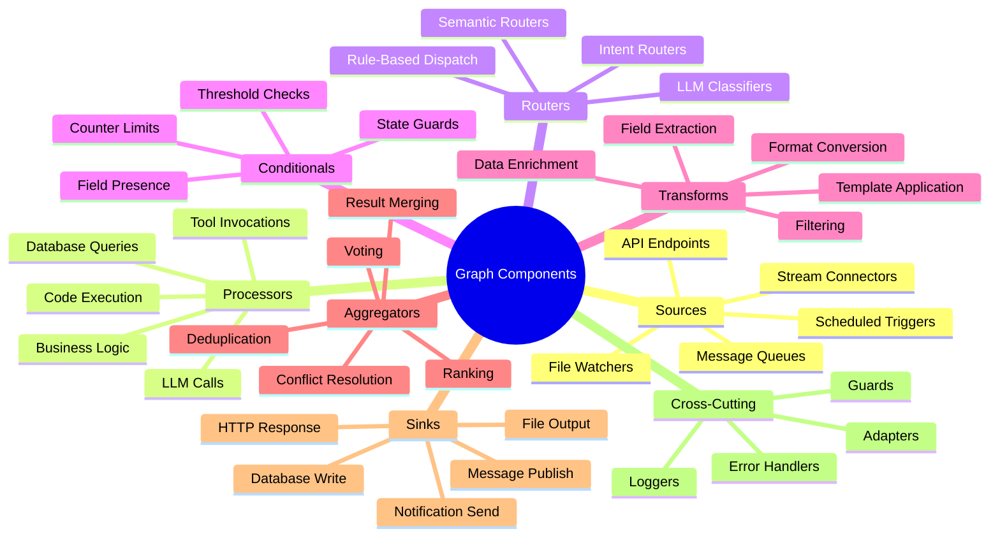
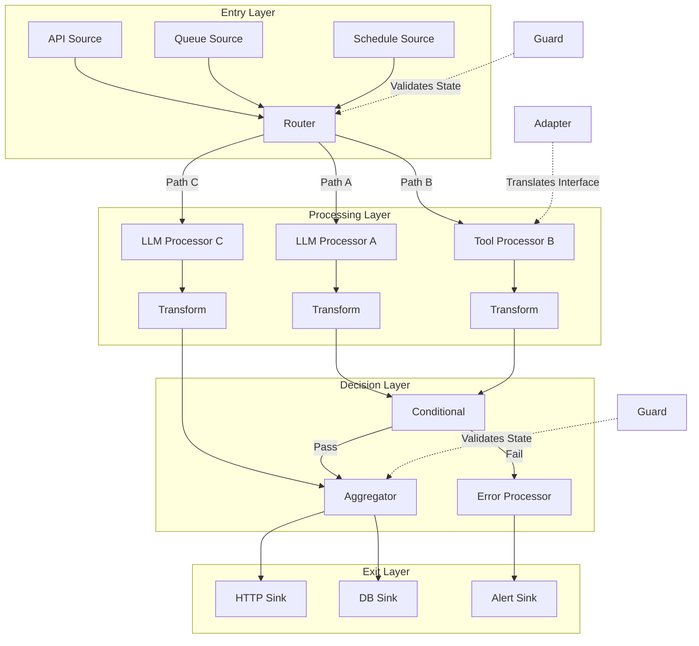
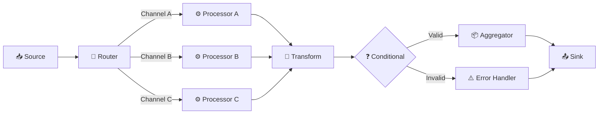
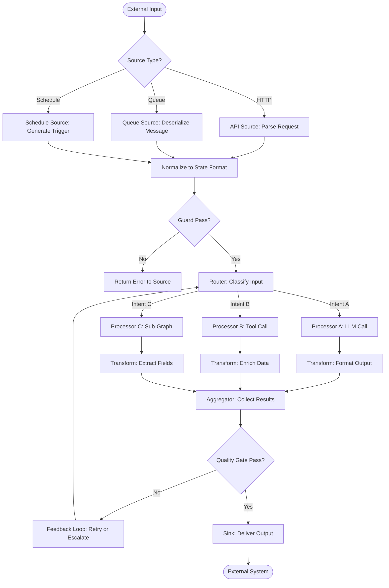
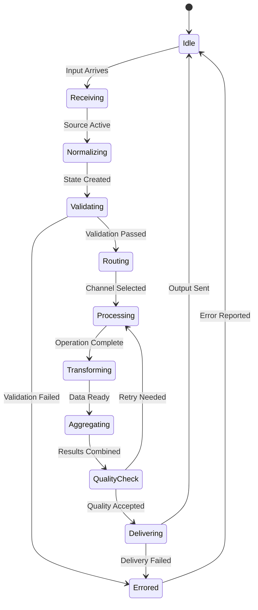
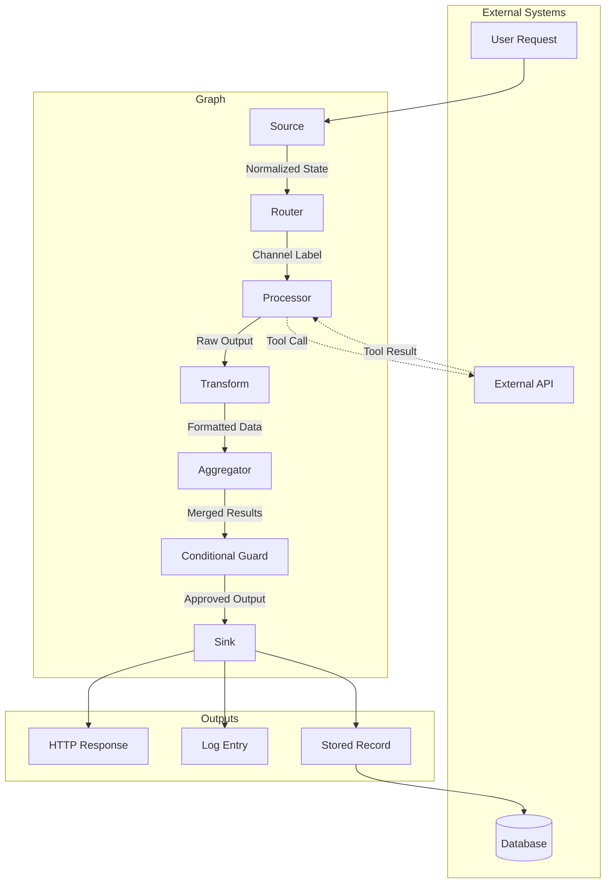
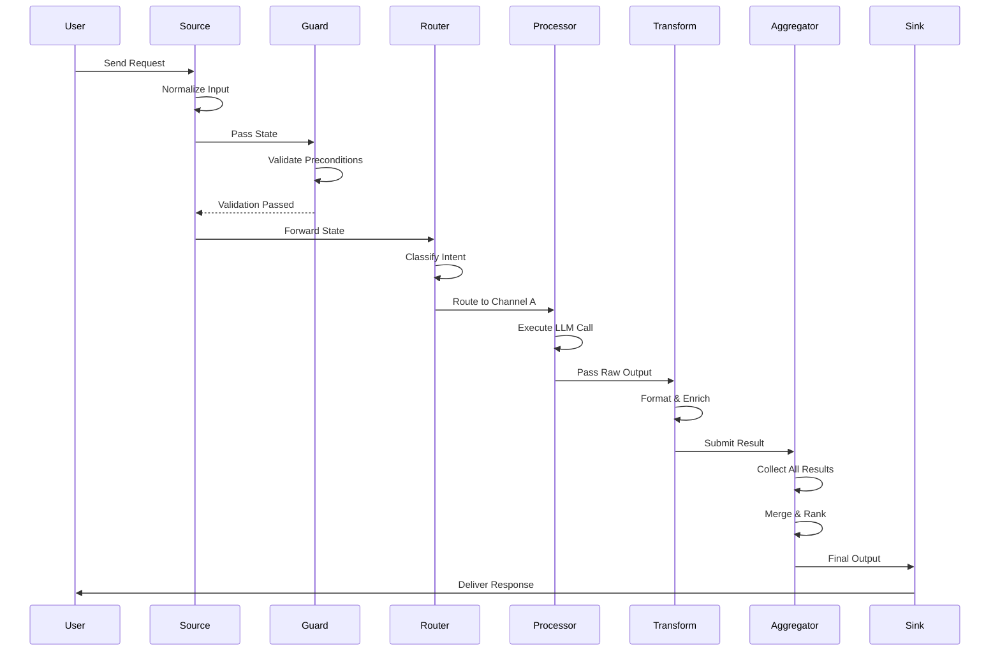

# Graph Components

## 📌 Overview

Graph Components are the reusable building blocks from which graph-based AI systems are constructed. While 03_Core_Concepts.md introduced the abstract ideas of nodes and edges, and 09_Graph_Nodes.md and 10_Graph_Edges.md provide deep dives into those two categories, this document takes a practical, catalog-oriented approach: what are the specific types of components that Graph Engineers use every day, what problems do they solve, and how do they compose into working systems? Think of this document as a component library reference—a catalog of proven building blocks that you can combine to solve a wide variety of AI engineering problems.

The components presented here are not tied to any specific framework. They are architectural patterns that can be implemented in LangGraph, CrewAI, AutoGen, a custom framework, or even in ad hoc code. What matters is the component's role in the graph, its interface contract—what it expects as input and what it produces as output—and its behavioral guarantees under various conditions. By understanding these components at the pattern level rather than the implementation level, you gain the ability to recognize when a component is needed, select the right type, and integrate it effectively regardless of your tooling. This document covers seven major component categories: sources, processors, routers, conditionals, transforms, aggregators, and sinks.

## 🎯 Learning Objectives

After studying this document, you will be able to identify and describe the seven major categories of graph components and their roles within a graph system. You will understand the interface contracts that each component type must satisfy, including input expectations, output guarantees, and side-effect behaviors. You will learn how to select the appropriate component type for a given processing need, avoiding the common mistake of using a generic processor where a specialized component would be more effective. You will be able to compose multiple components into a coherent graph, ensuring that data types flow correctly between components and that state is managed consistently. Finally, you will understand the design principles that make components reusable, testable, and composable, enabling you to build your own component library over time.

## 🧠 Definition

A Graph Component is a self-contained unit of functionality within a graph-based AI system that performs a well-defined processing role, interacts with other components through explicit interfaces, and can be reasoned about, tested, and reused independently of the specific graph in which it is deployed. Components are the vocabulary of graph engineering—just as a programmer combines language primitives (loops, conditionals, functions) into programs, a Graph Engineer combines components (sources, processors, routers, transforms, aggregators, sinks) into graph systems. The power of the component abstraction lies in its ability to separate concerns: each component handles one aspect of the system's behavior, and the graph topology defines how these aspects compose into the overall system.

Components differ from raw nodes in their level of abstraction and their behavioral guarantees. A node is a point in the graph where processing occurs; a component is a named, typed pattern of node behavior with a documented interface and expected semantics. For example, a "router component" is not just any node that happens to route—it is a node that satisfies a specific contract: it receives a single input, applies classification or matching logic, and directs execution to one of several predetermined outputs without modifying the state. This contract allows you to substitute one router implementation for another, test routers independently, and reason about system behavior at the component level rather than the node level.

## ❓ Why It Matters

Without a well-defined component vocabulary, every graph system becomes a custom, ad hoc construction that is difficult to understand, maintain, and extend. Teams that lack a shared component language end up reinventing the same patterns repeatedly, with each engineer implementing their own version of a router, their own approach to data transformation, and their own error handling strategy. This leads to inconsistent system quality, duplicated effort, and graph topologies that are hard to reason about because there is no shared understanding of what each node is supposed to do.

A well-defined component vocabulary provides several critical benefits. First, it accelerates development by providing ready-made solutions to common problems—instead of designing a routing mechanism from scratch, you select the router component pattern and implement it. Second, it improves system quality by encoding best practices into the component definitions—for example, the aggregator component pattern specifies how to handle partial failures during parallel aggregation. Third, it enhances communication by giving the team a shared language—a design review can discuss whether a conditional or a router is more appropriate for a given decision point, rather than debating the merits of an ad hoc node design. Fourth, it enables systematic testing because each component type has well-defined test strategies—routers are tested for classification accuracy, transforms are tested for output correctness, and so on.

## 🏛️ Core Concepts

The component taxonomy is organized around the role each component plays in the data processing pipeline. Sources are entry points that introduce data into the graph from external systems—user inputs, API requests, scheduled events, or data streams. Processors are the workhorses that perform the primary AI operations—LLM calls, tool invocations, and business logic execution. Routers analyze inputs and direct execution to one of several downstream paths, implementing classification and dispatch logic. Conditionals evaluate boolean expressions on the state to make binary or multi-way branching decisions.

Transforms modify data without making decisions about flow—they reshape, filter, enrich, format, or translate data as it passes through the graph. Aggregators collect results from multiple parallel paths and combine them into a unified output, handling ordering, deduplication, and conflict resolution. Sinks are exit points that deliver the graph's output to external systems—writing to databases, sending responses, triggering webhooks, or publishing to message queues.

Beyond these seven primary categories, two cross-cutting component types provide essential supporting functionality. Guards are components that validate state at critical points, blocking execution if preconditions are not met and preventing the graph from entering invalid or dangerous states. Adapters are components that translate between different interface conventions, allowing components with incompatible interfaces to work together. These nine component types form a complete vocabulary for describing graph systems at an architectural level.

## 🧩 Key Components

**Sources** introduce data into the graph and are responsible for normalizing external inputs into the graph's internal state format. A source might accept a raw HTTP request and extract the user's query, context, and preferences into a structured state object. Sources define the contract between the external world and the graph—if the source normalizes correctly, every downstream component can rely on a consistent input format regardless of how the data arrived. Common source types include API endpoints, message queue consumers, file watchers, scheduled triggers, and streaming data connectors.

**Processors** are the primary execution units where AI operations occur. A processor wraps an LLM call, a tool invocation, or a computation and produces an output that advances the graph's state. Processors are the most diverse component category because the operations they perform vary widely—summarization, extraction, classification, generation, code execution, database queries, and more. Despite this diversity, all processors share a common interface: they accept a state (or a subset of state), perform an operation, and return a state update. This uniform interface allows any processor to be placed at any position in the graph, as long as the data types are compatible.

**Routers** and **Conditionals** are the decision-making components that give graphs their branching behavior. A router uses an LLM or a rule-based classifier to analyze the input and select one of several predefined output channels. A conditional evaluates a deterministic expression on the state—such as checking whether a field exists, a score exceeds a threshold, or a counter has reached a limit—and branches accordingly. The key distinction is that routers involve AI-based classification (with inherent non-determinism), while conditionals involve deterministic evaluation (with predictable, repeatable behavior). Both are essential for building systems that handle diverse inputs.

**Transforms** modify data in transit without changing the graph's execution path. They format dates, convert units, extract fields, merge data from multiple sources, apply templates, or perform any other data manipulation that does not involve a decision about where to go next. Transforms are often underappreciated, but they play a critical role in ensuring that data is in the correct format for each downstream component. A well-placed transform can eliminate the need for complex formatting logic inside a processor, keeping the processor focused on its primary AI operation.

**Aggregators** collect results from multiple parallel paths and produce a unified output. This is one of the more complex component types because it must handle variable numbers of inputs, partial failures, ordering issues, and conflict resolution. A research assistant that queries three databases in parallel needs an aggregator that collects the three result sets, deduplicates overlapping results, ranks them by relevance, and produces a single unified result list. The aggregator's interface contract specifies how it handles missing results (from failed paths), how it orders the combined output, and what happens when results from different paths conflict.

**Sinks** deliver the graph's output to the external world. Like sources, sinks form the boundary between the graph and external systems. A sink might format the final output as an HTTP response, write results to a database, send a notification, or enqueue a message for downstream processing. Sinks are responsible for translating the graph's internal state format into whatever format the external system expects. They also handle delivery guarantees—retrying failed deliveries, acknowledging successful ones, and reporting delivery failures.

## 🧭 Mental Model

Think of graph components as the stations and machinery in a factory production line. Sources are the loading docks where raw materials enter the factory. Processors are the assembly stations where value is added through work—cutting, shaping, welding, painting. Routers are the sorting stations that direct different products to different assembly lines based on their type. Conditionals are the quality check stations that accept or reject items based on measurable criteria. Transforms are the preparation stations that adjust materials before they reach the next work station—cutting to size, applying primer, attaching labels. Aggregators are the final assembly stations where parts from multiple lines come together into a finished product. Sinks are the shipping docks where finished products leave the factory.

This factory analogy highlights several important properties. First, each station has a clear role and interface—it receives materials in a specific format and produces outputs in a specific format. Second, the overall product quality depends on every station performing its role correctly—a flaw at any station propagates downstream. Third, the factory's capacity and throughput are determined by the slowest station (the bottleneck). Fourth, the factory can be reconfigured by adding, removing, or rearranging stations, just as a graph can be modified by adding, removing, or reconnecting components.

## 🗺️ Mind Map

## 🏗️ Architecture Diagram

## 🔄 Workflow

## ⚙️ Internal Working

Each component type has a well-defined internal structure and operational pattern. A Source component initializes by establishing a connection to its external data provider—opening an HTTP listener, subscribing to a message queue, registering a file system watcher, or setting up a timer. When data arrives, the source normalizes it into the graph's internal state format, performing validation and transformation as needed. For example, an API source might extract the query string from the request body, validate that it is not empty, set default values for optional parameters, and construct a state object with fields like `user_query`, `conversation_id`, and `preferences`. The normalized state is then passed to the next component in the graph.

A Processor component receives a state (or a subset of state fields), performs its primary operation, and returns a state update. For an LLM processor, this involves constructing a prompt from the input state, calling the LLM API, parsing the response, and extracting the relevant output into a state update. For a tool processor, it involves preparing the tool's input parameters from the state, invoking the tool, and mapping the tool's output back to the state. Processors typically have timeout configurations, retry logic, and fallback behaviors that handle the inherent unreliability of external services. The key design principle for processors is single responsibility: each processor should do one thing well, making it easy to test, optimize, and replace independently.

A Router component receives the current state, applies classification or matching logic, and returns the identifier of the next node to execute. Classification can be performed by an LLM (for complex, semantic routing) or by rules (for simple, deterministic routing). An LLM-based router constructs a classification prompt, calls the LLM, and parses the response to extract the selected channel. A rule-based router evaluates a series of conditions—regular expression matches, keyword presence, field values—and selects the first matching channel. Routers must be designed to handle ambiguous cases where the input could reasonably match multiple channels; the routing strategy for ambiguity (pick the first match, pick the highest confidence, or ask for clarification) has significant system-level implications.

An Aggregator component waits for all (or a quorum of) parallel paths to complete, then combines their outputs into a unified result. The aggregation strategy depends on the data type—text results might be concatenated or summarized, structured results might be merged by key, scored results might be ranked and filtered. The aggregator must handle partial failures: if one of three parallel paths fails, should it proceed with the two successful results, retry the failed path, or fail the entire aggregation? This decision should be configurable and should depend on the business requirements of the specific use case. Aggregators also handle deduplication when parallel paths may return overlapping results, and conflict resolution when paths return contradictory information.

## 🔀 Execution Flow

## 📊 Lifecycle

## 📡 Data Flow

## 🤝 Interaction Flow

## 🌍 Real-World Analogy

Consider a modern restaurant kitchen, which is essentially a component-based graph system for transforming raw ingredients into finished dishes. The order entry system (source) receives customer orders and normalizes them into ticket format. The expediter (router) reads each ticket and directs it to the appropriate station—grill, sauté, pastry, or salad. Each station (processor) performs its specialized work, applying heat, cutting, mixing, or assembling. The prep cooks (transforms) wash, peel, and portion ingredients before they reach the stations. The plating station (aggregator) collects components from multiple stations, arranges them on a single plate, and performs final quality checks. The food runner (sink) delivers the finished plate to the customer.

The kitchen analogy illustrates several principles of component design. Each station has a specialized role and a clear interface—it receives ingredients in a known format and produces a component in a known format. The expediter makes routing decisions based on the order content, not by performing cooking. The plating station does not cook; it aggregates. If the salad station is backed up, the expediter can reroute simpler salads to the cold prep station (dynamic routing). If a dish fails quality inspection at the plating station, it is sent back for correction (error handling and feedback loops). The entire kitchen operates as a coordinated system, with each component doing its part and the overall quality emerging from the orchestration of all components.

## 💡 Practical Example

Consider building a content moderation system that processes user-generated posts. The system begins with a Source component that receives posts from a message queue, normalizes them into a standard format with fields for content, author metadata, and context. A Guard component checks that the post is not empty and that the author is not on an exempt list. A Router component then classifies the post into one of three categories: text-only, image-containing, or link-containing, directing each to a specialized processing path.

The text-only path goes through a Processor that runs an LLM-based toxicity analysis, producing a toxicity score and a categorization (hate speech, harassment, spam, or clean). The image-containing path goes through a Processor that runs a vision model for content policy analysis, followed by a Transform that extracts text from any overlaid text in the image. The link-containing path goes through a Processor that fetches and analyzes the linked content. A Conditional component then checks whether any path produced a high-severity flag—if so, the post is routed to a human review Sink; otherwise, it is approved and passed to a publishing Sink. An Aggregator component combines the analysis results from all active paths into a single moderation report that is stored for auditing purposes.

## 🧪 Use Cases

One powerful use case is an intelligent customer support routing system. A Source receives incoming support tickets from email, chat, and phone channels. A Router classifies each ticket by topic (billing, technical, account, general) and urgency (critical, high, medium, low). Based on the classification, the ticket is directed to one of several specialized Processor paths: a billing path that checks account status and payment history, a technical path that runs diagnostic LLM analysis on the described issue, an account path that handles password resets and access requests, or a general path that provides standard FAQ responses. Transforms format each path's output into a consistent response structure. An Aggregator combines any parallel analysis results, and a Conditional checks whether the response confidence exceeds a threshold—if not, the ticket is escalated to a human agent via a Sink.

Another important use case is a multi-source research synthesis system. A Source accepts a research question and parameters (date range, domains, depth). A Router dispatches parallel queries to multiple information sources: academic databases, news archives, patent databases, and internal knowledge bases. Each path has a Processor that queries its source, a Transform that normalizes the results into a common format, and a Guard that validates result quality. An Aggregator collects results from all paths, deduplicates overlapping findings, ranks by relevance, and resolves conflicts. A final Processor synthesizes the aggregated findings into a coherent research summary. A Sink delivers the summary to the requesting user and stores it in a knowledge base for future reference.

A third use case is a data pipeline for AI training data preparation. Sources ingest raw data from multiple origins. Processors clean, tokenize, and annotate the data. Transforms convert between formats, apply schema changes, and filter out low-quality entries. Conditionals implement quality gates that reject data below quality thresholds. Aggregators combine processed data from parallel paths into training-ready datasets. Sinks write the final datasets to storage in formats ready for model training, while also publishing quality metrics to a monitoring dashboard.

## ⚖️ Comparison

| Component | Input | Output | Determinism | Primary Role |
|---|---|---|---|---|
| **Source** | External data | Normalized state | Deterministic | Data ingestion |
| **Processor** | State subset | State update | Non-deterministic (LLM) / Deterministic (tool) | Core operations |
| **Router** | State | Channel identifier | Non-deterministic (LLM) / Deterministic (rules) | Flow control |
| **Conditional** | State | Boolean or branch | Fully deterministic | Gate/branch |
| **Transform** | Data | Modified data | Fully deterministic | Data shaping |
| **Aggregator** | Multiple results | Unified result | Deterministic (strategy-dependent) | Result combination |
| **Sink** | Final state | External action | Deterministic | Output delivery |
| **Guard** | State | Pass/fail | Fully deterministic | Validation |
| **Adapter** | Component A format | Component B format | Fully deterministic | Interface translation |

The key differentiator between component types is not their implementation technology but their role in the graph and their behavioral contract. A router and a conditional both make decisions, but a router uses potentially non-deterministic classification while a conditional uses deterministic evaluation. A processor and a transform both modify data, but a processor's primary purpose is the AI operation while a transform's primary purpose is data formatting. Understanding these role-based distinctions is essential for selecting the right component for each position in the graph.

## ✅ Best Practices

Design every component with a single, clear responsibility. A component that tries to do too much—routing and processing, or transforming and aggregating—becomes difficult to test, optimize, and reuse. When you find a component growing complex, split it into multiple components connected by edges. This follows the principle of separation of concerns and produces graphs that are easier to understand and modify. For example, if a node both classifies input and generates a response, split it into a router followed by separate processors for each classification.

Define explicit interface contracts for every component. Document what inputs the component expects, what outputs it produces, what state fields it reads and writes, and what side effects it may have. This documentation enables independent testing (you can test a component by providing inputs that match its contract without needing the rest of the graph) and makes it possible to swap implementations without affecting the rest of the system. Interface contracts are especially important for processors that call external services, where the contract should specify timeout behavior, retry logic, and fallback strategies.

Build a component library that accumulates reusable patterns over time. When you implement a well-designed component for one graph, extract it into a shared library with clear documentation and tests. Over time, this library becomes a significant productivity multiplier, allowing new graphs to be assembled quickly from proven components. The library should include not just the component implementations but also example configurations, test fixtures, and performance benchmarks. This investment in reusability pays compounding returns as the library grows.

## ❌ Common Mistakes

The most prevalent mistake is using a processor where a more specialized component would be more appropriate. Many engineers build a single monolithic node that receives input, classifies it, processes it, formats the output, and decides what to do next. This "god node" anti-pattern produces graphs that are difficult to test (you cannot test the classification logic without also testing the processing logic), difficult to optimize (you cannot improve the processing without risking the classification), and difficult to extend (adding a new classification requires modifying the monolithic node). The solution is to decompose the god node into a router, a processor, a transform, and a conditional, each with a single responsibility.

Another common mistake is ignoring the data format compatibility between components. A processor that outputs JSON will fail if the next component expects plain text, and this failure may not be caught during testing if the test inputs happen to be simple enough that the format mismatch does not cause an error. Every edge in the graph should have a documented data format contract, and guards or transforms should enforce these contracts at critical boundaries. This is especially important in graphs that have been extended over time by multiple engineers, where implicit assumptions about data formats can easily become misaligned.

A third mistake is building components that depend on global state or external configuration rather than receiving their dependencies through their inputs. Components that reach out to global configuration or external services in ways that are not visible from their interface are difficult to test in isolation and difficult to reuse in different contexts. Instead, design components to receive all necessary configuration and dependencies as part of their input state or as constructor parameters. This makes the component's dependencies explicit, enabling proper mocking during tests and proper configuration in different deployment environments.

## 🚀 Advanced Topics

Dynamic component composition is an advanced technique where the graph topology itself is determined at runtime based on the input or state. Rather than a fixed set of components connected by static edges, a dynamic composition engine assembles the appropriate components and connections for each request. For example, a research system might dynamically select which information sources to query based on the detected domain, constructing a custom graph for each query. This approach maximizes flexibility but requires careful management of state schemas, error handling, and monitoring, since the graph structure varies between executions.

Component versioning and gradual rollout applies the principles of API versioning to graph components. When you need to change a component's interface or behavior, you deploy the new version alongside the old one and gradually shift traffic using a router or conditional. This allows you to validate the new version in production without affecting all users, and to roll back instantly if issues are detected. Component versioning is particularly important for processors that call LLMs, where a prompt change can have unpredictable effects on output quality and must be validated carefully before full deployment.

Self-optimizing components use feedback loops to automatically improve their performance over time. A router component might track classification accuracy and automatically adjust its classification prompts or rules based on observed misclassifications. An aggregator might learn which combination strategy produces the best-quality outputs for different input types and automatically select the best strategy. These self-optimizing capabilities require careful design to ensure that the optimization process itself does not introduce instability or degrade performance during the learning period. The monitoring data from 07_Graph_Lifecycle.md plays a critical role in feeding the feedback loops that drive self-optimization.