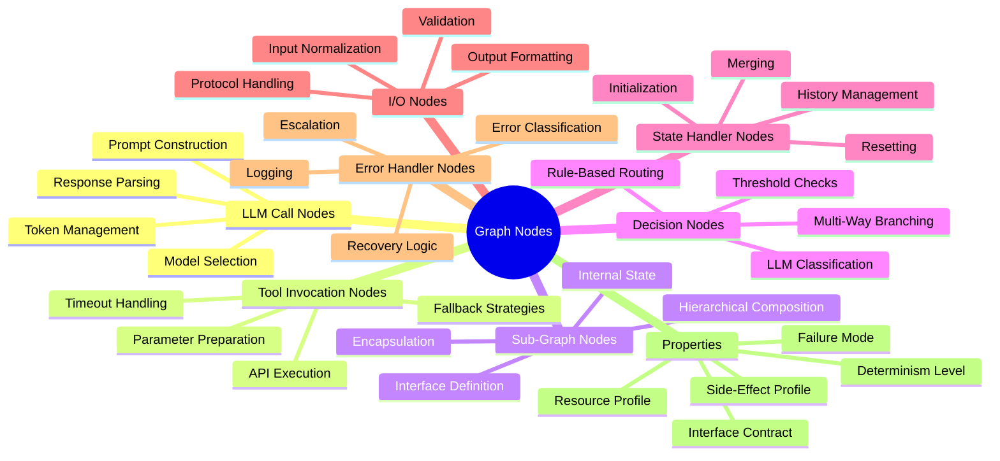
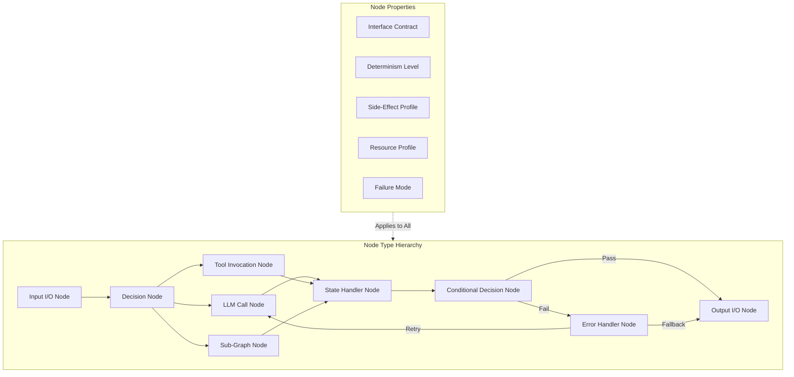
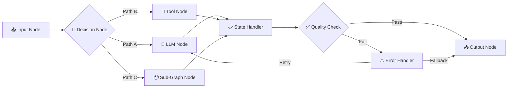
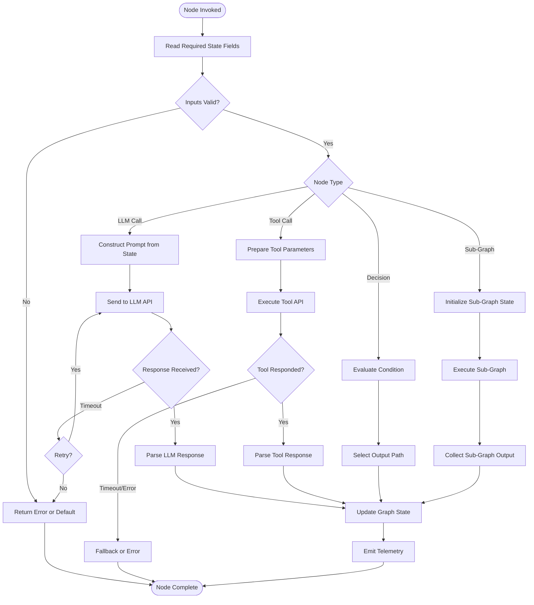
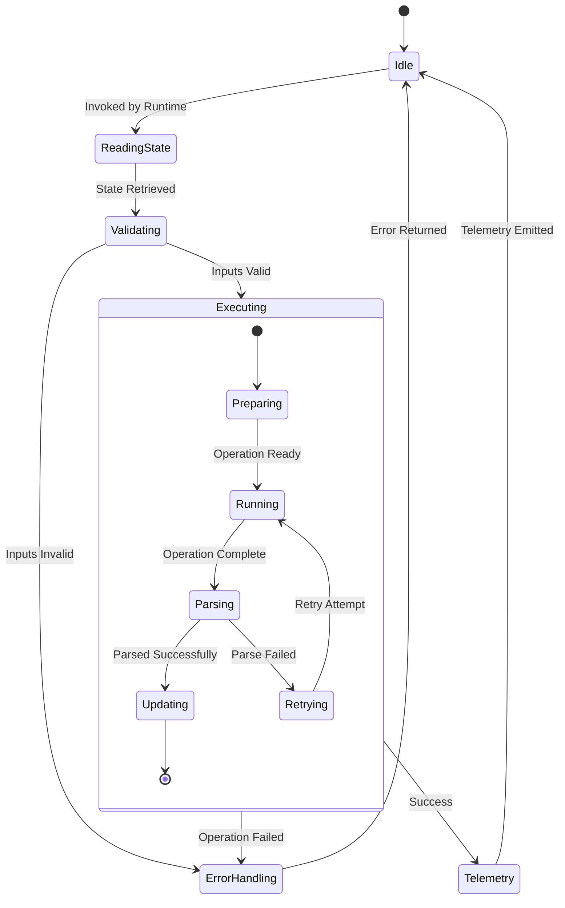
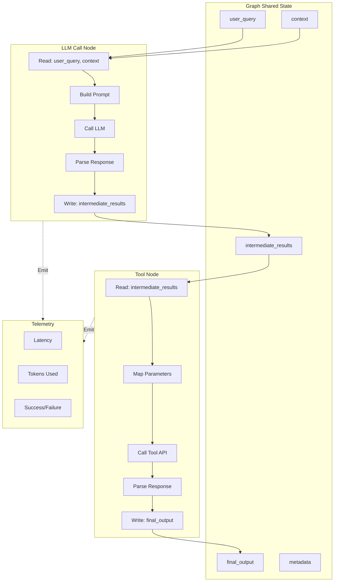
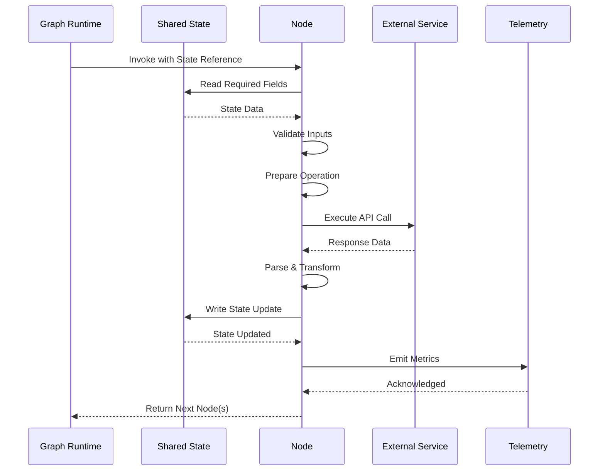

# Graph Nodes

## 📌 Overview

Graph Nodes are the atomic units of processing in a graph-based AI system. Every operation that the system performs—calling a language model, invoking a tool, transforming data, making a decision, or executing an entire sub-graph—happens within a node. Nodes are where the actual work of the system gets done; edges (covered in 10_Graph_Edges.md) merely direct the flow between nodes, and state provides the context that nodes need to do their work. Understanding nodes deeply is essential because the quality of a graph system is ultimately determined by the quality of its individual nodes, even though the system's overall behavior emerges from the interactions between them.

This document provides a comprehensive treatment of graph nodes, covering the major node types, their properties, design principles, and implementation patterns. While 08_Graph_Components.md categorized nodes into functional roles (processors, routers, guards, etc.), this document zooms in to examine the internal structure and behavior of nodes themselves. What does a well-designed node look like internally? How do you configure it for optimal performance? How do you test it in isolation? How do you handle failures and retries? These are the questions this document answers, providing the detailed knowledge needed to design, implement, and maintain high-quality nodes that compose reliably into larger graph systems.

## 🎯 Learning Objectives

After studying this document, you will be able to identify and describe the major node types used in graph-based AI systems, including LLM call nodes, tool invocation nodes, sub-graph nodes, decision nodes, state handler nodes, I/O nodes, and error handler nodes. You will understand the key properties that every node possesses—its interface, state access pattern, determinism level, side effects, and resource requirements—and how these properties affect node design and system behavior. You will learn the design principles that guide node construction, including single responsibility, interface clarity, idempotency, and graceful degradation. You will be able to make informed decisions about when to split a complex node into multiple simpler nodes and when merging nodes would improve clarity and performance. Finally, you will understand the testing strategies appropriate for each node type, enabling you to build robust test suites that validate node behavior in isolation and in context.

## 🧠 Definition

A Graph Node is a named, typed unit of execution within a graph-based AI system that receives input (from the graph's shared state or from specific upstream nodes), performs a defined operation, and produces output (as updates to the shared state or as direct outputs to specific downstream nodes). Every node has a type that defines its behavioral category, an interface that specifies its input and output contracts, and a configuration that controls its operational parameters. Nodes are the vertices of the graph—the points where processing occurs—while edges are the directed connections that determine the order and conditions under which nodes execute.

Nodes exist on a spectrum from fully deterministic to fully non-deterministic. A deterministic node, such as a data formatting node or a threshold check node, will always produce the same output for the same input. A non-deterministic node, such as an LLM call node, may produce different outputs on different invocations even with identical inputs, due to the inherent variability of language model sampling. This spectrum of determinism has profound implications for testing, monitoring, and system-level reasoning, and it is one of the key properties that distinguishes graph-based AI systems from traditional software systems where all components are deterministic.

## ❓ Why It Matters

The design of individual nodes has an outsized impact on overall system quality because nodes are the points where value is created and where things go wrong. A poorly designed prompt in an LLM node can produce hallucinated, biased, or irrelevant outputs that propagate through the rest of the graph, degrading the quality of every downstream node's inputs. A tool invocation node that does not handle timeouts properly can cause the entire graph to hang, wasting resources and degrading user experience. A decision node with ambiguous classification criteria can misroute a significant fraction of inputs, sending them to processing paths that produce poor results.

Node design also has a direct impact on system-level properties that emerge from node interactions. The latency of the overall graph is determined by the slowest node on the critical path. The cost of operating the graph is the sum of costs across all nodes, dominated by LLM call nodes. The testability of the graph depends on whether each node can be tested in isolation, which in turn depends on whether nodes have clean interfaces and minimal dependencies. The debuggability of the graph depends on whether nodes produce clear, structured logs that make it possible to trace the flow of data and identify where things went wrong. Investing in high-quality node design pays dividends across every aspect of system operation.

## 🏛️ Core Concepts

Every node in a graph system possesses a set of core properties that define its behavior and its interactions with the rest of the system. The **node type** determines the category of operation the node performs—LLM call, tool invocation, sub-graph execution, decision, state manipulation, input/output, or error handling. The **interface** defines what data the node reads from state and what data it writes to state, creating a contract that downstream nodes can rely on. The **state access pattern** specifies whether the node reads the full state, a subset of state fields, or only its direct inputs—more restricted access patterns produce more testable and reusable nodes.

The **determinism level** classifies how predictable the node's output is for a given input, ranging from fully deterministic (same input always produces same output) to stochastic (output varies with each invocation). The **side-effect profile** catalogs what external actions the node may perform—API calls, database writes, file operations—since side effects cannot be easily rolled back and must be handled carefully. The **resource profile** describes the node's computational requirements—CPU, memory, network, and particularly LLM token consumption—which affects cost, latency, and capacity planning. Finally, the **failure mode** describes how the node behaves when things go wrong—does it throw an error, return a partial result, fall back to a default, or retry?

These properties are not independent; they interact in important ways. A node that performs external API calls (side effect) is inherently less deterministic than a node that only processes in-memory data. A node with a high token consumption (resource profile) will dominate the system's cost structure. A node whose failure mode is to throw an error requires the graph to have explicit error-handling edges, while a node whose failure mode is to return a default value allows the graph to continue without special error handling. Understanding these property interactions is essential for making good design decisions.

## 🧩 Key Components

**LLM Call Nodes** are the most common and most important node type in AI graph systems. They construct a prompt from the current state (or a subset of it), send the prompt to a language model, receive the model's response, and extract the relevant information into a state update. LLM nodes have several configurable parameters: the model to use, the system prompt template, the temperature and other sampling parameters, the maximum tokens, and the output schema or parsing strategy. The quality of an LLM node is primarily determined by the quality of its prompt, making prompt engineering a critical skill for node design. LLM nodes are inherently non-deterministic and their latency is dominated by the model inference time, making them the primary determinants of both output quality and system latency.

**Tool Invocation Nodes** wrap calls to external tools, APIs, or services. They prepare the tool's input parameters from the graph state, execute the tool call, handle the response (including errors and timeouts), and map the tool's output back into the graph state. Tool nodes are critical for connecting the graph to the outside world—enabling it to search the web, query databases, execute code, send emails, or interact with any external system. Tool nodes must handle the full range of failure modes: network timeouts, authentication failures, rate limiting, invalid responses, and partial data. A well-designed tool node has configurable timeout and retry parameters, clear error reporting, and a fallback strategy for when the tool is unavailable.

**Sub-Graph Nodes** embed an entire graph within a single node of a parent graph. The sub-graph node receives input from the parent graph's state, executes its internal graph to completion, and returns the sub-graph's final state as its output. Sub-graphs enable hierarchical composition—building complex systems from simpler, reusable graph modules. A sub-graph node encapsulates its internal complexity, presenting a clean interface to the parent graph. For example, a research assistant graph might contain a sub-graph node for "document retrieval" that internally manages search query generation, multiple database queries, result ranking, and deduplication. The parent graph treats this as a single node that accepts a query and returns a list of relevant documents.

**Decision Nodes** evaluate conditions on the current state to determine which path the graph should take next. Decision nodes range from simple threshold checks (is the confidence score above 0.8?) to complex LLM-based classifications (what is the user's intent from these six categories?). Decision nodes are the primary mechanism for creating branching behavior in graphs, and their accuracy directly determines how well the graph handles diverse inputs. A misclassification in a decision node sends the input down the wrong processing path, producing a poor result regardless of how well the downstream nodes perform. This makes decision nodes among the most critical nodes in any graph system.

**State Handler Nodes** manipulate the graph's shared state without performing external operations. They initialize state fields, merge partial results, reset counters, update conversation history, or perform any other state management operation. State handler nodes are fully deterministic and typically very fast, but they play a crucial role in ensuring that state remains consistent and correct throughout the graph's execution. Poorly designed state handlers are a common source of bugs—overwriting state fields that downstream nodes need, failing to initialize fields that conditional branches expect, or creating state structures that are difficult for downstream nodes to consume.

**I/O Nodes** handle the interface between the graph and external systems at the input and output boundaries. Input nodes receive external data (HTTP requests, messages, files) and normalize it into the graph's internal state format. Output nodes take the graph's final state and deliver it to external systems (HTTP responses, database writes, notifications). I/O nodes are deterministic in their data transformation logic but non-deterministic in their timing (they depend on external system availability). They play a critical role in making the graph a self-contained system with well-defined boundaries.

**Error Handler Nodes** are specialized nodes that execute when a failure occurs in the graph. They receive information about the error (the failing node, the error type, the state at the time of failure) and implement the error handling strategy: logging the error, returning a user-friendly error message, attempting recovery, or escalating to human attention. Error handler nodes transform unstructured failures into structured responses, preventing error conditions from propagating unpredictably through the rest of the graph.

## 🧭 Mental Model

Think of nodes as the workstations in a professional kitchen, each staffed by a specialist chef with a specific role and clear inputs and outputs. The prep chef (input node) receives raw ingredients and prepares them for cooking. The sauté chef (LLM node) takes prepared ingredients and applies specialized techniques to transform them. The grill chef (tool node) operates specialized equipment that requires specific input formats. The expediter (decision node) examines each order and directs it to the appropriate station. The pastry chef (sub-graph node) manages an entire sub-kitchen with its own internal workflow. The plating chef (state handler) assembles components from multiple stations onto a single plate. The quality inspector (error handler) checks every plate before it leaves the kitchen.

Each chef works independently, focused on their specialty, but they coordinate through a shared understanding of what each station produces. The sauté chef doesn't need to know how the prep chef prepared the ingredients, only that they arrive in the expected format. This separation of concerns is the same principle that guides node design: each node should be a specialist that does one thing well, with a clear interface that other nodes can rely on. When a chef becomes overwhelmed, you can add another station (split a node) or redistribute work (merge nodes). When a new dish requires a new technique, you add a new station with a specialist chef (add a node type).

## 🗺️ Mind Map

## 🏗️ Architecture Diagram

## 🔄 Workflow

## ⚙️ Internal Working

The internal operation of a node follows a consistent pattern regardless of its type, though the specifics vary significantly. Every node begins by reading its required inputs from the graph state. The node then performs its primary operation—constructing and sending an LLM prompt, preparing and executing a tool call, evaluating a decision condition, or manipulating state fields. During this operation, the node may interact with external services (LLM APIs, tool endpoints, databases) and may produce intermediate results that are used to compute the final output. The node then produces its output as a state update, which is merged into the graph's shared state by the graph runtime. Finally, the node may emit telemetry data—latency, token consumption, success/failure status—that feeds into the monitoring system.

For an LLM Call Node, the internal working is more detailed. First, the node reads the relevant state fields needed to construct the prompt. It then applies a prompt template, substituting state values into placeholder positions. The completed prompt is sent to the configured LLM along with parameters like temperature, max tokens, and stop sequences. While waiting for the response, the node may enforce a timeout. When the response arrives, the node parses it—extracting structured data from the LLM's text output using techniques like JSON extraction, regex matching, or structured output parsing. The parsed data is then formatted as a state update and returned. If parsing fails, the node may retry with a modified prompt or fall back to a default value.

For a Tool Invocation Node, the internal working involves parameter mapping, execution, and response handling. The node reads the tool's required parameters from the state, validating that all required parameters are present and correctly typed. It then constructs the tool's API request, including authentication, headers, and body. The request is sent with a configurable timeout, and the response is received and validated against an expected schema. If the response is valid, the relevant data is extracted and returned as a state update. If the tool returns an error, times out, or returns invalid data, the node's failure mode determines what happens: retry with backoff, return a default value, or raise an error for the graph's error handling edges.

## 🔀 Execution Flow

## 📊 Lifecycle

## 📡 Data Flow

## 🤝 Interaction Flow

## 🌍 Real-World Analogy

Consider a modern automobile manufacturing plant where each node is a specialized robotic workstation. The welding robot (LLM node) receives pre-formed metal panels and applies precise welds according to programmed patterns—its output quality depends on the programmed pattern (prompt), the robot's precision (model capability), and the quality of the input panels (state). The painting robot (tool node) applies a specific coating using specialized equipment (external tool)—it requires correctly prepared surfaces and produces a finish that downstream stations (quality inspection) evaluate. The assembly robot (sub-graph node) is actually a mini-assembly line within the main line, taking multiple sub-components and producing a fully assembled sub-assembly. The quality inspection station (decision node) measures the assembled product against specifications and routes it either to the next station or back for rework.

The analogy extends to node design principles. Each robotic station has a clearly defined interface—it receives parts in a specific orientation and produces parts in a specific orientation. Stations do not reach into each other's work areas; they communicate only through the conveyor belt (the graph's state). If a station is upgraded (model change), only that station is affected; the rest of the line continues to operate. If a station fails, the line can be stopped or the product can be diverted to a manual repair station (error handler). The overall quality of the finished automobile depends on every station performing its role correctly, just as the quality of a graph system's output depends on every node performing its role correctly.

## 💡 Practical Example

Consider a customer support graph where a user submits a complaint. The first node is an Input I/O Node that receives the complaint via HTTP, validates the required fields (user ID, complaint text, category), and writes them to the shared state. The second node is a Decision Node that uses an LLM to classify the complaint into one of four categories: billing, technical, account access, or general inquiry. Based on the classification, the graph routes to one of four specialized LLM Call Nodes, each with a prompt tuned for its category. The billing node queries the user's account history and generates a billing-related response. The technical node runs diagnostics and provides troubleshooting steps.

After the specialized node produces its response, a State Handler Node adds the response to the conversation history and increments a turn counter. A Conditional Decision Node checks whether the turn counter has exceeded a maximum—if so, it routes to an escalation path that creates a support ticket. Otherwise, it routes to an Output I/O Node that formats the response and delivers it to the user. If any LLM node fails (timeout, invalid response), an Error Handler Node catches the error, logs the details, and routes to a fallback LLM node with a simpler prompt that is more likely to succeed. This example demonstrates how different node types work together, each performing its specialized role, with the graph topology orchestrating their interaction.

## 🧪 Use Cases

One critical use case is building a multi-step reasoning chain where each LLM node performs one step of a complex reasoning task. For example, a legal analysis system might have separate nodes for extracting relevant facts from a case document, identifying applicable legal principles, analyzing how the principles apply to the facts, identifying potential counterarguments, and synthesizing a legal opinion. Each node is a specialized LLM node with a prompt tuned for its specific reasoning step. The advantage of separating these into distinct nodes (rather than one large prompt) is that each step can be independently optimized, tested, and updated. If the fact extraction step needs improvement, you can modify its prompt without affecting the other steps.

Another important use case is implementing a tool-augmented research system where a planner node decides which tools to call, tool nodes execute the calls, and an evaluator node assesses whether enough information has been gathered. This creates a loop where the planner can issue additional tool calls if the evaluator determines that the research is insufficient. Each node in this loop has a clear responsibility, and the loop's termination condition is managed by the evaluator's decision node. This pattern is common in systems that need to gather information from multiple sources before producing a final answer.

A third use case is building a hierarchical system using sub-graph nodes. A corporate knowledge assistant might have a top-level routing graph that classifies queries by department (HR, legal, engineering, sales) and delegates each to a department-specific sub-graph. Each department sub-graph has its own specialized nodes, prompts, and tools, but presents a clean interface to the top-level graph. This hierarchical composition allows each department's sub-graph to be developed, tested, and deployed independently, while the top-level graph provides unified routing and I/O handling.

## ⚖️ Comparison

| Node Type | Primary Operation | Determinism | External Dependencies | Latency Profile |
|---|---|---|---|---|
| **LLM Call** | Prompt → Model → Parse | Non-deterministic | LLM API | High (1-30s) |
| **Tool Invocation** | Params → API → Response | Deterministic (usually) | Tool API | Medium (100ms-5s) |
| **Sub-Graph** | Input → Execute graph → Output | Varies | Internal + sub-graph deps | High (sum of sub-graph) |
| **Decision** | Evaluate condition → Select path | Deterministic or LLM-based | None or LLM API | Low (μs-100ms) |
| **State Handler** | Read/write state fields | Fully deterministic | None | Very low (μs) |
| **I/O** | Receive/deliver external data | Deterministic transform | External system | Medium (varies) |
| **Error Handler** | Process error info → Recovery | Deterministic | None or escalation API | Low (μs-100ms) |

The key trade-off in node selection is between capability and determinism. LLM nodes are the most capable but the least deterministic and the most expensive. Tool nodes provide access to real-world data but introduce external dependencies. Decision nodes enable branching but their accuracy determines system quality. State handler and I/O nodes are reliable and fast but limited in what they can do. Effective graph design balances these trade-offs, using the most deterministic, cheapest node type that can accomplish the task, and reserving LLM nodes for tasks that genuinely require language model capabilities.

## ✅ Best Practices

Design every node with a single, clear responsibility. A node that both classifies input and generates a response is doing two things, and changing one behavior risks breaking the other. Instead, use a decision node for classification and a separate LLM node for response generation, connected by an edge. This separation makes each node easier to test, optimize, and reuse. When reviewing a node design, ask: "Can I describe what this node does in a single sentence without using the word 'and'?" If not, the node probably has too many responsibilities and should be split.

Make every node's state access explicit and minimal. A node should read only the state fields it actually needs and write only the fields it actually produces. This principle, analogous to the principle of least privilege in security, produces nodes that are easier to test (fewer inputs to mock), easier to reason about (clear data dependencies), and easier to reuse in different graphs (fewer state requirements). Document the node's state access pattern as part of its interface contract, listing exactly which fields it reads and which it writes.

Implement comprehensive error handling within each node, following the principle of defensive programming. Every external call (LLM API, tool API) should have a timeout, every response should be validated against an expected schema, and every failure should produce a structured error that the graph's error handling edges can process. Nodes should never throw unhandled exceptions; they should always return either a successful result or a well-defined error. This discipline ensures that the graph remains in control even when individual components fail, enabling graceful degradation rather than cascading failures.

## ❌ Common Mistakes

The most common mistake is building nodes that are too large and do too much. A single node that classifies input, retrieves data, processes it, formats the output, and decides what to do next is a maintenance nightmare. It is difficult to test (you cannot test the classification without also testing the processing), difficult to optimize (improving the processing may require changes to the classification code), and difficult to reuse (the node is tied to a specific combination of operations). The solution is to decompose such nodes into multiple smaller nodes, each with a single responsibility, connected by edges that define the flow.

Another frequent mistake is ignoring the state access pattern and having nodes read or write more state fields than necessary. This creates hidden dependencies between nodes that are not visible from the graph topology. If Node A writes a state field that Node C reads, but the connection is not visible in the graph structure (because Node B is between them in the execution order), then changing Node B's behavior can inadvertently break Node C. Making state access explicit and minimal eliminates these hidden dependencies and makes the graph's data flow visible and traceable.

A third common mistake is treating all node types the same during testing. Deterministic nodes (state handlers, transforms) can be tested with exact output matching, but non-deterministic nodes (LLM calls) require statistical evaluation using the evaluation harness described in 07_Graph_Lifecycle.md. Testing an LLM node by checking for an exact output string will produce flaky tests that sometimes pass and sometimes fail, eroding confidence in the test suite. Instead, test LLM nodes for semantic quality, structural correctness, and constraint satisfaction, using appropriate evaluation metrics for each.

## 🚀 Advanced Topics

Dynamic node configuration enables a node's behavior to be adjusted at runtime based on the input or state. For example, an LLM node might select different models based on the complexity of the input—using a smaller, faster model for simple queries and a larger, more capable model for complex ones. The model selection decision can be made by a preceding decision node or by the LLM node itself based on input characteristics. Dynamic configuration enables cost optimization (using expensive models only when needed) and performance optimization (using fast models for the common case), but it adds complexity to testing and monitoring since the node's behavior is no longer fixed.

Node cloning and parallelization is an advanced technique where multiple instances of the same node type execute concurrently on different inputs or with different configurations. For example, a summarization system might run three different summarization prompts in parallel and use an aggregator node to select the best summary. This pattern, known as the "committee of experts" approach, can improve output quality by leveraging the diversity of different model configurations. However, it also multiplies cost and latency, so it should be used judiciously and only for high-value decisions where the quality improvement justifies the additional expense.

Adaptive nodes use feedback from previous executions to improve their future performance. An LLM node might maintain a cache of successful prompts for similar inputs and use them as few-shot examples. A decision node might track its classification accuracy and adjust its confidence thresholds. A tool node might learn which data sources are most reliable for different query types and prefer them. These adaptive behaviors transform nodes from static processors into learning components that improve over time, but they require careful design to ensure stability and prevent the learning process from introducing regressions. The monitoring and evolution practices from 07_Graph_Lifecycle.md are essential for managing adaptive nodes safely.