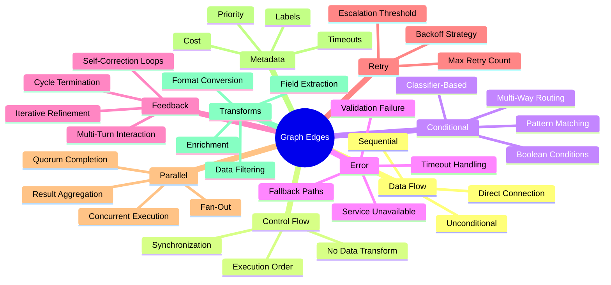
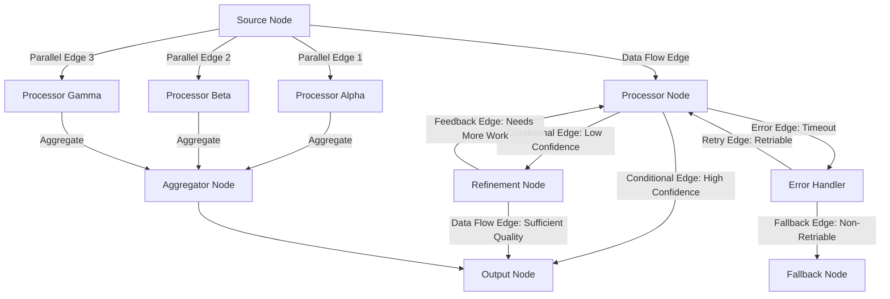
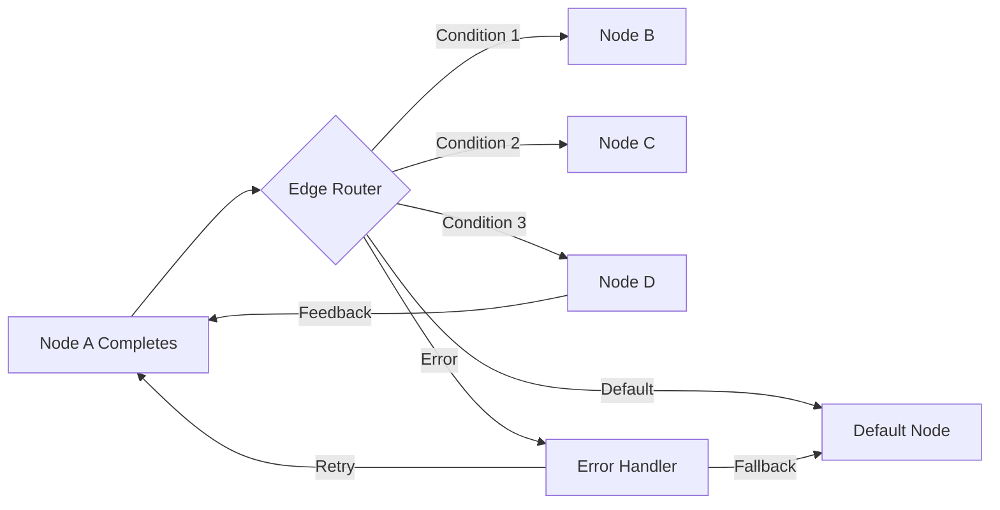
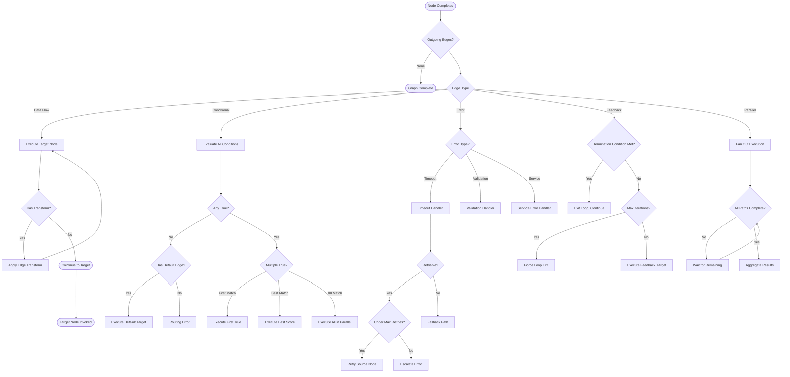
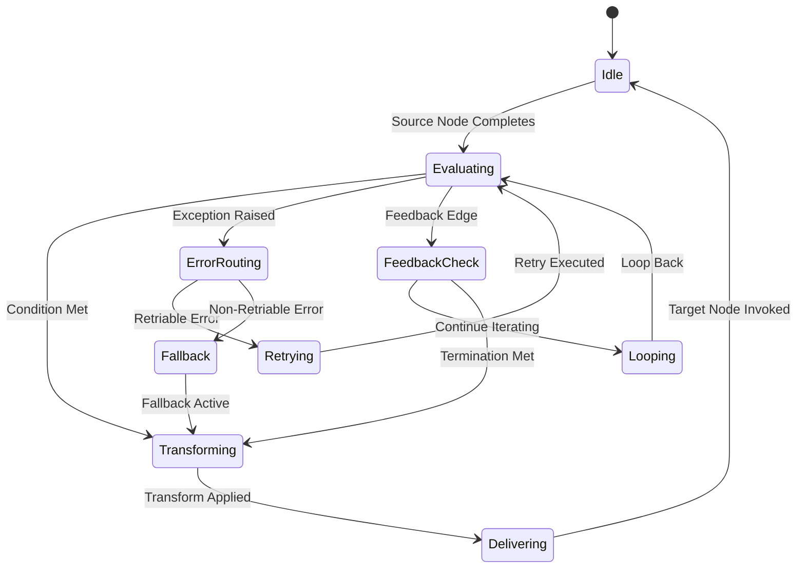
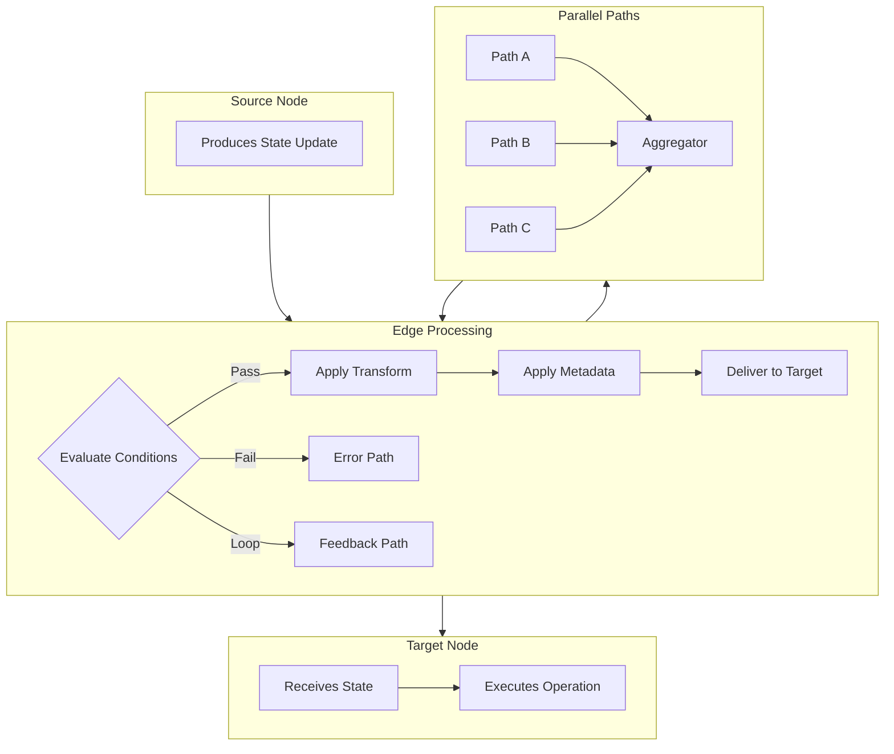
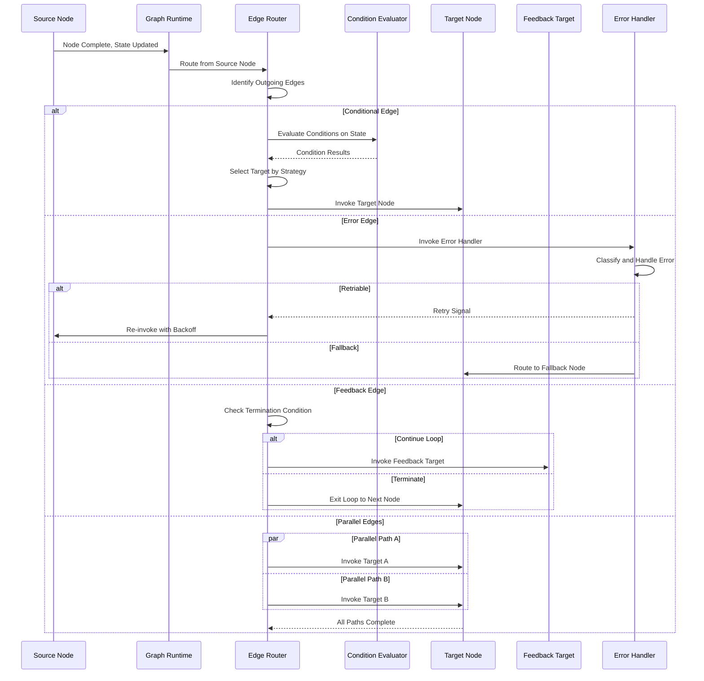

# Graph Edges

## 📌 Overview

Graph Edges are the directed connections between nodes that define how data, control, and state flow through a graph-based AI system. While nodes (covered in 09_Graph_Nodes.md) are where the processing happens, edges are where the intelligence of the system's structure lives. A collection of nodes without edges is just a bag of capabilities; it is the edges that transform those capabilities into a coherent system with defined behavior. The design of edges determines the system's routing logic, error handling, data transformations, and dynamic behavior. In many ways, edge design is more architecturally consequential than node design, because edges define the system's topology—the overall shape of its behavior.

This document provides a comprehensive treatment of graph edges, covering the major edge types, their routing logic, transformation capabilities, and design principles. Edges are often underappreciated compared to nodes—practitioners spend hours perfecting prompt templates but minutes on routing conditions. This imbalance is misguided, because even perfectly designed nodes will produce poor system-level results if the edges connecting them are poorly designed. A classification node that routes to the wrong handler, or a feedback edge that never terminates, can undermine the entire system regardless of how well individual nodes perform.

## 🎯 Learning Objectives

After studying this document, you will be able to identify and describe the major edge types used in graph-based AI systems, including data flow edges, control flow edges, conditional edges, error edges, feedback edges, and retry edges. You will understand how routing logic is implemented for each edge type and how to design routing conditions that are correct, complete, and efficient. You will learn how edge metadata enriches edges with additional information such as transformation functions, priority levels, and cost weights. You will be able to design parallel edge configurations that enable concurrent execution while managing the resulting complexity. Finally, you will understand the common edge design anti-patterns and how to avoid them, enabling you to design edge structures that produce correct, efficient, and maintainable system behavior.

## 🧠 Definition

A Graph Edge is a directed connection between two nodes in a graph-based AI system that specifies when and how execution and data flow from a source node to a target node. Every edge has a source node (where it originates), a target node (where it leads), and one or more conditions that determine whether the edge is traversed. Edges may also carry metadata that specifies data transformations to apply during traversal, priority for conflict resolution when multiple edges are active, and annotations for documentation and monitoring purposes.

At the most fundamental level, edges answer three questions about the relationship between nodes. First, the connectivity question: which nodes are connected? Second, the conditionality question: under what circumstances is the edge traversed? Third, the transformation question: what happens to the data as it flows along the edge? Different edge types prioritize these questions differently. A simple data flow edge focuses on connectivity and assumes unconditional traversal. A conditional edge adds sophisticated conditionality. A feedback edge introduces temporal complexity by connecting a later node back to an earlier one. Understanding these edge types and their interactions is essential for designing systems whose behavior is correct, predictable, and efficient.

## ❓ Why It Matters

Edge design directly determines the correctness and efficiency of the overall system. Consider a customer support system where the classification node must route incoming queries to the appropriate specialist handler. If the conditional edges from the classifier are poorly designed—perhaps the conditions overlap, causing some queries to match multiple handlers, or there are gaps, causing some queries to match no handler—the system will produce inconsistent and unreliable results regardless of how well the classifier and handlers perform. The routing accuracy of the edges is just as important as the classification accuracy of the node.

Edge design also has a profound impact on system performance and cost. An edge that creates an unnecessary loop can cause the system to make redundant LLM calls, multiplying latency and cost. An edge that always takes the most expensive path when a cheaper path would suffice wastes resources. An edge that triggers parallel execution for every input, even when parallelism is not needed, creates unnecessary load. Conversely, well-designed edges can dramatically improve performance—parallel edges that enable concurrent processing can reduce latency from the sum of all node times to the maximum of any single node time. Edges that implement early termination can skip unnecessary processing when sufficient information is already available.

Furthermore, edges are the primary mechanism for implementing error handling, feedback loops, and adaptive behavior in graph systems. An error edge from any node to a centralized error handler ensures that failures are caught and managed consistently. A feedback edge from an evaluator node back to a processing node enables iterative refinement. A conditional edge that checks output quality and routes to a retry path enables self-correcting behavior. These patterns cannot be implemented at the node level; they require thoughtful edge design that connects nodes into the right topological patterns.

## 🏛️ Core Concepts

The fundamental taxonomy of graph edges is organized around the purpose each edge type serves in the system. **Data flow edges** are the simplest type, providing unconditional, direct connections that pass data from one node to the next in sequence. They represent the default path through the graph and are the most common edge type in linear and sequential graph patterns. **Control flow edges** govern the order of execution without carrying data transformations—they determine which node executes next based on the completion of the current node, but they don't modify the data in transit.

**Conditional edges** add routing logic that evaluates conditions on the current state to determine which of several possible target nodes to traverse. Conditional edges are the mechanism that transforms linear graphs into branching graphs, enabling the system to handle diverse inputs through specialized processing paths. The conditions on conditional edges can be simple (checking a boolean flag) or complex (evaluating multiple state fields against thresholds). **Error edges** connect nodes to error handling nodes, providing a dedicated path for failure scenarios. Error edges are typically configured with specific error type filters—some error edges handle timeouts, others handle validation failures, and others handle external service outages.

**Feedback edges** connect a downstream node back to an upstream node, creating cycles in the graph that enable iterative processing. Feedback edges are essential for patterns like self-correction (where an evaluator checks output quality and routes back to the processor if quality is insufficient), progressive refinement (where each iteration improves the output), and multi-turn interaction (where the system engages in a conversation with the user). **Retry edges** are a specialized form of feedback edge that specifically handles the case where a node's operation fails and needs to be re-attempted. Retry edges typically include configuration for maximum retry count, backoff strategy, and failure escalation.

Beyond these primary types, two additional edge concepts provide important structural capabilities. **Parallel edges** fan out from a single node to multiple target nodes, enabling concurrent execution. The graph runtime executes all parallel targets simultaneously and waits for all (or a quorum of) them to complete before proceeding. **Fallback edges** provide alternative paths when the primary path is unavailable, implementing graceful degradation by routing to a simpler, cheaper, or more reliable processing option when the preferred option fails.

## 🧩 Key Components

**Edge Conditions** are the boolean expressions that determine whether a conditional edge is traversed. An edge condition is a function that takes the current graph state and returns true or false. Conditions can be simple field checks (state.confidence > 0.8), pattern matches (state.intent matches "billing.*"), or complex multi-criteria evaluations. The design of edge conditions is critical because incorrect conditions cause routing errors—either sending inputs down the wrong path (false positives) or failing to route them to any path (false negatives). Edge conditions should be exhaustive (covering all possible inputs) and mutually exclusive (no input matches more than one condition) unless intentional overlap is desired for parallel processing.

**Edge Transforms** are functions that modify the data as it flows along an edge. Rather than passing state unchanged from source to target, an edge transform can format, filter, enrich, or reshape the data. For example, an edge from a classification node to a specialist processor might transform the state by extracting only the fields relevant to that specialist, reducing the amount of data the specialist needs to process. Edge transforms allow data adaptation without adding extra transform nodes to the graph, keeping the topology cleaner. However, they can make the graph harder to debug because data transformations are not visible as separate processing steps.

**Edge Metadata** enriches edges with additional information that affects their behavior or provides documentation. Priority metadata determines which edge is preferred when multiple edges are eligible for traversal. Cost metadata tracks the expected cost of traversing the edge (useful for optimization and budgeting). Label metadata provides human-readable descriptions for documentation and debugging. Timeout metadata specifies how long to wait for the target node to complete before considering the edge traversal failed. Retry metadata configures the retry behavior for the edge. This metadata layer enables rich edge behavior without complicating the core routing logic.

**Routing Functions** are the computational engines that implement edge routing logic. For simple conditional edges, the routing function evaluates a single boolean condition. For complex multi-way routing, the routing function may evaluate multiple conditions in sequence, use a classifier (rule-based or LLM-based) to select among multiple targets, or compute a score for each target and select the highest-scoring one. The routing function is the most critical part of conditional edge design because it directly determines routing accuracy. A well-designed routing function produces correct, consistent routing decisions across the full range of possible inputs, including edge cases and ambiguous inputs.

## 🧭 Mental Model

Think of edges as the roads and highways in a transportation network, with nodes as the cities and intersections. A data flow edge is a one-way street that always leads from one city to the next. A conditional edge is a highway interchange with multiple exits, each signed for a specific destination—the driver (the routing function) reads the signs (the conditions) and takes the appropriate exit. An error edge is an emergency detour that activates when the main road is blocked. A feedback edge is a roundabout or a U-turn that sends traffic back to a previous intersection. A retry edge is a pull-off where a truck can turn around and try the mountain pass again after failing on the first attempt.

This transportation analogy highlights several important properties of edge design. First, the network's efficiency depends on the quality of the routing decisions—if the signs are confusing or missing, drivers end up on wrong roads, just as poor edge conditions send inputs down wrong processing paths. Second, the network must handle all possible origins and destinations—if there's a city with no road leading to it, it's unreachable, just as a node with no incoming edge is dead code. Third, the network must avoid dead ends and infinite loops—every path should eventually reach a destination, just as every execution path in a graph should eventually terminate. Fourth, parallel highways enable faster travel by providing multiple routes simultaneously, just as parallel edges enable faster processing through concurrent execution.

## 🗺️ Mind Map

## 🏗️ Architecture Diagram

## 🔄 Workflow

## ⚙️ Internal Working

When a node completes its execution, the graph runtime examines the edges originating from that node to determine which node(s) to execute next. For a simple data flow edge, the runtime immediately begins executing the target node, passing the current state as input. The edge traversal is essentially instantaneous—it is a control signal, not a data processing step. The state remains unchanged during traversal unless the edge has an associated transform function, in which case the transform is applied to the state before the target node receives it.

For conditional edges, the runtime evaluates each edge's condition against the current state. If an edge's condition returns true, that edge is eligible for traversal. The routing function then selects among eligible edges based on the routing strategy: first-match (select the first true condition in priority order), best-match (select the condition with the highest confidence score), or all-match (traverse all true conditions, creating parallel execution). The selected target node(s) are then invoked. If no edge's condition is true, the routing function checks for a default edge; if no default exists, the graph execution terminates with a routing error.

For feedback edges, the runtime must handle the cycle that the edge creates. The graph runtime tracks the execution history and evaluates the feedback edge's termination condition before allowing traversal. Common termination conditions include a maximum iteration count (preventing infinite loops), a quality threshold (stop iterating once output quality is sufficient), or a convergence check (stop iterating when the output stops changing significantly). The runtime maintains a loop counter and any other state needed to evaluate termination conditions, ensuring that feedback loops always terminate.

For parallel edges, the runtime identifies all edges from the source node that are marked as parallel and initiates execution of all target nodes concurrently. The runtime then waits for all parallel paths to complete (or for a configured quorum) before proceeding. During parallel execution, each path operates on a copy of the state (or a shared state with appropriate locking, depending on the framework). The results from all parallel paths are then presented to the aggregator node that the parallel edges converge on. The runtime manages the complexity of concurrent execution, including timeout handling for individual paths, partial failure management, and result collection.

## 🔀 Execution Flow

## 📊 Lifecycle

## 📡 Data Flow

## 🤝 Interaction Flow

## 🌍 Real-World Analogy

Consider the routing system of a major package delivery company. When a package arrives at a sorting facility (source node), it travels along a conveyor belt (data flow edge) to a scanner that reads the destination address. Based on the address, the routing system (conditional edge conditions) directs the package to the appropriate outbound conveyor—one for local deliveries, one for regional deliveries, and one for international shipments. If a package has an unreadable address (error), it is routed to a manual sorting station (error handler edge). If a package requires additional processing (such as customs documentation), it is routed back to a processing station (feedback edge). High-volume periods may see packages directed to multiple parallel processing lines (parallel edges), with results consolidated at the end.

The delivery analogy illuminates several critical aspects of edge design. The routing system must have a condition for every possible destination—if a package's address corresponds to a region with no outbound conveyor, the package is stuck. The routing conditions must be unambiguous—if two conveyors both claim to handle the same region, packages may be misrouted. The system must handle exceptions gracefully—a damaged package needs a different path than a correctly processed one. And the system must avoid infinite loops—a package that keeps getting sent back for additional processing without ever being shipped out represents a failure of the feedback edge's termination condition. These are exactly the same challenges that Graph Engineers face when designing edge structures for AI systems.

## 💡 Practical Example

Consider a content generation system that produces blog posts. The graph begins with a Source Node that receives the topic and parameters. A Decision Node classifies the content type (tutorial, opinion, news analysis, or listicle) and routes via conditional edges to one of four specialized LLM Nodes, each with a prompt tuned for that content type. After the LLM Node generates a draft, a conditional edge checks the draft length: if it is too short, a feedback edge routes back to the LLM Node with instructions to expand; if it is too long, a different feedback edge routes to a condensation Node. Once the length is acceptable, a quality evaluation Node scores the draft on relevance, coherence, and readability.

A conditional edge from the quality evaluator checks the score: if it exceeds 0.85, a data flow edge routes to the output Node; if it is between 0.6 and 0.85, a feedback edge routes back to the LLM Node with improvement instructions; if it is below 0.6, an error edge routes to a human review Node. The feedback loop has a maximum iteration count of three to prevent infinite refinement. Additionally, if the LLM Node times out (which happens occasionally with complex generation tasks), an error edge routes to a fallback Node that uses a simpler, faster prompt to produce a basic draft. This example demonstrates how multiple edge types work together to create a system that is both robust (handles failures gracefully) and adaptive (improves output quality through feedback loops).

## 🧪 Use Cases

One critical use case is implementing intelligent routing in a multi-domain assistant. A single assistant handles queries about products, billing, technical support, and general knowledge. The classification node produces a domain label, and conditional edges route to domain-specific processing graphs. The key design challenge is handling ambiguous queries that could plausibly belong to multiple domains. The edge conditions must include tie-breaking logic—perhaps checking for keyword signals, user history, or contextual clues. The routing function might use a confidence threshold: if the highest-confidence classification is above 0.8, take that path; if it is between 0.5 and 0.8, ask a clarification node to disambiguate; if it is below 0.5, route to a general-purpose handler. This graduated routing strategy, implemented through carefully designed conditional edges, dramatically improves the system's ability to handle ambiguous inputs.

Another important use case is building a self-correcting code generation system. The graph has a code generation node, a test execution node, and a feedback edge that routes test failures back to the code generation node with the error message as additional context. The feedback edge has a termination condition of three iterations: if the code still fails after three generation attempts, an error edge routes to a human developer. A parallel edge configuration runs multiple test suites concurrently, and an aggregator node collects all test results. This system demonstrates how feedback edges enable iterative improvement, error edges provide safety nets, and parallel edges enable efficient execution—all through edge design rather than node complexity.

A third use case is implementing a multi-model consensus system for high-stakes decisions. The same input is sent via parallel edges to three different LLM nodes using three different models. A conditional edge from each model node routes to a consensus aggregator. The aggregator compares the three outputs and uses a conditional edge to check agreement: if all three agree, the output is accepted; if two of three agree, a tiebreaker node using a fourth model makes the final decision; if all three disagree, a human review edge is triggered. This pattern uses parallel edges for redundancy, conditional edges for consensus checking, and error edges for disagreement handling, demonstrating how edge design can implement sophisticated reliability patterns.

## ⚖️ Comparison

| Edge Type | Purpose | Condition | Direction | Cycle Risk |
|---|---|---|---|---|
| **Data Flow** | Sequential connection | None (always active) | Forward only | None |
| **Control Flow** | Execution ordering | None or simple | Forward only | None |
| **Conditional** | Branching/routing | State-based boolean | Forward only | None |
| **Error** | Failure handling | Error type match | Any direction | Low |
| **Feedback** | Iterative improvement | Quality/convergence check | Backward | High (needs termination) |
| **Retry** | Transient failure recovery | Error + retry count | Backward | Managed (max count) |
| **Parallel** | Concurrent execution | All active simultaneously | Forward only | None |
| **Fallback** | Graceful degradation | Primary path failure | Forward only | None |

The key dimension of comparison is the trade-off between flexibility and complexity. Data flow and control flow edges are simple and predictable but limited in expressiveness. Conditional edges add routing flexibility but require careful condition design to avoid gaps and overlaps. Feedback edges enable powerful iterative patterns but introduce the risk of infinite loops and require termination conditions. Parallel edges dramatically improve throughput but add complexity in result aggregation and partial failure handling. Effective edge design selects the simplest edge type that meets the behavioral requirement, avoiding unnecessary complexity.

## ✅ Best Practices

Design edge conditions to be exhaustive and mutually exclusive. Every possible state configuration that can arise at the edge's source node should match exactly one conditional edge. Gaps in coverage (states that match no condition) cause routing failures, while overlaps (states that match multiple conditions) cause ambiguous routing. The easiest way to achieve this is to define a complete enumeration of all possible routing outcomes and ensure that each has exactly one corresponding condition. Include a default or catch-all condition as a safety net, even when you believe your conditions are exhaustive. This default path should log the unmatched state for analysis, helping you discover conditions you didn't anticipate.

Always include termination conditions on feedback edges. Every cycle in the graph must have a guaranteed exit point. The three most common termination strategies are maximum iteration count (stop after N iterations regardless of quality), quality threshold (stop when output quality exceeds a threshold), and convergence detection (stop when the output stops changing between iterations). The best practice is to combine at least two of these—a maximum iteration count as a hard limit and a quality threshold as the desired exit condition. This ensures that the loop always terminates (bounded by the iteration count) while normally exiting when quality is sufficient (bounded by the threshold).

Document every edge's purpose, condition, and expected data flow. Edges are the connective tissue of the graph, and their behavior should be immediately understandable from documentation. For conditional edges, document the exact condition in both natural language and code. For feedback edges, document the termination condition and the expected number of iterations. For error edges, document which error types they handle and what recovery strategy they implement. For parallel edges, document whether all paths must succeed or whether a quorum is sufficient. This documentation is essential for maintaining the graph over time, especially when multiple engineers contribute to its evolution.

## ❌ Common Mistakes

The most common and damaging edge design mistake is creating feedback edges without proper termination conditions. An unterminated feedback loop can cause the graph to execute indefinitely, consuming resources and producing no useful output. This mistake is particularly insidious because it may not be caught during testing if the test inputs happen to produce outputs that meet the quality threshold quickly. In production, however, adversarial inputs or unusual state configurations can trigger the loop and cause it to run without bound. Always implement a hard iteration limit as a safety net, even when a quality-based termination condition is the primary exit mechanism.

Another frequent mistake is designing conditional edges with overlapping conditions that cause non-deterministic routing. If two edges both match the same state configuration, the routing behavior depends on the order in which conditions are evaluated, which may not be consistent across framework implementations or versions. This produces erratic system behavior that is extremely difficult to debug because the root cause (condition overlap) is not obvious from observing the system's inputs and outputs. The solution is to test conditions for mutual exclusivity and to add explicit priority ordering when overlap is intentional.

A third common mistake is overusing parallel edges without considering the cost implications. Parallel execution multiplies the cost of every node on the parallel paths. If three parallel paths each call an LLM node, the system makes three LLM calls per execution instead of one, tripling the cost. Parallel edges should be used only when the latency reduction justifies the cost increase, and when the parallel paths genuinely produce different value (not redundant results). A common anti-pattern is fanning out to three identical LLM nodes hoping for better results through redundancy—this is usually better handled by a single LLM node with a better prompt and a feedback loop for self-correction.

Ignoring edge transforms is another mistake that leads to data format mismatches. When a node's output format does not match the next node's expected input format, the data must be transformed somewhere. If this transformation is not explicitly designed—either as an edge transform or as a dedicated transform node—the mismatch will cause runtime errors or, worse, silent data corruption where the target node processes incorrectly formatted data without raising an error. Always verify that data formats are compatible across every edge and add explicit transforms where needed.

## 🚀 Advanced Topics

Dynamic edge routing uses runtime information to modify edge behavior, going beyond static conditions evaluated on the current state. A dynamic router might consider historical routing statistics—if a particular path has been producing poor results recently, reduce its priority. It might consider real-time load balancing—if a target node is experiencing high latency, route to an alternative. It might consider cost optimization—if a cheaper path is available and the quality difference is acceptable, prefer the cheaper option. Dynamic routing transforms edges from static connections into adaptive, context-aware routing decisions that optimize system behavior in real time.

Edge-level observability and tracing provides detailed visibility into how data flows through the graph at the edge level. Each edge traversal is logged with a trace ID, the source and target nodes, the edge condition that was evaluated, the state at the time of evaluation, any transform that was applied, and the latency of the traversal. These edge-level traces enable powerful debugging capabilities: you can trace a single request's complete path through the graph, identify exactly which conditional edge routed it, and see what the state looked like at each routing decision. Edge tracing is essential for debugging complex graphs with many conditional paths and feedback loops, where the system's behavior can be difficult to predict from the topology alone.

Probabilistic edges introduce controlled randomness into routing decisions, enabling exploration and diversity. Rather than always taking the highest-scoring path, a probabilistic edge might route 80% of traffic to the best path and 20% to alternative paths, enabling A/B testing of different processing strategies within a single graph. This technique is particularly valuable for optimizing graph systems over time: by routing a small fraction of traffic to experimental paths, you can evaluate new prompts, models, or routing strategies in production without risking the majority of traffic. The monitoring data from 07_Graph_Lifecycle.md provides the quality signals needed to evaluate experimental paths and promote successful experiments to primary paths. Probabilistic edges transform the graph from a static system into an evolving system that continuously explores and optimizes its own behavior.