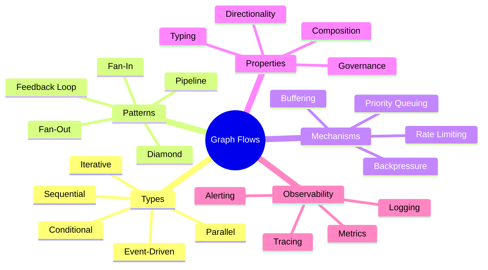
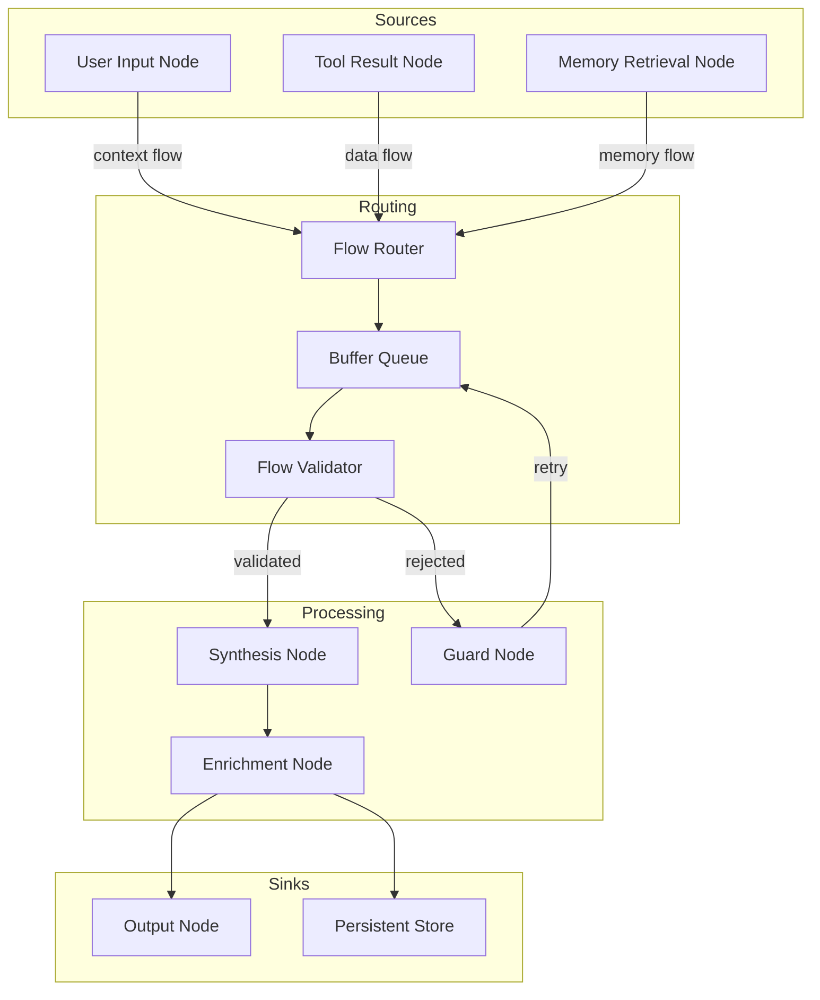
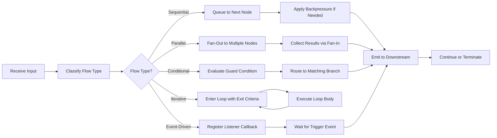
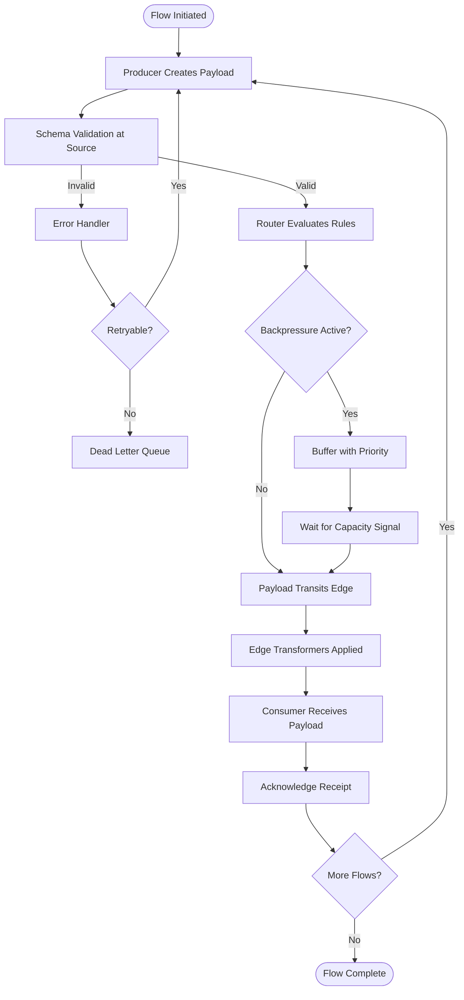
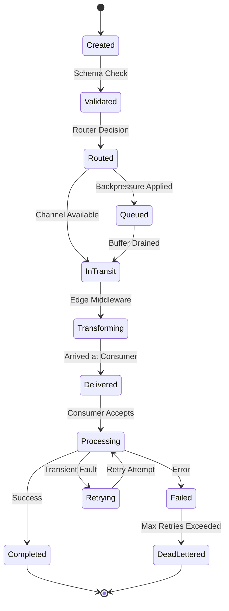
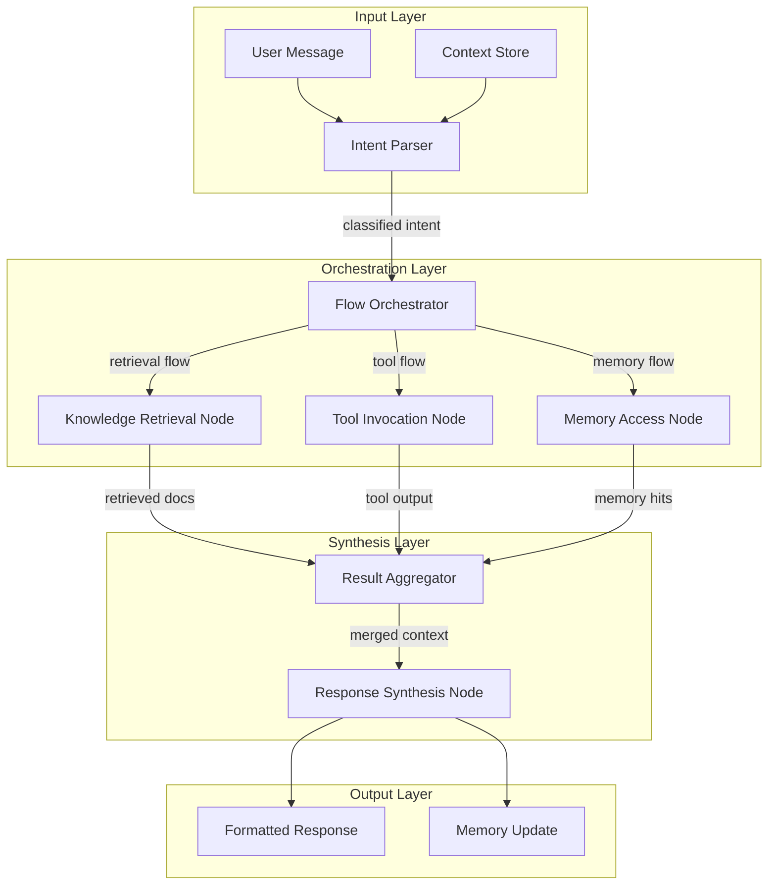
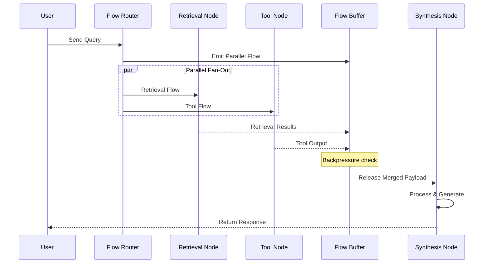

# Graph Flows: Data, Control, and Context in Graph-Based AI Systems

## 📌 Overview

Graph flows represent the lifeblood of any graph-based AI system, governing how information, control signals, and contextual knowledge move between interconnected nodes. In the context of graph engineering for AI agents, flows are not merely data pipelines—they are the orchestrated movement of prompts, intermediate reasoning outputs, tool invocations, memory accesses, and decision signals across a network of specialized components. Understanding flows is essential because the quality, timing, and routing of information directly determine an AI system's coherence, accuracy, and responsiveness. A well-designed graph flow ensures that each node receives precisely the context it needs, when it needs it, without overwhelming downstream components with irrelevant data. Conversely, poorly designed flows create bottlenecks, information loss, and cascading errors that degrade the entire system's performance.

## 🎯 Learning Objectives

After studying this document, you will be able to distinguish between the five primary flow types used in graph-based AI systems and identify when each is most appropriate. You will understand how backpressure mechanisms prevent system overload during high-throughput scenarios and how buffering strategies smooth out irregular data arrivals. You will gain the ability to design flow patterns that balance latency, throughput, and resource utilization across complex multi-agent architectures. Additionally, you will learn to recognize flow anti-patterns such as fan-out storms, deadlocks, and context starvation before they manifest as production failures. Finally, you will be equipped to trace, debug, and optimize flows within real graph systems using structured observability techniques.

## 🧠 Definition

A graph flow is the directed, rule-governed movement of data payloads, control signals, and contextual metadata along the edges connecting nodes within a graph-based AI system. Unlike simple point-to-point message passing, graph flows are first-class architectural primitives that carry typed payloads, observe routing constraints, respect priority ordering, and may transform en route through intermediary processing stages. In graph engineering, a flow encompasses not just what moves but how it moves—its velocity, its shape (single-value versus batched), its delivery guarantees (at-least-once versus exactly-once), and its relationship to other concurrent flows within the same graph topology. Every flow has a source node that produces it, one or more edge traversals that route it, and a target node that consumes it, though flows may also split, merge, or loop back as part of complex orchestration patterns.

## ❓ Why It Matters

Without deliberate flow design, graph-based AI systems devolve into chaotic webs of uncontrolled message passing where data arrives late, in wrong formats, or not at all. In production AI applications—a customer support agent routing queries across retrieval, reasoning, and response generation nodes—flow failures translate directly into user-facing errors, hallucinated responses, or frozen interactions. Flow design determines whether an AI system can scale gracefully under load or crumbles when concurrent request volume spikes. It also dictates how easily engineers can reason about system behavior, because predictable flows produce deterministic execution traces that simplify debugging and observability. Furthermore, regulatory and safety requirements in domains like healthcare or finance demand that information flows are auditable, which is only possible when flows are explicitly modeled rather than implicitly scattered across ad-hoc callbacks.

## 🏛️ Core Concepts

Graph flows rest on several foundational concepts that distinguish them from traditional pipeline or bus-based architectures. First, **flow directionality** establishes that every flow has an explicit source-to-sink orientation, even when bidirectional communication is needed (which is modeled as two opposing flows). Second, **flow typing** ensures that each flow carries a semantically meaningful payload type—a context flow carries conversation history, a control flow carries routing directives, and a data flow carries raw inputs or tool outputs. Third, **flow composition** allows multiple simple flows to be combined into complex patterns: a parallel fan-out distributes a query to multiple retrieval nodes, and a subsequent fan-in merges their results before passing them to a synthesis node. Fourth, **flow governance** encompasses backpressure, rate limiting, and priority queuing mechanisms that prevent any single flow from destabilizing the broader system. Together, these concepts form a vocabulary for precisely describing how information animates a graph structure.

## 🧩 Key Components

The key components of a graph flow system include **flow sources** (nodes that emit data, such as user input handlers or sensor adapters), **flow channels** (the edges that carry payloads, optionally with transformation or enrichment middleware), **flow routers** (decision nodes that direct flows based on content-based rules or state conditions), **flow buffers** (queues that absorb rate differences between producers and consumers), and **flow sinks** (terminal or processing nodes that consume and act upon incoming data). Additionally, **flow monitors** observe throughput, latency, and error rates across the graph, providing the observability signals needed for runtime optimization. **Flow schemas** define the expected structure, types, and constraints of payloads traveling along each channel, enabling validation at every hop. In advanced systems, **flow transformers** sit on edges and modify payloads in transit—redacting sensitive fields, enriching with metadata, or compressing context windows—ensuring that each downstream node receives data in its optimal format.

## 🧭 Mental Model

Think of a graph flow as a city's traffic system. Roads are the edges, intersections are the routing nodes, and vehicles are the data payloads carrying passengers (information) from one district (node) to another. Some roads are one-way streets (unidirectional flows), while major boulevards handle high-volume bidirectional traffic. Traffic lights and roundabouts act as flow controllers, managing congestion and preventing collisions at busy intersections. Rush hour represents a load spike, where backpressure mechanisms (like metered highway on-ramps) prevent the entire road network from gridlocking. Delivery trucks (tool invocation flows) follow different routes than commuter cars (context flows), yet they share the same infrastructure and must be coordinated to avoid conflicts. This mental model captures how flows coexist, compete for shared resources, and require intelligent governance to function smoothly at scale.

## 🗺️ Mind Map

## 🏗️ Architecture Diagram

## 🔄 Workflow

## ⚙️ Internal Working

The internal working of a graph flow system begins when a source node produces a payload and places it onto an outgoing edge channel. The flow router inspects the payload's type, priority, and routing metadata to determine the appropriate downstream path. If the target node is available and its input buffer has capacity, the payload is forwarded immediately. If the target is busy or its buffer is full, backpressure signals propagate upstream, causing the source to either throttle production or spill into an overflow buffer. As the payload traverses each edge, any attached flow transformers modify it—adding trace identifiers, stripping oversized context, or converting formats. The receiving node validates the incoming payload against its expected flow schema before processing. If validation fails, the payload may be routed to an error handler, dead-letter queue, or retry buffer. Throughout this journey, flow monitors record timestamps and metadata at each hop, building a complete execution trace that supports debugging and performance analysis.

## 🔀 Execution Flow

## 📊 Lifecycle

## 📡 Data Flow

## 🤝 Interaction Flow

## 🌍 Real-World Analogy

Consider a modern restaurant kitchen during the dinner rush. The host stand receives customer orders (input flows) and routes them to the appropriate cooking stations—grill, sauté, pastry (conditional routing). Each station has a ticket rail (buffer queue) that holds incoming orders until the chef is ready. If the grill station is overwhelmed, the expeditor applies backpressure by slowing the rate of new tickets sent there, while still feeding the salad station (priority-based flow control). Some dishes require components from multiple stations that must arrive simultaneously for plating (synchronization flow). The expeditor acts as the flow orchestrator, monitoring every station's capacity and adjusting flow rates in real time. When a dish is complete, it flows to the pass (output sink) where the final quality check occurs before delivery to the table. This kitchen analogy perfectly mirrors how graph flows manage concurrent data movement, capacity-aware routing, and synchronized delivery in AI agent systems.

## 💡 Practical Example

Imagine a customer support AI agent built as a graph system. When a user submits a complaint, the entry node creates a **context flow** carrying the user's message, conversation history, and account metadata. The flow router examines the message intent and fans out three parallel flows: a **retrieval flow** to a knowledge base node searching for relevant policies, a **tool flow** to an order lookup node fetching recent transactions, and a **memory flow** to a user profile node retrieving past interaction summaries. Each of these flows has its own buffer—if the knowledge base is slow, its buffer holds the retrieval request without blocking the other two flows. Once all three complete, a fan-in aggregator merges the results into a single enriched context payload. This merged payload then flows sequentially through a reasoning node, a draft generation node, and a compliance check node before reaching the response output node. Throughout this process, flow monitors track latency at each hop, and if the total flow time exceeds a threshold, the system can short-circuit by returning a cached response or escalating to a human agent.

## 🧪 Use Cases

Graph flows are critical in multi-agent research systems where a coordinator agent distributes sub-tasks to specialist agents (code generation, literature review, data analysis) and must merge their outputs into a coherent final report. In autonomous AI assistants, event-driven flows handle asynchronous notifications—calendar reminders, email arrivals, sensor alerts—routing each to the appropriate handler without blocking the main conversation loop. Content moderation pipelines use conditional flows to route flagged content through different analysis paths (toxicity detection, fact-checking, brand safety) based on classification scores. In AI-powered trading systems, iterative flows implement feedback loops where market analysis results feed back into model re-evaluation, creating continuous improvement cycles. Healthcare diagnostic agents employ parallel flows to simultaneously retrieve patient history, current symptoms, and drug interaction databases, then merge results for a comprehensive assessment—where flow timing directly impacts diagnostic accuracy and patient safety.

## ⚖️ Comparison

Graph flows differ significantly from traditional pipeline architectures in their flexibility and composability. Where a pipeline enforces a single linear path, graph flows support arbitrary topologies including branching, merging, and looping. Compared to pub-sub event buses, graph flows carry stronger typing guarantees and explicit routing rules, making behavior more predictable and debuggable. Microservice choreography relies on implicit flows mediated by service discovery and load balancers, whereas graph flows make routing explicit in the graph topology itself. The trade-off is that graph flows require more upfront design effort—you must define channels, schemas, and routing rules rather than relying on convention. However, this upfront investment pays dividends in operational complexity reduction, because a well-designed graph flow can be visualized, traced, and modified through the graph structure rather than by hunting through scattered configuration files and callback registrations.

## ✅ Best Practices

Always define explicit flow schemas for every channel in your graph, specifying payload types, size limits, and required metadata fields. Implement backpressure at every node boundary rather than relying on infinite buffers that mask capacity problems until they cause out-of-memory failures. Use structured trace identifiers that propagate through every flow hop, enabling end-to-end request tracking across parallel and conditional branches. Design flows to be idempotent where possible, so that retries caused by transient failures do not produce duplicate side effects. Separate control flows (routing directives, cancellation signals) from data flows (payloads, context) to prevent control signals from being blocked by data backpressure. Monitor flow metrics—throughput, latency percentiles, buffer utilization—at every critical junction and set alerts on degradation trends rather than absolute thresholds. Document your flow topology visually using graph diagrams and keep them version-controlled alongside your code.

## ❌ Common Mistakes

A frequent mistake is designing flows without considering backpressure, leading to cascading failures when a slow node causes upstream buffers to overflow and crash the entire graph. Another common error is mixing concerns within a single flow—for example, embedding control signals inside data payloads rather than using dedicated control channels—which makes flows harder to reason about and debug. Engineers often neglect to implement flow timeouts, allowing payloads to sit in buffers indefinitely when downstream nodes fail silently. Fan-out patterns without corresponding fan-in synchronization cause race conditions where a synthesis node processes incomplete result sets. Over-reliance on event-driven flows without ordering guarantees leads to out-of-order processing that corrupts context windows. Finally, many teams skip flow observability entirely, treating graph execution as a black box, which turns production debugging into a guessing game rather than a systematic investigation.

## 🚀 Advanced Topics

Advanced graph flow systems implement **adaptive routing**, where flow paths change dynamically based on real-time performance metrics—a node experiencing high latency is automatically bypassed in favor of a healthier alternative. **Flow versioning** allows multiple schema versions to coexist during rolling upgrades, with transformer edges automatically converting between versions. **Predictive backpressure** uses machine learning models to forecast congestion before it occurs, preemptively throttling upstream flows. **Flow meshes** extend the graph flow paradigm across distributed systems, where nodes reside on different machines or even different data centers, requiring flow serialization, network-aware buffering, and distributed consensus for exactly-once delivery guarantees. **Self-healing flows** incorporate circuit breaker patterns that detect degraded nodes, reroute flows around them, and automatically restore original paths once health is recovered. These advanced patterns transform graph flows from simple data movement mechanisms into resilient, self-optimizing infrastructure layers capable of supporting mission-critical AI applications at scale.
