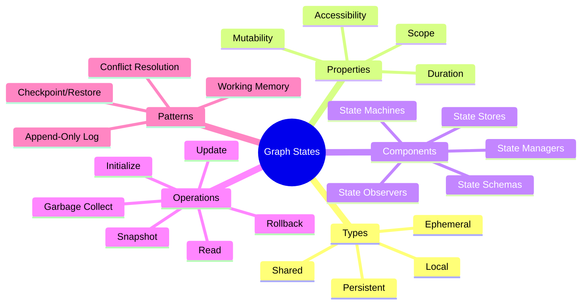
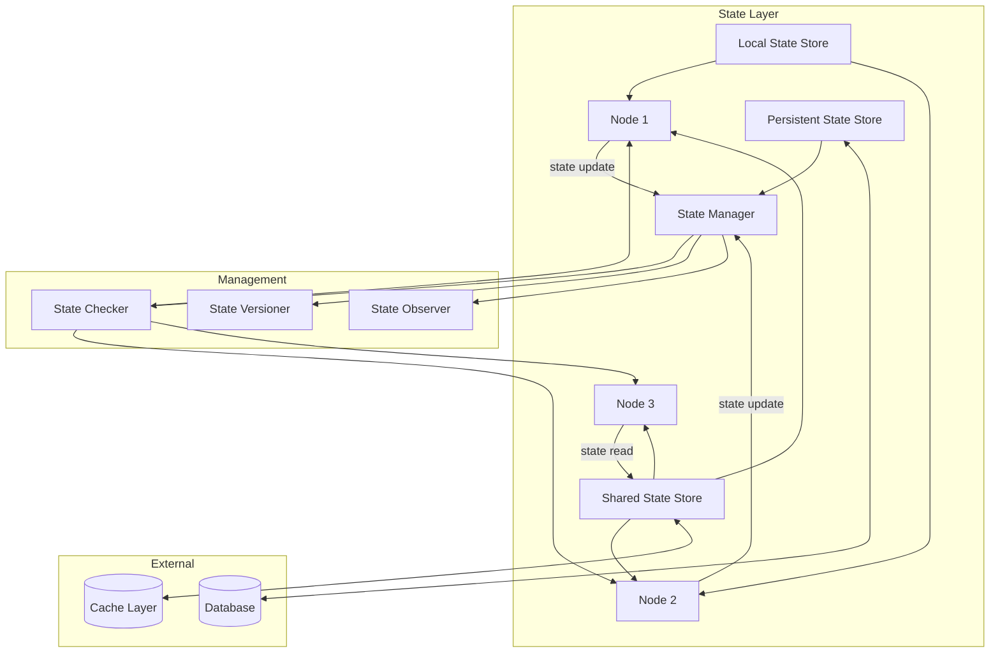
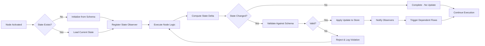
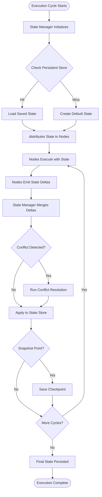
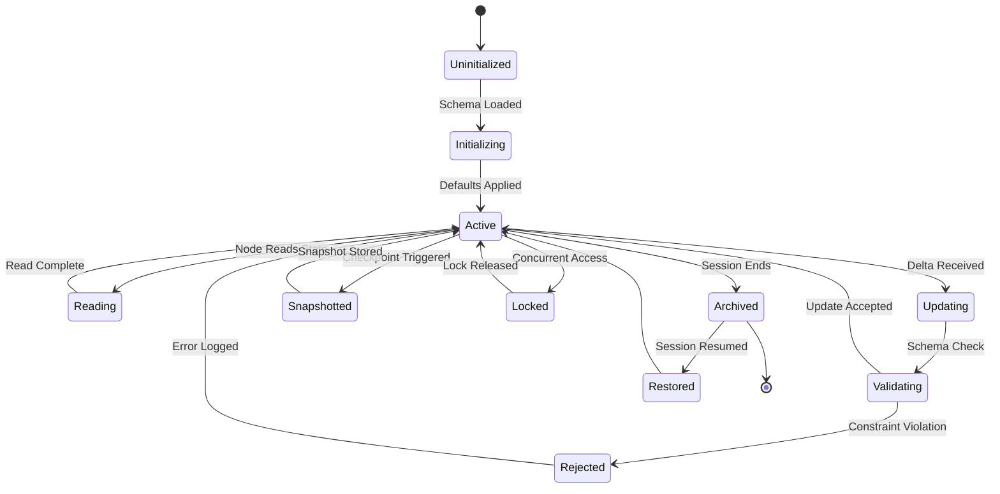
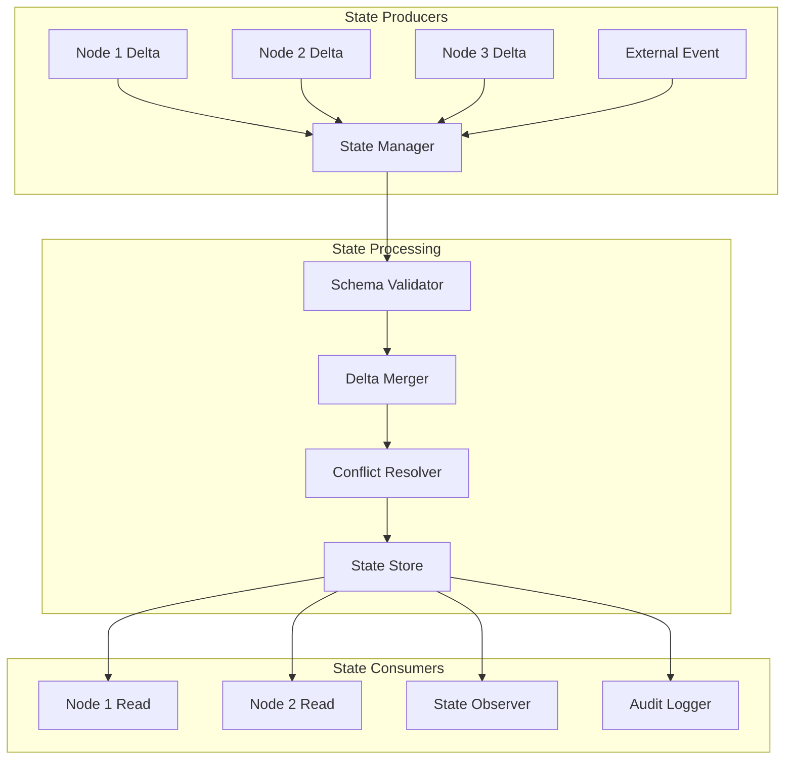
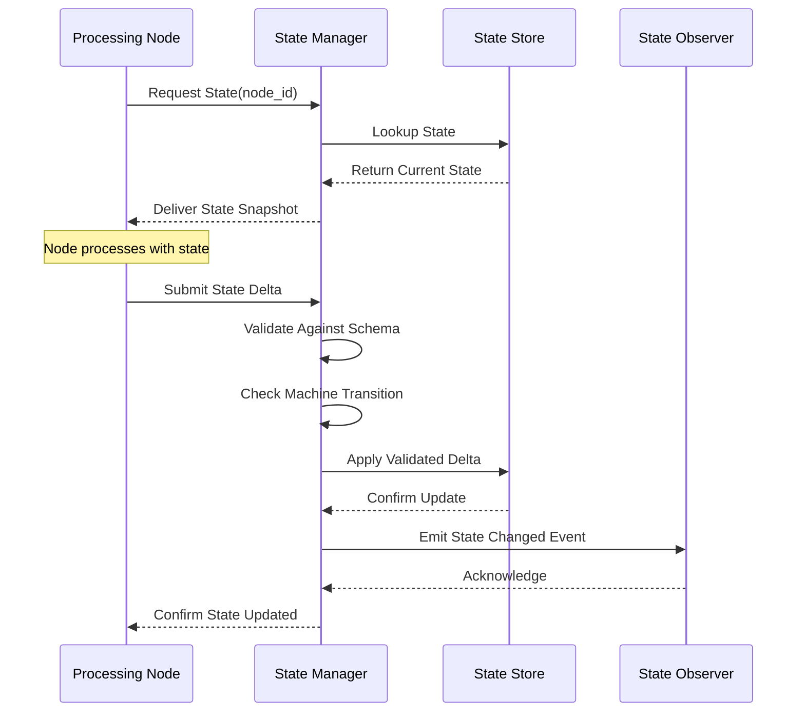

# Graph States: Managing State in Graph-Based AI Systems

## 📌 Overview

Graph states are the structured snapshots of information that nodes, edges, and the overall graph topology hold at any point during execution. In graph-based AI systems, state management is the discipline of defining what information persists, where it persists, how long it persists, and who can access it. Unlike stateless function calls in traditional software, graph-engineered AI agents are inherently stateful—they accumulate conversation context, track tool execution results, maintain reasoning chains, and remember user preferences across interactions. The design of state schemas, the choice between ephemeral and persistent storage, and the rules governing state sharing between nodes collectively determine whether an AI system can maintain coherent multi-turn conversations, learn from past interactions, and recover gracefully from failures. Poor state management leads to context leakage, inconsistent behavior, and an inability to reproduce or debug system decisions.

## 🎯 Learning Objectives

After studying this document, you will be able to classify the four primary state types—ephemeral, persistent, shared, and local—and select the appropriate type for each component in a graph system. You will understand how to design state schemas that capture the essential information a node needs without bloating memory or slowing execution. You will learn to implement state machines within graph nodes that enforce valid behavioral sequences and prevent illegal state combinations. You will gain proficiency in managing state lifecycle events—creation, updates, snapshots, rollbacks, and garbage collection—across complex multi-agent graphs. Finally, you will be equipped to diagnose and resolve common state management failures such as stale state references, race conditions in concurrent state updates, and state explosion in highly branching graph topologies.

## 🧠 Definition

A graph state is a structured, typed data representation that captures the current condition, configuration, and accumulated knowledge of a node, edge, or entire graph at a specific moment in time. In graph engineering for AI systems, states are not passive data containers—they are active entities that influence routing decisions, flow behavior, and node execution. A state consists of a **state schema** (the defined structure and constraints of the data), a **state value** (the current data conforming to that schema), and a **state context** (metadata about provenance, timestamps, and access permissions). Graph states may be scoped to a single node (local state), shared across multiple nodes (shared state), temporary within a single execution cycle (ephemeral state), or durable across sessions (persistent state). The state machine associated with a node defines the legal states it can occupy and the conditions under which it moves between them.

## ❓ Why It Matters

State management is the difference between an AI agent that remembers your preferences across sessions and one that treats every conversation as if it has amnesia. In a customer service graph system, the state determines whether the agent knows the user's order history, their current issue status, and the steps already attempted to resolve their problem. Without proper state management, multi-step AI workflows lose their place, repeating actions or skipping critical steps. State also enables **resumability**—if a long-running graph execution is interrupted by a failure or timeout, properly managed state allows the system to resume from the last consistent checkpoint rather than starting over. In safety-critical applications, state auditing provides a verifiable record of every decision the system made, which is essential for compliance, debugging, and continuous improvement. Furthermore, state sharing patterns directly impact performance: excessive shared state creates contention bottlenecks, while excessive local state duplication creates consistency challenges.

## 🏛️ Core Concepts

The core concepts of graph state management revolve around four dimensions: **scope** (where state lives), **duration** (how long state persists), **mutability** (how state changes), and **accessibility** (who can read or write state). **Scope** determines whether state is node-local, edge-attached, subgraph-shared, or graph-global, each offering different trade-offs between encapsulation and visibility. **Duration** classifies state as ephemeral (lasting only within a single execution), session-scoped (lasting across multiple turns in a conversation), or persistent (surviving across conversations and system restarts). **Mutability** patterns range from immutable append-only logs (ideal for auditability) to fully mutable working memory (ideal for iterative reasoning). **Accessibility** is governed by state visibility rules that control which nodes can read or modify which state variables, preventing unauthorized access and unintended side effects. Together, these dimensions form a design space that engineers navigate to balance correctness, performance, and maintainability.

## 🧩 Key Components

The key components of a graph state system include **state schemas** (formal definitions of state structure using typed fields, default values, and validation constraints), **state stores** (the backing storage mechanisms, which may be in-memory for ephemeral state, database-backed for persistent state, or message-bus-mediated for distributed shared state), **state machines** (per-node definitions of legal states and valid transitions between them), **state managers** (middleware components that handle state initialization, updates, snapshots, and cleanup), and **state observers** (monitoring components that track state changes for debugging, auditing, and analytics). Additionally, **state serializers** convert between in-memory state representations and persistent formats, while **state merge strategies** define how conflicting updates from concurrent nodes are resolved—using last-writer-wins, version vectors, or custom conflict resolution logic. **State versioning** provides historical tracking, enabling rollback to previous states and temporal queries like "what did this node know at step 3?"

## 🧭 Mental Model

Think of graph state as the workspace of a collaborative team operating in a shared office. Each team member (node) has their own desk and notepad (local state) where they jot down private thoughts and intermediate calculations. The whiteboard in the center of the room is shared state—anyone can read it and add to it, but there are rules about who can erase what. The filing cabinet in the corner holds persistent state—records from past projects that survive even after the team moves on to new work. Sticky notes passed between desks carry ephemeral state—temporary messages relevant only to the current task. The team lead (state manager) ensures that everyone's notes are consistent, that the whiteboard doesn't become cluttered, and that important discoveries are filed for future reference. This analogy captures how state coexists at multiple scopes, requires active management, and serves as the collective memory that enables coordinated intelligent behavior.

## 🗺️ Mind Map

## 🏗️ Architecture Diagram

## 🔄 Workflow

## ⚙️ Internal Working

The internal working of a graph state system begins when a node is activated and requests its current state from the appropriate state store. The state manager locates the state based on the node's identity and the current execution context, returning either a freshly initialized state (populated with schema defaults) or the existing state from a previous cycle. The node reads relevant state fields, executes its logic, and produces a state delta—a description of what fields should change and their new values. Before applying the delta, the state manager validates it against the state schema, checking type conformance, constraint satisfaction, and machine transition legality. If validation passes, the update is applied atomically to the state store, and a state change event is emitted to all registered observers. If the state is shared, concurrent access is handled through locking or optimistic concurrency control—either preventing simultaneous writes or detecting conflicts and retrying. State snapshots may be taken at configurable intervals or before risky operations, enabling rollback if downstream processing fails. When a node or execution cycle completes, the state manager evaluates garbage collection rules to determine whether ephemeral state should be cleared, freeing memory for future operations.

## 🔀 Execution Flow

## 📊 Lifecycle

## 📡 Data Flow

## 🤝 Interaction Flow

## 🌍 Real-World Analogy

Consider an air traffic control system, which is fundamentally a state management system for a graph of airports, flight paths, and aircraft. Each aircraft (node) maintains its own local state—current altitude, speed, fuel level, and destination. The radar system maintains shared state that all controllers can see—the real-time position and heading of every aircraft in the airspace. Flight plans stored in the system database represent persistent state that survives shift changes and system reboots. Temporary flight restrictions and weather advisories are ephemeral state, relevant only for the current operating period. When an aircraft requests a route change, the controller checks the shared state to ensure no conflicts exist (state validation), updates the flight plan (state mutation), and all radar displays refresh automatically (observer notification). If two aircraft converge on the same altitude, a conflict resolution protocol triggers—exactly like concurrent state update conflicts in a graph system. This analogy illustrates how state at different scopes and durations must be carefully coordinated to maintain safe, coherent system behavior.

## 💡 Practical Example

Consider a multi-turn research assistant built as a graph system with specialized nodes for query understanding, literature search, synthesis, and response generation. When a user begins a session, the system initializes a **session state** containing the user's research topic, preferred citation style, and an empty result accumulator (persistent state in a database). As the conversation progresses, the query understanding node updates a **conversation state** with the running dialogue history and identified sub-questions (session-scoped state). The literature search node maintains **local state** tracking which databases have been queried and how many results each returned. When synthesis begins, it reads both the shared conversation state and the search node's local state to produce a comprehensive summary. If the user asks a follow-up question two hours later, the system restores the session state from persistent storage, loads the conversation history, and the synthesis node can reference prior findings without re-searching. Throughout this process, state observers log every state change for debugging, and state versioning enables the system to show the user what it knew at each step of the research process.

## 🧪 Use Cases

Graph state management is essential in conversational AI agents that must maintain context across dozens of turns, where state includes dialogue history, user preferences, task progress, and pending actions. In autonomous code generation systems, state tracks the evolving codebase representation, test results, and refactoring decisions across iterative improvement cycles. Multi-agent simulation platforms use shared state to coordinate the behavior of dozens of AI agents operating in a shared environment—each agent reads the world state, updates its local state, and writes changes back to the shared state under conflict resolution rules. Workflow automation systems rely on persistent state to track the progress of long-running business processes that span hours or days, surviving system restarts and operator shifts. In AI-powered personalization engines, user state profiles accumulate behavioral signals over time, enabling increasingly accurate recommendations while maintaining privacy through state access controls that limit what each node can learn about the user.

## ⚖️ Comparison

Graph state management differs from traditional application state in several important ways. Web application session state is typically stored in a single key-value store and accessed by a single server process, whereas graph state is distributed across multiple nodes with complex sharing and visibility rules. Database transactions provide ACID guarantees for state changes, but graph state often requires weaker consistency models to maintain acceptable latency across distributed nodes. Functional programming advocates for immutable state, which eliminates entire classes of bugs but conflicts with the inherently mutable nature of AI reasoning processes that build up knowledge incrementally. Event sourcing stores state as a sequence of events that can be replayed, which aligns well with graph state versioning but adds complexity to state queries that need the current value rather than the full history. The graph state approach uniquely combines the auditability of event sourcing with the query efficiency of materialized state by maintaining both a current state snapshot and an append-only change log.

## ✅ Best Practices

Always define explicit state schemas for every node before implementing any logic, treating schemas as contracts that prevent unexpected data from corrupting system behavior. Minimize shared state by default—start with local state and promote to shared only when genuine coordination requirements demand it. Implement state observers from the beginning of development, because retrofitting observability into a complex graph system is exponentially harder than building it in from the start. Use version vectors or timestamps for optimistic concurrency control rather than heavy locks, which create deadlocks in highly parallel graph topologies. Design state for failure recovery by ensuring that every state mutation can be either committed atomically or rolled back completely—never leave state in a partially updated condition. Set explicit time-to-live (TTL) values for ephemeral state to prevent memory leaks from accumulating across long-running sessions. Finally, separate state schema definitions from node implementation code so that state contracts can evolve independently and be validated across the entire graph.

## ❌ Common Mistakes

A pervasive mistake is treating all state as global shared state, which creates coupling between nodes that should be independent and leads to unpredictable behavior when updates arrive out of order. Engineers frequently neglect to define state schemas, allowing unstructured dictionaries to accumulate ad-hoc fields that become impossible to validate or debug. Another common error is failing to handle state initialization correctly, causing nodes to operate on null or default values that produce subtly wrong results. Teams often overlook state cleanup in ephemeral scopes, leading to memory leaks that gradually degrade performance over hours of continuous operation. Concurrent state updates without proper conflict resolution cause silent data corruption where one node's update overwrites another's without detection. Many implementations store state in the wrong durability tier—putting frequently accessed ephemeral state in a database (adding unnecessary latency) or putting critical persistent state only in memory (losing it on crash). Finally, inadequate state versioning makes it impossible to answer retrospective questions about what the system knew at a specific point in time.

## 🚀 Advanced Topics

Advanced graph state systems implement **probabilistic state**, where state values carry confidence scores that reflect uncertainty—useful when nodes produce hypotheses rather than certainties. **Federated state** allows graph systems spanning multiple organizations to share limited state subsets through secure, governed interfaces without exposing complete internal state. **State compaction** algorithms periodically compress accumulated state by summarizing historical details into higher-level abstractions, maintaining essential knowledge while reducing memory footprint—similar to how human memory consolidates experiences. **Causal state tracking** uses logical clocks to capture the causal relationships between state changes across distributed nodes, enabling precise reasoning about what information was available to each node at each decision point. **Self-evolving state schemas** allow the structure of state to adapt over time based on observed usage patterns—adding new fields dynamically, retiring unused ones, and adjusting validation constraints based on production data distributions. These advanced patterns push graph state management beyond simple data storage into the realm of intelligent, adaptive memory systems that mirror the sophistication of the AI agents they support.
