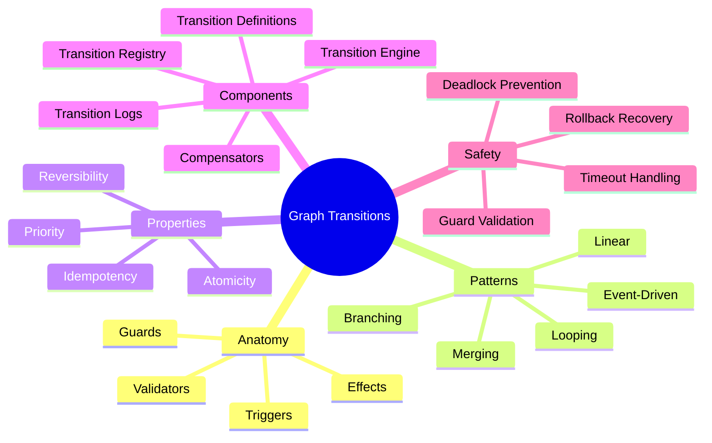
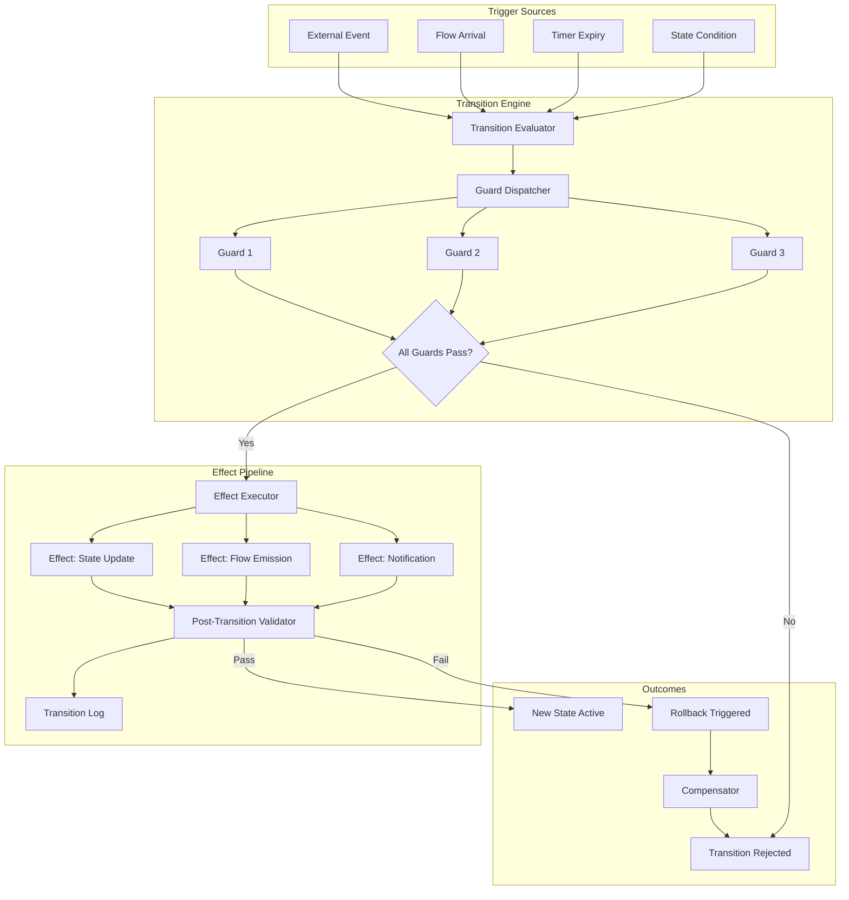
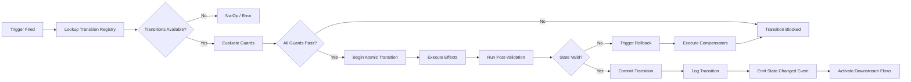
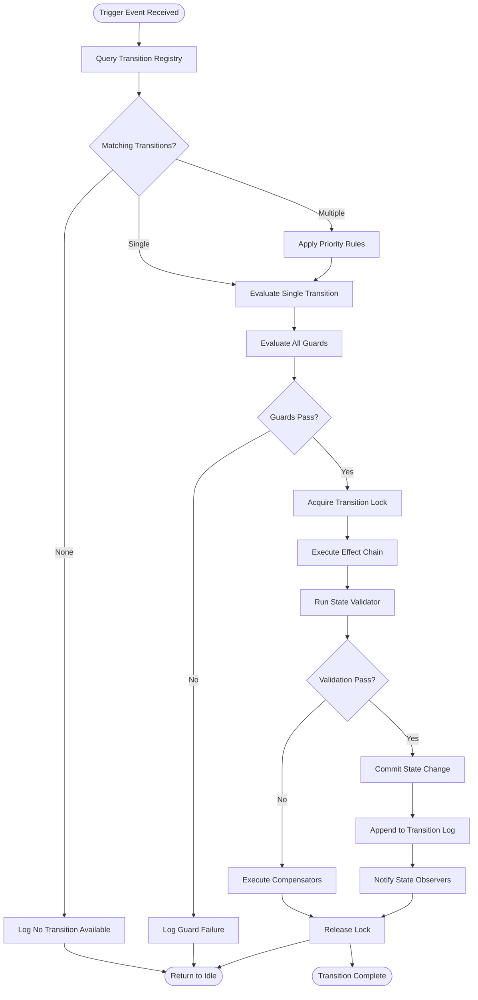
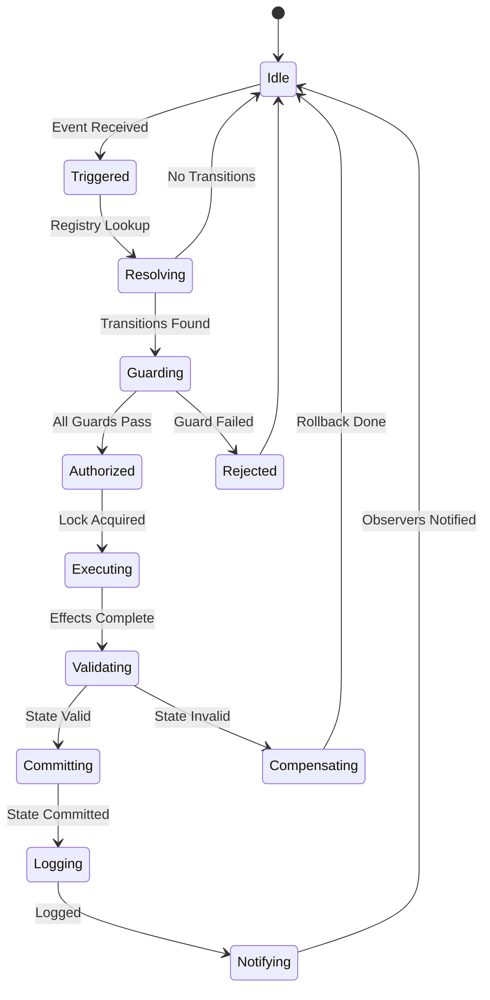
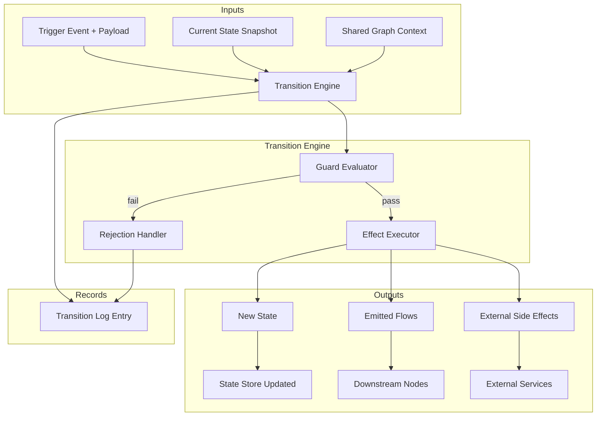
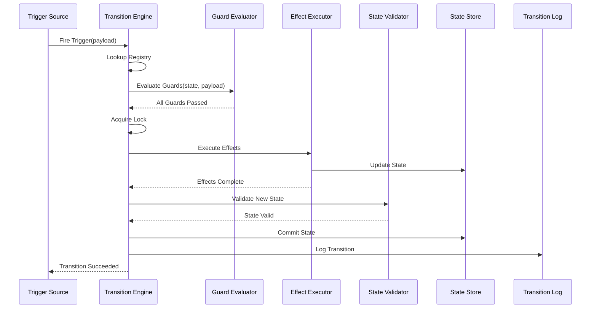

# Graph Transitions: Movement Between States in Graph-Based AI Systems

## 📌 Overview

Graph transitions are the mechanisms by which nodes, edges, and the broader graph system move from one state to another in response to triggers, conditions, and events. In graph-based AI engineering, transitions are the critical bridges between static topology and dynamic behavior—they define what happens when a user submits a query, when a tool returns results, when an error interrupts processing, or when a timeout expires. A transition is more than a simple state change; it encapsulates the trigger that initiated it, the guard conditions that must be satisfied, the effects that execute during the change, and the validation that confirms the transition was legal. Well-designed transitions create systems that behave predictably under normal conditions and degrade gracefully under exceptional ones. Poorly designed transitions lead to orphaned states, dead ends, race conditions, and systems that freeze or loop indefinitely when unexpected inputs arrive.

## 🎯 Learning Objectives

After studying this document, you will be able to identify and implement the five core transition patterns—linear, branching, merging, looping, and event-driven—within graph-based AI systems. You will understand the anatomy of a transition, including triggers, guards, effects, and validators, and how each component contributes to safe and predictable state changes. You will learn to design guard conditions that prevent illegal state combinations without creating unreachable states that trap the system. You will gain proficiency in implementing transition effects that execute side effects such as logging, notifications, and state cleanup at precisely the right moment during a transition. Finally, you will be equipped to build transition validators that catch malformed transitions before they corrupt system state, and to debug transition-related failures using systematic trace analysis techniques.

## 🧠 Definition

A graph transition is a first-class, typed operation that moves a node or the entire graph system from a source state to a target state, governed by an explicit trigger event, zero or more guard conditions, zero or more side effects, and a post-transition validation step. In graph engineering, transitions are the behavioral arrows that connect the structural nodes defined in the topology. Each transition has a **trigger** (the event or condition that initiates it, such as a flow arrival, a timer expiration, or an external signal), **guards** (boolean predicates that must all evaluate to true for the transition to proceed), **effects** (imperative actions executed as part of the transition, such as updating shared state, emitting notifications, or invoking cleanup routines), and a **validator** (a post-transition check that confirms the resulting state is consistent and legal). Transitions may be **internal** (moving within a single node's state machine) or **cross-node** (triggering state changes in other nodes as part of a coordinated graph-level transition).

## ❓ Why It Matters

Transitions are where graph systems either deliver on their design promises or fail catastrophically. Consider a medical diagnosis AI graph where a data collection node must transition to an analysis node only after all required patient data has been gathered. If the transition guard is too permissive, the analysis node may operate on incomplete data, producing dangerous recommendations. If the guard is too strict, the system may get stuck waiting for data that will never arrive, freezing the entire diagnostic workflow. Transition design also directly impacts system testability—transitions with explicit triggers and guards can be tested in isolation, while implicit state changes hidden inside node logic require end-to-end testing that is far more expensive and fragile. In production systems, transition logging provides the primary audit trail for understanding what the system did and why, making well-defined transitions essential for compliance, debugging, and continuous improvement. Furthermore, transition patterns determine system flexibility: a graph with only linear transitions is rigid and brittle, while one with well-designed branching and looping transitions can adapt to diverse inputs and recover from errors.

## 🏛️ Core Concepts

The core concepts of graph transitions center on four elements that form the transition lifecycle. **Triggers** are the events that initiate a transition—these may be data-driven (a flow arriving at a node), time-driven (a timeout or scheduled event), state-driven (a condition becoming true in the graph), or externally driven (a user cancellation or system signal). **Guards** are the gatekeepers that evaluate whether a transition should proceed; they inspect current state, incoming data, and system conditions to make a binary authorization decision. **Effects** are the actions that execute during the transition itself—these run atomically with the state change and may include state mutations, flow emissions, external service calls, and logging operations. **Validators** are post-transition checks that confirm the new state is internally consistent and satisfies all schema constraints. Beyond these four elements, transitions also exhibit **priority** (when multiple transitions are possible, which one wins), **atomicity** (whether a transition's effects are all-or-nothing), and **reversibility** (whether the transition can be undone, either automatically via compensating transitions or manually via rollback operations).

## 🧩 Key Components

The key components of a graph transition system include **transition definitions** (declarative specifications that list source state, target state, trigger type, guard conditions, and effects), **transition engines** (runtime components that evaluate triggers, execute guards, apply effects, and run validators in the correct order), **transition registries** (catalogs of all valid transitions for a node or graph, used to determine which transitions are possible from any given state), **transition logs** (append-only records of every transition that has occurred, supporting audit and debugging), and **transition compensators** (inverse operations that can undo a transition's effects when rollback is required). Additionally, **transition middleware** provides cross-cutting concerns such as timing measurement, deadlock detection, and circuit breaking. **Transition test harnesses** enable unit testing of individual transitions in isolation, verifying that guards correctly accept and reject transitions and that effects produce the expected state changes. In distributed graph systems, **transition coordinators** manage cross-node transitions that must be applied atomically across multiple nodes, using two-phase commit or saga patterns to ensure consistency.

## 🧭 Mental Model

Think of graph transitions as the rules of a board game. The board is the graph topology, the pieces are the nodes, and the current positions of all pieces represent the system state. Each possible move is a transition—defined by where a piece can go from its current position, what conditions must be met (guards, like "you can only move to this square if no other piece is there"), and what happens when you move (effects, like "collect $200" or "draw a card"). The game rules (transition registry) define every legal move from every position. The game master (transition engine) enforces the rules, checking guards before allowing a move and applying effects after the move is made. If a player tries an illegal move, the game master rejects it and the turn restarts (guard failure). Some moves trigger special sequences (chaining transitions), and some squares send you backward (looping transitions). This model captures how transitions create structured, rule-governed behavior within a defined topology while still allowing complex emergent gameplay.

## 🗺️ Mind Map

## 🏗️ Architecture Diagram

## 🔄 Workflow

## ⚙️ Internal Working

The internal working of a graph transition begins when a trigger event arrives at the transition engine. The engine consults the transition registry to identify all transitions that are possible from the current source state and match the trigger type. If multiple transitions are eligible, priority rules select the highest-priority candidate. The engine then evaluates each guard condition in sequence, short-circuiting on the first failure to avoid unnecessary computation. Guards have access to the current state, the trigger payload, and any shared graph context they need for their evaluation. If all guards pass, the engine enters an atomic transition scope where effects execute sequentially. Each effect may mutate state, emit flows, or call external services, and the engine tracks all side effects for potential rollback. Once all effects complete, the post-transition validator checks that the new state satisfies all schema constraints and invariants. If validation passes, the transition is committed, the transition log records the complete transition including source state, target state, trigger, and timestamp, and a state-changed event is emitted to notify observers. If validation fails, all effects are reversed using compensator operations, and the system remains in the original state with the transition logged as failed.

## 🔀 Execution Flow

## 📊 Lifecycle

## 📡 Data Flow

## 🤝 Interaction Flow

## 🌍 Real-World Analogy

Consider the security screening process at an international airport, which is fundamentally a state transition system. A passenger (node) begins in the "waiting" state. When they approach the checkpoint (trigger), the system evaluates guards: Do they have a valid boarding pass? Are they on the right flight? If guards pass, they transition to "screening" state with effects like placing belongings in bins and walking through the scanner. The scanner result (another trigger) causes a branching transition: cleared passengers move to "departing" state, while flagged passengers transition to "secondary screening" state with its own guards and effects. Some passengers loop back through additional screening (looping transition). If the system detects a security threat (event-driven trigger), multiple nodes simultaneously transition to "lockdown" state (coordinated cross-node transition). The entire process is logged (transition logging), and if a screening error is discovered, passengers can be recalled (compensating transition). This analogy shows how complex real-world processes are naturally modeled as networks of guarded transitions with branching, merging, and looping paths.

## 💡 Practical Example

Consider an AI-powered content moderation system built as a graph with nodes for ingestion, classification, review, and action. When content arrives, the ingestion node transitions from "idle" to "received" state (linear transition). The classification node then evaluates content through multiple analysis pipelines, with a branching transition: low-risk content transitions directly to "approved" state, while high-risk content transitions to "human review" state. The branching guard examines a confidence score—if classification confidence is above 95%, the system auto-approves; otherwise, it routes to a human reviewer. During human review, a merging transition occurs when the reviewer's decision combines with the classifier's original assessment to produce a final action. If a reviewer is unavailable after 30 minutes, a timeout trigger fires a looping transition that escalates to a senior reviewer. Throughout this process, every transition is logged with its trigger, guards evaluated, and effects applied, creating a complete audit trail. If an appeal is filed, compensating transitions can reverse the action and return the content to a review state, demonstrating how reversibility is built into the transition design.

## 🧪 Use Cases

Graph transitions are essential in conversational AI systems where the dialogue manager must transition between states like "greeting," "intent clarification," "information gathering," and "response delivery" based on user inputs and system confidence. In autonomous vehicle AI, the decision system transitions between driving modes—highway cruising, urban navigation, parking—based on environmental sensors, GPS data, and driver inputs, with safety guards preventing dangerous mode transitions. Multi-step AI workflows for document processing use branching transitions to route documents through different approval paths based on content type, monetary value, and risk classification. In AI-powered game engines, non-player characters transition between behavioral states—patrolling, investigating, combat, fleeing—based on player proximity, health levels, and environmental events. Scientific research automation platforms use looping transitions to implement iterative hypothesis refinement cycles, where each experiment result triggers a transition that updates the hypothesis state and determines whether another experiment cycle is needed or the research is complete.

## ⚖️ Comparison

Graph transitions differ from simple if-else branching in several fundamental ways. Traditional conditional logic is scattered throughout code and operates on local variables, while graph transitions are centralized, declaratively defined, and operate on structured state objects. State machine libraries provide transition semantics but typically operate within a single component, whereas graph transitions span multiple interconnected nodes and can trigger coordinated multi-node state changes. Event-driven architectures handle transitions implicitly through event handlers, but lack the explicit guard-effect-validate pipeline that makes graph transitions auditable and testable. Workflow engines like BPMN provide rich transition semantics but are heavyweight and inflexible compared to the lightweight, composable transition definitions used in graph engineering. The graph transition approach uniquely combines the rigor of formal state machines with the flexibility of event-driven architectures, adding the cross-node coordination capabilities needed for multi-agent AI systems while maintaining the testability and observability that production systems demand.

## ✅ Best Practices

Always define transitions declaratively rather than imperatively—specify source state, target state, trigger, and guards as data structures rather than embedding them in procedural code. Keep guards pure and side-effect-free so they can be evaluated safely without risking partial system changes. Design transitions to be idempotent where possible, so that duplicate trigger deliveries (which are common in distributed systems) do not cause double-execution of effects. Implement compensating transitions for every non-trivial state change, ensuring that the system can always return to a known-good state after a failure. Log every transition attempt—both successful and failed—with enough detail to reconstruct the complete system state at any point in time. Use explicit timeout guards on transitions that depend on external services, preventing the system from waiting indefinitely for responses that may never arrive. Finally, design your transition registry to be exhaustive and non-overlapping, ensuring that every possible trigger from every possible state has exactly one defined behavior—no dead ends and no ambiguity.

## ❌ Common Mistakes

A common mistake is implementing transitions as hidden side effects within node logic rather than as explicit, declared operations, which makes system behavior impossible to reason about without reading every line of code. Engineers frequently create transitions without guards, allowing any trigger to force a state change regardless of whether the change makes sense in the current context. Another widespread error is designing transition effects that are not atomic—where some effects succeed and others fail, leaving the system in an inconsistent half-transitioned state. Teams often neglect to implement compensating transitions, making it impossible to recover from failed operations without manual intervention. Overly complex guard conditions that depend on external service calls introduce latency and failure modes into the transition evaluation itself. Many systems lack transition logging entirely, or log only successful transitions, which means failed transitions—and the guard evaluations that blocked them—are invisible during debugging. Finally, circular transition definitions (where two transitions can trigger each other indefinitely) without loop detection or iteration limits cause the system to enter infinite transition loops that consume all available resources.

## 🚀 Advanced Topics

Advanced graph transition systems implement **probabilistic transitions**, where guard conditions return confidence scores rather than binary values, enabling the system to pursue the highest-confidence path while maintaining fallback options. **Composite transitions** bundle multiple state changes across different nodes into a single atomic operation using distributed transaction protocols like two-phase commit or saga patterns. **Predictive transition optimization** uses historical transition data to pre-evaluate likely next transitions and pre-load their required resources, reducing transition latency. **Adaptive guard thresholds** adjust guard strictness dynamically based on system load—relaxing guards under heavy load to maintain throughput while tightening them during low-load periods to maximize quality. **Transition pattern mining** analyzes transition logs to discover emergent patterns that were not explicitly designed, identifying opportunities to optimize the graph topology or add missing transitions. **Self-healing transitions** detect when the system enters an unexpected state (due to bugs or external corruption) and automatically execute recovery transitions that restore a known-good state, combining anomaly detection with automated remediation. These advanced patterns transform graph transitions from simple state change mechanisms into intelligent, adaptive control surfaces that enable AI systems to operate reliably in complex, dynamic environments.
