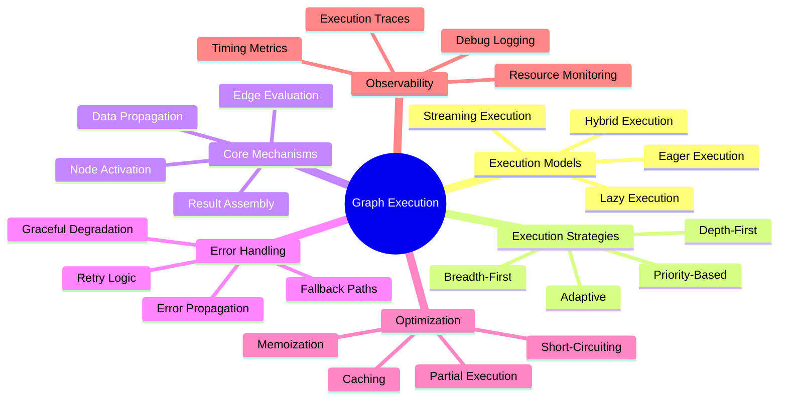
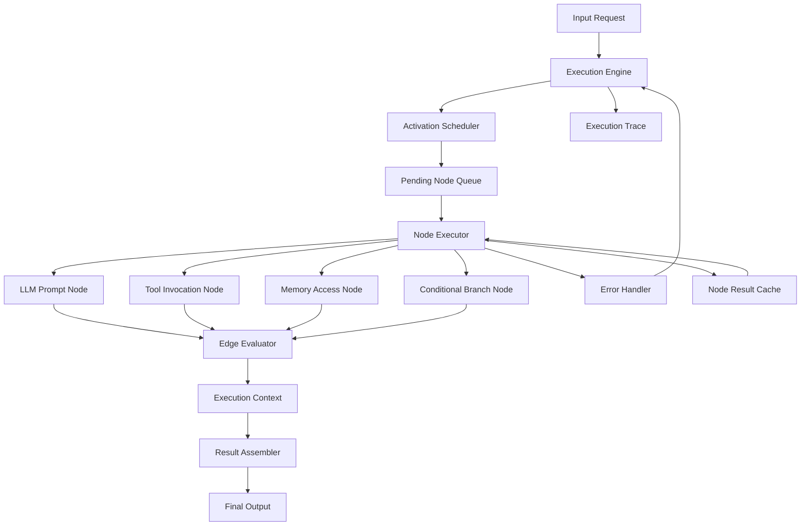
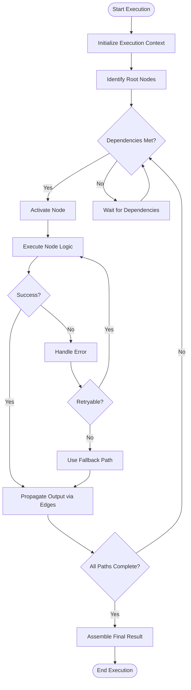
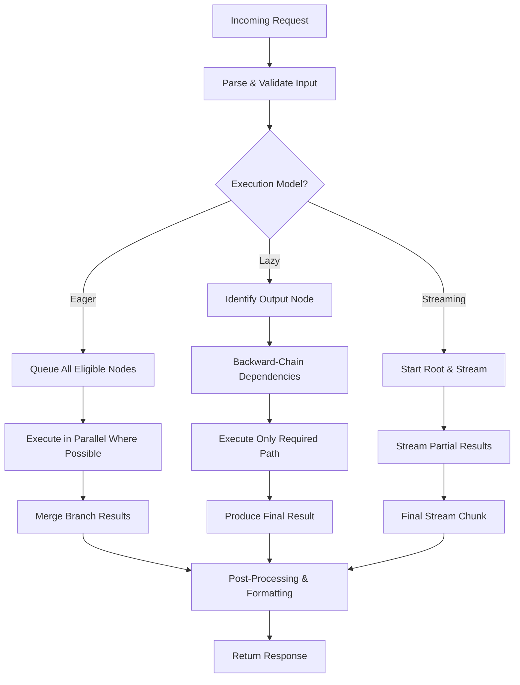
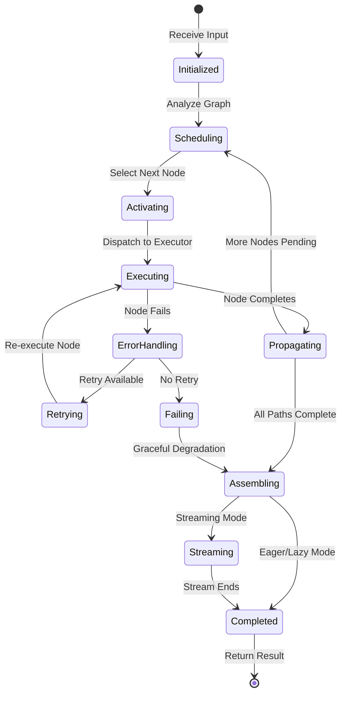
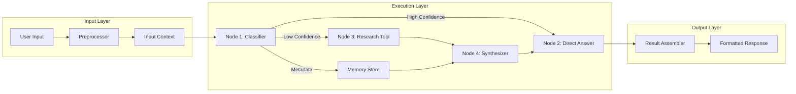
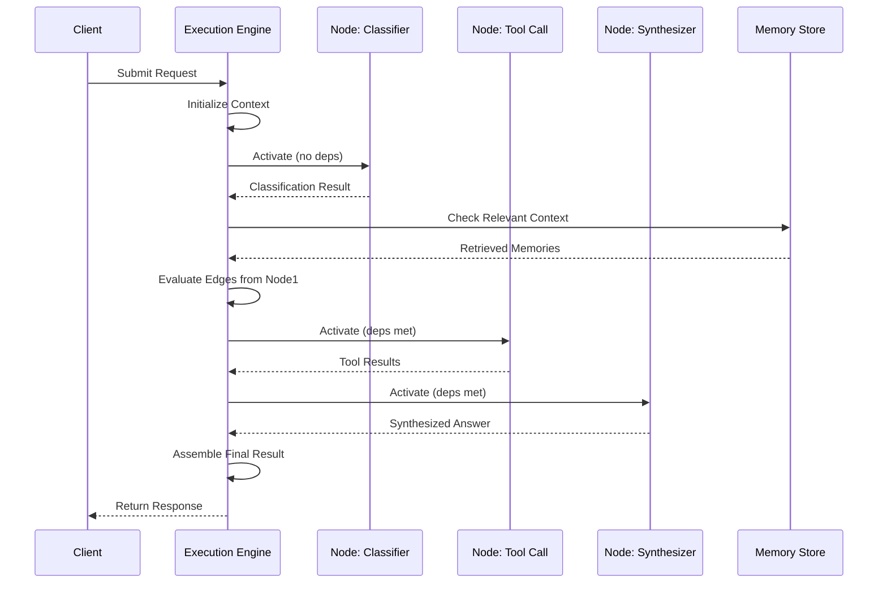

# Graph Execution

## 📌 Overview

Graph execution is the process of actively running a graph-based AI system by traversing its nodes and edges to produce a final output. In the context of graph engineering — where prompts, memory, tools, and AI agents are modeled as interconnected graph structures — execution refers to the runtime behavior of moving data and control through these graph topologies. Unlike static graph analysis, execution is fundamentally dynamic, involving real-time decisions about which nodes to activate, how to route intermediate results, and when to terminate the process. Every execution instance represents a single journey through the graph, shaped by inputs, conditions, and the current state of the system.

Understanding graph execution is essential because it bridges the gap between a designed graph architecture and its actual behavior in production. A beautifully designed graph is meaningless if its execution model is flawed — causing unnecessary delays, redundant computations, or incorrect result routing. Execution determines how effectively your AI agent responds to user prompts, how efficiently it invokes tools, and how gracefully it handles failures. The execution model you choose fundamentally shapes the user experience, the system's resource consumption, and the reliability of every interaction.

Execution in graph-engineered systems differs significantly from traditional pipeline execution. While pipelines follow a fixed sequence of stages, graph execution can branch, loop, merge, and adapt based on intermediate results. This flexibility enables sophisticated behaviors like conditional tool selection, dynamic prompt chaining, and context-dependent memory retrieval. However, this same flexibility introduces complexity in tracking execution state, managing side effects, and ensuring deterministic behavior when needed.

## 🎯 Learning Objectives

After studying this document, you will be able to distinguish between eager, lazy, and streaming execution models and select the appropriate model for a given graph engineering scenario. You will understand how execution strategies govern the traversal order and parallelism of graph nodes, and how partial execution enables efficient short-circuiting when intermediate results satisfy the system's goals. You will also learn how errors propagate through graph structures and how to design resilient execution paths that degrade gracefully under failure conditions.

You will gain practical knowledge of implementing execution controllers that manage the lifecycle of a graph run, from initialization through node activation to final result assembly. You will be able to design execution traces that provide observability into complex graph behaviors, enabling debugging and optimization. Additionally, you will understand how execution intersects with memory management and context window constraints, ensuring that large graph traversals do not exhaust available resources.

Finally, you will develop the ability to evaluate execution performance using metrics such as node activation count, edge traversal frequency, end-to-end latency, and resource utilization. This knowledge will enable you to optimize graph structures for faster, more reliable, and more cost-effective AI agent behaviors. You will be equipped to make informed trade-offs between execution speed, result quality, and system resource consumption.

## 🧠 Definition

Graph execution is the runtime process of traversing a graph structure — composed of interconnected nodes representing AI prompts, memory stores, tool invocations, and agent decision points — by activating nodes, evaluating edge conditions, propagating data between connected components, and assembling final outputs. It encompasses the complete operational lifecycle from the moment an input enters the graph until a result is produced or the execution is terminated. Graph execution is not merely a traversal algorithm; it is a comprehensive runtime behavior that includes state management, error handling, resource monitoring, and result composition.

In formal terms, graph execution can be defined as a function that maps an input state and a graph topology to an output state through a sequence of node activations. Each node activation transforms its input context using its internal logic — whether that logic is an LLM call, a tool invocation, a memory read/write, or a conditional branch decision. The execution function respects the graph's structural constraints (edges define valid data flow paths) while dynamically selecting which paths to follow based on runtime conditions.

The definition of graph execution is inherently tied to the execution model being used. An eager execution model activates nodes immediately when their dependencies are satisfied, while a lazy execution model defers node activation until its output is actually needed. A streaming execution model begins producing partial results as soon as the first nodes complete, without waiting for the entire graph to finish. Each model provides different guarantees about ordering, resource usage, and result availability, making the choice of execution model a critical architectural decision.

## ❓ Why It Matters

Graph execution matters because it is the mechanism through which your graph-engineered AI system delivers value to users. A graph that takes ten seconds to execute when a user expects a two-second response creates a poor experience, regardless of how elegant its topology might be. Execution performance directly impacts user satisfaction, system throughput, and operational costs, especially when each node activation may involve expensive LLM API calls or external tool invocations that consume time and money.

Execution also matters for correctness. In a graph with conditional branches, looping structures, and merged outputs, the order and completeness of execution determine whether the final result is accurate. A node that is skipped due to an incorrect dependency evaluation can corrupt the entire output. Similarly, improper error propagation can cause a system to silently produce incorrect results rather than failing fast with a meaningful error message. Understanding execution ensures that your graph behaves as designed under all conditions.

Furthermore, execution matters for system resilience and observability. When a graph executes, it generates a trace — a record of which nodes were activated, what data flowed between them, and how long each operation took. This trace is invaluable for debugging failures, optimizing performance, and understanding user interaction patterns. Without a well-defined execution model, you lose the ability to reason about what your system is doing, making it nearly impossible to improve or maintain. Execution is the heartbeat of your graph system, and understanding it is essential for building reliable, efficient AI agents.

## 🏛️ Core Concepts

The core concepts of graph execution revolve around several fundamental ideas that govern how graph systems operate at runtime. First, the concept of activation conditions determines when a node becomes eligible for execution. A node typically activates when all its input dependencies have been satisfied — meaning all predecessor nodes have completed and produced their outputs. However, activation can also be governed by conditional logic, external events, or resource availability constraints, making activation a rich and configurable aspect of execution.

Second, the concept of data propagation defines how outputs from one node flow into the inputs of connected nodes. In graph engineering, this data flow often includes not just the primary result but also metadata such as confidence scores, token usage, timing information, and execution context. Data propagation mechanisms must handle type conversion, schema validation, and context window management to ensure that downstream nodes receive properly formatted inputs. Lossy or incorrect propagation is a common source of execution failures in complex graph systems.

Third, the concept of execution strategies determines the overall approach to traversing the graph. Breadth-first execution activates all nodes at the current level before proceeding deeper, which is useful for parallel independent operations. Depth-first execution follows a single path to its conclusion before backtracking, which is useful for sequential reasoning chains. Hybrid strategies combine both approaches, using depth-first execution for critical paths and breadth-first for independent side tasks. The choice of strategy profoundly affects latency, resource usage, and result quality.

Fourth, the concept of termination conditions defines when execution stops. A graph may terminate when a designated output node is reached, when a maximum depth is exceeded, when a confidence threshold is met, or when an error condition occurs. Proper termination logic prevents infinite loops in cyclic graphs and ensures that execution does not consume excessive resources. Termination conditions are especially important in agent systems where the graph may include iterative refinement loops that must eventually converge.

## 🧩 Key Components

The execution engine is the central component responsible for managing the entire execution lifecycle. It maintains the execution state, tracks which nodes have been activated, manages the queue of pending activations, and coordinates data propagation between nodes. The execution engine implements the chosen execution model — eager, lazy, or streaming — and ensures that the graph's structural constraints are respected throughout the process. It is analogous to an operating system's process scheduler, but specialized for graph-based AI workflows.

The node executor is the component that actually invokes a node's logic when it is activated. For an LLM prompt node, the executor sends the prompt to the language model API and awaits the response. For a tool node, the executor invokes the external tool with the appropriate parameters. For a memory node, the executor reads from or writes to the memory store. Each node type requires a specialized executor that handles the unique semantics of that node's operation, including timeouts, retries, and result parsing.

The edge evaluator determines whether data should flow along a particular edge based on the edge's condition. In graph engineering, edges often carry conditional logic — for example, an edge might only be traversed if a classification node's confidence exceeds a threshold, or if a user's input matches a specific intent pattern. The edge evaluator inspects the output of the source node and applies the edge's condition to decide whether the target node should be activated. This component is critical for implementing conditional branching and dynamic routing in graph systems.

The execution context is a shared data structure that maintains the state of the current execution, including all intermediate results, metadata, error information, and configuration parameters. The execution context flows through every node activation, ensuring that each node has access to the information it needs. It also serves as the basis for execution traces and debugging logs. A well-designed execution context is immutable within a single node activation, preventing unintended side effects that could corrupt the execution state.

The result assembler collects the outputs from designated output nodes and composes them into the final response. In simple graphs, this may involve returning a single node's output directly. In complex graphs, it may involve merging outputs from multiple branches, applying post-processing transformations, or selecting the best result from a set of candidates. The result assembler is responsible for ensuring that the final output meets the expected format and quality standards before being returned to the user.

## 🧭 Mental Model

Imagine a busy restaurant kitchen where each station represents a node in your graph. The head chef (execution engine) receives an order (input) and begins coordinating the preparation. The prep station chops vegetables first, then passes them to the sauté station, which passes the cooked dish to the plating station. Some stations work in parallel — the grill and the oven operate simultaneously on different components of the same order. The expeditor (edge evaluator) checks quality at each handoff point, deciding whether a component meets standards before passing it along. If the grill station runs into trouble, the head chef can reroute to a backup plan (error handling and alternative paths).

In an eager execution model, every station begins working the moment its ingredients arrive, even if the final dish doesn't need every component. In a lazy model, stations only begin when the plating station explicitly requests their output. In a streaming model, partial dishes are sent to the table as components complete, giving the diner immediate feedback. Each model changes the kitchen's operational rhythm and efficiency, just as execution models change the behavior of your graph system.

## 🗺️ Mind Map

## 🏗️ Architecture Diagram

## 🔄 Workflow

## ⚙️ Internal Working

The internal working of graph execution begins with initialization. When an execution request arrives, the engine creates a fresh execution context containing the input data, configuration parameters, an empty result map, and a trace buffer. The engine then analyzes the graph topology to identify root nodes — nodes with no unresolved dependencies — and adds them to the pending activation queue. This initialization phase is critical because it establishes the baseline state that all subsequent operations will reference.

During the activation phase, the engine dequeues nodes from the pending queue and dispatches them to the appropriate node executor. The executor invokes the node's logic, which may involve constructing an LLM prompt from the current context, calling an external API, reading from a vector store, or evaluating a conditional expression. The executor wraps the invocation in error-handling logic that catches exceptions, measures timing, and records resource consumption. The result — whether success or failure — is written back into the execution context under the node's identifier.

After a node completes, the propagation phase begins. The engine examines all outgoing edges from the completed node and evaluates each edge's condition against the node's output. For edges whose conditions are satisfied, the engine checks whether the target node's dependencies are now fully met. If so, the target node is added to the pending activation queue. This cascading process continues until no more nodes can be activated — either because all reachable nodes have been executed or because termination conditions have been met.

Throughout this process, the engine continuously monitors for termination conditions. If a maximum execution time is exceeded, a budget limit is reached, or a cycle detection mechanism triggers, the engine initiates an orderly shutdown. It cancels pending activations, collects whatever results are available, and passes them to the result assembler. The result assembler then applies any post-processing logic — such as formatting, filtering, or ranking — and produces the final output that is returned to the caller.

## 🔀 Execution Flow

## 📊 Lifecycle

## 📡 Data Flow

## 🤝 Interaction Flow

## 🌍 Real-World Analogy

Consider a modern logistics hub where packages flow through a network of sorting stations, inspection points, and dispatch centers. Each station is a node, and the conveyor belts connecting them are edges. When a package arrives (input), the system scans it (root node activation) and determines its route based on destination, size, and priority (edge evaluation). Some packages go through customs inspection (conditional branch), while others proceed directly to dispatch. High-priority packages take an express path (eager execution), while bulk shipments wait until a full truck is ready (lazy batched execution). Live tracking updates are sent to customers as packages pass each checkpoint (streaming execution).

If a sorting machine breaks down (node failure), the system reroutes packages through an alternative station (fallback path). If a package is damaged during inspection, it is flagged and removed from the main flow (error propagation). The logistics manager monitors a dashboard showing real-time package locations (execution trace), enabling quick intervention when delays occur. This analogy captures the essence of graph execution: dynamic routing, conditional branching, parallel processing, error recovery, and real-time monitoring — all working together to deliver results efficiently.

## 💡 Practical Example

Imagine a customer support AI agent designed as a graph. The graph starts with a classification node that categorizes the user's query into one of three intents: billing, technical support, or general inquiry. Based on the classification, the graph branches along different paths. The billing path includes nodes for account lookup, transaction history retrieval, and refund calculation. The technical support path includes nodes for error log analysis, knowledge base search, and solution generation. The general inquiry path includes a simple FAQ lookup node.

In an eager execution model, the system might activate all three paths simultaneously and then select the most relevant result. While this maximizes responsiveness, it wastes resources by executing unnecessary nodes. In a lazy execution model, the system only activates the path matching the classified intent, saving resources but adding latency for the initial classification step. In a streaming execution model, the system might immediately stream a "I'm looking into your issue..." message while the classification node processes the input, then stream intermediate status updates as the graph progresses through the appropriate path.

If the transaction history retrieval node fails (perhaps the database is temporarily unavailable), the error handler activates a fallback node that asks the user to provide their order number directly. This fallback path ensures the system remains functional even when individual components fail. The execution trace records the entire flow — including the failure and fallback — enabling the support team to identify and address the root cause.

## 🧪 Use Cases

**Real-time conversational AI agents** rely heavily on streaming graph execution to deliver responses as quickly as possible. In a chatbot that performs retrieval-augmented generation, the graph streams the initial greeting while simultaneously retrieving relevant documents and composing a detailed response. Each token of the LLM output is streamed to the user as it is generated, creating a responsive experience even when the full graph execution takes several seconds. This use case demands low-latency execution with graceful degradation when retrieval nodes are slow.

**Multi-step research agents** benefit from lazy execution to minimize unnecessary computation. A research agent that investigates a topic might have nodes for web search, paper retrieval, summarization, and fact-checking. Lazy execution ensures that the fact-checking node only activates if the summarization node produces a result that requires verification, avoiding the cost of fact-checking every response regardless of whether it's needed. This selective execution is critical for controlling costs in systems that make frequent LLM API calls.

**Batch processing pipelines** use eager execution to maximize throughput. When processing a large dataset through a graph — for example, classifying and tagging thousands of documents — eager execution activates all eligible nodes simultaneously, utilizing available parallelism to process documents as quickly as possible. The execution engine manages resource allocation to prevent overwhelming downstream services, but the overall strategy prioritizes speed over resource efficiency.

**Self-correcting AI systems** depend on sophisticated error propagation and retry logic. A code generation agent that writes, tests, and debugs code in a graph structure needs robust execution error handling. When a test node fails, the error must propagate back to the code generation node with specific feedback, triggering a targeted retry rather than a full restart. This use case demonstrates how execution model design directly impacts the quality of AI-generated outputs.

## ⚖️ Comparison

| Aspect | Eager Execution | Lazy Execution | Streaming Execution |
|--------|----------------|----------------|---------------------|
| Activation Timing | Immediate upon dependency satisfaction | Deferred until output is needed | Immediate with partial result emission |
| Latency | Low (parallel work starts early) | Higher (sequential dependency resolution) | Lowest (first results available immediately) |
| Resource Usage | High (may execute unnecessary nodes) | Low (only required nodes execute) | Moderate (overhead for stream management) |
| Determinism | High (predictable execution order) | Moderate (depends on demand patterns) | Lower (timing-dependent) |
| Error Discovery | Early (failures detected quickly) | Late (failures may not be discovered) | Early (but partial results already emitted) |
| Best For | Throughput-critical batch processing | Cost-sensitive interactive systems | Real-time user-facing applications |
| Complexity | Low | Moderate | High (stateful stream management) |

## ✅ Best Practices

Design your graph execution with clear termination conditions to prevent infinite loops and unbounded resource consumption. Every graph should have at least one absolute termination criterion — such as a maximum execution time, a maximum node activation count, or a maximum depth limit — that prevents runaway execution regardless of the graph's logic. These safety nets are especially important in agent systems where the graph may include iterative refinement loops or recursive structures that could theoretically run forever.

Implement comprehensive execution tracing from the very beginning of your project. Even in development, having a detailed record of which nodes activated, what data flowed between them, and how long each operation took is invaluable for debugging and optimization. Structure your traces to be queryable and aggregatable so you can identify patterns across multiple executions — such as nodes that consistently timeout or paths that are rarely taken but consume significant resources.

Use partial execution and short-circuiting to avoid unnecessary computation. When a conditional branch includes a fast path that can produce an acceptable result, design your execution engine to check for early termination conditions before continuing down slower paths. For example, if a cached result is available and still valid, skip the entire computation branch. This optimization can dramatically reduce both latency and cost in systems that handle repetitive queries.

Separate execution logic from node logic to maintain clean architecture. The execution engine should be a generic component that can run any graph topology, while individual nodes contain only the logic specific to their function. This separation allows you to swap execution models, add middleware, or change scheduling strategies without modifying node implementations. It also makes testing much easier, as you can test nodes in isolation using mock execution contexts.

## ❌ Common Mistakes

The most common mistake in graph execution is failing to handle cycles properly. Many graph-engineered AI systems naturally contain cycles — for example, an agent that re-evaluates its output and decides whether to refine it. Without proper cycle detection and termination logic, these cycles can cause infinite execution loops that exhaust resources and crash the system. Always implement both structural cycle detection (analyzing the graph topology at initialization) and runtime cycle detection (tracking the number of times a node has been activated).

Another frequent mistake is ignoring the cost of node activation in execution strategy decisions. In graph engineering, each node activation may involve an expensive LLM API call that costs money and takes seconds to complete. An execution engine that eagerly activates all eligible nodes without considering cost can quickly become prohibitively expensive. Always incorporate cost estimation into your scheduling logic, and use lazy execution for expensive nodes unless there is a clear performance benefit to eager execution.

A third common mistake is neglecting execution context size management. As a graph executes, the execution context accumulates intermediate results, metadata, and trace information. In systems with large graphs or long execution chains, this context can grow to exceed memory limits or LLM context window sizes. Implement context pruning strategies that discard unnecessary intermediate results, compress trace data, and evict stale entries. Monitor context size throughout execution and trigger cleanup when thresholds are exceeded.

Finally, many developers make the mistake of treating execution as an implementation detail rather than a first-class architectural concern. Execution model selection, error handling strategy, and termination logic should be explicit design decisions that are documented and reviewed alongside the graph topology itself. Treating execution as an afterthought leads to brittle systems that are difficult to debug, optimize, and maintain.

## 🚀 Advanced Topics

Adaptive execution is an advanced technique where the execution engine dynamically changes its strategy based on observed behavior during a run. For example, the engine might start with eager execution for the first few nodes to maximize parallelism, then switch to lazy execution for a particularly expensive subtree, and finally switch to streaming for the final output assembly. Adaptive execution requires a sophisticated monitoring system that can detect patterns such as increasing latency, rising error rates, or degrading result quality, and translate those patterns into strategy adjustments.

Speculative execution borrows from processor architecture and applies it to graph systems. The engine predicts which branches are most likely to be taken and begins executing them before the conditional evaluation is complete. If the prediction is correct, the results are already available, dramatically reducing latency. If the prediction is wrong, the speculative results are discarded and the correct branch is executed. This technique is particularly valuable in graph systems where conditional branches depend on LLM outputs that have high latency.

Distributed execution enables graph nodes to run across multiple machines or containers, enabling horizontal scaling for computationally intensive workloads. In a distributed execution model, the execution engine partitions the graph across workers, manages data serialization and transfer between nodes, and coordinates fault tolerance. This approach is essential for production systems that need to handle high request volumes or execute graphs with nodes that have very different resource requirements. However, distributed execution introduces significant complexity in areas such as data consistency, network latency management, and partial failure recovery.

Execution compilation is an optimization technique where the execution engine analyzes the graph structure before runtime and generates an optimized execution plan. This plan might include node reordering to minimize data transfer, identification of common sub-expressions that can be shared across branches, or pre-computation of static edge conditions. Similar to query optimization in databases, execution compilation can dramatically improve performance for graphs that are executed repeatedly with similar inputs, as the compilation cost is amortized over many executions.
